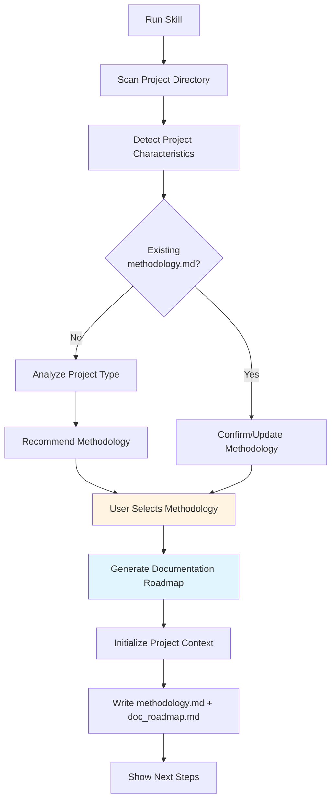

# Meta-Initialization Skill

## Overview

This is the **entry point** for the SDLC-Docs-Engine. It analyzes your project, recommends the appropriate documentation methodology, and generates a customized documentation roadmap.

**Always run this skill FIRST** before executing any other documentation generation skills.

## When to Use This Skill

✅ **USE when:**
- Starting documentation for a new project
- Migrating from v2.x to v3.0 of this engine
- Switching methodologies mid-project (e.g., Waterfall → Agile)
- Setting up documentation standards for a team

❌ **DO NOT USE when:**
- You've already run this skill and have `../project_context/methodology.md`
- You're just updating existing documentation (use specific phase skills instead)

## Input Requirements

This skill requires **minimal input** and will prompt for missing information:

| Input | Source | Required? |
|-------|--------|-----------|
| Project directory | Parent project root (`../`) | ✅ Yes (auto-detected) |
| User responses | Interactive prompts | ✅ Yes |
| Existing context files | `../project_context/` | Optional (will be detected) |

## Output Files

This skill creates/updates files in `../project_context/`:

| File | Purpose | Format |
|------|---------|--------|
| `methodology.md` | Selected methodology and rationale | Markdown |
| `doc_roadmap.md` | Documentation plan with phases and priorities | Markdown |
| `project_profile.md` | Project characteristics and constraints | Markdown |

## Process Workflow



## Step-by-Step Instructions

### Step 1: Scan Project Directory

Scan `../` (parent project root) for indicators:

**Project Type Indicators:**
- **package.json** → Node.js/JavaScript project
- **composer.json** → PHP project
- **requirements.txt** / **pyproject.toml** → Python project
- **.sln** / **.csproj** → C# .NET project
- **pom.xml** / **build.gradle** → Java project
- **Cargo.toml** → Rust project
- **go.mod** → Go project

**Existing Documentation:**
- **README.md** → Check for methodology mentions
- **ARCHITECTURE.md** → Check for design approach
- **../project_context/methodology.md** → Previous methodology selection

**Development Artifacts:**
- **.git/** → Git repository (check for branch strategy)
- **docker-compose.yml** → Containerized deployment
- **.github/workflows/** → CI/CD setup

Log all findings:
```
[Scan Report]
- Project Type: PHP (composer.json detected)
- Framework: Laravel (composer.json dependencies)
- Database: MySQL (migrations/ directory)
- Deployment: Docker (docker-compose.yml)
- Version Control: Git
- CI/CD: GitHub Actions
- Existing Docs: README.md, ARCHITECTURE.md
- Existing Context: None (first-time setup)
```

### Step 2: Detect Project Characteristics

Based on scan results, determine:

#### **Regulatory/Compliance Indicators**

Check for keywords in README.md, documentation:
- "FDA", "FAA", "DOD", "medical device", "aerospace" → **Regulated project**
- "HIPAA", "GDPR", "SOC2", "PCI-DSS" → **Compliance required**
- "safety-critical", "life-safety" → **Formal V&V needed**

#### **Project Maturity**

- **Greenfield** (no existing code): Need comprehensive upfront planning
- **Brownfield** (existing codebase): Need documentation for existing system
- **Startup/MVP**: Fast iteration, evolving requirements
- **Enterprise**: Established processes, likely Waterfall or SAFe

#### **Team Structure**

Infer from repository activity (if Git history exists):
- Multiple contributors, PR workflow → Team environment
- Single contributor → Solo developer
- Frequent commits → Agile/iterative
- Infrequent, large commits → Waterfall/milestone-based

### Step 3: Recommend Methodology

Based on detected characteristics, recommend:

#### **Recommend Waterfall if:**

- ✅ Regulatory/compliance keywords detected
- ✅ Project type: Medical, aerospace, government, automotive
- ✅ Fixed-scope contract language in docs
- ✅ Formal signoff processes mentioned
- ✅ Safety-critical system

**Confidence Score:** Calculate based on indicators (0-100%)

Example:
```
[Recommendation: Waterfall] (Confidence: 85%)

Reasons:
1. "FDA" and "medical device" detected in README.md
2. Formal compliance requirements (HIPAA)
3. Fixed-scope project (contract.pdf found)
4. Safety-critical indicators present

Recommended Pipeline:
- 02-requirements-engineering/waterfall/ (Full IEEE 830 SRS)
- 03-design-documentation/ (HLD + LLD for traceability)
- 09-governance-compliance/ (Traceability matrix, audit reports)
```

#### **Recommend Agile if:**

- ✅ Startup/MVP keywords in README
- ✅ Frequent commits (>10/week average)
- ✅ Sprint-based branch naming (feature/*, sprint/*)
- ✅ User-centric language ("user stories", "epics")
- ✅ No regulatory constraints

Example:
```
[Recommendation: Agile] (Confidence: 90%)

Reasons:
1. Startup project (package.json: version 0.3.2)
2. Frequent commits (average 15/week)
3. Feature branch workflow detected
4. No regulatory constraints detected
5. README mentions "MVP" and "rapid iteration"

Recommended Pipeline:
- 02-requirements-engineering/agile/ (User stories, backlog)
- 07-agile-artifacts/ (Sprint planning, DoD, DoR)
- Lightweight design docs (HLD only, no LLD)
```

#### **Recommend Hybrid if:**

- ✅ Mixed indicators (regulatory backend + agile frontend)
- ✅ Microservices architecture (some services regulated, others not)
- ✅ SAFe framework indicators
- ✅ Enterprise with agile teams

Example:
```
[Recommendation: Hybrid] (Confidence: 70%)

Reasons:
1. Microservices architecture detected (docker-compose.yml: 8 services)
2. Backend mentions "payment processing" (regulated)
3. Frontend is React SPA (rapid iteration)
4. Mix of waterfall (API) and agile (UI) branches

Recommended Pipeline:
- Backend: 02-requirements-engineering/waterfall/ (IEEE 830 SRS for payment service)
- Frontend: 02-requirements-engineering/agile/ (User stories for UI)
- Shared: 03-design-documentation/ (Unified HLD)
```

### Step 4: User Selection

Present recommendation and allow user to confirm or override:

```
==================================================
SDLC-Docs-Engine: Methodology Selection
==================================================

Based on analysis of your project, we recommend:

📋 WATERFALL METHODOLOGY (Confidence: 85%)

Reasons:
- Regulated industry detected (FDA, medical device)
- Fixed-scope project indicators
- Safety-critical system

This recommendation suggests:
✅ Comprehensive upfront requirements (IEEE 830 SRS)
✅ Formal design documentation (HLD + LLD)
✅ Traceability matrix and audit reports
✅ Verification & Validation per IEEE 1012

==================================================

Do you want to:
[1] Accept recommendation (Waterfall)
[2] Choose Agile instead
[3] Choose Hybrid approach
[4] Show detailed comparison
[5] Skip methodology selection (manual setup)

Your choice:
```

### Step 5: Generate Documentation Roadmap

Based on selected methodology, create `doc_roadmap.md`:

#### **For Waterfall Projects:**

```markdown
# Documentation Roadmap: [Project Name]

**Methodology:** Waterfall
**Selected:** [Date]
**Rationale:** [Brief explanation from detection]

## Active Documentation Pipelines

### Phase 01: Strategic Vision (Optional but Recommended)
- [ ] 01-prd-generation → Product Requirements Document

### Phase 02: Requirements Engineering (MANDATORY)
- [ ] 02-requirements-engineering/waterfall/01-initialize-srs
- [ ] 02-requirements-engineering/waterfall/02-context-engineering
- [ ] 02-requirements-engineering/waterfall/03-descriptive-modeling
- [ ] 02-requirements-engineering/waterfall/04-interface-specification
- [ ] 02-requirements-engineering/waterfall/05-feature-decomposition
- [ ] 02-requirements-engineering/waterfall/06-logic-modeling
- [ ] 02-requirements-engineering/waterfall/07-attribute-mapping
- [ ] 02-requirements-engineering/waterfall/08-semantic-auditing

### Phase 03: Design Documentation (MANDATORY)
- [ ] 03-design-documentation/01-high-level-design
- [ ] 03-design-documentation/02-low-level-design
- [ ] 03-design-documentation/03-api-specification

### Phase 05: Testing Documentation (MANDATORY)
- [ ] 05-testing-documentation/01-test-strategy
- [ ] 05-testing-documentation/02-test-plans

### Phase 09: Governance & Compliance (MANDATORY)
- [ ] 09-governance-compliance/01-traceability-matrix
- [ ] 09-governance-compliance/02-audit-reports
- [ ] 09-governance-compliance/03-compliance-docs (if HIPAA/GDPR/SOC2)

## Disabled Pipelines

❌ **Phase 07: Agile Artifacts** (Not applicable for Waterfall)
❌ **Phase 02: Agile Requirements** (Using Waterfall SRS instead)

## Execution Order

1. **Week 1-2:** Phase 02 (Requirements) - Generate IEEE 830 SRS
2. **Week 3-4:** Phase 03 (Design) - HLD and LLD
3. **Week 5:** Phase 05 (Testing) - Test strategy and plans
4. **Week 6:** Phase 09 (Governance) - Traceability and audits

**Total Estimated Time:** 6 weeks for complete documentation suite

## Next Steps

Run: 02-requirements-engineering/waterfall/01-initialize-srs
```

#### **For Agile Projects:**

```markdown
# Documentation Roadmap: [Project Name]

**Methodology:** Agile (Scrum)
**Selected:** [Date]
**Rationale:** [Brief explanation]

## Active Documentation Pipelines

### Phase 01: Strategic Vision (MANDATORY for Agile)
- [ ] 01-strategic-vision/01-prd-generation → Lightweight PRD

### Phase 02: Requirements Engineering (MANDATORY)
- [ ] 02-requirements-engineering/agile/01-user-story-generation
- [ ] 02-requirements-engineering/agile/02-acceptance-criteria
- [ ] 02-requirements-engineering/agile/03-story-mapping
- [ ] 02-requirements-engineering/agile/04-backlog-prioritization

### Phase 03: Design Documentation (Lightweight)
- [ ] 03-design-documentation/01-high-level-design (HLD only, skip LLD)

### Phase 07: Agile Artifacts (MANDATORY)
- [ ] 07-agile-artifacts/01-sprint-planning
- [ ] 07-agile-artifacts/02-definition-of-done
- [ ] 07-agile-artifacts/03-definition-of-ready

### Phase 08: End-User Documentation (Post-MVP)
- [ ] 08-end-user-documentation/01-user-manual

## Disabled Pipelines

❌ **Phase 02: Waterfall SRS** (Using Agile user stories instead)
❌ **Phase 09: Formal Governance** (Lightweight traceability via story tags)

## Execution Order

1. **Sprint 0:** Phase 01 (Vision) + Phase 02 (User Stories)
2. **Sprint 0:** Phase 03 (HLD) - Architectural overview
3. **Sprint 1-N:** Phase 07 (Agile Artifacts) - Ongoing per sprint
4. **Post-MVP:** Phase 08 (User Docs)

**Total Estimated Time:** 1-2 sprints for initial setup, then continuous

## Next Steps

Run: 01-strategic-vision/01-prd-generation
Then: 02-requirements-engineering/agile/01-user-story-generation
```

### Step 6: Initialize Project Context

Check if `../project_context/` exists:

**If missing:**
```bash
mkdir -p ../project_context
echo "Project context directory created."
```

**If exists:**
```
[INFO] Project context directory already exists.
Checking for existing files...

Found:
- vision.md (last modified: 2026-01-15)
- features.md (last modified: 2026-01-20)

Missing:
- methodology.md (will be created)
- doc_roadmap.md (will be created)
```

### Step 7: Write Output Files

#### **File 1: `../project_context/methodology.md`**

Use template from `templates/methodology.md.template` (populated with detection results).

#### **File 2: `../project_context/doc_roadmap.md`**

Use template from `templates/doc_roadmap.md.template` (populated based on methodology).

#### **File 3: `../project_context/project_profile.md`**

```markdown
# Project Profile

**Generated:** [Date]
**Project Type:** [Detected type]
**Framework:** [Detected framework]
**Database:** [Detected database]
**Deployment:** [Detected deployment]

## Characteristics

- **Regulatory Constraints:** [Yes/No - list standards]
- **Team Size:** [Inferred from git history]
- **Development Pace:** [Rapid/Moderate/Methodical]
- **Maturity:** [Greenfield/Brownfield/Startup/Enterprise]

## Recommended Methodology

**Selected:** [Waterfall/Agile/Hybrid]
**Confidence:** [XX%]

See `methodology.md` for full rationale.
```

## Resources

- **[templates/methodology.md.template](templates/methodology.md.template)**: Template for methodology selection
- **[templates/doc_roadmap.md.template](templates/doc_roadmap.md.template)**: Template for documentation roadmap
- **[references/methodology-decision-tree.md](references/methodology-decision-tree.md)**: Detailed decision criteria
- **[references/detection-rules.md](references/detection-rules.md)**: Project characteristic detection rules

## Common Pitfalls

❌ **Skipping this skill**
- Jumping directly to Phase 02 without methodology selection leads to wrong documentation approach

❌ **Overriding recommendation without justification**
- If you choose Agile for a regulated project, document WHY (e.g., regulatory approval already obtained)

❌ **Not updating roadmap when project changes**
- Re-run this skill if project characteristics change (e.g., startup gets FDA approval)

❌ **Ignoring hybrid recommendations**
- If recommended Hybrid, don't force pure Waterfall or Agile

## Verification Checklist

Before proceeding to Phase 01/02:

- [ ] `../project_context/methodology.md` exists and is populated
- [ ] `../project_context/doc_roadmap.md` exists with checklist
- [ ] `../project_context/project_profile.md` exists
- [ ] Methodology selection is documented with rationale
- [ ] Next steps are clear (which skill to run next)
- [ ] Team agrees with methodology choice (if applicable)

## Integration with Other Phases

**This skill enables:**
- **Phase 01 (Strategic Vision)**: Knows whether to generate PRD (Agile) or skip (Waterfall starts with SRS)
- **Phase 02 (Requirements)**: Activates correct pipeline (waterfall/ or agile/)
- **Phase 03 (Design)**: Determines depth (full HLD+LLD for Waterfall, lightweight HLD for Agile)
- **Phase 07 (Agile Artifacts)**: Only activates if methodology is Agile or Hybrid
- **Phase 09 (Governance)**: Determines formality level (full RTM for Waterfall, lightweight for Agile)

**Upstream Dependencies:**
- None (this is the first skill to run)

**Downstream Consumers:**
- All other phases read `methodology.md` to determine their execution mode

## Example Output

See `templates/` directory for complete examples:
- `methodology.md.example` - Waterfall selection for medical device
- `methodology.md.example-agile` - Agile selection for startup
- `methodology.md.example-hybrid` - Hybrid for enterprise SaaS

## Maintenance & Updates

**When to re-run this skill:**
- Project characteristics change significantly (e.g., startup becomes enterprise)
- Regulatory status changes (e.g., FDA approval required mid-project)
- Team decides to switch methodologies
- Major pivot in product direction

**Safe to re-run:** Yes, this skill will prompt before overwriting existing files.

---

**Last Updated:** 2026-02-07
**Skill Version:** 1.0.0
**Maintained by:** Peter Bamuhigire
