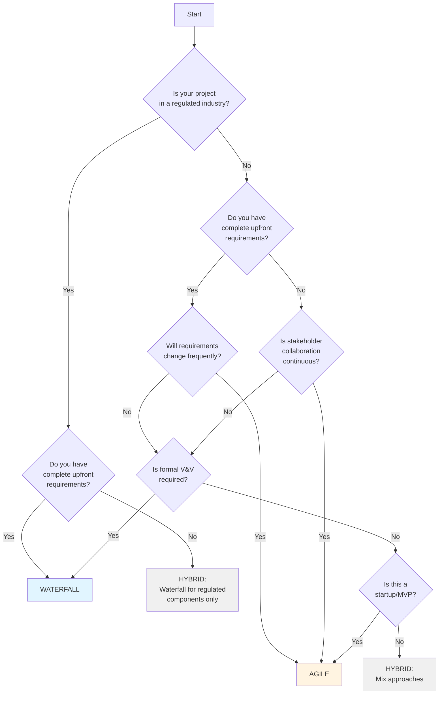

# Methodology Decision Tree

This reference guide provides detailed decision criteria for selecting the appropriate documentation methodology (Waterfall, Agile, or Hybrid).

---

## Decision Framework

Use this decision tree to determine the best methodology for your project:



---

## Waterfall Indicators (High Confidence)

### Regulatory & Compliance (85-95% confidence)

**Strong Indicators:**
- FDA (Food and Drug Administration) requirements
- FAA (Federal Aviation Administration) certification
- DOD (Department of Defense) contracts
- Medical device classification (Class II/III)
- Aerospace/aviation systems
- Automotive safety systems (ISO 26262)
- Nuclear power systems
- Financial systems with SOX compliance

**Detection Keywords:**
- "FDA", "510(k)", "PMA", "IEC 62304"
- "FAA", "DO-178C", "ARP4754"
- "ISO 26262", "ASIL"
- "IEC 61508", "SIL"
- "SOX", "Sarbanes-Oxley"

**Scoring:**
- Any regulatory keyword found: +50 points
- Safety-critical mentioned: +30 points
- Compliance audit required: +20 points

### Fixed-Scope Indicators (70-85% confidence)

**Strong Indicators:**
- Fixed-price contract
- RFP (Request for Proposal) response
- Government procurement
- Detailed specification document exists
- Formal signoff processes mentioned
- Change control board (CCB) mentioned

**Detection Keywords:**
- "fixed-price", "fixed-scope"
- "RFP", "procurement"
- "change control board", "CCB"
- "formal signoff", "milestone approval"
- "contract deliverables"

**Scoring:**
- Fixed-price contract: +40 points
- RFP/procurement: +30 points
- CCB mentioned: +20 points

### Documentation Artifacts (60-75% confidence)

**Strong Indicators:**
- Existing SRS document
- IEEE 830 references in README
- Formal requirements database (e.g., DOORS)
- Detailed Gantt charts
- Phase-gate process mentioned

**Detection:**
- Look for `SRS.md`, `Requirements.docx`, `SPEC.pdf`
- Check for "IEEE 830", "IEEE 1233" in docs
- Gantt charts in project_plan/

**Scoring:**
- Existing SRS: +30 points
- IEEE standards referenced: +25 points
- Gantt charts: +15 points

---

## Agile Indicators (High Confidence)

### Startup/MVP Indicators (80-95% confidence)

**Strong Indicators:**
- "MVP" or "Minimum Viable Product" in README
- Version < 1.0.0 in package.json/composer.json
- "Startup", "seed funding", "Series A" mentioned
- "pivot", "iterate", "experiment" in docs
- Small team (<10 people)

**Detection Keywords:**
- "MVP", "minimum viable product"
- "startup", "early-stage"
- "pivot", "iterate", "experiment"
- "user feedback", "customer discovery"

**Scoring:**
- MVP mentioned: +50 points
- Version < 1.0: +30 points
- Startup keywords: +20 points

### Development Pace Indicators (70-85% confidence)

**Strong Indicators:**
- High commit frequency (>10/week average)
- Sprint/iteration in branch names (e.g., `sprint-5/`, `iteration-3/`)
- Short-lived feature branches (<1 week)
- Continuous deployment (CI/CD) setup
- Daily standup notes in docs/

**Detection:**
- Git log analysis: `git log --since="1 month ago" --pretty=oneline | wc -l`
- Branch naming patterns: `git branch -a | grep -E "(sprint|iteration|feature)"`
- Check for `.github/workflows/`, `.gitlab-ci.yml`, `Jenkinsfile`

**Scoring:**
- >10 commits/week: +40 points
- Sprint branches: +30 points
- CI/CD setup: +20 points

### User-Centric Language (65-80% confidence)

**Strong Indicators:**
- "User stories" folder or file exists
- "Epic", "Story", "Backlog" in documentation
- Personas defined
- Journey maps or story maps
- Jira/Trello/Asana mentioned

**Detection Keywords:**
- "user story", "user stories"
- "epic", "backlog", "sprint"
- "persona", "user journey"
- "acceptance criteria", "definition of done"

**Scoring:**
- User stories mentioned: +40 points
- Epics/backlog: +25 points
- Personas defined: +20 points

---

## Hybrid Indicators (Moderate Confidence)

### Microservices Architecture (75-85% confidence)

**Strong Indicators:**
- Multiple services in docker-compose.yml
- Separate repositories per service
- API gateway mentioned
- Service mesh (Istio, Linkerd) references
- Mix of regulated and non-regulated services

**Detection:**
- Parse `docker-compose.yml` for service count
- Check for `/services/`, `/microservices/` directories
- Look for API gateway configs (Kong, Tyk, AWS API Gateway)

**Scoring:**
- >5 microservices: +35 points
- API gateway: +25 points
- Service mesh: +20 points

**Hybrid Recommendation:**
- Regulated services (payment, auth, data) → Waterfall
- User-facing services (UI, notifications) → Agile

### Enterprise SAFe Indicators (70-80% confidence)

**Strong Indicators:**
- "SAFe", "Scaled Agile Framework" mentioned
- Program Increment (PI) planning references
- Agile Release Train (ART) mentioned
- Large organization (>50 developers)
- Mix of Agile teams with waterfall governance

**Detection Keywords:**
- "SAFe", "Scaled Agile"
- "Program Increment", "PI planning"
- "Agile Release Train", "ART"
- "portfolio management"

**Scoring:**
- SAFe mentioned: +40 points
- PI planning: +30 points
- Large org (inferred): +20 points

**Hybrid Recommendation:**
- Team level: Agile (user stories, sprints)
- Portfolio level: Waterfall governance (formal requirements)

---

## Scoring System

### Calculation

Each project is scored across three dimensions:

**Waterfall Score:**
```
Waterfall = Regulatory_Points + Fixed_Scope_Points + Formal_Docs_Points
```

**Agile Score:**
```
Agile = Startup_Points + Dev_Pace_Points + User_Centric_Points
```

**Hybrid Score:**
```
Hybrid = Microservices_Points + SAFe_Points + Mixed_Indicators
```

### Confidence Levels

- **High Confidence (>85%):** Clear methodology choice, strong indicators
- **Moderate Confidence (70-85%):** Likely correct, but review with team
- **Low Confidence (<70%):** Mixed signals, recommend user override

### Decision Rules

```python
if Waterfall > 100 and Waterfall > (Agile * 1.5):
    return "Waterfall", calculate_confidence(Waterfall, Agile, Hybrid)
elif Agile > 100 and Agile > (Waterfall * 1.5):
    return "Agile", calculate_confidence(Waterfall, Agile, Hybrid)
elif Hybrid > 80 or abs(Waterfall - Agile) < 30:
    return "Hybrid", calculate_confidence(Waterfall, Agile, Hybrid)
else:
    return "Ask User", 0  # Low confidence, let user decide
```

---

## Edge Cases & Special Scenarios

### Brownfield Projects (Existing Codebase)

**Scenario:** Large existing codebase, minimal documentation

**Recommendation:**
- If regulated: Waterfall (need to document existing system)
- If not regulated: Agile (evolve docs as code changes)
- Consider: Start with lightweight docs (Agile), formalize later if needed

### Government Contracts

**Scenario:** Government contract with agile development

**Recommendation:** Hybrid
- Contract deliverables: Waterfall (formal SRS for acceptance)
- Development process: Agile (sprints, user stories)
- Deliverable mapping: Map user stories to SRS requirements

### Open Source Projects

**Scenario:** Open source community project

**Recommendation:** Agile (usually)
- Community-driven: Agile user stories, issues as requirements
- Exception: Infrastructure projects (databases, compilers) may need formal specs

### Legacy Modernization

**Scenario:** Modernizing legacy system

**Recommendation:** Hybrid
- Document existing system: Waterfall (formal SRS of current state)
- New development: Agile (iterative modernization)
- Bridge: Traceability matrix linking old to new

---

## Override Guidelines

### When to Override Recommendation

Users should consider overriding if:

1. **Organizational mandate:** Company policy requires specific methodology
2. **Team expertise:** Team has strong preference/experience with one approach
3. **Stakeholder expectations:** Stakeholders expect specific deliverables
4. **Contractual obligations:** Contract specifies documentation format
5. **Cultural fit:** Methodology doesn't fit organizational culture

### How to Override Safely

If overriding the recommendation:

1. **Document rationale** in `methodology.md`
2. **List risks** of mismatch (e.g., "Using Agile for regulated project: ensure compliance mapped to user stories")
3. **Define mitigation** (e.g., "Generate SRS from user stories at release gate")
4. **Get stakeholder buy-in** before proceeding

**Example Override:**

```markdown
## Override Decision

**Recommendation:** Waterfall (Confidence: 85%)
**Selected:** Agile

**Rationale:**
While project has regulatory requirements (FDA), we obtained pre-approval
for Agile development with quarterly compliance audits.

**Mitigation:**
- Generate SRS from user stories at end of each quarter
- Maintain traceability tags on all stories
- Run formal audit per IEEE 1012 before each FDA submission
```

---

## Decision Support Matrix

| Project Characteristic | Waterfall | Agile | Hybrid |
|------------------------|-----------|-------|--------|
| **Regulated industry** | ✅ Strong fit | ❌ Poor fit | ⚠️ Possible with care |
| **Fixed-price contract** | ✅ Strong fit | ❌ Poor fit | ⚠️ Depends on flexibility |
| **Safety-critical** | ✅ Mandatory | ❌ Not recommended | ⚠️ For non-critical parts only |
| **Startup/MVP** | ❌ Overhead | ✅ Strong fit | ⚠️ If some parts regulated |
| **Evolving requirements** | ❌ Difficult | ✅ Strong fit | ⚠️ For stable core + evolving features |
| **Continuous delivery** | ❌ Conflicts | ✅ Strong fit | ✅ Good fit |
| **Large team (>50)** | ⚠️ Possible | ❌ Hard to scale | ✅ SAFe/Hybrid works |
| **Microservices** | ❌ Monolith better | ⚠️ Possible | ✅ Strong fit |

---

## Validation Checklist

Before finalizing methodology selection:

- [ ] Regulatory requirements identified and documented
- [ ] Contract type and flexibility assessed
- [ ] Team size and structure considered
- [ ] Stakeholder expectations understood
- [ ] Development pace and release frequency evaluated
- [ ] Risk tolerance assessed (high risk → Waterfall, low risk → Agile)
- [ ] Technical architecture reviewed (monolith vs. microservices)
- [ ] Organizational culture considered (hierarchical → Waterfall, flat → Agile)
- [ ] Tooling and infrastructure evaluated (Jira → Agile, DOORS → Waterfall)
- [ ] Team experience with methodologies assessed

---

**Last Updated:** 2026-02-07
