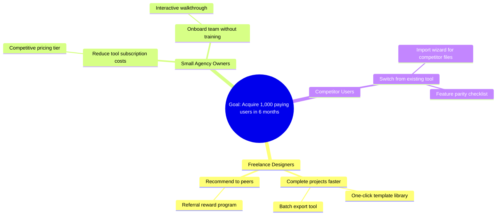

# Impact Mapping Construction Guide

## Purpose

This reference provides the methodology for constructing Impact Maps -- a strategic planning technique that connects business goals to product deliverables through actors and behavioral impacts. Impact Maps prevent scope creep by ensuring every deliverable traces to a measurable business outcome.

## Reference Standards

- Gojko Adzic, "Impact Mapping" -- Goal-Actor-Impact-Deliverable framework
- IEEE 29148-2018 -- Stakeholder needs and business requirements
- BA Guide for Lean Enterprises -- Strategic alignment techniques

## Impact Map Structure

An Impact Map is a four-level hierarchy:

```
Goal (WHY)
  --> Actor (WHO)
    --> Impact (HOW)
      --> Deliverable (WHAT)
```

### Level 1: Goal (WHY)

The measurable business objective the product shall achieve.

**SMART Criteria:**
- **Specific:** State exactly what shall be achieved.
- **Measurable:** Include a number.
- **Achievable:** Within the team's capacity.
- **Relevant:** Aligned with business strategy from `vision.md`.
- **Time-bound:** Include a deadline.

**Examples:**

| Quality | Goal Statement |
|---------|---------------|
| Good | "Acquire 1,000 paying users within 6 months of launch" |
| Good | "Reduce customer support ticket volume by 30% within Q3 2026" |
| Bad | "Get more users" (not measurable, not time-bound) |
| Bad | "Build a great product" (not specific, not measurable) |

**Rule:** The goal shall be extracted from or directly traceable to `vision.md` business goals. Do not fabricate goals.

### Level 2: Actors (WHO)

The people, personas, or systems whose behavior must change to reach the goal. Actors include helpers (who move the goal forward) and hinderers (who obstruct it).

**Identification procedure:**
1. Review `stakeholders.md` for all stakeholder groups.
2. Classify each stakeholder as helper or hinderer relative to the goal.
3. Add competitors or market forces as hinderer actors if relevant.
4. Prioritize actors by influence on the goal (high, medium, low).

**Template:**

| Actor | Type | Influence | Current Behavior | Desired Behavior |
|-------|------|-----------|-----------------|-----------------|
| [Actor 1] | Helper | High | [What they do now] | [What they should do] |
| [Actor 2] | Hinderer | Medium | [What they do now] | [What should change] |

### Level 3: Impacts (HOW)

The behavioral changes the product shall create in each actor. An impact describes how an actor's behavior should change to support the goal.

**Filling procedure:**
1. For each actor, ask: "How should their behavior change to help us reach the goal?"
2. For hinderer actors, ask: "How can the product reduce or eliminate their negative influence?"
3. State impacts as observable behavioral changes, not product features.

**Examples:**

| Quality | Impact Statement |
|---------|-----------------|
| Good | "Customers complete purchases without contacting support" |
| Good | "Sales reps spend 50% less time on manual data entry" |
| Bad | "Users use the new dashboard" (describes feature usage, not behavior change) |
| Bad | "The system processes payments" (describes system behavior, not actor behavior) |

**Rule:** Impacts describe actor behavior changes, not system capabilities. If the impact reads like a feature, rephrase it.

### Level 4: Deliverables (WHAT)

The product capabilities that can create the desired impacts. Each deliverable is the smallest feature or change that can produce the impact.

**Prioritization rules:**
1. For each impact, identify the smallest deliverable that can test whether the impact is achievable.
2. Rank deliverables by effort-to-impact ratio (high impact / low effort first).
3. Defer large deliverables until smaller experiments validate the impact.

**Template:**

| Deliverable | Effort | Expected Impact | Priority |
|-------------|--------|-----------------|----------|
| [Smallest viable feature] | Low / Medium / High | [Which impact it tests] | 1 |
| [Next feature] | Low / Medium / High | [Which impact it tests] | 2 |

## Mermaid Mindmap Syntax

The Impact Map shall be rendered as a Mermaid mindmap:



### Syntax Rules

| Element | Syntax | Notes |
|---------|--------|-------|
| Root (Goal) | `root((Goal text))` | Double parentheses for rounded shape |
| Actor | Indented text (2 spaces) | First child level |
| Impact | Indented text (4 spaces) | Second child level |
| Deliverable | Indented text (6 spaces) | Third child level |

### Formatting Guidelines

1. The root node shall state the full SMART goal.
2. Actor names shall match stakeholder names from `stakeholders.md`.
3. Impact text shall begin with a verb describing behavior change.
4. Deliverable text shall begin with a noun or noun phrase describing the capability.
5. Limit the map to 3-5 actors, 2-3 impacts per actor, and 1-3 deliverables per impact.

## Iteration and Pruning

### When to Prune

Remove branches from the Impact Map when:
- An experiment invalidates the assumed impact.
- The deliverable has been shipped and the impact is not observed.
- The actor is no longer relevant to the goal.

### Pruning Procedure

1. Mark the branch with `[PRUNED: reason]`.
2. Archive the pruned branch in the document's revision history.
3. Reassess remaining branches for priority changes.

### When to Expand

Add branches when:
- A new actor is discovered through customer research.
- A validated impact suggests additional deliverables.
- The goal is revised (which may require a new map).

## Integration with Lean Canvas

| Impact Map Level | Lean Canvas Block |
|-----------------|-------------------|
| Goal | Aligns with Key Metrics targets |
| Actors | Maps to Customer Segments |
| Impacts | Informs Unique Value Proposition |
| Deliverables | Maps to Solution features |

## Validation Checklist

- [ ] The goal is SMART and traceable to `vision.md`
- [ ] Every actor traces to `stakeholders.md` or a documented market segment
- [ ] Every impact describes a behavioral change, not a feature
- [ ] Every deliverable is the smallest capability that can test its parent impact
- [ ] The map has no more than 5 actors at the first level
- [ ] No orphan actors (actors without impacts)
- [ ] No orphan deliverables (deliverables without a parent impact)

## Common Mistakes

| Mistake | Correction |
|---------|------------|
| Goal is not measurable | Add a number and a timeframe |
| Listing features as impacts | Rephrase as actor behavior changes |
| Too many deliverables per impact | Focus on the smallest experiment first |
| Missing hinderer actors | Include competitors and resistant stakeholders |
| Map never updated after experiments | Schedule map reviews after every validation cycle |
