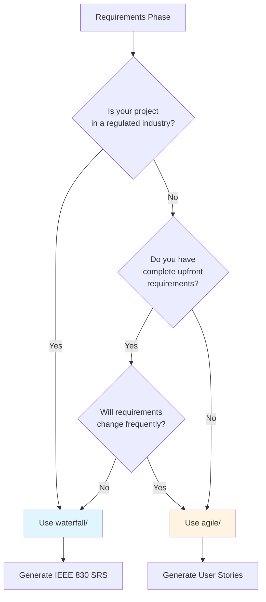

# Requirements Engineering

This phase handles **requirements documentation** across different software development methodologies.

## Choose Your Methodology

This directory contains **two distinct pipelines** for requirements engineering:

### 📋 Waterfall Pipeline (`waterfall/`)

**Best for:** Traditional projects requiring comprehensive upfront requirements documentation.

**Generates:** IEEE 830-compliant Software Requirements Specification (SRS)

**When to use:**
- Regulated industries (medical, aerospace, government)
- Fixed-scope, fixed-price contracts
- Safety-critical systems
- Projects requiring formal verification

**Output:** Complete SRS document with 8 sections covering introduction, system overview, functional/non-functional requirements, and traceability.

👉 **[Start with Waterfall SRS Pipeline](waterfall/README.md)**

---

### 📊 Agile Pipeline (`agile/`)

**Best for:** Iterative projects with evolving requirements and frequent stakeholder feedback.

**Generates:** User Stories, Acceptance Criteria, Story Maps, Product Backlog

**When to use:**
- Scrum, Kanban, or XP projects
- Startups with high uncertainty
- MVPs and rapid prototypes
- Projects with frequent scope changes

**Output:** Prioritized backlog of user stories with INVEST criteria compliance, acceptance criteria, and story points.

👉 **[Start with Agile Requirements Pipeline](agile/README.md)**

---

## Comparison Matrix

| Aspect | Waterfall (`waterfall/`) | Agile (`agile/`) |
|--------|--------------------------|-------------------|
| **Documentation Style** | Comprehensive upfront | Just-enough, evolving |
| **Standards** | IEEE 830, IEEE 1233, IEEE 1012 | IEEE 29148, Agile Alliance |
| **Output Format** | Formal SRS document (Sections 1.0-3.6) | User stories, story maps, backlogs |
| **Requirements Format** | "The system SHALL..." statements | "As a [user], I want [action]..." |
| **Verification** | Traceability matrix, formal audits | Acceptance criteria, DoD/DoR |
| **Change Management** | Formal change control, versioning | Backlog refinement, sprint planning |
| **Stakeholder Review** | Milestone-based signoffs | Continuous collaboration |
| **Typical Timeline** | Weeks to months | Hours to days per story |
| **Best for Projects** | >$500K, >12 months, regulated | <$500K, <12 months, flexible scope |

## Hybrid Approach

**Can I use both?**

Yes! Some projects benefit from a **hybrid approach**:

**Example 1: Regulated Backend + Agile Frontend**
- Use **`waterfall/`** for backend API (requires FDA/CE compliance)
- Use **`agile/`** for frontend UI (rapid iteration)

**Example 2: Core Platform + New Features**
- Use **`waterfall/`** for core platform architecture (stable, well-defined)
- Use **`agile/`** for new feature experiments (uncertain, exploratory)

**Example 3: Enterprise SAFe**
- Use **`agile/`** for team-level user stories
- Use **`waterfall/`** elements for solution-level specifications

## Decision Tree



## Quick Start

### Step 1: Assess Your Project

Answer these questions:

1. **Regulatory requirements?** (FDA, FAA, DOD, etc.)
   - Yes → Likely need `waterfall/`
   - No → Continue to question 2

2. **Requirements stability?**
   - Stable, well-defined → Consider `waterfall/`
   - Evolving, uncertain → Consider `agile/`

3. **Stakeholder availability?**
   - Milestone-based reviews → `waterfall/`
   - Continuous collaboration → `agile/`

4. **Project risk?**
   - Low tolerance for scope change → `waterfall/`
   - High tolerance, need flexibility → `agile/`

### Step 2: Run Appropriate Pipeline

**For Waterfall:**
```bash
# Initialize context
Run skill: 02-requirements-engineering/waterfall/01-initialize-srs

# Populate ../project_context/*.md files

# Run phases 02-08 sequentially
Run skill: 02-requirements-engineering/waterfall/02-context-engineering
# ... continue through phase 08
```

**For Agile:**
```bash
# Initialize context
Run skill: 02-requirements-engineering/agile/01-user-story-generation

# Refine and prioritize
Run skill: 02-requirements-engineering/agile/03-story-mapping
```

### Step 3: Proceed to Next SDLC Phase

After requirements are documented:

- **Waterfall:** Move to `03-design-documentation/01-high-level-design`
- **Agile:** Move to sprint planning in `07-agile-artifacts/01-sprint-planning`

## Pipeline Status

| Pipeline | Status | Version | Last Updated |
|----------|--------|---------|--------------|
| **waterfall/** | ✅ Stable | 3.0.0 | 2026-02-07 |
| **agile/** | 🚧 Beta | 1.0.0 | 2026-02-07 |
| **use-cases/** | 📅 Planned | - | TBD |

## Migration from v2.x

**Previous users:** The original 8-phase SRS pipeline (phases 01-08 at root level) has been moved to `waterfall/`.

Update your workflows:
```bash
# Old path (deprecated)
01-initialize-srs/

# New path
02-requirements-engineering/waterfall/01-initialize-srs/
```

See [Migration Guide](../../docs/MIGRATION_V2_TO_V3.md) for details.

## Standards Reference

### Waterfall Standards
- IEEE Std 830-1998 (SRS)
- IEEE Std 1233-1998 (System Requirements)
- IEEE Std 1012-2016 (V&V)
- ISO/IEC 25010 (Quality Model)

### Agile Standards
- IEEE Std 29148-2018 (Requirements Engineering)
- Agile Alliance User Story Standards
- INVEST Criteria (Bill Wake, 2003)
- Story Mapping (Jeff Patton, 2014)

## Related Phases

- **00-meta-initialization/**: Methodology selection
- **01-strategic-vision/**: PRD, vision statements
- **03-design-documentation/**: HLD, LLD, API specs
- **07-agile-artifacts/**: Sprint planning, DoD, DoR

---

**Need help choosing?** Consult the [Decision Tree](#decision-tree) above or review `CLAUDE.md` for AI assistant guidance.

**Last Updated:** 2026-02-07
