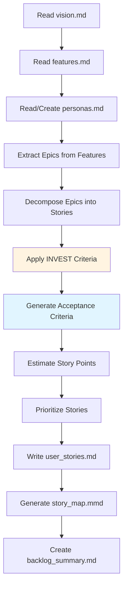

# User Story Generation Skill

## Overview

Transform high-level feature descriptions into **well-formed user stories** that comply with INVEST criteria (Independent, Negotiable, Valuable, Estimable, Small, Testable) and IEEE Std 29148-2018 requirements engineering principles.

This skill is the Agile equivalent of the Waterfall SRS pipeline, producing lightweight, user-centric requirements suitable for Scrum, Kanban, and XP methodologies.

## When to Use This Skill

✅ **USE for:**
- Agile/Scrum projects requiring user story backlogs
- MVP development with evolving requirements
- Projects with continuous stakeholder collaboration
- Teams using sprint-based development
- Startups needing rapid iteration

❌ **DO NOT USE for:**
- Regulated industries requiring IEEE 830 SRS (use `../waterfall/` instead)
- Fixed-scope, fixed-price contracts
- Projects requiring comprehensive upfront requirements

## Input Files

This skill reads from `../project_context/`:

| File | Purpose | Required? |
|------|---------|-----------|
| `vision.md` | Product vision and goals | ✅ Yes |
| `features.md` | High-level feature catalog | ✅ Yes |
| `personas.md` | User personas and roles | ⚠️ Recommended |
| `glossary.md` | Domain terminology (IEEE 610.12) | ⚠️ Recommended |
| `quality_standards.md` | NFR targets for story acceptance criteria | Optional |

**Note:** If `personas.md` doesn't exist, the skill will prompt to create it or infer personas from `vision.md`.

## Output Files

This skill writes to `../output/`:

| File | Contents | Format |
|------|----------|--------|
| `user_stories.md` | Complete backlog of user stories | Markdown |
| `story_map.mmd` | Visual story map diagram | Mermaid |
| `backlog_summary.md` | Metrics and priority overview | Markdown |
| `epic_breakdown.md` | Epic → Story hierarchy | Markdown |

## Process Workflow



## Core Instructions

### Step 1: Persona Identification

1. Read `../project_context/personas.md`. If missing, prompt user:
   ```
   personas.md not found. Would you like to:
   [1] Create personas now (recommended)
   [2] Infer personas from vision.md
   [3] Skip personas (use generic "User" role)
   ```

2. If creating personas, use the template in `templates/personas.md.template`:
   - Identify 3-5 primary user types
   - Define: Role, Goals, Pain Points, Technical Proficiency
   - Example: "Restaurant Manager", "Waiter", "Kitchen Staff"

### Step 2: Epic Extraction

1. Parse `../project_context/features.md` to identify **Epics** (large features requiring multiple sprints)

2. For each feature, determine if it's:
   - **Epic** (>13 story points, requires breakdown) → Tag as Epic
   - **Story** (2-13 story points) → Keep as single story
   - **Task** (<2 story points) → Flag to merge with related stories

3. Create epic hierarchy in `../output/epic_breakdown.md`

### Step 3: Story Decomposition

For each Epic or Feature, generate **user stories** following this format:

```markdown
### US-XXX: [Story Title]

**As a** [persona/role]
**I want to** [action/capability]
**So that** [business value/benefit]

**Acceptance Criteria:**
- [ ] Given [precondition], When [action], Then [expected result]
- [ ] Given [precondition], When [action], Then [expected result]
- [ ] [Additional criteria as needed]

**Story Points:** [Fibonacci: 1, 2, 3, 5, 8, 13]
**Priority:** [Critical / High / Medium / Low]
**Epic:** [Epic name if applicable]
**Dependencies:** [US-XXX, US-YYY] (if any)
**Tags:** [#feature-area, #persona, #sprint-candidate]
```

### Step 4: INVEST Criteria Validation

For each generated story, verify compliance with **INVEST criteria**:

| Criterion | Validation Check | Fix if Failing |
|-----------|------------------|----------------|
| **I**ndependent | Story can be completed without blocking on other stories | Split dependencies or reorder |
| **N**egotiable | Story describes outcome, not specific implementation | Rephrase to focus on "what", not "how" |
| **V**aluable | Story delivers measurable value to user or business | Add "So that [benefit]" clause |
| **E**stimable | Team can estimate effort (story points) | Add missing context or split if too vague |
| **S**mall | Story fits in 1 sprint (typically <13 points) | Split into smaller stories |
| **T**estable | Acceptance criteria can be verified with pass/fail | Add concrete, measurable criteria |

**Tag non-compliant stories:** `[INVEST-FAIL: {criterion}]` and append remediation notes.

### Step 5: Acceptance Criteria Generation

For each story, create **3-5 acceptance criteria** using **Given-When-Then** (Gherkin) format:

**Good Example:**
```
- Given I am a logged-in customer
  When I add an item to my cart
  Then the cart icon shows the updated item count
```

**Bad Example (too vague):**
```
- The system should handle cart operations correctly
```

**NFR Acceptance Criteria:**
If `quality_standards.md` defines performance/security targets, append them:
```
- Given 100 concurrent users adding items
  When cart updates occur
  Then response time shall be <200ms (95th percentile)
```

### Step 6: Story Point Estimation

Estimate complexity using **Fibonacci sequence** (1, 2, 3, 5, 8, 13):

| Points | Complexity | Typical Duration | Examples |
|--------|------------|------------------|----------|
| 1 | Trivial | <4 hours | Copy change, config update |
| 2 | Simple | 4-8 hours | Simple CRUD form, basic validation |
| 3 | Moderate | 1-2 days | Feature with business logic, API integration |
| 5 | Complex | 2-4 days | Multi-step workflow, complex validation |
| 8 | Very Complex | 1 week | Multi-entity feature, significant backend work |
| 13 | Epic-sized | >1 week | **Should be split into smaller stories** |

**Estimation Guidelines:**
- Consider: Dev time + Testing time + Review time
- Include: Frontend + Backend + DB changes
- Account for: Technical debt, unknowns, dependencies

**If story is >13 points:** Flag with `[EPIC: Split Required]` and suggest decomposition.

### Step 7: Prioritization

Assign priority based on:

1. **Business Value** (from `vision.md` goals)
2. **User Impact** (from personas)
3. **Dependencies** (foundational features first)
4. **Risk** (high-risk items early for de-risking)

**Priority Levels:**
- **Critical:** Blocks other work, core functionality
- **High:** Significant user value, needed for MVP
- **Medium:** Nice-to-have for MVP, required for v1.0
- **Low:** Future enhancement, not blocking

### Step 8: Story Mapping

Generate `../output/story_map.mmd` using **Jeff Patton's Story Mapping** approach:

```mermaid
graph TD
    subgraph "Epic: User Management"
        US001[US-001: User Registration<br/>Priority: Critical | Points: 3]
        US002[US-002: User Login<br/>Priority: Critical | Points: 2]
        US003[US-003: Password Reset<br/>Priority: High | Points: 3]
        US004[US-004: Profile Management<br/>Priority: Medium | Points: 5]
    end

    subgraph "Epic: Product Catalog"
        US005[US-005: Browse Products<br/>Priority: Critical | Points: 5]
        US006[US-006: Search Products<br/>Priority: High | Points: 5]
        US007[US-007: Filter Products<br/>Priority: Medium | Points: 3]
    end

    US001 --> US002
    US002 --> US003
    US005 --> US006
```

## Output Format Specification

### File: `../output/user_stories.md`

```markdown
# User Story Backlog: [Project Name]

**Generated:** [Date]
**Methodology:** Agile (Scrum)
**Standards:** IEEE 29148-2018, INVEST Criteria

---

## Backlog Overview

| Metric | Value |
|--------|-------|
| Total Stories | 45 |
| Total Story Points | 187 |
| Epics | 6 |
| Critical Priority | 12 stories (63 points) |
| High Priority | 18 stories (89 points) |
| Medium Priority | 10 stories (28 points) |
| Low Priority | 5 stories (7 points) |

---

## Epic 1: User Management (25 points)

### US-001: User Registration

**As a** new customer
**I want to** create an account with email and password
**So that** I can access personalized features

**Acceptance Criteria:**
- [ ] Given I am on the registration page
      When I enter a valid email and password (min 8 chars)
      Then my account is created and I receive a confirmation email
- [ ] Given I enter an already-registered email
      When I attempt to register
      Then I see an error: "Email already in use"
- [ ] Given I enter an invalid email format
      When I attempt to register
      Then I see inline validation error before submission

**Story Points:** 3
**Priority:** Critical
**Epic:** User Management
**Dependencies:** None
**Tags:** #authentication #mvp #sprint-1

**Technical Notes:**
- Use bcrypt for password hashing (from quality_standards.md)
- Email verification via SendGrid API
- Store user in `users` table with unique email constraint

---

### US-002: User Login

[... similar format ...]

---

## Epic 2: Product Catalog (58 points)

[... continue for all epics ...]

---

## Appendix A: INVEST Compliance Report

All stories validated against INVEST criteria. No failures detected.

## Appendix B: Story Point Distribution

[Chart showing Fibonacci distribution of story points]

## Appendix C: Personas Reference

[Link to ../project_context/personas.md]
```

### File: `../output/backlog_summary.md`

```markdown
# Backlog Summary

**Project:** [Name]
**Generated:** [Date]
**Total Estimated Effort:** 187 story points (~9.4 sprints @ 20 points/sprint)

## Sprint Recommendations

### Sprint 1 (MVP Foundation) - 20 points
- US-001: User Registration (3 pts)
- US-002: User Login (2 pts)
- US-005: Browse Products (5 pts)
- US-010: Shopping Cart (8 pts)
- US-015: Basic Checkout (2 pts)

### Sprint 2 (MVP Completion) - 21 points
[... continue ...]

## Risk Assessment

| Risk | Stories Affected | Mitigation |
|------|------------------|------------|
| Payment Gateway Integration | US-018, US-019 | Spike story in Sprint 1 to prototype |
| Performance (<200ms target) | US-005, US-006 | Load testing after Sprint 2 |

## Dependencies Graph

[Mermaid diagram showing story dependencies]
```

## Resources

- **[templates/personas.md.template](templates/personas.md.template)**: Persona definition template
- **[templates/user_story.md.template](templates/user_story.md.template)**: Single story template
- **[references/invest-criteria.md](references/invest-criteria.md)**: Detailed INVEST validation guide
- **[references/story-estimation-guide.md](references/story-estimation-guide.md)**: Story point calibration examples
- **[examples/sample-backlog.md](examples/sample-backlog.md)**: Complete example backlog

## Common Pitfalls

❌ **Writing implementation details in stories**
- Bad: "Create a React form component with Formik validation"
- Good: "Register as a new user with email/password"

❌ **Vague acceptance criteria**
- Bad: "The system should work correctly"
- Good: "Given valid credentials, When I log in, Then I am redirected to dashboard"

❌ **Stories too large (>13 points)**
- Always split epic-sized stories into smaller, sprint-sized chunks

❌ **Missing "So that" clause**
- Every story needs a clear business value statement

❌ **Generic personas**
- "User" is too vague; use specific roles from personas.md

## Verification Checklist

Before finalizing the backlog:

- [ ] All stories follow "As a / I want / So that" format
- [ ] Each story has 3-5 testable acceptance criteria
- [ ] All stories are <13 story points (or flagged for splitting)
- [ ] INVEST criteria validated for all stories
- [ ] Priority assigned based on business value + dependencies
- [ ] Story map generated showing epic breakdown
- [ ] Backlog summary includes sprint recommendations
- [ ] No orphan stories (all belong to an epic or theme)

## Integration with Other Phases

**Upstream Dependencies:**
- Requires `01-strategic-vision/01-prd-generation` for product goals
- Uses `personas.md` from vision phase

**Downstream Consumers:**
- User stories feed into `07-agile-artifacts/01-sprint-planning`
- Acceptance criteria become test cases in `05-testing-documentation/`
- Epics inform `03-design-documentation/01-high-level-design`

## Standards Compliance

This skill implements:

- **IEEE Std 29148-2018**: Requirements Engineering Processes
  - Section 6.4.2: Stakeholder requirements elicitation
  - Section 6.4.5: Requirements specification
- **Agile Alliance User Story Standards**
- **INVEST Criteria** (Bill Wake, 2003)
- **Story Mapping** (Jeff Patton, 2014)
- **IEEE Std 610.12-1990**: Software Engineering Terminology (for glossary alignment)

## Example: Before vs. After

### Before (from features.md)

```markdown
## Feature: User Management
Allow users to create accounts, log in, and manage their profiles.
```

### After (Generated User Stories)

```markdown
### US-001: User Registration
**As a** new customer
**I want to** create an account with email and password
**So that** I can access personalized recommendations

**Acceptance Criteria:**
- [ ] Given I am on registration page, When I enter valid email/password, Then account is created
- [ ] Given I use weak password, When I submit, Then I see validation error
- [ ] Given I use existing email, When I submit, Then I see "Email already registered"

**Story Points:** 3 | **Priority:** Critical | **Epic:** User Management

---

### US-002: User Login
[... similar format ...]

---

### US-003: Password Reset
[... similar format ...]

---

### US-004: Profile Management
[... similar format ...]
```

## Maintenance & Updates

**When to re-run this skill:**
- New features added to `features.md`
- Personas change in `personas.md`
- Vision/goals updated in `vision.md`

**Idempotency:** This skill can be re-run safely. It will:
- Preserve existing story IDs (US-XXX)
- Append new stories for new features
- Update acceptance criteria if features change
- Regenerate story map and backlog summary

---

**Last Updated:** 2026-02-07
**Skill Version:** 1.0.0
**Maintained by:** Peter Bamuhigire
