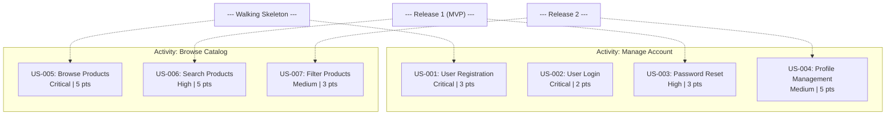

# Story Mapping Skill Guidance

## Overview

Run this skill after user stories and acceptance criteria exist. It organizes stories spatially into a **story map** that reveals the product's scope through three dimensions: user activities (the backbone), a walking skeleton (the MVP end-to-end flow), and release slices that partition remaining work into incremental deliveries. The output provides both a narrative table and a Mermaid diagram for visual-first communication with stakeholders.

## When to Use This Skill

Use this skill after user stories and epics have been generated by `01-user-story-generation` and acceptance criteria have been refined by `02-acceptance-criteria`. Story mapping converts the flat backlog into a two-dimensional visualization that exposes gaps, redundancies, and release boundaries before sprint planning begins.

## Quick Reference

- **Inputs:** `../output/user_stories.md`, `../output/epic_breakdown.md`
- **Outputs:** `../output/story_map.md`, `../output/story_map.mmd`
- **Tone:** Structured, visual-first; prioritize spatial clarity over prose density.

## Input Files

| File | Source | Required? |
|------|--------|-----------|
| `user_stories.md` | `../output/user_stories.md` | Yes |
| `epic_breakdown.md` | `../output/epic_breakdown.md` | Yes |

## Output Files

| File | Contents | Format |
|------|----------|--------|
| `story_map.md` | Narrative tables showing activities x releases with story identifiers | Markdown |
| `story_map.mmd` | Mermaid diagram with subgraphs per activity and release boundary labels | Mermaid |

## Core Instructions

1. **Read inputs.** Parse `../output/user_stories.md` and `../output/epic_breakdown.md`. Log the absolute path and line count of each file read.
2. **Identify user activities.** Derive backbone activities from the epic groupings. Each epic typically corresponds to one user activity (e.g., "Manage Account", "Browse Catalog", "Complete Purchase"). Activities represent the high-level tasks users perform end-to-end.
3. **Map stories to activities.** Place every story under its parent activity column, ordered by descending priority (Critical first, then High, Medium, Low).
4. **Define the Walking Skeleton.** Select the minimum set of Critical-priority stories that, taken together, demonstrate one complete end-to-end user flow. These stories form the foundation that proves the architecture works.
5. **Slice into releases.** Partition remaining stories into release groups:
   - **Release 1 (MVP):** All Must-Have stories beyond the walking skeleton.
   - **Release 2:** Should-Have stories that extend core functionality.
   - **Release 3:** Could-Have stories and enhancements.
6. **Generate `story_map.md`.** Write a narrative document containing:
   - A summary table listing each activity and the count of stories per release.
   - A detailed table per activity with columns: Story ID, Title, Priority, Points, Release.
   - A Walking Skeleton section listing the selected stories and the end-to-end flow they demonstrate.
7. **Generate `story_map.mmd`.** Write a Mermaid graph where each activity is a subgraph, stories are nodes labeled with ID, title, priority, and points, and horizontal dividers or annotations mark release boundaries.

## Output Format Specification

### story_map.md (Narrative Tables)

```markdown
# Story Map: [Project Name]

**Generated:** [Date]
**Standards:** IEEE 29148-2018, Jeff Patton Story Mapping (2014)

---

## Backbone Activities

| Activity | Walking Skeleton | Release 1 (MVP) | Release 2 | Release 3 | Total Stories |
|----------|-----------------|------------------|-----------|-----------|---------------|
| Manage Account | 2 | 3 | 2 | 1 | 8 |
| Browse Catalog | 1 | 2 | 2 | 1 | 6 |

---

## Walking Skeleton

The following stories form the minimum end-to-end flow:

| Story ID | Title | Activity | Points |
|----------|-------|----------|--------|
| US-001 | User Registration | Manage Account | 3 |
| US-005 | Browse Products | Browse Catalog | 5 |

---

## Activity Detail: Manage Account

| Story ID | Title | Priority | Points | Release |
|----------|-------|----------|--------|---------|
| US-001 | User Registration | Critical | 3 | Walking Skeleton |
| US-002 | User Login | Critical | 2 | Walking Skeleton |
| US-003 | Password Reset | High | 3 | Release 1 |
```

### story_map.mmd (Mermaid Diagram)



## Common Pitfalls

- **Missing backbone activities.** If an epic exists in `epic_breakdown.md` but no corresponding activity appears in the map, the backbone is incomplete. Every epic must map to at least one activity.
- **Orphan stories.** Stories that do not belong to any activity column indicate a gap in epic decomposition. Trace them back to `epic_breakdown.md` and assign them.
- **Unclear release boundaries.** Each release slice must have a stated rationale (e.g., "MVP viability", "market differentiation"). Avoid arbitrary groupings.
- **Walking skeleton too large.** The skeleton should contain the fewest stories needed for one end-to-end path; including non-critical stories inflates it beyond its architectural purpose.

## Verification Checklist

Before finalizing the story map:

- [ ] Every story in `user_stories.md` appears exactly once in the map.
- [ ] All backbone activities trace back to at least one epic in `epic_breakdown.md`.
- [ ] The walking skeleton demonstrates a complete end-to-end user flow using only Critical-priority stories.
- [ ] Release 1 (MVP) contains all Must-Have stories not in the walking skeleton.
- [ ] No story appears in more than one release slice.
- [ ] The Mermaid diagram in `story_map.mmd` renders without syntax errors.

## Integration

**Upstream Dependencies:**
- `01-user-story-generation` -- provides `user_stories.md` and `epic_breakdown.md`
- `02-acceptance-criteria` -- refines acceptance criteria used to validate story completeness

**Downstream Consumers:**
- `04-backlog-prioritization` -- uses the release slices as input for sprint allocation
- `07-agile-artifacts/` -- sprint planning consumes the prioritized, mapped backlog

## Standards

- **IEEE Std 29148-2018:** Requirements Engineering -- stakeholder requirements visualization (Section 6.4)
- **Jeff Patton, Story Mapping (2014):** Backbone, walking skeleton, and release slice methodology

## Resources

- `logic.prompt` -- execution prompt for the AI skill runner
- `README.md` -- quick-start summary for this skill

---

**Last Updated:** 2026-02-28
**Skill Version:** 1.0.0
