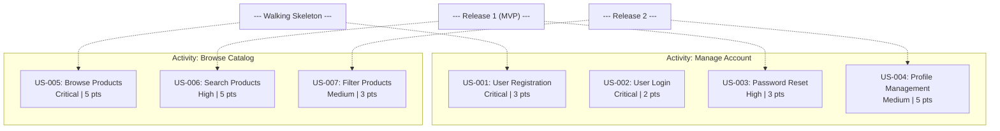

# Story Mapping Skill Guidance

<!-- local-contract-start -->
<!-- dual-compat-start -->
## Use When

- arranging an existing backlog into user activities, a walking skeleton, and release slices; use backlog-prioritization for economic ordering after the map exists.
- Use this procedure when the required source artefacts are available and `Story map and release-slice record` is the next lifecycle deliverable.

## Do Not Use When

- Use `backlog-prioritization` when that neighbouring route owns the decision or deliverable.
- Do not invent missing project evidence, standards clauses, thresholds, or stakeholder decisions.

## Required Inputs

| Artefact | Source or provider | Required? | Behaviour when missing |
| --- | --- | --- | --- |
| Approved stories, personas, user journeys, dependencies, and release constraints | Product backlog and product owner | Yes | Stop the affected step, name the missing source, and return only a qualified gap record. |

## Workflow

1. Inspect the required inputs and log the exact sources, versions, and unresolved assumptions.
2. Apply this skill's existing domain workflow and decision rules to produce `Story map and release-slice record`.
3. Stop when a required source, accountable decision owner, or deterministic test oracle is absent.
4. Recover by preserving valid work, marking the blocked scope, and returning the narrowest qualified artefact plus the next evidence needed.

## Outputs

| Artefact | Consumer | Acceptance condition |
| --- | --- | --- |
| Story map and release-slice record | Product owner, delivery team, and backlog prioritisation | Required sections are populated, source links resolve, and every material requirement or decision has an observable review or test oracle. |

## Evidence Produced

| Evidence | Reviewer | Acceptance condition |
| --- | --- | --- |
| Source, decision, trace, and validation record for `Story map and release-slice record` | Requirements quality reviewer | Inputs used, decisions made, checks run, failures, and unassessed items are explicit. |

## Capability and permission boundaries

Read and search are required. Editing is allowed only when the request authorises creation or repair of the named requirements artefact. Publishing, production mutation, destructive action, spending, and certification require explicit authority.

## Degraded mode

Fallback: if a required file, reviewer, standard source, network check, renderer, or execution capability is unavailable, return the narrowest useful qualified result and mark the affected check `not assessed`; never convert an unassessed check into a pass.

## Decision Rules

| Choice or condition | Action | Failure or risk avoided |
| --- | --- | --- |
| A release slice omits an end-to-end user outcome | Move or add stories until the slice forms a testable walking skeleton. | Component batches that deliver no usable outcome. |
| Required inputs and test oracles are complete | Continue through the existing workflow and record evidence. | A deliverable whose acceptance cannot be reproduced. |
| A mandatory source or owner is missing | Stop the affected branch and issue a qualified gap record. | Fabricated context or unauthorised decisions. |

## Quality Standards

- Preserve stable identifiers and bidirectional traceability from project evidence to `Story map and release-slice record` and its acceptance checks.
- Apply ISO/IEEE measures only with a named metric, method, threshold, evidence source, and responsible reviewer; run the anti-slop gate before release.

## Anti-Patterns

- Producing `Story map and release-slice record` from assumed context. Fix: cite the project source or mark the scope blocked.
- Accepting a material requirement without a deterministic oracle. Fix: add a measurable result, boundary, and verification method.
- Crossing into `backlog-prioritization` without routing the decision. Fix: hand off the named input and preserve trace links.
- Treating an unavailable check as passed. Fix: mark it `not assessed` and state the release consequence.
- Claiming standards, statutory, or stakeholder approval without evidence. Fix: cite the source and reviewer or qualify the claim.

## References

- [Skill authoring and release standard](../../../docs/skill-authoring-standard.md)
- [Skill guidance](README.md)
- [Executable generation logic](logic.prompt)
<!-- dual-compat-end -->
<!-- local-contract-end -->

## Overview

Run this skill after user stories and acceptance criteria exist. It organizes stories spatially into a **story map** that reveals the product's scope through three dimensions: user activities (the backbone), a walking skeleton (the MVP end-to-end flow), and release slices that partition remaining work into incremental deliveries. The output provides both a narrative table and a Mermaid diagram for visual-first communication with stakeholders.

## When to Use This Skill

Use this skill after user stories and epics have been generated by `01-user-story-generation` and acceptance criteria have been refined by `02-acceptance-criteria`. Story mapping converts the flat backlog into a two-dimensional visualization that exposes gaps, redundancies, and release boundaries before sprint planning begins.

## Quick Reference

- **Inputs:** `projects/<ProjectName>/<phase>/<document>/user_stories.md`, `projects/<ProjectName>/<phase>/<document>/epic_breakdown.md`
- **Outputs:** `projects/<ProjectName>/<phase>/<document>/story_map.md`, `projects/<ProjectName>/<phase>/<document>/story_map.mmd`
- **Tone:** Structured, visual-first; prioritize spatial clarity over prose density.

## Input Files

| File | Source | Required? |
|------|--------|-----------|
| `user_stories.md` | `projects/<ProjectName>/<phase>/<document>/user_stories.md` | Yes |
| `epic_breakdown.md` | `projects/<ProjectName>/<phase>/<document>/epic_breakdown.md` | Yes |

## Output Files

| File | Contents | Format |
|------|----------|--------|
| `story_map.md` | Narrative tables showing activities x releases with story identifiers | Markdown |
| `story_map.mmd` | Mermaid diagram with subgraphs per activity and release boundary labels | Mermaid |

## Core Instructions

1. **Read inputs.** Parse `projects/<ProjectName>/<phase>/<document>/user_stories.md` and `projects/<ProjectName>/<phase>/<document>/epic_breakdown.md`. Log the absolute path and line count of each file read.
2. **Identify user activities.** Derive backbone activities from the epic groupings. Each epic typically corresponds to one user activity (e.g., "Manage Account", "Browse Catalog", "Complete Purchase"). Activities represent the high-level tasks users perform end-to-end.
3. **Map stories to activities.** Place every story under its parent activity column, ordered by descending priority (Critical first, then High, Medium, Low).
4. **Define the Walking Skeleton.** Select the minimum set of Critical-priority stories that, taken together, demonstrate one complete end-to-end user flow. These stories form the foundation that proves the architecture works.
5. **Slice into releases.** Partition remaining stories into release groups:
   - **Release 1 (MVP):** All Must-Have stories beyond the walking skeleton.
   - **Release 2:** Should-Have stories that extend core functionality.
   - **Release 3:** Could-Have stories and enhancements.
6. **Generate `story_map.md`.** Write a narrative document containing:
   - A summary table listing each activity and the count of stories per release.
   - A detailed table per activity with columns: Story ID, Title, Priority, Points, Release.
   - A Walking Skeleton section listing the selected stories and the end-to-end flow they demonstrate.
7. **Generate `story_map.mmd`.** Write a Mermaid graph where each activity is a subgraph, stories are nodes labeled with ID, title, priority, and points, and horizontal dividers or annotations mark release boundaries.

## Output Format Specification

### story_map.md (Narrative Tables)

```markdown
# Story Map: [Project Name]

**Generated:** [Date]
**Standards:** IEEE 29148-2018, Jeff Patton Story Mapping (2014)

---

## Backbone Activities

| Activity | Walking Skeleton | Release 1 (MVP) | Release 2 | Release 3 | Total Stories |
|----------|-----------------|------------------|-----------|-----------|---------------|
| Manage Account | 2 | 3 | 2 | 1 | 8 |
| Browse Catalog | 1 | 2 | 2 | 1 | 6 |

---

## Walking Skeleton

The following stories form the minimum end-to-end flow:

| Story ID | Title | Activity | Points |
|----------|-------|----------|--------|
| US-001 | User Registration | Manage Account | 3 |
| US-005 | Browse Products | Browse Catalog | 5 |

---

## Activity Detail: Manage Account

| Story ID | Title | Priority | Points | Release |
|----------|-------|----------|--------|---------|
| US-001 | User Registration | Critical | 3 | Walking Skeleton |
| US-002 | User Login | Critical | 2 | Walking Skeleton |
| US-003 | Password Reset | High | 3 | Release 1 |
```

### story_map.mmd (Mermaid Diagram)


```mermaid
graph TD
    subgraph "Activity: Manage Account"
        US001["US-001: User Registration<br/>Critical | 3 pts"]
        US002["US-002: User Login<br/>Critical | 2 pts"]
        US003["US-003: Password Reset<br/>High | 3 pts"]
        US004["US-004: Profile Management<br/>Medium | 5 pts"]
    end

    subgraph "Activity: Browse Catalog"
        US005["US-005: Browse Products<br/>Critical | 5 pts"]
        US006["US-006: Search Products<br/>High | 5 pts"]
        US007["US-007: Filter Products<br/>Medium | 3 pts"]
    end

    WS["--- Walking Skeleton ---"] -.-> US001
    WS -.-> US005
    R1["--- Release 1 (MVP) ---"] -.-> US003
    R1 -.-> US006
    R2["--- Release 2 ---"] -.-> US004
    R2 -.-> US007
```

## Common Pitfalls

- **Missing backbone activities.** If an epic exists in `epic_breakdown.md` but no corresponding activity appears in the map, the backbone is incomplete. Every epic must map to at least one activity.
- **Orphan stories.** Stories that do not belong to any activity column indicate a gap in epic decomposition. Trace them back to `epic_breakdown.md` and assign them.
- **Unclear release boundaries.** Each release slice must have a stated rationale (e.g., "MVP viability", "market differentiation"). Avoid arbitrary groupings.
- **Walking skeleton too large.** The skeleton should contain the fewest stories needed for one end-to-end path; including non-critical stories inflates it beyond its architectural purpose.

## Verification Checklist

Before finalizing the story map:

- [ ] Every story in `user_stories.md` appears exactly once in the map.
- [ ] All backbone activities trace back to at least one epic in `epic_breakdown.md`.
- [ ] The walking skeleton demonstrates a complete end-to-end user flow using only Critical-priority stories.
- [ ] Release 1 (MVP) contains all Must-Have stories not in the walking skeleton.
- [ ] No story appears in more than one release slice.
- [ ] The Mermaid diagram in `story_map.mmd` renders without syntax errors.

## Integration

**Upstream Dependencies:**
- `01-user-story-generation` -- provides `user_stories.md` and `epic_breakdown.md`
- `02-acceptance-criteria` -- refines acceptance criteria used to validate story completeness

**Downstream Consumers:**
- `04-backlog-prioritization` -- uses the release slices as input for sprint allocation
- `07-agile-artifacts/` -- sprint planning consumes the prioritized, mapped backlog

## Standards

- **IEEE Std 29148-2018:** Requirements Engineering -- stakeholder requirements visualization (Section 6.4)
- **Jeff Patton, Story Mapping (2014):** Backbone, walking skeleton, and release slice methodology

## Resources

- `logic.prompt` -- execution prompt for the AI skill runner
- `README.md` -- quick-start summary for this skill

---

**Last Updated:** 2026-02-28
**Skill Version:** 1.0.0
