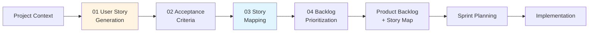

# Agile Requirements Pipeline

This directory contains skills for generating **Agile-compliant requirements documentation** using user stories, story mapping, and backlog management.

## When to Use This Pipeline

✅ **USE for:**
- Scrum, Kanban, or XP projects
- Startups with evolving requirements
- MVPs and rapid prototypes
- Projects with frequent stakeholder feedback
- Teams practicing iterative development

❌ **DO NOT USE for:**
- Regulated industries requiring IEEE 830 SRS (use `../waterfall/` instead)
- Fixed-scope, fixed-price contracts
- Safety-critical systems requiring formal V&V
- Projects with complete upfront requirements

## Pipeline Overview



## The Agile Requirements Skills

| Skill | Purpose | Standards | Output |
|-------|---------|-----------|--------|
| **[01-user-story-generation](01-user-story-generation/)** | Transform features into INVEST-compliant user stories | IEEE 29148, INVEST Criteria | User stories with acceptance criteria |
| **02-acceptance-criteria** | Refine Given-When-Then test scenarios | Behavior-Driven Development (BDD) | Detailed acceptance criteria |
| **03-story-mapping** | Create visual story map for release planning | Jeff Patton Story Mapping | Story map diagram + release plan |
| **04-backlog-prioritization** | Prioritize backlog using MoSCoW or WSJF | SAFe WSJF, MoSCoW Method | Prioritized backlog |

## Quick Start

### Step 1: Initialize Context

Ensure `../project_context/` contains:

- **`vision.md`**: Product vision and goals (created by `01-strategic-vision/`)
- **`features.md`**: High-level feature catalog
- **`personas.md`**: User personas (created during user story generation)

If these don't exist, run `01-strategic-vision/01-prd-generation` first.

### Step 2: Generate User Stories

```bash
Run skill: 02-requirements-engineering/agile/01-user-story-generation
```

**Output:**
- `../output/user_stories.md` - Complete backlog
- `../output/story_map.mmd` - Visual story map
- `../output/backlog_summary.md` - Metrics and sprint recommendations

### Step 3: Refine Acceptance Criteria (Optional)

```bash
Run skill: 02-requirements-engineering/agile/02-acceptance-criteria
```

Adds detailed Given-When-Then scenarios for complex stories.

### Step 4: Create Story Map

```bash
Run skill: 02-requirements-engineering/agile/03-story-mapping
```

Generates visual journey map showing epics → stories → releases.

### Step 5: Prioritize Backlog

```bash
Run skill: 02-requirements-engineering/agile/04-backlog-prioritization
```

Applies MoSCoW (Must/Should/Could/Won't) or WSJF (Weighted Shortest Job First) prioritization.

## Expected Outputs

After completing all skills, you will have:

- **`../output/user_stories.md`**: INVEST-compliant user stories with story points
- **`../output/story_map.mmd`**: Visual Mermaid diagram of user journey
- **`../output/backlog_summary.md`**: Sprint-ready backlog with priorities
- **`../output/epic_breakdown.md`**: Epic → Story hierarchy
- **`../output/acceptance_criteria_detailed.md`**: BDD-style test scenarios

## Integration with SDLC Phases

**Upstream Dependencies:**
- Requires **01-strategic-vision/01-prd-generation** for product goals
- Uses **`vision.md`** and **`features.md`** as input

**Downstream Consumers:**
- User stories feed into **07-agile-artifacts/01-sprint-planning**
- Acceptance criteria become test cases in **05-testing-documentation/**
- Epics inform **03-design-documentation/01-high-level-design**

## Agile vs. Waterfall Requirements

| Aspect | Agile (This Pipeline) | Waterfall (`../waterfall/`) |
|--------|----------------------|----------------------------|
| **Format** | User stories | Formal SRS document |
| **Level of Detail** | Just-enough (INVEST) | Comprehensive (IEEE 830) |
| **Change Management** | Backlog refinement | Formal change control |
| **Verification** | Acceptance criteria + DoD | Traceability matrix (IEEE 1012) |
| **Timeline** | Hours to days per story | Weeks to months for full SRS |
| **Best For** | Iterative projects | Regulated, fixed-scope projects |

## User Story Format

All stories generated by this pipeline follow this standard:

```markdown
### US-XXX: [Story Title]

**As a** [persona/role]
**I want to** [action/capability]
**So that** [business value/benefit]

**Acceptance Criteria:**
- [ ] Given [precondition], When [action], Then [expected result]
- [ ] [Additional criteria...]

**Story Points:** [1, 2, 3, 5, 8, 13]
**Priority:** [Critical / High / Medium / Low]
**Epic:** [Epic name]
**Tags:** [#feature-area, #persona]
```

## INVEST Criteria Compliance

Every user story is validated against **INVEST criteria**:

- **I**ndependent: Story can be completed without blocking dependencies
- **N**egotiable: Describes outcome, not implementation
- **V**aluable: Delivers measurable value to users/business
- **E**stimable: Team can estimate effort
- **S**mall: Fits within one sprint (<13 story points)
- **T**estable: Has clear, verifiable acceptance criteria

See [01-user-story-generation/references/invest-criteria.md](01-user-story-generation/references/invest-criteria.md) for detailed validation guide.

## Story Point Estimation

Stories use **Fibonacci sequence** (1, 2, 3, 5, 8, 13) for estimation:

| Points | Complexity | Typical Duration |
|--------|------------|------------------|
| 1 | Trivial | <4 hours |
| 2 | Simple | 4-8 hours |
| 3 | Moderate | 1-2 days |
| 5 | Complex | 2-4 days |
| 8 | Very Complex | 1 week |
| 13 | Epic-sized | **Should be split** |

## Backlog Maintenance

**When to re-run skills:**

| Changed File | Re-run Skill | Reason |
|--------------|--------------|--------|
| `vision.md` | 01-user-story-generation | Vision affects story priorities |
| `features.md` | 01-user-story-generation | New features → new stories |
| `personas.md` | 01-user-story-generation | Personas affect story framing |
| User stories changed | 03-story-mapping | Update story map visualization |
| Priorities changed | 04-backlog-prioritization | Reorder backlog |

**Idempotency:** Skills are re-runnable and will:
- Preserve existing story IDs (US-XXX)
- Append new stories for new features
- Update acceptance criteria if features change
- Regenerate visualizations

## Common Pitfalls

❌ **Writing implementation details in stories**
- Bad: "Create a React form with Formik validation"
- Good: "Register as a new user with email/password"

❌ **Vague acceptance criteria**
- Bad: "The system should work correctly"
- Good: "Given valid credentials, When I log in, Then I see dashboard"

❌ **Stories too large (>13 points)**
- Always split epic-sized stories into smaller chunks

❌ **Missing "So that" clause**
- Every story needs clear business value

❌ **Generic personas**
- "User" is too vague; use specific roles from `personas.md`

## Standards Compliance

This pipeline implements:

- **IEEE Std 29148-2018**: Requirements Engineering
- **INVEST Criteria** (Bill Wake, 2003)
- **Story Mapping** (Jeff Patton, 2014)
- **Behavior-Driven Development** (Dan North, 2006)
- **SAFe WSJF** (Scaled Agile Framework)
- **MoSCoW Prioritization** (Dai Clegg, 1994)

## Related Pipelines

- **Waterfall SRS:** `../waterfall/` - IEEE 830-compliant formal requirements
- **Design Documentation:** `../../03-design-documentation/` - HLD, LLD, API specs
- **Sprint Planning:** `../../07-agile-artifacts/01-sprint-planning/` - Sprint backlog
- **Testing:** `../../05-testing-documentation/` - Test cases from acceptance criteria

## Pipeline Status

| Skill | Status | Version | Last Updated |
|-------|--------|---------|--------------|
| **01-user-story-generation** | ✅ Stable | 1.0.0 | 2026-02-07 |
| **02-acceptance-criteria** | 📅 Planned | - | TBD |
| **03-story-mapping** | 📅 Planned | - | TBD |
| **04-backlog-prioritization** | 📅 Planned | - | TBD |

---

**Need help?** See [01-user-story-generation/SKILL.md](01-user-story-generation/SKILL.md) for detailed instructions.

**Last Updated:** 2026-02-07
