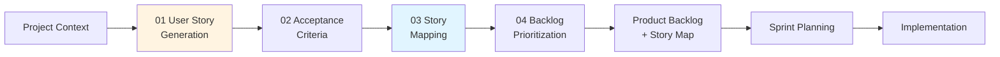

# Agile Requirements Pipeline

This directory contains skills for generating Agile-compliant requirements documentation using user stories, story mapping, and backlog management.

<!-- alias-block start -->
The canonical runtime workspace for this pipeline is `projects/<ProjectName>/`. References inside older skill-local files to `../project_context/` and `../output/` should be interpreted as compatibility aliases into that active project workspace.
<!-- alias-block end -->

## When to Use This Pipeline

Use this pipeline for:

- Scrum, Kanban, or XP projects
- Startups with evolving requirements
- MVPs and rapid prototypes
- Projects with frequent stakeholder feedback
- Teams practicing iterative development

Do not use this pipeline as the only requirements path for:

- regulated industries requiring a formal SRS baseline
- fixed-scope, fixed-price contracts
- safety-critical systems requiring formal V&V
- projects with complete up-front requirements

## Pipeline Overview


```mermaid
flowchart LR
    C[Project Context] --> S01[01 User Story<br/>Generation]
    S01 --> S02[02 Acceptance<br/>Criteria]
    S02 --> S03[03 Story<br/>Mapping]
    S03 --> S04[04 Backlog<br/>Prioritization]
    S04 --> O[Product Backlog<br/>+ Story Map]

    O --> SP[Sprint Planning]
    SP --> I[Implementation]

    style S01 fill:#fff4e1
    style S03 fill:#e1f5ff
```

## The Agile Requirements Skills

| Skill | Purpose | Standards | Output |
|-------|---------|-----------|--------|
| [01-user-story-generation](01-user-story-generation/) | Transform features into INVEST-compliant user stories | IEEE 29148, INVEST Criteria | User stories with acceptance criteria |
| 02-acceptance-criteria | Refine Given-When-Then test scenarios | BDD | Detailed acceptance criteria |
| 03-story-mapping | Create visual story map for release planning | Jeff Patton Story Mapping | Story map diagram and release plan |
| 04-backlog-prioritization | Prioritize backlog using MoSCoW or WSJF | SAFe WSJF, MoSCoW | Prioritized backlog |

## Quick Start

### Step 1: Initialize Context

Ensure `projects/<ProjectName>/_context/` contains:

- `vision.md`: product vision and goals
- `features.md`: high-level feature catalog
- `personas.md`: user personas

If these do not exist, run the strategic vision flow first.

### Step 2: Generate User Stories

```bash
Run skill: 02-requirements-engineering/agile/01-user-story-generation
```

Canonical outputs live under `projects/<ProjectName>/02-requirements-engineering/...`, typically including:

- `user_stories.md`
- `story_map.mmd`
- `backlog_summary.md`

### Step 3: Refine Acceptance Criteria

```bash
Run skill: 02-requirements-engineering/agile/02-acceptance-criteria
```

### Step 4: Create Story Map

```bash
Run skill: 02-requirements-engineering/agile/03-story-mapping
```

### Step 5: Prioritize Backlog

```bash
Run skill: 02-requirements-engineering/agile/04-backlog-prioritization
```

## Integration with SDLC Phases

- Upstream: Strategic vision artifacts provide goals and scope.
- Downstream: Agile stories feed sprint planning, testing, and design refinement.
- Hybrid: use this pipeline for volatile delivery areas only after the stable scope boundary is defined upstream.

See [hybrid-operating-model.md](/C:/wamp64/www/srs-skills/docs/hybrid-operating-model.md) for the required handshake between baselined requirements, sprint execution, and change control.

## Agile vs. Waterfall Requirements

| Aspect | Agile (this pipeline) | Waterfall (`../waterfall/`) |
|--------|------------------------|-----------------------------|
| Format | User stories | Formal SRS document |
| Level of detail | Just enough | Comprehensive |
| Change management | Backlog refinement | Formal change control |
| Verification | Acceptance criteria plus DoD | Traceability matrix and formal V&V |
| Best fit | Iterative delivery | Regulated and fixed-scope work |

## Quality Expectations

Every user story should remain:

- independent enough to schedule
- valuable to a user or business goal
- small enough to deliver
- testable through explicit acceptance criteria
- traceable back to scope and forward into testing

## Related Pipelines

- Waterfall SRS: `../waterfall/`
- Design documentation: `../../03-design-documentation/`
- Sprint planning: `../../07-agile-artifacts/01-sprint-planning/`
- Testing: `../../05-testing-documentation/`
