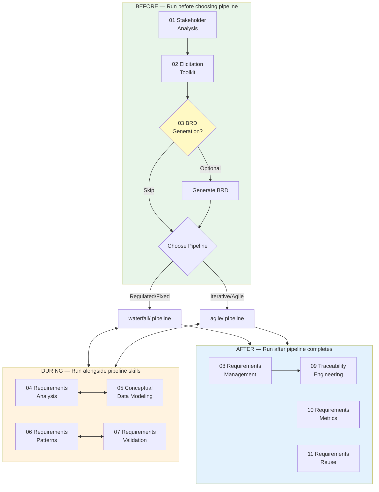

# Requirements Engineering Fundamentals

**Methodology-agnostic RE skills** that wrap around both the Waterfall and Agile pipelines. These skills implement the complete requirements engineering lifecycle drawn from four authoritative sources:

- **Agile Software Requirements** (Dean Leffingwell) — Lean requirements practices
- **Business Requirements Gathering & Data Architecture Modeling** — BRD, data quality, MDM
- **Requirements Engineering for Software and Systems** (Phillip Laplante) — Complete RE lifecycle
- **Software Requirements Essentials** (Karl Wiegers & Joy Beatty) — 20 core BA practices

## Lifecycle Architecture



## Skill Inventory

### Before — Run Before Choosing Pipeline

| # | Skill | Purpose | Standards | Required? |
|---|-------|---------|-----------|-----------|
| 01 | [Stakeholder Analysis](before/01-stakeholder-analysis/) | Identify, classify, prioritize stakeholders | IEEE 29148 §6.2 | Yes |
| 02 | [Elicitation Toolkit](before/02-elicitation-toolkit/) | Multi-technique requirements gathering | IEEE 29148 §6.3, Laplante Ch.4 | Yes |
| 03 | [BRD Generation](before/03-brd-generation/) | Business Requirements Document | IEEE 29148 §6.4 | **Optional** |

### During — Run Alongside Pipeline Skills

| # | Skill | Purpose | Standards | Required? |
|---|-------|---------|-----------|-----------|
| 04 | [Requirements Analysis](during/04-requirements-analysis/) | Classify, detect conflicts, assess feasibility | IEEE 29148 §6.5, Laplante Ch.5 | Yes |
| 05 | [Conceptual Data Modeling](during/05-conceptual-data-modeling/) | Entity-relationship from business language | IEEE 1016, Book 2 Ch.5-7 | Yes |
| 06 | [Requirements Patterns](during/06-requirements-patterns/) | Decision tables, state transitions, CRUD | IEEE 830, Wiegers 10-12 | Yes |
| 07 | [Requirements Validation](during/07-requirements-validation/) | Reviews, inspections, prototype testing | IEEE 1012, Wiegers 13-14 | Yes |

### After — Run After Pipeline Completes

| # | Skill | Purpose | Standards | Required? |
|---|-------|---------|-----------|-----------|
| 08 | [Requirements Management](after/08-requirements-management/) | Baselining, change control, versioning | IEEE 29148 §6.7 | Yes |
| 09 | [Traceability Engineering](after/09-traceability-engineering/) | Forward/backward trace links | IEEE 1012, Laplante Ch.7.3 | Yes |
| 10 | [Requirements Metrics](after/10-requirements-metrics/) | Quality scoring & universal quality gate | Laplante Ch.7.4, Wiegers 19-20 | Yes |
| 11 | [Requirements Reuse](after/11-requirements-reuse/) | Requirements library for product lines | Laplante Ch.9 | **Optional** |

## Quick Start

### Step 1: Run Before Skills

```bash
# Identify and classify stakeholders
Run skill: 02-requirements-engineering/fundamentals/before/01-stakeholder-analysis

# Gather requirements using appropriate techniques
Run skill: 02-requirements-engineering/fundamentals/before/02-elicitation-toolkit

# (Optional) Generate Business Requirements Document
Run skill: 02-requirements-engineering/fundamentals/before/03-brd-generation
```

### Step 2: Choose and Run Your Pipeline

Based on methodology selected in `00-meta-initialization`:

```bash
# Waterfall: Run phases 01-08
Run skill: 02-requirements-engineering/waterfall/01-initialize-srs
# ... through 08-semantic-auditing

# OR Agile: Run skills 01-04
Run skill: 02-requirements-engineering/agile/01-user-story-generation
# ... through 04-backlog-prioritization
```

### Step 3: Run During Skills (Alongside Pipeline)

Invoke these as needed when you encounter complexity:

```bash
# Analyze and resolve requirement conflicts
Run skill: 02-requirements-engineering/fundamentals/during/04-requirements-analysis

# Model business entities and relationships
Run skill: 02-requirements-engineering/fundamentals/during/05-conceptual-data-modeling

# Apply patterns to complex business rules
Run skill: 02-requirements-engineering/fundamentals/during/06-requirements-patterns

# Validate requirements quality before proceeding
Run skill: 02-requirements-engineering/fundamentals/during/07-requirements-validation
```

### Step 4: Run After Skills

```bash
# Establish requirements baseline
Run skill: 02-requirements-engineering/fundamentals/after/08-requirements-management

# Build traceability matrix
Run skill: 02-requirements-engineering/fundamentals/after/09-traceability-engineering

# Score requirements quality (UNIVERSAL QUALITY GATE)
Run skill: 02-requirements-engineering/fundamentals/after/10-requirements-metrics

# (Optional) Build reusable requirements library
Run skill: 02-requirements-engineering/fundamentals/after/11-requirements-reuse
```

## Input/Output Contracts

### Inputs (from `../project_context/`)

| File | Used By Skills | Purpose |
|------|----------------|---------|
| `vision.md` | 01, 02, 03, 04 | Business goals, product vision |
| `features.md` | 01, 02, 03, 04, 05, 06 | Feature catalog |
| `business_rules.md` | 04, 05, 06 | Domain logic |
| `tech_stack.md` | 04 | Technical constraints |
| `quality_standards.md` | 07, 10 | Quality targets |
| `glossary.md` | 05, 07 | IEEE 610.12 terminology |

### Outputs (to `../output/`)

| Artifact | Generated By | Consumed By |
|----------|-------------|-------------|
| `stakeholder_register.md` | Skill 01 | Skills 02, 03, 09 |
| `elicitation_log.md` | Skill 02 | Skills 03, 04, 05 |
| `brd.md` | Skill 03 (optional) | Pipeline skills |
| `requirements_analysis_report.md` | Skill 04 | Skills 06, 07 |
| `conceptual_data_model.md` | Skill 05 | Phase 03 database-design |
| `requirements_patterns.md` | Skill 06 | Skills 07, 09 |
| `validation_report.md` | Skill 07 | Skills 08, 10 |
| `requirements_baseline.md` | Skill 08 | Skill 09 |
| `change_control_process.md` | Skill 08 | Project governance |
| `traceability_matrix.md` | Skill 09 | Skill 10, Phase 09 |
| `requirements_metrics_report.md` | Skill 10 | Quality gate decision |
| `requirements_library.md` | Skill 11 (optional) | Future projects |

## Quality Gate (Skill 10)

The Requirements Metrics skill serves as the **universal quality gate** for both pipelines:

| Metric | GREEN (Pass) | YELLOW (Conditional) | RED (Fail) |
|--------|-------------|---------------------|------------|
| Completeness Index | ≥ 95% | ≥ 80% | < 80% |
| Ambiguity Index | 0 | ≤ 5 | > 5 |
| Testability Score | ≥ 90% | ≥ 75% | < 75% |
| Traceability Coverage | ≥ 85% | ≥ 70% | < 70% |
| Conflict Count | 0 | ≤ 3 | > 3 |

## Integration with Existing Pipelines

### With Waterfall Pipeline

```
fundamentals/before/ → waterfall/01-08 + fundamentals/during/ → fundamentals/after/
                                                                        ↕
                                                          waterfall/08-semantic-auditing
```

Skill 10 (Metrics) complements waterfall Phase 08 (Semantic Auditing) — run both for maximum coverage.

### With Agile Pipeline

```
fundamentals/before/ → agile/01-04 + fundamentals/during/ → fundamentals/after/
```

Skill 10 (Metrics) fills the Agile pipeline's missing quality gate — INVEST compliance is included as an Agile-specific metric.

## Standards Compliance

| Standard | Skills |
|----------|--------|
| IEEE 29148-2018 (Requirements Engineering) | 01, 02, 03, 04, 08 |
| IEEE 1012-2016 (V&V) | 07, 09 |
| IEEE 830-1998 (SRS) | 06, 07 |
| IEEE 1016-2009 (Software Design) | 05 |
| IEEE 610.12-1990 (Terminology) | All |
| ISO/IEC 25010 (Quality Model) | 07, 10 |
| ISO/IEC 15504 (Process Assessment) | 10 |

## Domain-Specific Extensions

Skill 02 (Elicitation Toolkit) includes domain checklists that hook into existing `skills/` directory:

| Domain | Checklist Covers | Related Skill |
|--------|-----------------|---------------|
| Healthcare | HIPAA, HL7, patient safety | `skills/healthcare-ui-design/` |
| SaaS | Multi-tenancy, billing, subscriptions | `skills/multi-tenant-saas-architecture/` |
| POS/Retail | Payment processing, inventory | `skills/pos-sales-ui-design/` |
| GIS/Mapping | Spatial data, projections | `skills/gis-mapping/` |

---

**Version:** 1.0.0
**Last Updated:** 2026-03-07
**Maintained by:** Peter Bamuhigire
