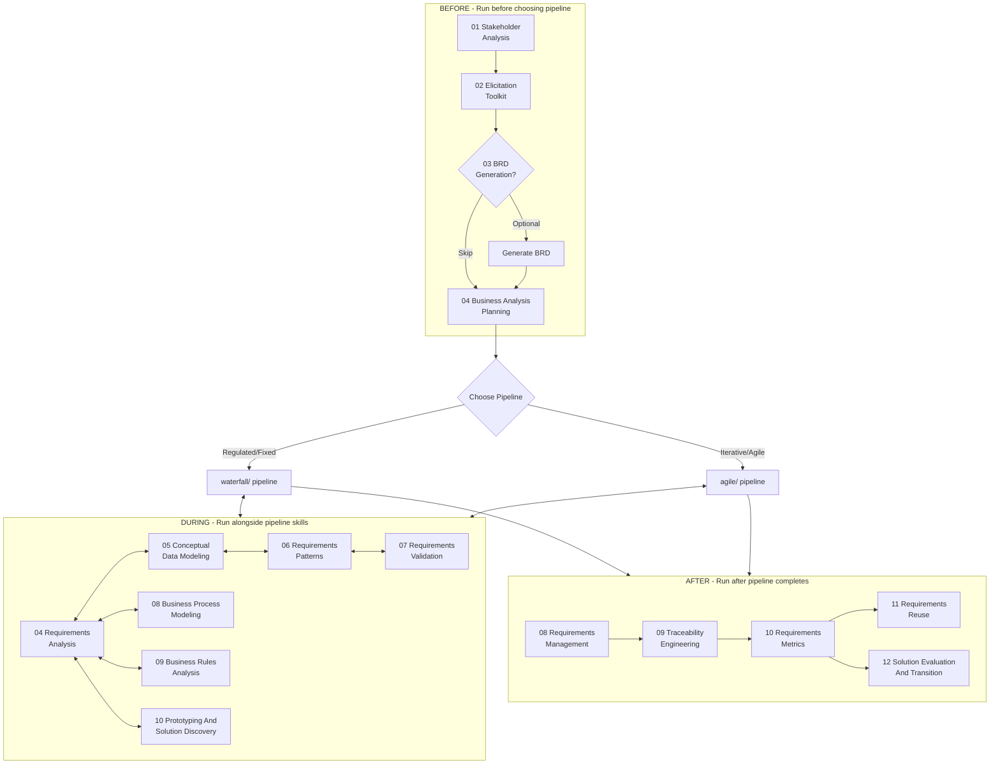

# Requirements Engineering Fundamentals

**Methodology-agnostic RE skills** that wrap around both the Waterfall and Agile pipelines. These skills now cover not only classic requirements capture and validation, but also business analysis planning, process modeling, business rules analysis, prototype-led discovery, transition planning, and requirements reuse.

The lifecycle here is grounded in:

- **Agile Software Requirements** for iterative requirements work
- **Requirements Engineering for Software and Systems** for the full RE lifecycle
- **Software Requirements Essentials** for practical BA techniques
- **Mastering the Requirements Process** for event thinking, fit criteria, and process modeling
- **Business Analysis for Practitioners** for planning, governance, and transition

## Lifecycle Architecture



## Skill Inventory

### Before - Run Before Choosing Pipeline

| # | Skill | Purpose | Standards | Required? |
|---|-------|---------|-----------|-----------|
| 01 | [Stakeholder Analysis](before/01-stakeholder-analysis/) | Identify, classify, and prioritize stakeholders | IEEE 29148 Sec. 6.2 | Yes |
| 02 | [Elicitation Toolkit](before/02-elicitation-toolkit/) | Gather requirements using multiple elicitation techniques | IEEE 29148 Sec. 6.3, Laplante Ch.4 | Yes |
| 03 | [BRD Generation](before/03-brd-generation/) | Produce a business requirements document when needed | IEEE 29148 Sec. 6.4 | Optional |
| 04 | [Business Analysis Planning](before/04-business-analysis-planning/) | Define BA governance, stakeholder engagement, decision model, and planning approach | PMI BA Practice Guide, Wiegers planning practices | Recommended |

### During - Run Alongside Pipeline Skills

| # | Skill | Purpose | Standards | Required? |
|---|-------|---------|-----------|-----------|
| 04 | [Requirements Analysis](during/04-requirements-analysis/) | Classify requirements, detect conflicts, assess feasibility | IEEE 29148 Sec. 6.5, Laplante Ch.5 | Yes |
| 05 | [Conceptual Data Modeling](during/05-conceptual-data-modeling/) | Model business entities and relationships from domain language | IEEE 1016, data analysis practices | Yes |
| 06 | [Requirements Patterns](during/06-requirements-patterns/) | Structure complex requirements using reusable patterns | IEEE 830, Wiegers Ch.10-12 | Yes |
| 07 | [Requirements Validation](during/07-requirements-validation/) | Review, inspect, and validate requirements quality | IEEE 1012, Wiegers Ch.13-14 | Yes |
| 08 | [Business Process Modeling](during/08-business-process-modeling/) | Model workflow, events, actors, decisions, and handoffs | Volere, business process analysis practices | Recommended |
| 09 | [Business Rules Analysis](during/09-business-rules-analysis/) | Separate rules from processes and catalog rule logic explicitly | Business rules analysis practices | Recommended |
| 10 | [Prototyping And Solution Discovery](during/10-prototyping-and-solution-discovery/) | Compare candidate solutions and run prototype-driven learning loops | Volere prototyping and discovery practices | Recommended |

### After - Run After Pipeline Completes

| # | Skill | Purpose | Standards | Required? |
|---|-------|---------|-----------|-----------|
| 08 | [Requirements Management](after/08-requirements-management/) | Baselines, change control, and versioning | IEEE 29148 Sec. 6.7 | Yes |
| 09 | [Traceability Engineering](after/09-traceability-engineering/) | Build forward and backward trace links | IEEE 1012, Laplante Ch.7.3 | Yes |
| 10 | [Requirements Metrics](after/10-requirements-metrics/) | Score requirements quality and enforce the quality gate | Laplante Ch.7.4, Wiegers Ch.19-20 | Yes |
| 11 | [Requirements Reuse](after/11-requirements-reuse/) | Build a reusable requirements library | Laplante Ch.9 | Optional |
| 12 | [Solution Evaluation And Transition](after/12-solution-evaluation-and-transition/) | Plan organizational transition, evaluate outcomes, and support operational handoff | PMI BA transition and evaluation practices | Recommended |

## Suggested Flow

### Step 1: Run Before Skills

```bash
Run skill: 02-requirements-engineering/fundamentals/before/01-stakeholder-analysis
Run skill: 02-requirements-engineering/fundamentals/before/02-elicitation-toolkit
Run skill: 02-requirements-engineering/fundamentals/before/03-brd-generation
Run skill: 02-requirements-engineering/fundamentals/before/04-business-analysis-planning
```

### Step 2: Choose and Run Your Pipeline

Based on methodology selected in `00-meta-initialization`:

```bash
Run skill: 02-requirements-engineering/waterfall/01-initialize-srs
# ... through 08-semantic-auditing

# or

Run skill: 02-requirements-engineering/agile/01-user-story-generation
# ... through 04-backlog-prioritization
```

### Step 3: Run During Skills When Complexity Appears

```bash
Run skill: 02-requirements-engineering/fundamentals/during/04-requirements-analysis
Run skill: 02-requirements-engineering/fundamentals/during/05-conceptual-data-modeling
Run skill: 02-requirements-engineering/fundamentals/during/06-requirements-patterns
Run skill: 02-requirements-engineering/fundamentals/during/07-requirements-validation
Run skill: 02-requirements-engineering/fundamentals/during/08-business-process-modeling
Run skill: 02-requirements-engineering/fundamentals/during/09-business-rules-analysis
Run skill: 02-requirements-engineering/fundamentals/during/10-prototyping-and-solution-discovery
```

### Step 4: Run After Skills Before Design Baselining or Launch

```bash
Run skill: 02-requirements-engineering/fundamentals/after/08-requirements-management
Run skill: 02-requirements-engineering/fundamentals/after/09-traceability-engineering
Run skill: 02-requirements-engineering/fundamentals/after/10-requirements-metrics
Run skill: 02-requirements-engineering/fundamentals/after/11-requirements-reuse
Run skill: 02-requirements-engineering/fundamentals/after/12-solution-evaluation-and-transition
```

## Input/Output Contracts

### Inputs (from `../project_context/`)

| File | Used By Skills | Purpose |
|------|----------------|---------|
| `vision.md` | 01, 02, 03, 04 before, 04 during, 10 during, 12 after | Business goals and product intent |
| `features.md` | 01, 02, 03, 04 during, 05, 06, 08 during, 10 during | Feature scope and workflows |
| `business_rules.md` | 04 during, 05, 06, 09 during | Domain rules and policy logic |
| `tech_stack.md` | 04 during, 10 during, 12 after | Technical constraints and solution context |
| `quality_standards.md` | 07, 10 after, 12 after | Quality targets and acceptance thresholds |
| `glossary.md` | 05, 07, 09 during | Shared terminology |

### Outputs (to `../output/`)

| Artifact | Generated By | Consumed By |
|----------|-------------|-------------|
| `stakeholder_register.md` | Skill 01 | Skills 02, 03, 04 before, 09 after |
| `elicitation_log.md` | Skill 02 | Skills 03, 04 during, 05, 08 during |
| `brd.md` | Skill 03 | Pipeline skills and BA planning |
| `business_analysis_plan.md` | Skill 04 before | Pipelines, reviews, transition planning |
| `requirements_analysis_report.md` | Skill 04 during | Skills 06, 07, 08 during, 09 during, 10 during |
| `conceptual_data_model.md` | Skill 05 | Phase 03 database design |
| `requirements_patterns.md` | Skill 06 | Skills 07 and 09 after |
| `validation_report.md` | Skill 07 | Skills 08 after, 10 after |
| `business_process_models.md` | Skill 08 during | Design, testing, operations, training |
| `business_rules_catalog.md` | Skill 09 during | Validation, design, compliance, testing |
| `solution_discovery_report.md` | Skill 10 during | Design decisions and backlog shaping |
| `requirements_baseline.md` | Skill 08 after | Skill 09 after |
| `change_control_process.md` | Skill 08 after | Project governance |
| `traceability_matrix.md` | Skill 09 after | Skill 10 after and downstream phases |
| `requirements_metrics_report.md` | Skill 10 after | Quality gate decision |
| `requirements_library.md` | Skill 11 | Future projects |
| `solution_evaluation_transition_plan.md` | Skill 12 after | Deployment, training, hypercare, product governance |

## Quality Gate (Skill 10 After)

The Requirements Metrics skill serves as the universal quality gate for both pipelines:

| Metric | Green | Yellow | Red |
|--------|-------|--------|-----|
| Completeness Index | >= 95% | >= 80% | < 80% |
| Ambiguity Index | 0 | <= 5 | > 5 |
| Testability Score | >= 90% | >= 75% | < 75% |
| Traceability Coverage | >= 85% | >= 70% | < 70% |
| Conflict Count | 0 | <= 3 | > 3 |

## Integration With Existing Pipelines

### Waterfall

`fundamentals/before/ -> waterfall/01-08 + fundamentals/during/ -> fundamentals/after/`

Skill 10 after still complements waterfall semantic auditing, while the new during-skills add deeper analysis for process-heavy or policy-heavy systems.

### Agile

`fundamentals/before/ -> agile/01-04 + fundamentals/during/ -> fundamentals/after/`

The added discovery and transition skills help Agile teams avoid shallow story-only analysis and weak release preparation.

## Standards And Practices Coverage

| Standard Or Practice | Skills |
|----------------------|--------|
| IEEE 29148-2018 | 01, 02, 03, 04 during, 08 after |
| IEEE 1012-2016 | 07, 09 after |
| IEEE 830-1998 | 06, 07 |
| IEEE 1016-2009 | 05 |
| ISO/IEC 25010 | 07, 10 after, 12 after |
| PMI Business Analysis Practice Guide | 04 before, 12 after |
| Volere / Mastering the Requirements Process | 08 during, 09 during, 10 during |

## Domain-Specific Extensions

Skill 02 (Elicitation Toolkit) can still be combined with domain-specific packs under `skills/` and `domains/` where a project needs extra context such as healthcare, SaaS, retail, GIS, or other vertical constraints.

---

**Version:** 1.1.0
**Last Updated:** 2026-04-13
**Maintained by:** Peter Bamuhigire
