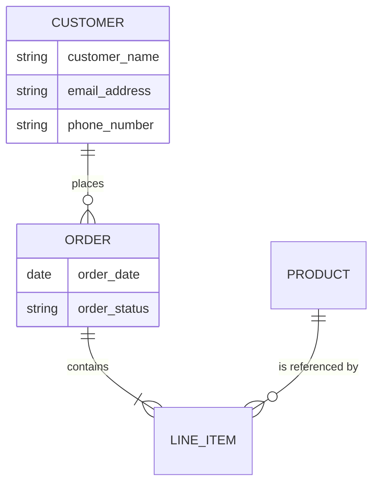

# Conceptual Data Modeling Skill

## Overview

This skill translates business language from feature descriptions, business rules, and elicitation artifacts into a formal conceptual data model. The model captures entities, relationships, cardinality, and business-level attributes without prescribing implementation details. The output serves as the authoritative data requirements baseline that feeds into Phase 03 database design skills.

## When to Use This Skill

- After requirements analysis has classified and prioritized the requirements set
- When feature descriptions reference data objects that need formal definition
- When business rules imply entity relationships that must be explicitly modeled
- Before database design begins, to ensure the logical structure is stakeholder-approved
- When Master Data Management requirements demand a shared entity vocabulary

## Quick Reference

| Attribute     | Value                                                                  |
|---------------|------------------------------------------------------------------------|
| **Inputs**    | `../project_context/features.md`, `business_rules.md`, `elicitation_log.md`, `glossary.md` |
| **Output**    | `../output/conceptual_data_model.md`                                   |
| **Tone**      | Technical, precise, business-facing; no implementation-specific terms   |
| **Standards** | IEEE 1016-2009, IEEE 29148-2018, Book 2 Ch.5-7                        |

## Input Files

| File               | Location                                  | Required | Purpose                                          |
|--------------------|-------------------------------------------|----------|--------------------------------------------------|
| features.md        | `../project_context/features.md`          | Yes      | Feature descriptions containing entity references |
| business_rules.md  | `../project_context/business_rules.md`    | Yes      | Business rules defining entity constraints        |
| elicitation_log.md | `../project_context/elicitation_log.md`   | No       | Raw stakeholder statements with domain vocabulary |
| glossary.md        | `../project_context/glossary.md`          | No       | Controlled vocabulary for entity and attribute naming |

## Output Files

| File                      | Location                                | Description                                    |
|---------------------------|----------------------------------------|------------------------------------------------|
| conceptual_data_model.md  | `../output/conceptual_data_model.md`   | Complete conceptual ER model with Mermaid diagrams, entity catalog, and data quality rules |

## Core Instructions

Follow these steps in order. Halt and notify the user if a required input file is missing.

### Step 1: Read and Catalog Context Files

Read `features.md`, `business_rules.md`, and optionally `elicitation_log.md` and `glossary.md` from `../project_context/`. If `glossary.md` exists, load it as the controlled vocabulary for entity and attribute naming. Log every file path read.

### Step 2: Entity Identification

Apply noun analysis to all input artifacts to identify candidate business entities:

1. **Extract Nouns:** Scan feature descriptions, business rules, and elicitation notes for recurring nouns and noun phrases.
2. **Filter Candidates:** Remove nouns that represent attributes (simple data values), actors (external to the system), or synonyms of already-identified entities.
3. **Validate Against Glossary:** If `glossary.md` exists, confirm entity names match the controlled vocabulary. Flag mismatches with `[GLOSSARY-MISMATCH]`.
4. **Assign Identifiers:** Assign each confirmed entity a unique identifier (e.g., ENT-001).

Produce an Entity Candidate Table:

| ID      | Entity Name | Source                  | Status    | Notes          |
|---------|-------------|-------------------------|-----------|----------------|
| ENT-001 | Customer    | features.md line 12     | Confirmed |                |
| ENT-002 | Invoice     | business_rules.md BR-05 | Confirmed |                |

See `references/er-modeling-guide.md` for entity identification techniques and naming conventions.

### Step 3: Relationship Definition

For each pair of related entities, define the relationship:

1. **Identify Verb Phrases:** Extract verbs connecting entities in business rules (e.g., "Customer places Order").
2. **Determine Cardinality:** Assign cardinality using standard notation:
   - `1:1` (one-to-one)
   - `1:M` (one-to-many)
   - `M:M` (many-to-many)
3. **Determine Optionality:** Mark each side as mandatory (must participate) or optional (may participate).
4. **Document Relationship Constraints:** Record any business rules that constrain the relationship (e.g., "An Order shall contain at least one Line Item").

Produce a Relationship Table:

| Relationship        | Entity A  | Cardinality | Entity B   | Optionality      | Governing Rule |
|---------------------|-----------|-------------|------------|------------------|----------------|
| places              | Customer  | 1:M         | Order      | A: mandatory, B: mandatory | BR-003 |
| contains            | Order     | 1:M         | LineItem   | A: mandatory, B: mandatory | BR-007 |

### Step 4: Attribute Documentation

For each entity, document attributes at the business level. Do NOT specify data types, column names, or storage details.

| Attribute       | Description                        | Business Rule | Data Quality Rule | Required |
|-----------------|------------------------------------|---------------|-------------------|----------|
| Customer Name   | Full legal name of the customer    | BR-001        | Completeness      | Yes      |
| Email Address   | Primary contact email              | BR-002        | Uniqueness, Conformity | Yes |

Each attribute SHALL include:
- A plain-language description
- The governing business rule (if any)
- The applicable data quality dimension (see Step 5)
- Whether the attribute is required or optional

### Step 5: Apply Data Quality Rules

Evaluate every entity and attribute against six data quality dimensions per Book 2:

| Dimension     | Definition                                              | Measurement Criterion                         |
|---------------|---------------------------------------------------------|-----------------------------------------------|
| Completeness  | All required attributes have values                     | Percentage of non-null required fields         |
| Consistency   | Same data represented the same way across contexts      | Cross-reference check across entity instances  |
| Conformity    | Data adheres to defined formats and standards           | Regex or format validation pass rate           |
| Accuracy      | Data correctly represents the real-world entity         | Stakeholder verification sampling rate         |
| Timeliness    | Data is current and updated within acceptable latency   | Maximum age threshold (e.g., < 24 hours)       |
| Uniqueness    | No duplicate entity instances exist                     | Duplicate detection rate across key fields     |

For each entity, produce a Data Quality Profile documenting which dimensions apply and the business-level acceptance threshold.

See `references/data-quality-rules.md` for measurement criteria and business rule mapping.

### Step 6: Generate Mermaid ER Diagrams

Produce one or more Mermaid `erDiagram` blocks that visually represent the conceptual model:



Follow Crow's Foot notation for cardinality. Split into multiple diagrams if the model exceeds 15 entities per diagram for readability.

See `references/er-modeling-guide.md` for Mermaid erDiagram syntax and notation conventions.

### Step 7: Master Data Management Assessment (Optional)

If multiple features reference the same core entities (e.g., Customer, Product), assess MDM requirements:

- Identify golden record candidates (entities shared across subsystems)
- Define entity resolution rules for matching and deduplication
- Assign data stewardship roles from `stakeholders.md`
- Document cross-system integration requirements

See `references/mdm-requirements.md` for MDM assessment guidance.

### Step 8: Generate Conceptual Data Model Document

Write the completed model to `../output/conceptual_data_model.md` using the output format below. Log summary statistics: total entities, relationships, attributes, and data quality rules defined.

## Output Format Specification

The generated `conceptual_data_model.md` SHALL contain the following sections:

```
# Conceptual Data Model: [Project Name]

## 1. Document Information
## 2. Model Summary
### 2.1 Scope and Objectives
### 2.2 Input Artifacts Analyzed
### 2.3 Key Findings
## 3. Entity Catalog
### 3.1 Entity Identification Table
### 3.2 Entity Descriptions
## 4. Relationship Model
### 4.1 Relationship Table
### 4.2 ER Diagram (Mermaid)
## 5. Attribute Dictionary
### 5.1 Entity-Attribute Tables
### 5.2 Business Rule Mappings
## 6. Data Quality Profile
### 6.1 Quality Dimensions by Entity
### 6.2 Acceptance Thresholds
## 7. Master Data Management (if applicable)
## 8. Glossary Alignment
## 9. Recommendations and Next Steps
## 10. Appendix: Standards Traceability
```

## Common Pitfalls

1. **Mixing conceptual and physical modeling:** This skill produces a business-level model. Do not specify data types, indexes, or storage engines. Those belong in Phase 03 database design.
2. **Missing M:M resolution:** Many-to-many relationships require an associative entity at the logical level. Document the M:M relationship here; resolution occurs downstream.
3. **Attribute overload:** Include only business-meaningful attributes. Internal system fields (created_at, updated_at, surrogate keys) are implementation details.
4. **Ignoring optionality:** Cardinality without optionality is incomplete. Always state whether each side of a relationship is mandatory or optional.
5. **Glossary drift:** If entity names diverge from `glossary.md`, ambiguity propagates into every downstream artifact.

## Verification Checklist

- [ ] All required input files were read and logged.
- [ ] Every entity has a unique identifier, description, and source reference.
- [ ] Every relationship has cardinality, optionality, and a governing business rule.
- [ ] Every required attribute has a data quality dimension assigned.
- [ ] Mermaid ER diagrams render correctly and match the entity/relationship tables.
- [ ] Entity names align with `glossary.md` (if available).
- [ ] No implementation-specific details (data types, column names, indexes) appear.
- [ ] Standards traceability appendix maps sections to IEEE 1016 and IEEE 29148 clauses.

## Integration

| Direction  | Skill                                              | Relationship                                    |
|------------|----------------------------------------------------|-------------------------------------------------|
| Upstream   | `02-requirements-engineering/fundamentals/during/04-*` | Consumes classified requirements            |
| Downstream | `03-design-documentation/04-database-design`           | Feeds entity model to physical database design |
| Downstream | `02-requirements-engineering/fundamentals/during/06-*` | Feeds entities to CRUD matrix patterns         |
| Downstream | `02-requirements-engineering/waterfall/04-*`           | Feeds data interfaces to interface specification |

## Standards Compliance

| Standard          | Governs                                                  |
|-------------------|----------------------------------------------------------|
| IEEE 1016-2009    | Software design descriptions and data design viewpoints  |
| IEEE 29148-2018   | Data requirements and information model requirements     |
| Book 2 Ch.5-7    | Conceptual data architecture and quality dimensions      |

## Resources

- `references/er-modeling-guide.md` -- Entity identification, relationship types, Mermaid syntax
- `references/data-quality-rules.md` -- Six data quality dimensions with measurement criteria
- `references/mdm-requirements.md` -- Master Data Management requirements and golden record rules
