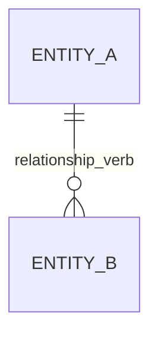
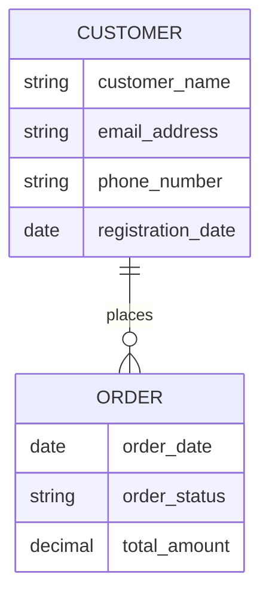
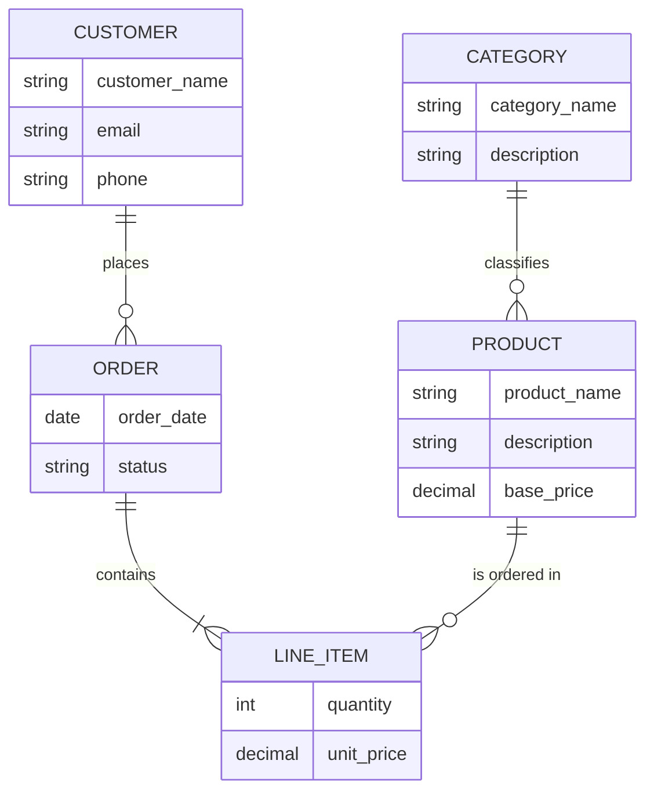

# Entity-Relationship Modeling Guide

**Purpose:** Techniques for identifying entities, defining relationships, and producing Mermaid ER diagrams at the conceptual level.

**Standards:** IEEE 1016-2009, IEEE 29148-2018, Book 2 Ch.5

---

## 1. Entity Identification Techniques

### 1.1 Noun Analysis

Extract candidate entities by scanning input artifacts for recurring nouns and noun phrases.

**Process:**
1. Read `features.md`, `business_rules.md`, and `elicitation_log.md`
2. Highlight every noun and noun phrase
3. Filter using the classification table below
4. Confirm survivors as entities with stakeholder validation

**Noun Classification:**

| Category         | Action     | Example                                    |
|------------------|------------|--------------------------------------------|
| Entity           | Keep       | Customer, Order, Product, Invoice          |
| Attribute        | Assign     | name, email, price (assign to parent entity)|
| Actor            | Exclude    | user, administrator (external to data model)|
| Synonym          | Merge      | client/customer, item/product              |
| Event            | Evaluate   | purchase, shipment (may become entity or attribute)|
| Abstract concept | Exclude    | quality, efficiency (not data objects)     |

### 1.2 Domain Expert Interview Extraction

When noun analysis is insufficient, extract entities from stakeholder statements:

- "We need to track **orders** and their **line items**." -> Order, LineItem
- "Each **supplier** provides multiple **products**." -> Supplier, Product
- "A **customer** can have multiple **addresses**." -> Customer, Address

### 1.3 Business Rule Mining

Business rules often imply entities and relationships:

- "BR-005: A discount shall apply to orders exceeding $500." -> Discount, Order
- "BR-012: Each product shall belong to exactly one category." -> Product, Category

---

## 2. Relationship Types

### 2.1 Cardinality Notation

| Relationship | Meaning                        | Chen Notation | Crow's Foot Notation |
|--------------|--------------------------------|---------------|----------------------|
| 1:1          | One-to-one                     | 1 --- 1       | `\|\|--\|\|`         |
| 1:M          | One-to-many                    | 1 --- M       | `\|\|--o{`           |
| M:M          | Many-to-many                   | M --- M       | `}o--o{`             |

### 2.2 Optionality

| Symbol        | Meaning                                              |
|---------------|------------------------------------------------------|
| `\|\|`        | Exactly one (mandatory participation)                |
| `o\|`         | Zero or one (optional participation)                 |
| `\|{`         | One or more (mandatory, multiple)                    |
| `o{`          | Zero or more (optional, multiple)                    |

### 2.3 Relationship Determination Process

1. Identify verb phrases connecting entities: "Customer **places** Order"
2. Determine cardinality by asking:
   - "Can one Customer place multiple Orders?" (Yes -> 1:M)
   - "Can one Order belong to multiple Customers?" (No -> 1:M confirmed)
3. Determine optionality by asking:
   - "Must every Customer have at least one Order?" (No -> Customer side is optional)
   - "Must every Order have exactly one Customer?" (Yes -> Order side is mandatory)

---

## 3. Mermaid erDiagram Syntax

### 3.1 Basic Structure

### 3.2 Cardinality Symbols in Mermaid

| Symbol | Meaning         |
|--------|-----------------|
| `\|\|` | Exactly one     |
| `o\|`  | Zero or one     |
| `\|{`  | One or more     |
| `o{`   | Zero or more    |

Combine left-side and right-side symbols with `--` to form the relationship line.

### 3.3 Adding Attributes

### 3.4 Complete Example

### 3.5 Diagram Readability Rules

- Maximum 15 entities per diagram; split into domain-area diagrams for larger models
- Use clear, active-voice relationship labels ("places," "contains," "classifies")
- List only business-meaningful attributes; omit surrogate keys and audit fields
- Order entities from left to right following the primary business flow

---

## 4. Naming Conventions

### 4.1 Entity Names

- Use singular nouns: `CUSTOMER` not `CUSTOMERS`
- Use PascalCase or UPPER_SNAKE_CASE consistently
- Match the glossary term exactly when `glossary.md` is available
- Avoid abbreviations unless defined in the glossary

### 4.2 Relationship Names

- Use active-voice verbs: "places," "contains," "manages"
- Read naturally from left to right: "CUSTOMER places ORDER"
- Avoid generic verbs: "has," "is related to," "links to"

### 4.3 Attribute Names

- Use snake_case at the conceptual level
- Prefix with the dimension if ambiguous: `order_date` not just `date`
- Do NOT include data types at the conceptual level; types belong in the physical model

---

## 5. Common Modeling Errors

| Error                           | Consequence                              | Prevention                                |
|---------------------------------|------------------------------------------|-------------------------------------------|
| Modeling an attribute as entity | Unnecessary complexity                   | If it has no attributes of its own, it is an attribute |
| Missing M:M associative entity  | Cannot represent intersection attributes | Document the M:M; resolve in logical model|
| Circular relationships          | Ambiguous traversal paths                | Validate with domain expert               |
| Inconsistent naming             | Confusion across artifacts               | Enforce glossary alignment                |

---

## 6. Entity Identification Checklist

- [ ] Noun analysis performed on all input artifacts
- [ ] Candidates filtered using the classification table
- [ ] Synonyms identified and merged
- [ ] Entity names validated against `glossary.md`
- [ ] Every entity has at least one relationship to another entity
- [ ] No orphan entities (entities with no connections)
- [ ] Mermaid diagram renders correctly and matches the entity catalog

---

**Last Updated:** 2026-03-07
