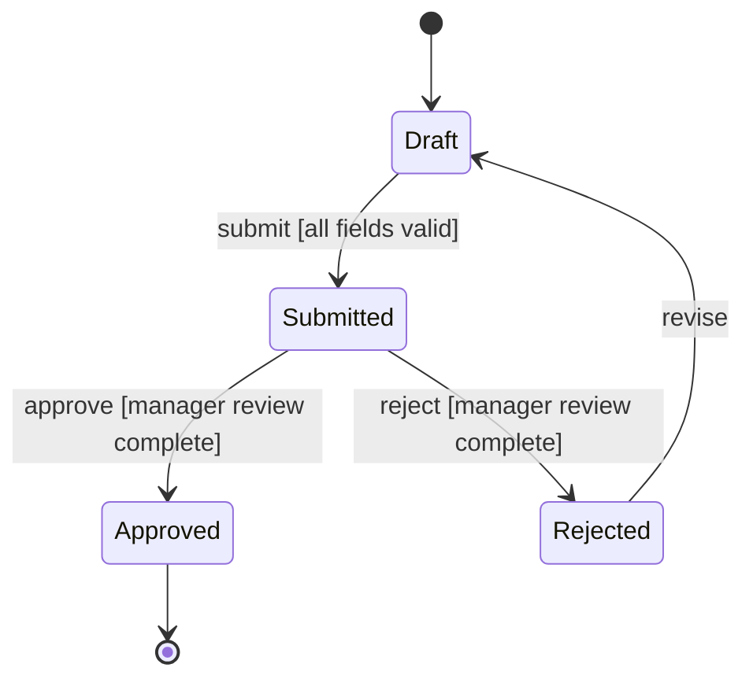

# Requirements Patterns Skill

## Overview

This skill applies structured specification patterns to requirements that are too complex for simple "shall" statements. Decision tables formalize multi-condition business logic, state transition diagrams capture entity lifecycle behavior, and CRUD matrices map data access permissions across roles. The output provides implementation-ready pattern artifacts that reduce ambiguity and ensure completeness.

## When to Use This Skill

- When business rules involve multiple conditions with combinatorial outcomes
- When entities have lifecycle states with defined transitions and guards
- When role-based data access permissions must be explicitly defined
- After requirements analysis has classified and prioritized the requirements set
- Before formal SRS specification to ensure complex behaviors are unambiguously captured

## Quick Reference

| Attribute     | Value                                                                  |
|---------------|------------------------------------------------------------------------|
| **Inputs**    | `../project_context/features.md`, `business_rules.md`; `../output/requirements_analysis_report.md` |
| **Output**    | `../output/requirements_patterns.md`                                   |
| **Tone**      | Technical, precise, tabular; no narrative ambiguity                     |
| **Standards** | IEEE 830-1998 Section 5.3.1, IEEE 29148-2018, Wiegers Practices 10-12 |

## Input Files

| File                            | Location                                         | Required | Purpose                                       |
|---------------------------------|--------------------------------------------------|----------|-----------------------------------------------|
| features.md                     | `../project_context/features.md`                 | Yes      | Feature descriptions with behavioral requirements |
| business_rules.md               | `../project_context/business_rules.md`           | Yes      | Business logic requiring pattern formalization |
| requirements_analysis_report.md | `../output/requirements_analysis_report.md`      | No       | Classified and prioritized requirements        |

## Output Files

| File                     | Location                              | Description                                    |
|--------------------------|---------------------------------------|------------------------------------------------|
| requirements_patterns.md | `../output/requirements_patterns.md`  | Decision tables, state diagrams, and CRUD matrices for complex requirements |

## Core Instructions

Follow these steps in order. Halt and notify the user if a required input file is missing.

### Step 1: Read Context Files

Read `features.md` and `business_rules.md` from `../project_context/`. Optionally read `requirements_analysis_report.md` from `../output/` if available. Log every file path read.

### Step 2: Pattern Selection

For each complex requirement, determine the appropriate pattern using these criteria:

| Pattern            | Select When                                                    | Example Trigger                         |
|--------------------|----------------------------------------------------------------|-----------------------------------------|
| Decision Table     | Multiple conditions produce different outcomes                  | Discount calculation with tiers         |
| State Transition   | An entity moves through defined lifecycle states                | Order status: Draft > Submitted > Approved |
| CRUD Matrix        | Multiple roles interact with multiple entities differently      | Admin vs. User vs. Guest permissions    |

Assign each complex requirement to exactly one primary pattern. If a requirement spans multiple patterns (e.g., a state transition with role-based permissions), produce one artifact per pattern and cross-reference them.

### Step 3: Generate Decision Tables

For each requirement assigned to the Decision Table pattern:

1. **Identify Conditions:** Extract every condition variable from the business rule. Each condition shall be binary (True/False) or enumerated.
2. **Identify Actions:** Extract every possible outcome or action.
3. **Build the Table:** Construct a table with $2^n$ rule columns for $n$ binary conditions. For enumerated conditions, use the product of all value counts.
4. **Validate Completeness:** Confirm every combination of conditions has a defined action. Flag missing combinations with `[INCOMPLETE-RULE]`.
5. **Simplify:** Merge rules where a condition does not affect the outcome (mark with dash "-").

**Decision Table Format:**

| Conditions / Rules      | R1  | R2  | R3  | R4  |
|-------------------------|-----|-----|-----|-----|
| Condition 1             | T   | T   | F   | F   |
| Condition 2             | T   | F   | T   | F   |
| **Actions**             |     |     |     |     |
| Action A                | X   |     | X   |     |
| Action B                |     | X   |     | X   |

Each decision table SHALL include:
- A unique identifier (DT-001)
- The governing business rule reference
- A plain-language description of the business context
- The completeness validation result

See `references/decision-tables.md` for construction techniques and simplification methods.

### Step 4: Generate State Transition Models

For each requirement assigned to the State Transition pattern:

1. **Identify States:** Extract every valid state an entity can occupy. Include initial and terminal states.
2. **Identify Events:** Extract every event (stimulus) that triggers a transition.
3. **Define Transitions:** Map each (State, Event) pair to the resulting state, including:
   - **Guard conditions:** Boolean expressions that must be true for the transition to fire
   - **Actions:** Operations executed during the transition
4. **Validate Completeness:** For every (State, Event) pair, confirm either a valid transition exists or the event is explicitly ignored. Flag undefined pairs with `[UNDEFINED-TRANSITION]`.
5. **Generate Mermaid Diagram:**



**State Transition Table Format:**

| Current State | Event    | Guard                   | Next State | Action              |
|---------------|----------|-------------------------|------------|---------------------|
| Draft         | submit   | all fields valid        | Submitted  | notify_reviewer()   |
| Submitted     | approve  | manager review complete | Approved   | notify_requester()  |

Each state model SHALL include:
- A unique identifier (STM-001)
- The entity being modeled
- The Mermaid stateDiagram
- The state transition table
- The completeness validation result

See `references/state-transition-modeling.md` for modeling techniques and validation methods.

### Step 5: Generate CRUD Matrices

For each set of entities and roles requiring access control definition:

1. **List Entities:** Extract all data entities from the conceptual data model or features.
2. **List Roles:** Extract all user roles from stakeholders or features.
3. **Map Permissions:** For each (Role, Entity) pair, assign one or more CRUD operations: Create (C), Read (R), Update (U), Delete (D).
4. **Gap Analysis:** Flag entities with:
   - No Create permission assigned to any role: `[NO-CREATE]`
   - No Delete permission assigned to any role: `[NO-DELETE]`
   - No Read permission (orphan entity): `[NO-READ]`
5. **RBAC Integration:** If role hierarchy exists, document permission inheritance.

**CRUD Matrix Format:**

| Entity / Role  | Admin | Manager | User  | Guest |
|----------------|-------|---------|-------|-------|
| Customer       | CRUD  | CRU     | R     | -     |
| Order          | CRUD  | CRUD    | CRU   | -     |
| Product        | CRUD  | CRU     | R     | R     |
| Report         | CRUD  | CR      | R     | -     |

Each CRUD matrix SHALL include:
- A unique identifier (CRUD-001)
- The scope (which subsystem or feature area)
- The gap analysis results
- Permission justification referencing business rules

See `references/crud-matrix.md` for matrix construction and gap analysis techniques.

### Step 6: Validate Pattern Completeness

Perform a cross-pattern completeness check:

1. **Decision Tables:** Confirm $2^n$ rules exist for $n$ conditions (or justified simplification).
2. **State Transitions:** Confirm all states are reachable from the initial state and at least one terminal state is reachable from every non-terminal state.
3. **CRUD Matrices:** Confirm every entity has at least C, R, and U permissions assigned.
4. **Cross-References:** Verify that entities appearing in state models also appear in CRUD matrices, and that decision table outcomes align with state transition events.

Flag all validation failures with the appropriate tag and document remediation steps.

### Step 7: Generate Requirements Patterns Document

Write the completed patterns to `../output/requirements_patterns.md` using the output format below. Log summary statistics: total decision tables, state models, CRUD matrices, and validation issues found.

## Output Format Specification

The generated `requirements_patterns.md` SHALL contain the following sections:

```
# Requirements Patterns: [Project Name]

## 1. Document Information
## 2. Pattern Summary
### 2.1 Pattern Selection Rationale
### 2.2 Coverage Statistics
## 3. Decision Tables
### 3.1 [DT-001: Description]
### 3.2 [DT-002: Description]
## 4. State Transition Models
### 4.1 [STM-001: Entity Lifecycle]
### 4.2 [STM-002: Entity Lifecycle]
## 5. CRUD Matrices
### 5.1 [CRUD-001: Subsystem Access Control]
## 6. Cross-Pattern Validation
## 7. Completeness Report
## 8. Recommendations and Next Steps
## 9. Appendix: Standards Traceability
```

## Common Pitfalls

1. **Incomplete decision tables:** Missing rule combinations lead to undefined system behavior. Always validate $2^n$ completeness before simplification.
2. **Unreachable states:** A state with no inbound transition is dead code. Validate reachability for every state in the model.
3. **CRUD without justification:** Assigning "CRUD" to every role for every entity defeats the purpose. Each permission SHALL trace to a business rule or feature.
4. **Mixing patterns:** Using a decision table when a state model is appropriate (or vice versa) creates confusion. Apply the pattern selection criteria strictly.
5. **Ignoring guard conditions:** State transitions without guards are ambiguous. Every transition SHALL have an explicit guard or document that no guard is needed.

## Verification Checklist

- [ ] All required input files were read and logged.
- [ ] Every complex requirement is assigned to exactly one primary pattern.
- [ ] Decision tables have $2^n$ completeness validated (or documented simplification).
- [ ] State transition models have reachability validated for all states.
- [ ] CRUD matrices have gap analysis completed for all entities.
- [ ] Mermaid diagrams render correctly and match their corresponding tables.
- [ ] Cross-pattern references are consistent (entities, events, roles).
- [ ] All validation failures are flagged with appropriate tags and remediation steps.
- [ ] Standards traceability appendix maps sections to IEEE 830 and IEEE 29148 clauses.

## Integration

| Direction  | Skill                                              | Relationship                                    |
|------------|----------------------------------------------------|-------------------------------------------------|
| Upstream   | `02-requirements-engineering/fundamentals/during/04-*` | Consumes classified requirements            |
| Upstream   | `02-requirements-engineering/fundamentals/during/05-*` | Consumes entity catalog for CRUD matrices   |
| Downstream | `02-requirements-engineering/fundamentals/during/07-*` | Feeds pattern artifacts to validation       |
| Downstream | `02-requirements-engineering/waterfall/05-*`           | Feeds into SRS feature decomposition        |
| Downstream | `02-requirements-engineering/waterfall/06-*`           | Feeds state models to logic modeling        |

## Standards Compliance

| Standard          | Governs                                                   |
|-------------------|-----------------------------------------------------------|
| IEEE 830-1998     | Requirements specification patterns and completeness      |
| IEEE 29148-2018   | Requirement expression and behavioral modeling            |
| Wiegers Ch.10-12  | Decision tables, state models, and specification patterns |

## Resources

- `references/decision-tables.md` -- Decision table construction and completeness checking
- `references/state-transition-modeling.md` -- State machine specification and Mermaid syntax
- `references/crud-matrix.md` -- CRUD matrix construction and RBAC integration
