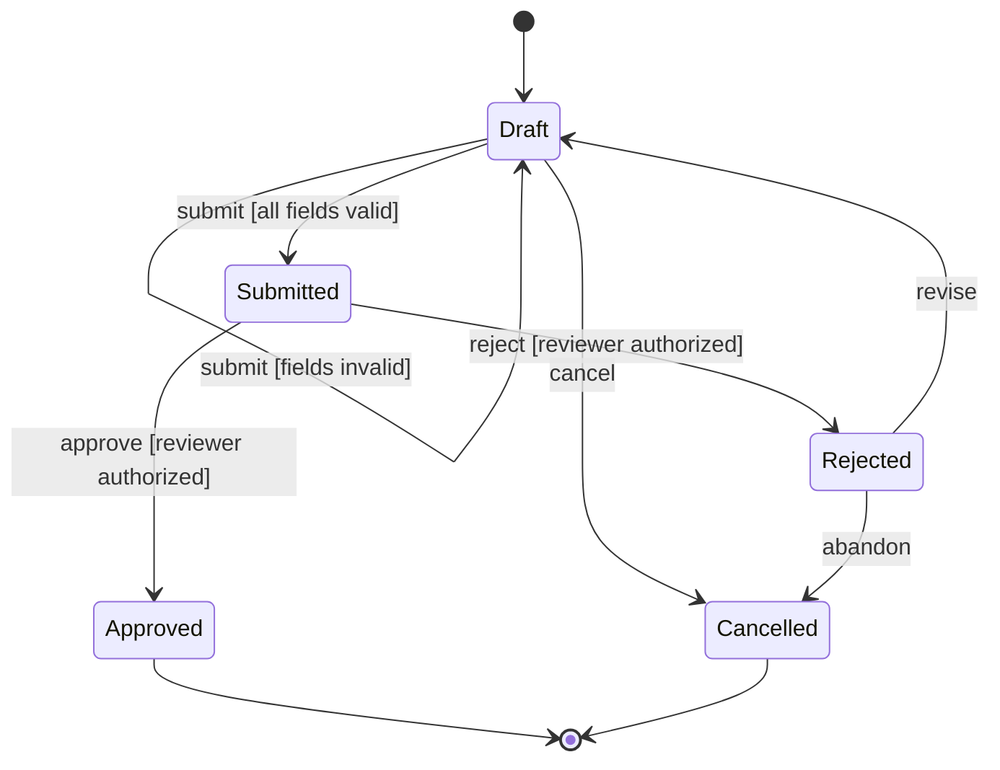
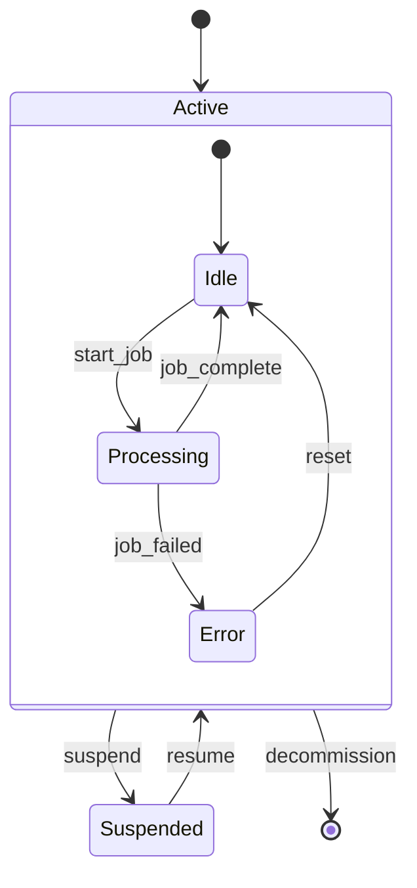

# State Transition Modeling Reference Guide

**Purpose:** Specify entity lifecycle behavior using state machines, state transition tables, and Mermaid stateDiagram syntax.

**Standards:** IEEE 830-1998, IEEE 29148-2018, Wiegers Practice 11

---

## 1. State Machine Concepts

### 1.1 Core Elements

| Element     | Definition                                                    | Example                          |
|-------------|---------------------------------------------------------------|----------------------------------|
| State       | A recognizable condition an entity occupies at a given time   | Draft, Submitted, Approved       |
| Event       | A stimulus that may trigger a transition                      | submit, approve, reject          |
| Transition  | A change from one state to another in response to an event    | Draft --submit--> Submitted      |
| Guard       | A boolean condition that must be true for the transition      | [all fields valid]               |
| Action      | An operation executed during the transition                   | send_notification()              |
| Initial     | The starting state of the entity                              | [*] --> Draft                    |
| Terminal    | A final state from which no transitions exit                  | Approved --> [*]                 |

### 1.2 State Types

| Type        | Description                                     | Notation in Mermaid      |
|-------------|-------------------------------------------------|--------------------------|
| Initial     | Where the entity lifecycle begins               | `[*] --> StateName`      |
| Intermediate| Normal operational states                        | `StateName`              |
| Terminal    | Where the entity lifecycle ends                  | `StateName --> [*]`      |
| Composite   | A state containing sub-states                   | `state StateName { ... }`|

---

## 2. State Transition Table

The state transition table is the formal specification that the Mermaid diagram visualizes. It SHALL be the authoritative artifact; the diagram is supplementary.

### 2.1 Table Format

| Current State | Event    | Guard                     | Next State  | Action                |
|---------------|----------|---------------------------|-------------|-----------------------|
| [Initial]     | create   | -                         | Draft       | initialize_record()   |
| Draft         | submit   | all fields valid          | Submitted   | notify_reviewer()     |
| Draft         | submit   | fields invalid            | Draft       | show_validation_errors()|
| Draft         | cancel   | -                         | Cancelled   | log_cancellation()    |
| Submitted     | approve  | reviewer authorized       | Approved    | notify_author()       |
| Submitted     | reject   | reviewer authorized       | Rejected    | notify_author()       |
| Rejected      | revise   | -                         | Draft       | clear_rejection()     |
| Rejected      | abandon  | -                         | Cancelled   | log_abandonment()     |
| Approved      | -        | -                         | [Terminal]  | -                     |
| Cancelled     | -        | -                         | [Terminal]  | -                     |

### 2.2 Table Construction Process

1. List all possible states from the business domain
2. List all events that can occur in each state
3. For each (State, Event) pair, determine:
   - Can this event occur in this state? If not, mark as "Ignored" or "Error"
   - What guard conditions apply?
   - What is the resulting state?
   - What actions execute during the transition?
4. Validate completeness (see Section 4)

---

## 3. Mermaid stateDiagram Syntax

### 3.1 Basic State Diagram



### 3.2 Syntax Elements

| Syntax                          | Meaning                               |
|---------------------------------|---------------------------------------|
| `[*] --> State`                 | Initial transition                    |
| `State --> [*]`                 | Terminal transition                   |
| `StateA --> StateB : event`     | Transition with event label           |
| `StateA --> StateB : event [guard]` | Transition with guard condition   |
| `state StateName { ... }`       | Composite state with sub-states       |
| `note right of State : text`    | Annotation on a state                 |

### 3.3 Composite State Example



### 3.4 Diagram Readability Rules

- Maximum 10 states per diagram; use composite states for complex models
- Arrange states top-to-bottom following the primary happy path
- Use consistent event naming: lowercase with underscores (submit_order, approve_request)
- Include guard conditions in square brackets for all conditional transitions
- Label every transition; unlabeled transitions are ambiguous

---

## 4. Completeness Validation

### 4.1 State Reachability

Every state SHALL be reachable from the initial state via at least one path of valid transitions. An unreachable state indicates a modeling error.

**Validation Process:**
1. Start at the initial state
2. Follow every outbound transition to discover reachable states
3. Repeat until no new states are discovered
4. Any state NOT in the reachable set is flagged with `[UNREACHABLE-STATE]`

### 4.2 Terminal Reachability

From every non-terminal state, at least one path SHALL lead to a terminal state. A state with no path to termination creates a potential infinite lifecycle.

**Validation Process:**
1. Start at each non-terminal state
2. Follow outbound transitions looking for a path to any terminal state
3. If no terminal state is reachable, flag with `[NO-TERMINAL-PATH]`

### 4.3 Event Completeness

For every (State, Event) pair in the system, one of the following SHALL be documented:
- A valid transition with guard, next state, and action
- An explicit "Ignored" designation (event has no effect in this state)
- An explicit "Error" designation (event is invalid in this state; system shall produce an error response)

Undocumented (State, Event) pairs are flagged with `[UNDEFINED-TRANSITION]`.

### 4.4 Determinism Check

For a given (State, Event) pair, guard conditions SHALL be mutually exclusive. If two transitions from the same state on the same event can both fire, the model is non-deterministic.

**Example of Non-Determinism:**
- Draft --> Submitted : submit [order total > $100]
- Draft --> PendingReview : submit [customer is new]

If a new customer places a $150 order, both guards are true. This is non-deterministic and SHALL be resolved.

---

## 5. State Transition to Requirements Mapping

Each transition in the state model SHALL produce a formal requirement:

**Template:**
```
[STM-001, T3] The system shall transition an Order from "Submitted" to "Approved"
when the "approve" event is received AND the reviewer is authorized,
executing the notify_author() action upon transition.
```

Additionally, generate error-handling requirements for invalid events:
```
[STM-001, E1] The system shall reject the "approve" event when the Order is in
"Draft" state and return error code ORD-401: "Order must be submitted before approval."
```

---

## 6. Common State Modeling Errors

| Error                        | Consequence                           | Detection Method                  |
|------------------------------|---------------------------------------|-----------------------------------|
| Missing initial state        | Entity cannot be created              | Check for `[*] -->` transition    |
| Missing terminal state       | Entity lifecycle never ends           | Check for `--> [*]` transition    |
| Unreachable state            | Dead code in implementation           | Reachability analysis             |
| Non-deterministic transitions| Unpredictable behavior                | Guard mutual exclusivity check    |
| Missing error transitions    | Silent failures                       | (State, Event) completeness check |

---

## 7. State Transition Modeling Checklist

- [ ] All states identified from business domain analysis
- [ ] Initial and terminal states explicitly defined
- [ ] State transition table completed for all (State, Event) pairs
- [ ] Guard conditions defined for all conditional transitions
- [ ] Actions documented for all transitions
- [ ] Reachability validated (all states reachable from initial)
- [ ] Terminal reachability validated (all states can reach terminal)
- [ ] Determinism validated (guards are mutually exclusive per state-event pair)
- [ ] Mermaid stateDiagram renders correctly and matches the table
- [ ] Each transition mapped to a formal "shall" requirement

---

**Last Updated:** 2026-03-07
