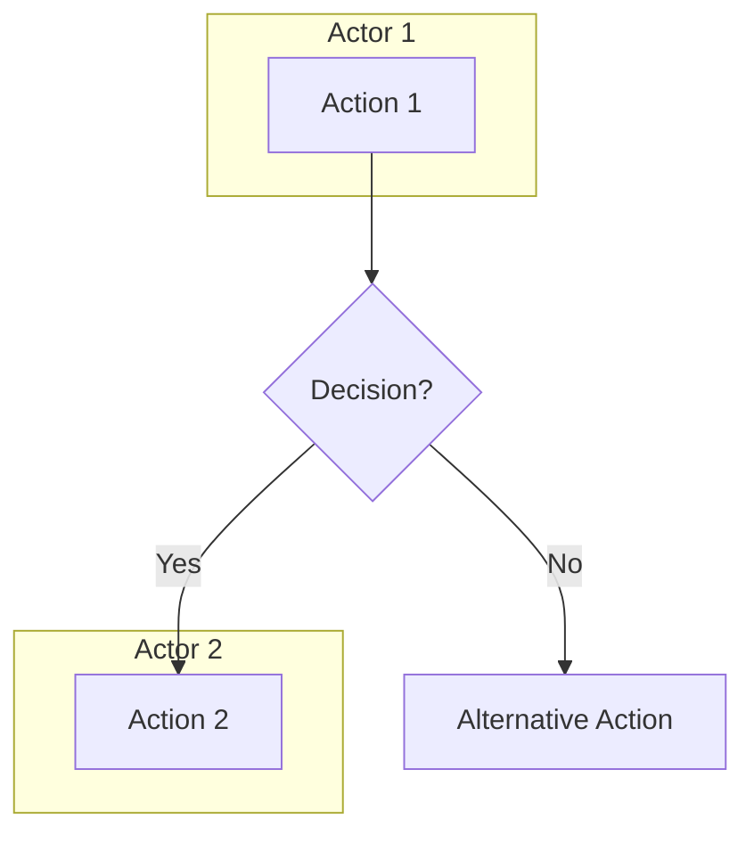

# Use Case Modeling Skill

## Overview

This skill runs after Phase 05 (Feature Decomposition). It transforms functional requirements from SRS Section 3.2 into a complete use case model that includes actor classification, use case diagrams, fully-dressed use case descriptions, and activity diagrams for complex workflows. The output conforms to UML 2.5.1 notation standards and IEEE 29148-2018 behavioral requirements guidance.

## When to Use

- After `05-feature-decomposition` has produced Section 3.2 in `SRS_Draft.md`.
- When stakeholders need a behavioral view of system interactions beyond stimulus-response pairs.
- When complex multi-actor workflows require visual modeling with swimlanes and decision logic.

## Quick Reference

| Attribute | Value |
|-----------|-------|
| **Inputs** | `projects/<ProjectName>/_context/features.md`, `projects/<ProjectName>/_context/business_rules.md`, `projects/<ProjectName>/_context/stakeholder_register.md` (optional), `projects/<ProjectName>/<phase>/<document>/SRS_Draft.md` (Sections 3.1-3.2) |
| **Output** | `projects/<ProjectName>/<phase>/<document>/Use_Case_Model.md` |
| **Tone** | Technical, precise, active voice with stimulus-response pairs |
| **Standards** | UML 2.5.1, IEEE 29148-2018, IEEE 830-1998 Clause 5.3.1 |

## Input Files

| File | Location | Required | Purpose |
|------|----------|----------|---------|
| `SRS_Draft.md` | `projects/<ProjectName>/<phase>/<document>/SRS_Draft.md` | **Required** | Sections 3.1 (System Features) and 3.2 (Functional Requirements) |
| `features.md` | `projects/<ProjectName>/_context/features.md` | **Required** | Feature list with user story triggers and acceptance criteria |
| `business_rules.md` | `projects/<ProjectName>/_context/business_rules.md` | Recommended | Business rules referenced by use cases |
| `stakeholder_register.md` | `projects/<ProjectName>/_context/stakeholder_register.md` | Optional | Stakeholder roles for actor identification |

## Output Files

| File | Location | Description |
|------|----------|-------------|
| `Use_Case_Model.md` | `projects/<ProjectName>/<phase>/<document>/Use_Case_Model.md` | Complete use case model with diagrams, descriptions, and traceability |

## Core Instructions

Follow these nine steps in order. Do not skip or reorder.

### Step 1: Read Context Files

Read `SRS_Draft.md` (Sections 3.1 and 3.2), `features.md`, and `business_rules.md` from the specified locations. Optionally read `stakeholder_register.md`. Log the absolute path of each file read. Halt execution if `SRS_Draft.md` or `features.md` is missing.

### Step 2: Identify and Classify Actors

Analyze the input files to identify all actors that interact with or have interest in the system.

**Two complementary actor taxonomies are available. Choose based on project type:**

**Option A — Cockburn's 3-Class Model** (use for software-centric systems):

| Actor Type | Definition | Identification Method |
|------------|------------|----------------------|
| **Primary** | Directly initiates or interacts with a use case to achieve a goal | Stakeholder list review, user story "As a..." clauses |
| **Supporting** | Provides a service to the system during use case execution | System boundary analysis, integration point review |
| **Offstage** | Has an interest in the use case outcome but does not directly interact | Regulatory review, business rule owner analysis |

**Option B — Whitten & Bentley's 4-Class Model** (use for enterprise/business information systems):

| Actor Type | Definition | Identification Method |
|------------|------------|----------------------|
| **Primary Business Actor** | Receives measurable value from the use case **without initiating it** | Who benefits? Who is the beneficiary? |
| **Primary System Actor** | **Directly initiates or triggers** the use case event | Who starts the interaction? Who clicks "submit"? |
| **External Server Actor** | Responds to a request from a use case (provides a service) | What external systems or roles respond to requests? |
| **External Receiver Actor** | Receives output/value from the use case but is not a primary actor | Who else gets a report, notification, or deliverable? |

> **Guidance:** Use Option B when the system is an enterprise business application (ERP, CRM, HR, billing, approval workflows) where the distinction between "who benefits" and "who initiates" is critical for correct workflow design. Use Option A for simpler or software-product contexts.

**Temporal Actors:** When the system has scheduled or time-triggered processes (nightly batch jobs, billing cycles, session expiry, automated reminders), model **time** as a Temporal Actor. Document: `Temporal Actor: System Clock — initiates [Use Case Name] at [schedule/frequency]`. Temporal actors are positioned outside the system boundary like other actors.

**Actor Generalization:** Apply actor generalization where two or more actors share common behaviors. Use an inheritance arrow from the specialized actor to the general actor. Document the generalization hierarchy. Distinguish human actors from system actors explicitly.

### Step 3: Identify Use Cases

Extract use cases from Section 3.2 functional requirements. Each use case shall represent a user-goal-level interaction (not subfunction level). Apply these rules:

1. Every use case shall have a verb-noun name (e.g., "Process Payment", "Register Account").
2. Every use case shall map to at least one functional requirement in Section 3.2.
3. Group related subfunctions under a single use case; do not create one use case per requirement.
4. Assign a unique identifier: `UC-[NNN]` (e.g., UC-001, UC-002).

### Step 4: Generate Use Case Diagram

Produce a system-level use case diagram using Mermaid notation or structured text-based UML. The diagram shall include:

- **System boundary** enclosing all use cases
- **Actors** positioned outside the boundary, with primary actors on the left and supporting/offstage actors on the right
- **Use cases** as labeled ovals inside the boundary
- **Associations** connecting actors to their use cases (solid lines)
- **Include relationships** for mandatory shared behavior (`<<include>>`)
- **Extend relationships** for optional conditional behavior (`<<extend>>`)
- **Actor generalization** using inheritance arrows where applicable
- **Depends-on relationships** (`<<depends on>>`) between use cases that have development sequencing dependencies — use case B cannot be built until use case A is complete. This relationship aids sprint planning and release sequencing.

### Step 5: Generate Fully-Dressed Use Case Descriptions

For each use case identified in Step 3, produce a fully-dressed description using this template:

```markdown
### UC-[NNN]: [Use Case Name]

| Field | Value |
|-------|-------|
| **UC-ID** | UC-[NNN] |
| **Name** | [Verb-Noun Name] |
| **Primary Actor** | [Actor Name] |
| **Stakeholders & Interests** | [List each stakeholder and their interest] |
| **Preconditions** | [Conditions that must be true before execution] |
| **Success Guarantee** | [System state after successful completion] |
| **Minimal Guarantee** | [System state guaranteed even on failure] |
| **Priority** | [Critical / High / Medium / Low] |
| **Frequency of Use** | [e.g., 500 times/day, Weekly, On-demand] |
| **Trigger** | [Event or action that initiates this use case] |

#### Main Success Scenario

1. The [Actor] [performs action].
2. The system shall [respond with action].
3. The [Actor] [performs next action].
4. The system shall [respond with next action].
...
[N]. The system shall [confirm completion / display result].

#### Alternative Flows

**[Step]a. [Condition]:**
1. The system shall [alternative action].
2. [Resume at step N / End use case].

**[Step]b. [Different Condition]:**
1. The system shall [alternative action].
2. [Resume at step N / End use case].

#### Exception Flows

**[Step]a. [Error Condition]:**
1. The system shall [log the error / display error message].
2. The system shall [recovery action].
3. [Resume at step N / Abort use case].

#### Business Rules

- BR-[NNN]: [Referenced business rule from business_rules.md]

#### Data Requirements

- [List data entities read, created, updated, or deleted]

#### Assumptions

- [List assumptions made by the analyst that affect this use case — e.g., "Assumes single currency; multi-currency not in scope"]

#### Implementation Constraints

- [Technical constraints that bound implementation choices — e.g., "Must use existing OAuth 2.0 provider", "Response time shall not exceed 2 seconds on 3G connection"]

#### Open Issues

- [Unresolved questions flagged for stakeholder review]
```

Writing guidelines for use case steps:
- Use active voice: "The system shall..." or "The [Actor] [verbs]..."
- Follow stimulus-response pairing: every actor action receives a system response.
- Do not embed UI details (button names, screen layouts) in the main flow; reference interface specifications instead.
- Number steps sequentially; alternative flows reference the main step they branch from.

### Step 6: Generate Activity Diagrams

For each use case that involves two or more actors, decision logic, or parallel activities, produce a Mermaid activity diagram. The diagram shall include:

- **Initial node** (filled circle) and **final node** (bullseye)
- **Actions** as rounded rectangles with verb-noun labels
- **Decision nodes** (diamonds) with mutually exclusive guard conditions enclosed in brackets
- **Fork/join bars** for parallel activities
- **Swimlanes** (partitions) separating responsibilities per actor

Use this Mermaid flowchart pattern for activity diagrams:



Generate activity diagrams only for complex workflows. Simple CRUD operations do not require activity diagrams.

### Step 7: Build Traceability Matrix

Construct a traceability matrix mapping every Section 3.2 functional requirement to at least one use case. Use this format:

| Requirement ID | Requirement Description | Use Case ID | Use Case Name | Coverage |
|----------------|------------------------|-------------|---------------|----------|
| FR-3.2.1.3-001 | [Description] | UC-001 | [Name] | Full / Partial |

Flag any functional requirement that has no corresponding use case with `[TRACE-FAIL: FR-[ID] has no use case coverage]`.

### Step 8: Validate Completeness

Perform these validation checks:

1. **Actor Coverage**: Every actor shall participate in at least one use case. Flag orphan actors with `[V&V-FAIL: Actor "[Name]" has no associated use case]`.
2. **Requirement Coverage**: Every functional requirement in Section 3.2 shall trace to at least one use case. Flag gaps per Step 7.
3. **Stimulus-Response Compliance**: Every main success scenario shall alternate between actor stimulus and system response per IEEE 830 Clause 5.3.1.
4. **Business Rule Coverage**: Every business rule referenced in `business_rules.md` that relates to a functional requirement shall appear in at least one use case description.
5. **Precondition/Postcondition Consistency**: No use case shall list a precondition that is not guaranteed as a postcondition of another use case or an initial system state.

### Step 9: Write Output

Assemble the complete use case model and write it to `projects/<ProjectName>/<phase>/<document>/Use_Case_Model.md`.

## Output Format

The generated `Use_Case_Model.md` shall contain the following sections:

```markdown
# Use Case Model: [Project Name]

- **Date:** [YYYY-MM-DD]
- **Version:** [X.Y]
- **Standard:** UML 2.5.1, IEEE 29148-2018

## 1. Actor Catalog

### 1.1 Actor Summary
| Actor | Type | Description | Generalization |
|-------|------|-------------|----------------|

### 1.2 Actor Generalization Hierarchy
[Diagram or structured list]

## 2. Use Case Diagram
[Mermaid diagram or text-based UML]

## 3. Use Case Descriptions
### UC-001: [Name]
[Fully-dressed template per Step 5]
...

## 4. Activity Diagrams
### AD-001: [Workflow Name]
[Mermaid activity diagram per Step 6]
...

## 5. Traceability Matrix
[Table per Step 7]

## 6. Validation Summary
[Results of Step 8 checks]

## 7. Open Issues
[Consolidated list of unresolved items]
```

## Common Pitfalls

| Pitfall | Remedy |
|---------|--------|
| One use case per requirement (too granular) | Group related requirements under user-goal-level use cases |
| UI details in main success scenario | Reference interface specifications; keep flows technology-neutral |
| Missing alternative and exception flows | Every decision point in the main flow shall have at least one alternative |
| Actors without use cases | Remove orphan actors or identify missing use cases |
| Untraceable requirements | Every FR in Section 3.2 shall map to at least one UC |
| Vague preconditions | State concrete, verifiable conditions with data state |

## Verification Checklist

- [ ] `Use_Case_Model.md` exists in `projects/<ProjectName>/<phase>/<document>/`
- [ ] Every actor is classified as Primary, Supporting, or Offstage
- [ ] Every use case has a unique UC-ID and verb-noun name
- [ ] Every fully-dressed description includes preconditions, postconditions, main scenario, alternatives, and exceptions
- [ ] Main success scenarios follow stimulus-response pairing
- [ ] Activity diagrams exist for all multi-actor or decision-heavy workflows
- [ ] Traceability matrix covers 100% of Section 3.2 functional requirements
- [ ] No `[TRACE-FAIL]` or `[V&V-FAIL]` tags remain unresolved

## Integration

| Direction | Skill | Relationship |
|-----------|-------|-------------|
| Upstream | `05-feature-decomposition` | Provides Section 3.2 functional requirements |
| Upstream | `04-interface-specification` | Provides Section 3.1 system features |
| Downstream | `06-logic-modeling` | Consumes use case flows for state and decision modeling |
| Downstream | `08-semantic-auditing` | Audits use case traceability and completeness |

## Standards

- **UML 2.5.1** -- Unified Modeling Language specification for use case and activity diagrams
- **IEEE 29148-2018** -- Systems and software engineering: behavioral requirements modeling
- **IEEE 830-1998 Clause 5.3.1** -- Stimulus-response pairs for functional requirements
- **Dennis, Wixom, Tegarden** -- "Systems Analysis and Design with UML" (fully-dressed use case format)
- **Whitten & Bentley (2007)** -- "Systems Analysis and Design Methods" — 4-class actor taxonomy (Primary Business, Primary System, External Server, External Receiver), use case relationship types including `<<depends on>>`

## Resources

- `references/use-case-template.md` -- Complete fully-dressed use case template with examples
- `references/activity-diagram-guide.md` -- Activity diagram construction and Mermaid syntax
- `references/actor-classification.md` -- Actor identification and classification techniques
- `README.md` -- Quick-start guide for this skill
