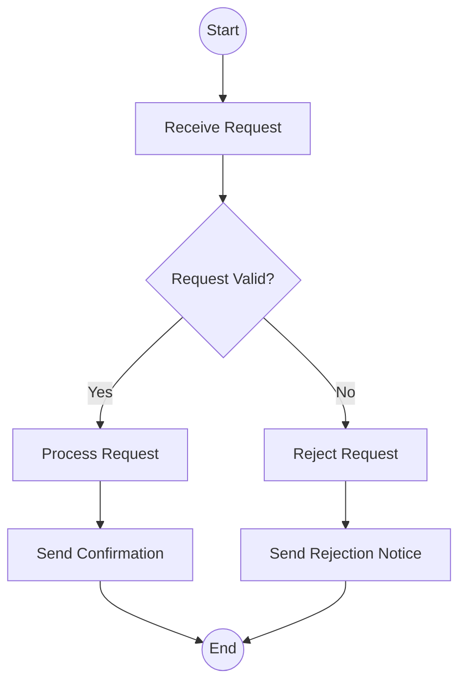
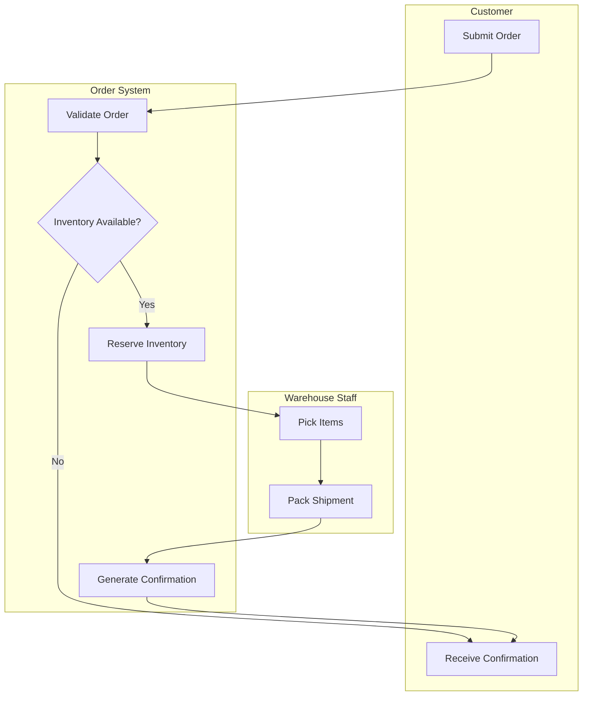
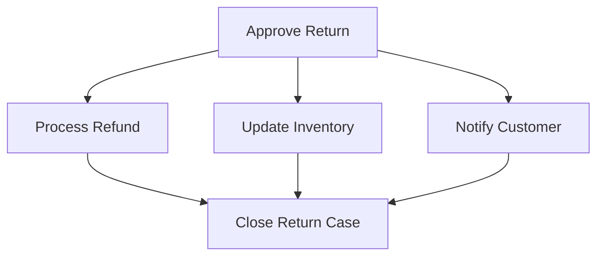
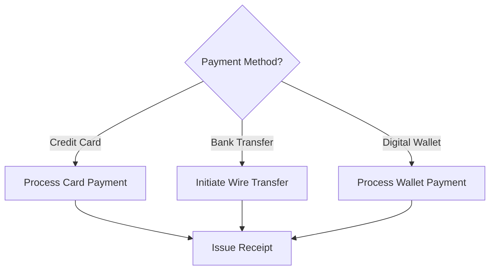
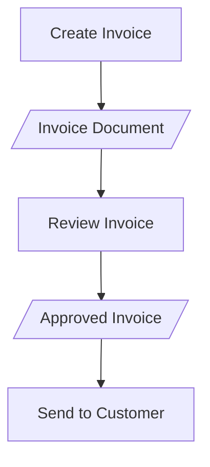

# Activity Diagram Construction Guide

## Purpose

This reference provides standards for constructing UML activity diagrams using Mermaid syntax. Activity diagrams model the flow of control and data through complex multi-actor workflows, making them essential for use cases with parallel activities, decision logic, or cross-functional responsibilities.

## Reference Standards

- UML 2.5.1 Section 15 -- Activities
- IEEE 29148-2018 -- Behavioral modeling for requirements

## When to Use Activity Diagrams

### Use Activity Diagrams When

- The use case involves two or more actors with distinct responsibilities.
- The workflow contains parallel activities that can execute concurrently.
- Complex decision logic with multiple branches requires visual clarification.
- Stakeholders need a process-level view beyond the textual use case description.

### Use Sequence Diagrams Instead When

- The focus is on message ordering between objects (not process flow).
- The interaction is primarily between software components, not actors.
- Timing constraints are the primary concern.

## Activity Diagram Elements

### Node Types

| Element | UML Symbol | Mermaid Syntax | Purpose |
|---------|-----------|----------------|---------|
| **Initial Node** | Filled circle | `A((Start))` or first node | Entry point of the activity |
| **Final Node** | Bullseye | `Z((End))` or `Stop` | Termination of the activity |
| **Action** | Rounded rectangle | `A[Action Name]` | A single unit of work |
| **Decision** | Diamond | `D{Condition?}` | Branch point with guard conditions |
| **Merge** | Diamond | Same as decision | Rejoins branches |
| **Fork** | Thick bar | Parallel subgraphs | Splits into concurrent flows |
| **Join** | Thick bar | Convergence point | Synchronizes concurrent flows |

### Guard Conditions

Every outgoing edge from a decision node shall have a guard condition enclosed in brackets. Guards shall be:

1. **Mutually exclusive**: No two guards on the same decision can be true simultaneously.
2. **Collectively exhaustive**: The guards shall cover all possible outcomes.
3. **Verifiable**: Each guard shall reference a concrete data condition.

Correct:
```
D{Order total > $100?} -->|Yes| ApplyDiscount
D{Order total > $100?} -->|No| SkipDiscount
```

Incorrect:
```
D{Is it valid?} -->|Maybe| Process
```

### Swimlanes (Partitions)

Swimlanes partition the diagram by actor or organizational unit. Each action shall reside in exactly one swimlane. The swimlane label shall match the actor name from the use case description.

## Mermaid Syntax for Activity Diagrams

Mermaid does not have native activity diagram support, so the skill shall use `flowchart TD` (top-down) with subgraphs for swimlanes.

### Basic Activity Flow



### Swimlane Pattern (Multi-Actor)



### Parallel Activities (Fork/Join)

Mermaid does not have explicit fork/join bars. Use multiple edges from a single node to represent a fork, and converge edges to a single node for a join.



**Annotation convention:** Add a comment above fork nodes: `%% FORK: Parallel execution begins` and above join nodes: `%% JOIN: All parallel paths must complete`.

### Decision with Multiple Branches



### Object Flow (Data Passing)

To represent data objects flowing between actions, use node labels:



Use the `[/"label"/]` syntax (parallelogram) to distinguish data objects from actions.

## Construction Procedure

### Step 1: Identify the Scope

Determine which use case or workflow the activity diagram models. State the UC-ID and name.

### Step 2: List All Actions

Extract every action from the main success scenario, alternative flows, and exception flows. Each numbered step in the use case becomes a candidate action node.

### Step 3: Identify Actors (Swimlanes)

Assign each action to the actor responsible for performing it. Create one swimlane per actor.

### Step 4: Map the Control Flow

Connect actions with edges. Insert decision nodes at every branching point. Add guard conditions.

### Step 5: Identify Parallelism

Review the workflow for actions that can execute concurrently. Insert fork/join patterns where the sequence is not strictly serial.

### Step 6: Validate Completeness

- Every path from the initial node shall reach a final node or loop back to a prior node.
- Every decision node shall have at least two outgoing edges with mutually exclusive guards.
- No action shall appear outside a swimlane.
- No swimlane shall be empty.

## Common Mistakes

| Mistake | Correction |
|---------|------------|
| Missing guard conditions on decision edges | Add explicit `[Yes]`/`[No]` or domain-specific guards |
| Actions in wrong swimlane | Match each action to the actor who performs it |
| Dead-end paths (no final node) | Ensure every branch terminates at a final node |
| Overly detailed diagrams (>20 nodes) | Split into sub-activity diagrams; reference by UC-ID |
| Using activity diagrams for simple CRUD | Reserve activity diagrams for multi-actor or decision-heavy flows |

## Naming Conventions

- **Actions**: Verb-Noun format (e.g., "Validate Order", "Send Notification")
- **Decisions**: Question format ending with "?" (e.g., "Payment Valid?", "Stock Available?")
- **Swimlanes**: Actor name matching the use case actor catalog
- **Diagram ID**: `AD-[NNN]` matching the corresponding `UC-[NNN]`
