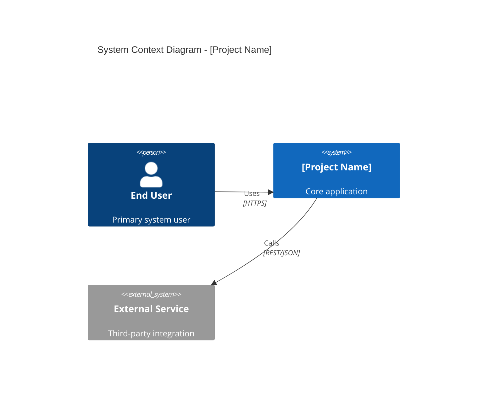
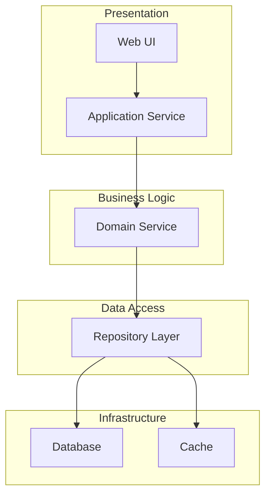

# High-Level Design Skill

## Overview

This is the first skill in Phase 03 (Design Documentation). It transforms the verified SRS requirements into a system-level architecture document that defines component boundaries, deployment topology, data flow paths, and technology decisions. The output uses Mermaid diagrams extensively for visual communication and conforms to IEEE 1016-2009 Sec 5 (Architectural Design Viewpoints).

## When to Use

- After Phase 02 completes and `SRS_Draft.md` exists in `../output/` with Sections 1.0 through 3.5 or later.
- When `tech_stack.md` is present in `../project_context/` to inform technology decisions.
- Can also incorporate `PRD.md` from `../output/` for additional product context.
- Suitable for both waterfall and Agile projects; Agile projects may also reference `user_stories.md`.

## Quick Reference

| Attribute   | Value |
|-------------|-------|
| **Inputs**  | `../output/SRS_Draft.md`, `../project_context/tech_stack.md`; optionally `../output/PRD.md` |
| **Output**  | `../output/HLD.md` |
| **Tone**    | Architectural, precise, diagram-heavy |
| **Standard** | IEEE 1016-2009 Sec 5 |

## Input Files

| File | Location | Required | Purpose |
|------|----------|----------|---------|
| SRS_Draft.md | `../output/SRS_Draft.md` | Yes | Functional requirements, interfaces, constraints, user classes |
| tech_stack.md | `../project_context/tech_stack.md` | Yes | Technology choices, framework versions, infrastructure targets |
| PRD.md | `../output/PRD.md` | No | Product context, feature priorities, success metrics |

## Output Files

| File | Location | Description |
|------|----------|-------------|
| HLD.md | `../output/HLD.md` | Complete High-Level Design document with architecture diagrams, technology decisions, and traceability |

## Core Instructions

Follow these ten steps in order. Halt and notify the user if a required input file is missing.

### Step 1: Read Context Files

Read `SRS_Draft.md` (all sections) from `../output/` and `tech_stack.md` from `../project_context/`. Optionally read `PRD.md` from `../output/`. Log the absolute path of each file read. If `SRS_Draft.md` or `tech_stack.md` is missing, halt execution and report the gap.

### Step 2: Determine Architectural Style

Analyze `tech_stack.md` and the SRS constraints (Section 3.4) to determine the architectural style: monolith, microservices, serverless, layered, or event-driven. State the chosen style with a one-paragraph rationale citing specific SRS constraints or technology requirements that drove the decision.

### Step 3: Generate System Context Diagram

Produce a Mermaid C4Context diagram showing the system boundary, external actors (derived from SRS Section 2.0 user classes), external systems (from SRS Section 3.1 interfaces), and data exchanges between them. Every node and edge shall have a descriptive label.

### Step 4: Generate Component Architecture Diagram

Produce a Mermaid graph TD diagram decomposing the system into architectural layers: Presentation, Business Logic, Data Access, and Infrastructure. For each component, document:
- **Name**: concise identifier
- **Responsibility**: one sentence describing what the component does
- **Interfaces exposed**: API endpoints or internal contracts

### Step 5: Generate Deployment Topology Diagram

Produce a Mermaid deployment diagram mapping components to infrastructure targets (servers, containers, cloud services). Include ports, protocols, and TLS configuration derived from SRS Section 3.1 (External Interface Requirements).

### Step 6: Generate Data Flow Diagrams

Produce one or more Mermaid flowchart diagrams showing data entry points, transformation steps, storage locations, and retrieval paths. Each diagram shall cover a major data flow identified in the SRS functional requirements.

### Step 7: Generate Technology Decisions Table

Produce a table with the following columns:

| Decision | Options Considered | Choice | Rationale |

Every rationale entry shall cite a specific SRS constraint, non-functional requirement, or technology stack entry that justifies the choice.

### Step 8: Document Integration Points

For each external system identified in SRS Section 3.1, document:
- System name and purpose
- Protocol (REST, GraphQL, gRPC, SOAP, WebSocket)
- Authentication method (OAuth 2.0, API key, mTLS)
- Data format (JSON, XML, Protobuf)
- Error handling strategy

### Step 9: Document Cross-Cutting Concerns

Address the following concerns with specific references to SRS sections:
- **Authentication and Authorization**: reference SRS Section 3.5.3 (Security Requirements)
- **Logging and Monitoring**: define log levels, structured log format, monitoring endpoints
- **Error Handling**: global error strategy, error codes, retry policies
- **Caching**: cache layers, invalidation strategy, TTL policies

### Step 10: Generate Traceability Table

Produce a traceability table linking every HLD component to its originating SRS section and requirement IDs:

| HLD Component | SRS Section | Requirement IDs | Notes |

Every component defined in Steps 3-6 shall appear in this table at least once.

## Output Format

The generated `HLD.md` shall contain these sections in order: Document Header (project name, date, version, standard), 1. Architectural Style, 2. System Context Diagram, 3. Component Architecture, 4. Deployment Topology, 5. Data Flow Diagrams, 6. Technology Decisions, 7. Integration Points, 8. Cross-Cutting Concerns (8.1 AuthN/AuthZ, 8.2 Logging, 8.3 Error Handling, 8.4 Caching), 9. Traceability Matrix, Appendix A: Glossary.

Mermaid diagram examples for Sections 2 and 3:

## Common Pitfalls

| Pitfall | Remedy |
|---------|--------|
| Missing deployment details | Every component must map to an infrastructure target with ports and protocols |
| Diagrams without labels | Every Mermaid node and edge shall have a descriptive label |
| Technology decisions without rationale | Every choice shall cite a specific SRS constraint or requirement |
| No traceability to requirements | Every HLD component shall link to at least one SRS requirement ID |

## Verification Checklist

- [ ] `HLD.md` exists in `../output/` with all nine sections populated.
- [ ] Architectural style is stated with a rationale paragraph citing SRS constraints.
- [ ] System context diagram includes all external actors and systems from SRS Sections 2.0 and 3.1.
- [ ] Every component in the architecture diagram has a name, responsibility, and interface.
- [ ] Technology decisions table cites SRS constraints in the Rationale column.
- [ ] Traceability table maps every HLD component to at least one SRS requirement ID.

## Integration

| Direction | Skill | Relationship |
|-----------|-------|-------------|
| Upstream | Phase 02 (Requirements Engineering) | Consumes `SRS_Draft.md` from `../output/` |
| Downstream | 02-low-level-design | Decomposes HLD components into module-level specifications |
| Downstream | 03-api-specification | Uses component interfaces to define API contracts |
| Downstream | 04-database-design | Uses data flow and component architecture to define data models |

## Standards

- **IEEE 1016-2009 Sec 5** -- Architectural design viewpoints, component descriptions, and design rationale
- **ISO/IEC 25010** -- Quality model for non-functional characteristics referenced in cross-cutting concerns

## Resources

- `logic.prompt` -- Executable prompt containing the step-by-step HLD generation logic.
- `README.md` -- Quick-start guide for this skill.
