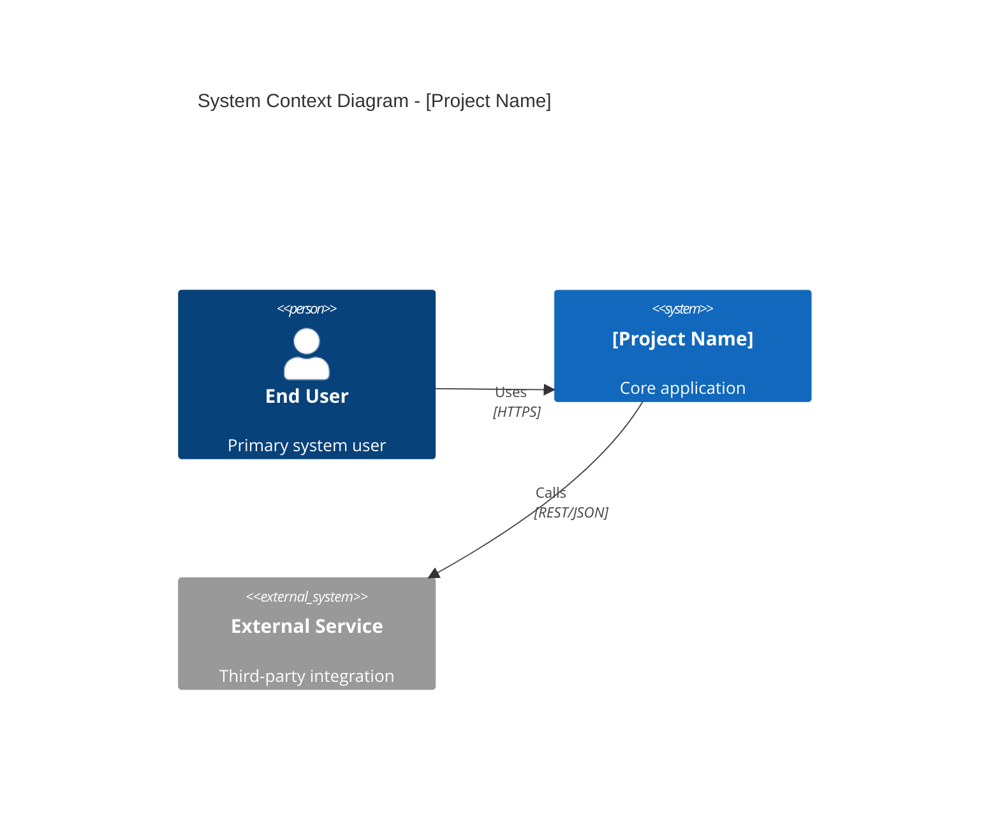
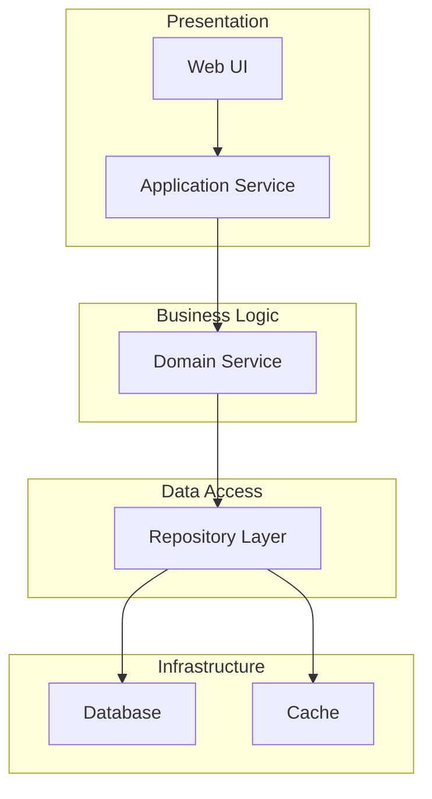

# High-Level Design Skill
<!-- dual-compat-start -->
## Use When

- Requirements are stable enough to choose system boundaries, responsibilities and cross-component flows.

## Do Not Use When

- Do not use to invent missing requirements or specify classes, methods and algorithms.

## Required Inputs

| Artefact | Source or provider | Required? | Missing behaviour |
|---|---|---|---|
| Approved SRS/PRD and constraints | Phase 01/02 artefacts | Required | Stop on unresolved architecture-driving requirements. |
| Current context, integrations and quality targets | Project context and owners | Required | Qualify unknown interfaces and create ADR questions. |

## Workflow

1. Read the named inputs and confirm their approval, version and unresolved decisions.
2. Apply the decision rules below before drafting; stop on a missing authority, unsafe assumption or unresolved scope driver.
3. Produce the High-Level Design, diagrams and ADR set through the existing domain procedure and load only the references needed for the chosen branch.
4. Trace each material statement in the High-Level Design, diagrams and ADR set to an input, decision or explicitly qualified assumption.
5. Verify the observable acceptance conditions, record unassessed checks, and hand the artefacts to their named consumers.
6. If validation fails, recover by correcting the source decision or artefact and rerun the affected check; do not weaken the acceptance condition.

## Outputs

| Artefact | Consumer | Observable acceptance condition |
|---|---|---|
| High-Level Design, diagrams and ADR set | LLD, API, database, infrastructure, test and operations teams | Every component owns responsibilities and data; critical flows, failures, trust boundaries, deployment and ADR consequences are testable. |

## Evidence Produced

| Evidence | Consumer | Acceptance condition |
|---|---|---|
| Source and decision trace | Reviewer and downstream owner | Each material statement cites an approved input, named decision or qualified open issue. |
| Completed verification record | Release or phase gate owner | Every applicable check records pass/fail; unavailable checks remain `not assessed`. |

## Capability and permission boundaries

Read-only is the default for analysis, review, evaluation and planning. Read and search access to authorised project artefacts are required. Editing is limited to an explicitly requested project deliverable. Execution may run document, syntax or validation checks. Network access is used only for facts that require current verification. Do not publish, spend, change production, approve policy, or claim certification without explicit authority.

## Degraded mode

If any required capability is unavailable, return the narrowest useful qualified High-Level Design, diagrams and ADR set draft plus a gap register showing the missing item, affected sections, risk and owner. Never convert an unassessed check into a pass.

## Decision Rules

| Choice | Action | Failure or risk avoided |
|---|---|---|
| Decision affects several components | Record an ADR and HLD view | Cross-system trade-off stays visible |
| Decision is internal to one module | Defer to LLD | HLD avoids implementation churn |

## Quality Standards

- Preserve repository terminology and trace every material choice to project context.
- Use deterministic acceptance conditions; replace vague quality claims with an observable check, threshold or named approval.
- Cover error, empty, edge, recovery and operational cases relevant to this skill.
- Verify standards, citations, APIs and package names before relying on them; qualify what cannot be checked.
- Stop release for a failed safety, security, legal, financial, accessibility or data-integrity gate.

## Anti-Patterns

- Drawing components with no responsibilities. Fix: name ownership, interfaces and data.
- Choosing technology before constraints. Fix: derive options from quality attributes.
- Showing only happy-path flow. Fix: add timeout, retry, degradation and recovery.
- Embedding class detail in HLD. Fix: hand it to LLD.
- Claiming scalability without a load metric. Fix: state workload, target and evidence method.

## References

- [SaaS HLD mode](references/saas-hld-mode.md)
- [AI HLD mode](references/ai-hld-mode.md)
- [Practical architecture](references/practical-architecture-knowledge.md)
<!-- dual-compat-end -->

## Overview

This is the first skill in Phase 03 (Design Documentation). It transforms the verified SRS requirements into a system-level architecture document that defines component boundaries, deployment topology, data flow paths, and technology decisions. The output uses Mermaid diagrams extensively for visual communication and conforms to IEEE 1016-2009 Sec 5 (Architectural Design Viewpoints).

## When to Use

- After Phase 02 completes and `SRS_Draft.md` exists in `projects/<ProjectName>/<phase>/<document>/` with Sections 1.0 through 3.5 or later.
- When `tech_stack.md` is present in `projects/<ProjectName>/_context/` to inform technology decisions.
- Can also incorporate `PRD.md` from `projects/<ProjectName>/<phase>/<document>/` for additional product context.
- Suitable for both waterfall and Agile projects; Agile projects may also reference `user_stories.md`.

## Quick Reference

| Attribute   | Value |
|-------------|-------|
| **Inputs**  | `projects/<ProjectName>/<phase>/<document>/SRS_Draft.md`, `projects/<ProjectName>/_context/tech_stack.md`; optionally `projects/<ProjectName>/<phase>/<document>/PRD.md` |
| **Output**  | `projects/<ProjectName>/<phase>/<document>/HLD.md` |
| **Tone**    | Architectural, precise, diagram-heavy |
| **Standard** | IEEE 1016-2009 Sec 5 |

## Input Files

| File | Location | Required | Purpose |
|------|----------|----------|---------|
| SRS_Draft.md | `projects/<ProjectName>/<phase>/<document>/SRS_Draft.md` | Yes | Functional requirements, interfaces, constraints, user classes |
| tech_stack.md | `projects/<ProjectName>/_context/tech_stack.md` | Yes | Technology choices, framework versions, infrastructure targets |
| PRD.md | `projects/<ProjectName>/<phase>/<document>/PRD.md` | No | Product context, feature priorities, success metrics |

## Output Files

| File | Location | Description |
|------|----------|-------------|
| HLD.md | `projects/<ProjectName>/<phase>/<document>/HLD.md` | Complete High-Level Design document with architecture diagrams, technology decisions, and traceability |

## Core Instructions

Follow these eleven steps in order. Halt and notify the user if a required input file is missing.

### Step 1: Read Context Files

Read `SRS_Draft.md` (all sections) from `projects/<ProjectName>/<phase>/<document>/` and `tech_stack.md` from `projects/<ProjectName>/_context/`. Optionally read `PRD.md` from `projects/<ProjectName>/<phase>/<document>/`. Log the absolute path of each file read. If `SRS_Draft.md` or `tech_stack.md` is missing, halt execution and report the gap.

### Step 2: Determine Architectural Style

Analyze `tech_stack.md` and the SRS constraints (Section 3.4) to determine the architectural style: monolith, microservices, serverless, layered, or event-driven. State the chosen style with a one-paragraph rationale citing specific SRS constraints or technology requirements that drove the decision.

For domain-heavy, integration-heavy, or scale-sensitive projects, load `references/practical-architecture-knowledge.md` before finalising the architectural style. Apply its bounded-context, scalability, reliability, and architecture-metric checks.

### Step 3: Generate System Context Diagram

Produce a Mermaid C4Context diagram showing the system boundary, external actors (derived from SRS Section 2.0 user classes), external systems (from SRS Section 3.1 interfaces), and data exchanges between them. Every node and edge shall have a descriptive label.

### Step 4: Generate Component Architecture Diagram

Produce a Mermaid graph TD diagram decomposing the system into architectural layers: Presentation, Business Logic, Data Access, and Infrastructure. For each component, document:
- **Name**: concise identifier
- **Responsibility**: one sentence describing what the component does
- **Interfaces exposed**: API endpoints or internal contracts

### Step 5: Generate Deployment Topology Diagram

Produce a Mermaid deployment diagram mapping components to infrastructure targets (servers, containers, cloud services). Include ports, protocols, and TLS configuration derived from SRS Section 3.1 (External Interface Requirements).

### Step 6: Assess Scalability Requirements (Optional)

If the system requires high availability (>99.9% uptime), handles >1000 concurrent users, or processes >100 requests/second, apply scalability patterns from `references/scalability-patterns.md`, `references/distributed-systems.md`, and `references/caching-strategies.md`. Document:

- Scaling strategy (horizontal vs vertical) with triggers and limits
- Caching layers and invalidation approach
- Reliability patterns (circuit breakers, retries, graceful degradation)

For systems requiring a full infrastructure design document, run `06-infrastructure-design` after completing HLD.

**Source:** System Design - The Big Archive (ByteByteGo 2024)

### Step 7: Generate Data Flow Diagrams

Produce one or more Mermaid flowchart diagrams showing data entry points, transformation steps, storage locations, and retrieval paths. Each diagram shall cover a major data flow identified in the SRS functional requirements.

### Step 8: Generate Technology Decisions Table

Produce a table with the following columns:

| Decision | Options Considered | Choice | Rationale |

Every rationale entry shall cite a specific SRS constraint, non-functional requirement, or technology stack entry that justifies the choice.

### Step 9: Document Integration Points

For each external system identified in SRS Section 3.1, document:
- System name and purpose
- Protocol (REST, GraphQL, gRPC, SOAP, WebSocket)
- Authentication method (OAuth 2.0, API key, mTLS)
- Data format (JSON, XML, Protobuf)
- Error handling strategy

### Step 10: Document Cross-Cutting Concerns

Address the following concerns with specific references to SRS sections:
- **Authentication and Authorization**: reference SRS Section 3.5.3 (Security Requirements)
- **Logging and Monitoring**: define log levels, structured log format, monitoring endpoints
- **Error Handling**: global error strategy, error codes, retry policies
- **Caching**: cache layers, invalidation strategy, TTL policies

### Step 11: Generate Traceability Table

Produce a traceability table linking every HLD component to its originating SRS section and requirement IDs:

| HLD Component | SRS Section | Requirement IDs | Notes |

Every component defined in Steps 3-7 shall appear in this table at least once.

> **Royce Test Planning Trigger (IEEE WESCON 1970, p.335):** Per Royce's Step 4, test planning begins at Program Design phase — not at the testing phase. When generating the HLD, simultaneously trigger `05-testing-documentation/01-test-strategy/SKILL.md` if it has not yet been started. The Test Strategy document (Doc 5 in Royce's canonical set) must be initiated no later than the completion of HLD.

## Output Format

The generated `HLD.md` shall contain these sections in order: Document Header (project name, date, version, standard), 1. Architectural Style, 2. System Context Diagram, 3. Component Architecture, 4. Deployment Topology, 5. Data Flow Diagrams, 6. Technology Decisions, 7. Integration Points, 8. Cross-Cutting Concerns (8.1 AuthN/AuthZ, 8.2 Logging, 8.3 Error Handling, 8.4 Caching), 9. Traceability Matrix, Appendix A: Glossary.

Mermaid diagram examples for Sections 2 and 3:

```mermaid
C4Context
    title System Context Diagram - [Project Name]
    Person(user, "End User", "Primary system user")
    System(sys, "[Project Name]", "Core application")
    System_Ext(ext, "External Service", "Third-party integration")
    Rel(user, sys, "Uses", "HTTPS")
    Rel(sys, ext, "Calls", "REST/JSON")
```

```mermaid
graph TD
    subgraph Presentation
        A[Web UI] --> C[Application Service]
    end
    subgraph Business Logic
        C --> D[Domain Service]
    end
    subgraph Data Access
        D --> E[Repository Layer]
    end
    subgraph Infrastructure
        E --> F[Database]
        E --> G[Cache]
    end
```

## Common Pitfalls

| Pitfall | Remedy |
|---------|--------|
| Missing deployment details | Every component must map to an infrastructure target with ports and protocols |
| Diagrams without labels | Every Mermaid node and edge shall have a descriptive label |
| Technology decisions without rationale | Every choice shall cite a specific SRS constraint or requirement |
| No traceability to requirements | Every HLD component shall link to at least one SRS requirement ID |

## Verification Checklist

- [ ] `HLD.md` exists in `projects/<ProjectName>/<phase>/<document>/` with all nine sections populated.
- [ ] Architectural style is stated with a rationale paragraph citing SRS constraints.
- [ ] System context diagram includes all external actors and systems from SRS Sections 2.0 and 3.1.
- [ ] Every component in the architecture diagram has a name, responsibility, and interface.
- [ ] Technology decisions table cites SRS constraints in the Rationale column.
- [ ] Traceability table maps every HLD component to at least one SRS requirement ID.
- [ ] For non-trivial systems, HLD includes bounded-context ownership, critical-flow failure handling, and practical architecture fitness measures from `references/practical-architecture-knowledge.md`.

## Integration

| Direction | Skill | Relationship |
|-----------|-------|-------------|
| Upstream | Phase 02 (Requirements Engineering) | Consumes `SRS_Draft.md` from `projects/<ProjectName>/<phase>/<document>/` |
| Downstream | 02-low-level-design | Decomposes HLD components into module-level specifications |
| Downstream | 03-api-specification | Uses component interfaces to define API contracts |
| Downstream | 04-database-design | Uses data flow and component architecture to define data models |

## Standards

- **IEEE 1016-2009 Sec 5** -- Architectural design viewpoints, component descriptions, and design rationale
- **ISO/IEC 25010** -- Quality model for non-functional characteristics referenced in cross-cutting concerns

## Resources

- `logic.prompt` -- Executable prompt containing the step-by-step HLD generation logic.
- `references/practical-architecture-knowledge.md` -- Book-distilled DDD, scalability, reliability, and architecture-metric checks.
- `references/saas-hld-mode.md` -- SaaS-mode addendum (two-plane decomposition, tenant-context, tenancy-pattern table, isolation summary). Apply when the project is a multi-tenant SaaS, then run `03-design-documentation/10-saas-multi-tenancy-architecture-spec` for the full spec.
- `README.md` -- Quick-start guide for this skill.
