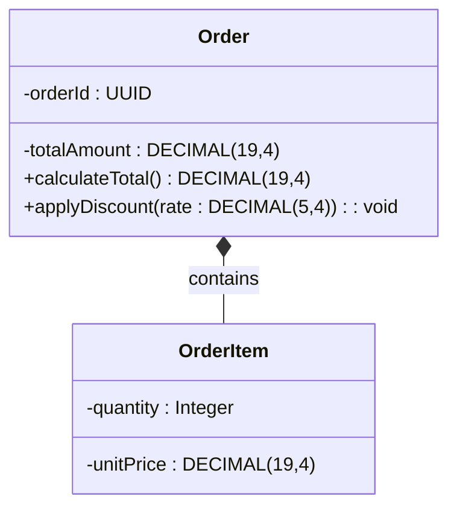
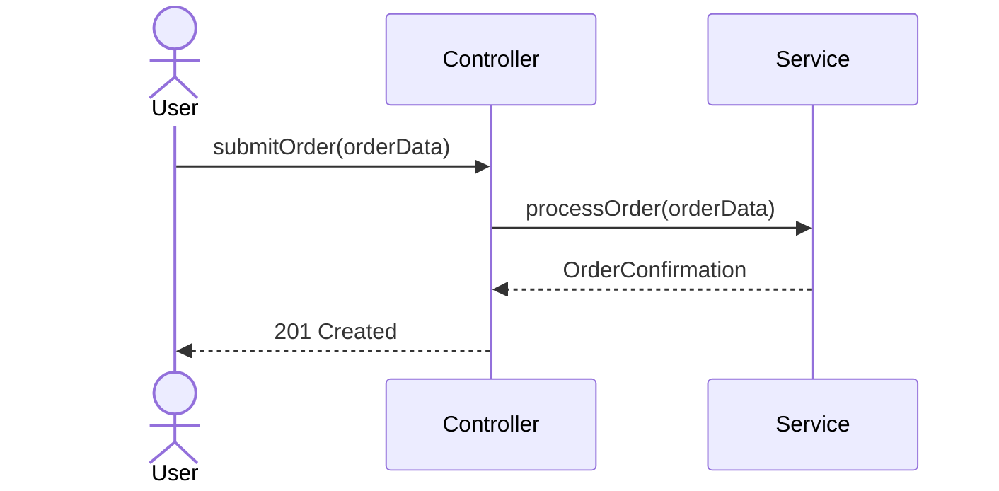
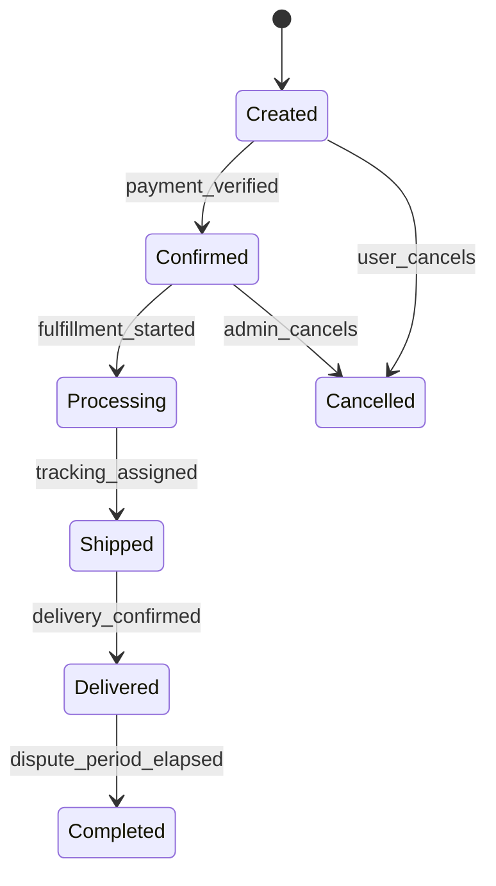

# Low-Level Design Skill

## Overview

This is the second skill in Phase 03 (Design Documentation). It decomposes the high-level components defined in HLD.md into implementable modules with class structures, interaction sequences, state transitions, and algorithmic detail. The resulting LLD.md serves as the definitive blueprint for developers, mapping every module back to its originating HLD component and SRS requirement.

## When to Use

- After the `01-high-level-design` skill has produced `HLD.md` in `../output/`.
- Requires `business_rules.md` in `../project_context/` for algorithm formalization and calculation logic.

## Quick Reference

| Attribute     | Value                                                                 |
|---------------|-----------------------------------------------------------------------|
| **Inputs**    | `../output/HLD.md`, `../output/SRS_Draft.md`, `../project_context/business_rules.md` |
| **Output**    | `../output/LLD.md`                                                    |
| **Tone**      | Implementation-precise, diagram-heavy, algorithm-focused              |
| **Standards** | IEEE 1016-2009 Sec 6, ISO/IEC 25010, ISO/IEC 25062                   |

## Input Files

| File               | Location                                  | Required | Purpose                                          |
|--------------------|-------------------------------------------|----------|--------------------------------------------------|
| HLD.md             | `../output/HLD.md`                        | Yes      | Component architecture to decompose into modules |
| SRS_Draft.md       | `../output/SRS_Draft.md`                  | Yes      | Stimulus-response pairs for sequence diagrams    |
| business_rules.md  | `../project_context/business_rules.md`    | Yes      | Business logic and calculations to formalize     |

## Output Files

| File    | Location             | Description                                              |
|---------|----------------------|----------------------------------------------------------|
| LLD.md  | `../output/LLD.md`   | Complete Low-Level Design with diagrams and algorithms   |

## Core Instructions

Follow these nine steps in order. Halt and notify the user if a required input file is missing.

### Step 1: Read and Validate Inputs

Read `HLD.md` and `SRS_Draft.md` from `../output/`, and `business_rules.md` from `../project_context/`. Log every file path read. If any required file is missing, halt execution and report the gap.

### Step 2: Decompose Components into Modules

For each component identified in HLD.md, decompose it into modules and classes. Define each module's single responsibility, public interface, and internal dependencies. Group related classes into packages or namespaces that mirror the HLD layered architecture.

### Step 3: Generate Class Diagrams

Produce Mermaid `classDiagram` blocks for each module. Classes shall include:
- Typed attributes (`String`, `Integer`, `DECIMAL(19,4)` for monetary values, `DateTime`)
- Parameterized methods with return types
- Relationships: inheritance (`<|--`), composition (`*--`), dependency (`..>`), association (`-->`)



### Step 4: Generate Sequence Diagrams

Produce Mermaid `sequenceDiagram` blocks for 5-8 critical workflows derived from SRS Section 3.2 stimulus-response pairs. Each diagram shall show:
- Actor-to-component message flows
- Both the happy path and at least one error/alternate path
- Return values and asynchronous callbacks where applicable



### Step 5: Generate State Machine Diagrams

Produce Mermaid `stateDiagram-v2` blocks for every entity that has lifecycle states. Each diagram shall include all terminal states and transition guards.



### Step 6: Formalize Business Rules as Algorithms

For each complex business rule in `business_rules.md`, produce structured pseudocode. Use LaTeX notation for all calculations:

- $LateFee = Balance \times Rate \times DaysOverdue$
- $Discount = SubTotal \times DiscountRate$ where $SubTotal > MinThreshold$

Include preconditions, postconditions, and edge-case guards for every algorithm. Document time complexity where relevant.

### Step 7: Design Error Handling

Define a comprehensive error handling strategy:
- **Error Code Taxonomy**: Enumerate domain-specific error codes mapped to HTTP status codes (e.g., `ORD-4001: Invalid order state transition` -> `409 Conflict`).
- **Exception Hierarchy**: Design the exception class tree (e.g., `ApplicationException` -> `ValidationException`, `BusinessRuleException`, `IntegrationException`).
- **Recovery Behavior**: Specify retry policy, fallback, or escalation per error type.

### Step 8: Define Data Validation Rules

For each input accepted by a module, define validation constraints per ISO/IEC 25062:
- Data type and format (e.g., email regex, ISO 8601 dates)
- Range checks (min/max values, string length bounds)
- Required vs. optional fields
- Cross-field validation rules (e.g., `endDate > startDate`)

### Step 9: Generate Traceability Matrix and Write Output

Produce a traceability table mapping every LLD module to its HLD component and originating SRS requirement ID:

| LLD Module           | HLD Component      | SRS Requirement IDs |
|----------------------|--------------------|---------------------|
| OrderService         | Order Management   | FR-3.2.1, FR-3.2.3 |
| PaymentGatewayAdapter| Payment Processing | FR-3.2.5, FR-3.2.6 |

Write the completed document to `../output/LLD.md`. Log the total module count, diagram count, and algorithm count.

## Output Format

The generated `LLD.md` shall follow this structure:

```
# Low-Level Design: [Project Name]
## Document Header
## 1. Introduction and Scope
## 2. Module Decomposition
### 2.x [Module Name] -- Responsibility, Class Diagram, Dependencies
## 3. Interaction Sequences
### 3.x [Workflow Name] Sequence Diagram
## 4. State Machine Models
### 4.x [Entity Name] State Diagram
## 5. Algorithm Specifications
### 5.x [Rule Name] Pseudocode
## 6. Error Handling Design (Taxonomy, Hierarchy, Recovery)
## 7. Data Validation Rules
## 8. Traceability Matrix
## Appendix A: Glossary
```

## Common Pitfalls

1. **Missing state transitions**: Every state must have at least one outbound transition or be explicitly terminal. Orphan states indicate incomplete analysis.
2. **Incomplete sequence flows**: Omitting error paths produces optimistic designs. Every sequence diagram shall include at least one failure branch.
3. **Algorithms without edge cases**: Division by zero, null inputs, empty collections, and boundary values shall be guarded in every algorithm.
4. **Generic error handling**: "Catch all exceptions" is not a design. Each error type shall have a specific code, message, and recovery strategy.

## Verification Checklist

- [ ] Every HLD component decomposes into at least one LLD module with a class diagram.
- [ ] Class diagrams use typed attributes (including `DECIMAL(19,4)` for monetary values) and parameterized methods.
- [ ] At least 5 sequence diagrams cover critical workflows with both happy and error paths.
- [ ] State machine diagrams include all terminal states and transition guard conditions.
- [ ] Every business rule algorithm includes preconditions, postconditions, and edge-case handling.
- [ ] Traceability matrix links every LLD module back to HLD components and SRS requirement IDs.

## Integration

| Direction  | Skill                                        | Relationship                                  |
|------------|----------------------------------------------|-----------------------------------------------|
| Upstream   | `03-design-documentation/01-high-level-design` | Consumes HLD.md component architecture      |
| Downstream | `03-design-documentation/03-api-specification`  | Feeds module interfaces for API contracts   |
| Downstream | `03-design-documentation/04-database-design`    | Feeds entity models for schema design       |
| Downstream | Phase 05 Testing                                | Feeds algorithms and state models for test case generation |

## Standards

- **IEEE 1016-2009 Sec 6**: Software Design Descriptions. Governs the structure of design viewpoints including decomposition, dependency, interface, and detail views.
- **ISO/IEC 25010**: Systems and software quality models. Provides the quality attribute framework referenced in module responsibilities.
- **ISO/IEC 25062**: Common Industry Format for usability test reports. Governs data validation rule documentation format.

## Resources

- `logic.prompt` -- executable prompt for automated LLD generation.
- `README.md` -- quick-start guide for this skill.
