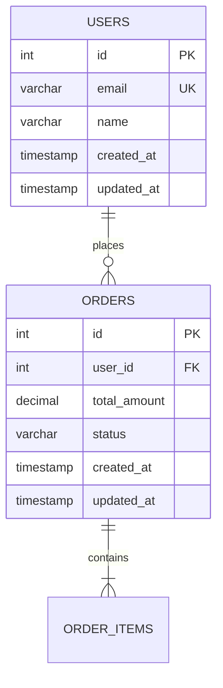

# Database Design Skill

## Overview

Produces comprehensive database design documentation including a visual Entity-Relationship Diagram (Mermaid erDiagram), normalized table definitions, indexing strategy, constraint specifications, migration plan, and a complete data dictionary. This skill can run after HLD is complete and may execute in parallel with API Specification (03-api-specification). **MANDATORY:** When the target platform is MySQL, this skill SHALL integrate with `skills/mysql-best-practices/` and apply all rules defined therein.

## When to Use

- After `HLD.md` exists in `../output/` and identifies data storage components.
- SRS Section 3.2 (Functional Requirements) provides entity candidates and business logic.
- `business_rules.md` in `../project_context/` provides data relationships, validation rules, and constraints.
- `tech_stack.md` in `../project_context/` specifies the database platform.

## Quick Reference

| Attribute   | Value |
|-------------|-------|
| **Inputs**  | `../output/SRS_Draft.md`, `../output/HLD.md`, `../project_context/business_rules.md`, `../project_context/tech_stack.md` |
| **Outputs** | `../output/Database_Design.md`, `../output/erd.mmd` |
| **Tone**    | Schema-precise, normalized, constraint-heavy |
| **Standard** | IEEE 1016-2009 Sec 6.7, ISO/IEC 25010 |

## Input Files

| File | Location | Required | Purpose |
|------|----------|----------|---------|
| SRS_Draft.md | `../output/SRS_Draft.md` | Yes | Entity candidates from Section 3.2, data objects from Section 2.0 |
| HLD.md | `../output/HLD.md` | Yes | Data storage components, architectural context, data flow paths |
| business_rules.md | `../project_context/business_rules.md` | Yes | Data relationships, validation constraints, business logic rules |
| tech_stack.md | `../project_context/tech_stack.md` | Yes | Database platform (MySQL 8.x, PostgreSQL, etc.), version constraints |

## Output Files

| File | Location | Description |
|------|----------|-------------|
| Database_Design.md | `../output/Database_Design.md` | Complete database design document with all sections |
| erd.mmd | `../output/erd.mmd` | Standalone Mermaid erDiagram file for the entity-relationship model |

## Core Instructions

Follow these eleven steps in order. Halt and notify the user if a required input file is missing.

### Step 1: Read Context Files

Read `SRS_Draft.md` and `HLD.md` from `../output/`, and `business_rules.md` and `tech_stack.md` from `../project_context/`. Log the absolute path of each file read. If any required file is missing, halt execution and report the gap.

### Step 2: Determine Database Platform

Parse `tech_stack.md` to identify the target database platform (MySQL 8.x, PostgreSQL, MariaDB, etc.). If the platform is MySQL or MariaDB, load and apply `skills/mysql-best-practices/` rules MANDATORILY for all subsequent steps. Document the platform version and any engine-specific constraints (e.g., InnoDB for MySQL).

### Step 3: Extract Entities

Extract entity candidates from SRS Section 3.2 (functional requirements) and Section 2.0 (data objects). Each entity becomes a table candidate. Cross-reference with `business_rules.md` to identify additional entities implied by relationships or constraints. List all identified entities with a one-sentence description.

### Step 4: Generate ERD

Produce an Entity-Relationship Diagram using Mermaid erDiagram syntax. Include all entities with typed attributes, relationships with proper cardinality notation (`||--o{`, `||--|{`, `}o--o{`), and junction tables for every many-to-many relationship. Write the diagram to `../output/erd.mmd`.

### Step 5: Verify Normalization

Analyze every table against normalization forms:
- **1NF:** Atomic values only, no repeating groups.
- **2NF:** No partial dependencies on composite keys.
- **3NF:** No transitive dependencies.

Document any intentional denormalization with a performance rationale citing specific query patterns or SRS requirements that justify the deviation.

### Step 6: Generate Table Definitions

For each table, specify: column name, data type, nullable flag, default value, and constraints (PK, FK, UNIQUE, CHECK, NOT NULL). Monetary values SHALL use `DECIMAL(19,4)` per the logic-modeling convention. Every table SHALL include `id` (PK), `created_at`, and `updated_at` audit columns. Include `deleted_at` for soft-delete tables where business rules require data retention.

### Step 7: Define Relationships and Foreign Keys

For every foreign key, explicitly state: parent table, child table, column mapping, `ON DELETE` action (CASCADE, SET NULL, RESTRICT), and `ON UPDATE` action. Referential integrity SHALL be enforced at the database level. Foreign key columns SHALL be indexed.

### Step 8: Define Indexing Strategy

Define indexes for each table with rationale:
- **Primary key indexes:** Every table (automatic).
- **Unique indexes:** Natural keys (email, username, slug).
- **Foreign key indexes:** Every FK column.
- **Composite indexes:** Common query patterns (include column order rationale).
- **Full-text indexes:** Search fields where applicable.

### Step 9: Generate Data Dictionary

Produce a comprehensive data dictionary covering every field across all tables:

| Table | Field | Type | Description | Constraints | Example Value |
|-------|-------|------|-------------|-------------|---------------|

Every column in every table SHALL appear in this dictionary.

### Step 10: Define Migration Strategy

Document the migration approach: versioned migrations (up/down scripts), seed data for reference tables, rollback procedures for each migration, and environment-specific considerations (dev, staging, production).

### Step 11: Multi-Tenancy and Final Output

If multi-tenancy is detected in SRS or HLD, define the tenant isolation strategy: shared database with `tenant_id` FK on every tenant-scoped table, or separate schemas. The `tenant_id` column SHALL have a foreign key constraint and be included in composite indexes for query performance. Write `Database_Design.md` and `erd.mmd` to `../output/`. Log total table count, column count, and relationship count.

## Output Format

The generated `Database_Design.md` shall use this section structure with a Document Header (Date, Version, Authors, Standard, Database Platform), followed by nine sections:

1. **Entity-Relationship Diagram** -- Mermaid erDiagram block with typed attributes and cardinality
2. **Normalization Analysis** -- 1NF/2NF/3NF verification per table; denormalization rationale
3. **Table Definitions** -- One subsection per table with Column/Type/Nullable/Default/Constraints columns
4. **Relationships and Foreign Keys** -- FK definitions with ON DELETE/ON UPDATE cascade rules
5. **Indexing Strategy** -- Index definitions with rationale per table
6. **Data Dictionary** -- Table/Field/Type/Description/Constraints/Example Value for every column
7. **Migration Strategy** -- Versioned migrations (up/down), seed data, rollback procedures
8. **Multi-Tenancy** -- Tenant isolation strategy (if applicable)
9. **Traceability Matrix** -- Table/SRS Section/Requirement IDs/Business Rule mapping

Example ERD block:

## Common Pitfalls

| Pitfall | Remedy |
|---------|--------|
| Missing indexes on foreign keys | Every FK column SHALL have a corresponding index |
| No cascade rules defined | Every FK SHALL specify ON DELETE and ON UPDATE actions |
| Monetary values not using DECIMAL(19,4) | All currency/monetary columns SHALL use DECIMAL(19,4) |
| Missing soft delete columns | Tables with data retention rules SHALL include deleted_at |
| No audit columns | Every table SHALL have created_at and updated_at columns |
| Denormalization without rationale | Document the performance justification for every deviation from 3NF |

## Verification Checklist

- [ ] `Database_Design.md` and `erd.mmd` exist in `../output/`.
- [ ] ERD renders correctly in Mermaid erDiagram syntax.
- [ ] All tables have primary keys defined.
- [ ] Foreign keys have ON DELETE and ON UPDATE cascade rules defined.
- [ ] Monetary columns use `DECIMAL(19,4)`.
- [ ] Data dictionary covers every field in every table.
- [ ] `skills/mysql-best-practices/` rules applied if MySQL or MariaDB detected.

## Integration

| Direction | Skill | Relationship |
|-----------|-------|-------------|
| Upstream | 01-high-level-design | Consumes `HLD.md` for data storage components and data flow paths |
| Downstream | Phase 04 (Development) | Provides schema definitions for ORM models and migration scripts |
| Downstream | Phase 05 (Testing) | Provides table structure for data integrity and constraint test cases |
| Mandatory Ref | `skills/mysql-best-practices/` | Applied when MySQL or MariaDB is the target platform |

## Standards

- **IEEE 1016-2009 Sec 6.7** -- Data design viewpoint: entity definitions, relationships, constraints, and data dictionary
- **ISO/IEC 25010** -- Quality model for data integrity, performance efficiency, and reliability characteristics

## Resources

- `logic.prompt` -- Executable prompt containing the step-by-step database design generation logic.
- `README.md` -- Quick-start guide for this skill.
