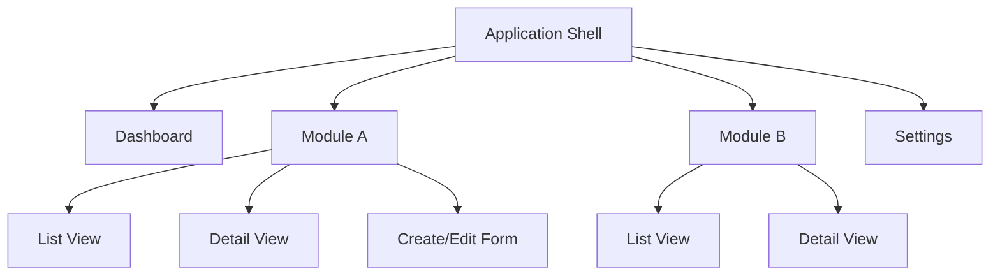

# Information Architecture Reference

## Site Map Construction Techniques

### Top-Down Approach

The system shall derive the site map from the product vision and high-level feature groupings. Begin with the application shell (root node), decompose into primary navigation categories, then expand each category into its constituent screens.

**Process:**
1. Identify primary user goals from `vision.md` and `features.md`.
2. Group features into logical categories (max 7 +/- 2 top-level items per Miller's Law).
3. Arrange categories by frequency of use and task criticality.
4. Decompose each category into screens and sub-screens.

**Mermaid Example:**

### Bottom-Up Approach

The system shall derive the site map from existing content and user mental models. Begin with an inventory of all content items, then group them through card sorting analysis.

**Process:**
1. Enumerate all content items, screens, and features from SRS Section 3.2.
2. Conduct open card sorting to discover user-generated categories.
3. Validate groupings with closed card sorting against the proposed hierarchy.
4. Reconcile user mental models with technical architecture constraints from `HLD.md`.

## Content Inventory Template

The system shall produce a content inventory table enumerating every page, screen, or content element:

| Page/Screen | Content Type | Owner | Status | Priority | Notes |
|-------------|-------------|-------|--------|----------|-------|
| Dashboard | Aggregate view | Product | Planned | P1 | Primary landing screen |
| User List | CRUD list | Engineering | Planned | P1 | Filterable, sortable |
| User Detail | Detail view | Engineering | Planned | P1 | Read-only with edit action |
| User Form | Create/Edit form | Engineering | Planned | P1 | Validation required |
| Settings | Configuration | Engineering | Planned | P2 | Role-restricted |
| Help/FAQ | Static content | Support | Planned | P3 | Searchable |

**Content Type Categories:**
- **Aggregate View:** Dashboard, summary, analytics display.
- **CRUD List:** Filterable, sortable, paginated data table.
- **Detail View:** Single-record display with related data.
- **Create/Edit Form:** Data entry with validation.
- **Configuration:** Settings, preferences, administration.
- **Static Content:** Help, FAQ, documentation, legal.

## Navigation Models

### Global Navigation

The system shall define persistent navigation visible on every screen. Global navigation shall contain no more than 7 primary items. Each item shall have an icon, label, and active state indicator.

### Local Navigation

The system shall define context-specific navigation within a section. Examples include tab bars within a detail view, sub-menus within a module, and step indicators within a wizard flow.

### Contextual Navigation

The system shall define in-content links and related-item references. Examples include "Related Items" sections, inline links to referenced entities, and "See Also" suggestions.

### Utility Navigation

The system shall define persistent utility links typically placed in the header or user menu: account profile, settings, notifications, help, and logout.

### Breadcrumb Navigation

The system shall define hierarchical breadcrumb trails for applications deeper than two navigation levels. Breadcrumbs shall reflect the actual page hierarchy, not the user's browsing history.

## Card Sorting Methodology

### Open Card Sorting

Participants group content items into categories they create themselves. The system shall use this method during early discovery to understand user mental models.

**Recording Template:**

| Card Label | Participant ID | Assigned Category | Confidence (1-5) |
|------------|---------------|-------------------|-------------------|
| User Profile | P01 | Account | 5 |
| Billing History | P01 | Account | 4 |
| Dashboard | P01 | Home | 5 |

### Closed Card Sorting

Participants sort content items into predefined categories. The system shall use this method to validate a proposed information architecture.

**Recording Template:**

| Card Label | Predefined Category | Correct Placement (%) | Avg Time (s) |
|------------|--------------------|-----------------------|---------------|
| User Profile | Account Settings | 92% | 3.2 |
| Billing History | Account Settings | 78% | 5.1 |

### Analysis Techniques

- **Similarity Matrix:** Calculate the percentage of participants who grouped each pair of items together.
- **Dendrogram:** Cluster analysis visualization showing hierarchical groupings at various similarity thresholds.
- **Category Agreement:** Percentage of participants who assigned an item to the same category. Target: >= 70% agreement for confident placement.
