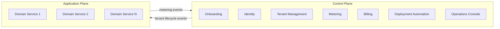

# SaaS Multi-Tenancy Architecture Specification Skill
<!-- dual-compat-start -->
## Use When

- Tenant boundaries materially affect service, data, deployment or operating design.

## Do Not Use When

- Do not use for a single-tenant system or to claim isolation without enforcement and detection evidence.

## Required Inputs

| Artefact | Source or provider | Required? | Missing behaviour |
|---|---|---|---|
| Approved HLD, SRS and business model | Phase 01-03 artefacts | Required | Stop if tenant identity or service inventory is incomplete. |
| Residency, isolation, scale and cost constraints | Security, compliance, platform and finance owners | Required | Make unknown constraints explicit ADR blockers. |

## Workflow

1. Read the named inputs and confirm their approval, version and unresolved decisions.
2. Apply the decision rules below before drafting; stop on a missing authority, unsafe assumption or unresolved scope driver.
3. Produce the Multi-Tenancy Architecture Specification and ADR seeds through the existing domain procedure and load only the references needed for the chosen branch.
4. Trace each material statement in the Multi-Tenancy Architecture Specification and ADR seeds to an input, decision or explicitly qualified assumption.
5. Verify the observable acceptance conditions, record unassessed checks, and hand the artefacts to their named consumers.
6. If validation fails, recover by correcting the source decision or artefact and rerun the affected check; do not weaken the acceptance condition.

## Outputs

| Artefact | Consumer | Observable acceptance condition |
|---|---|---|
| Multi-Tenancy Architecture Specification and ADR seeds | Service, data, security, platform and billing teams | Every tenant-touching service has a pattern, context rule, enforcement, failure behaviour, noisy-neighbour control, observability and cost attribution. |

## Evidence Produced

| Evidence | Consumer | Acceptance condition |
|---|---|---|
| Source and decision trace | Reviewer and downstream owner | Each material statement cites an approved input, named decision or qualified open issue. |
| Completed verification record | Release or phase gate owner | Every applicable check records pass/fail; unavailable checks remain `not assessed`. |

## Capability and permission boundaries

Read-only is the default for analysis, review, evaluation and planning. Read and search access to authorised project artefacts are required. Editing is limited to an explicitly requested project deliverable. Execution may run document, syntax or validation checks. Network access is used only for facts that require current verification. Do not publish, spend, change production, approve policy, or claim certification without explicit authority.

## Degraded mode

If any required capability is unavailable, return the narrowest useful qualified Multi-Tenancy Architecture Specification and ADR seeds draft plus a gap register showing the missing item, affected sections, risk and owner. Never convert an unassessed check into a pass.

## Decision Rules

| Choice | Action | Failure or risk avoided |
|---|---|---|
| Isolation/regulation outweighs pooling economy | Choose silo, pod or dedicated pattern | Blast radius and residency are bounded |
| Workload is homogeneous with enforceable row isolation | Choose pool with defence in depth | Unnecessary unit cost is avoided |

## Quality Standards

- Preserve repository terminology and trace every material choice to project context.
- Use deterministic acceptance conditions; replace vague quality claims with an observable check, threshold or named approval.
- Cover error, empty, edge, recovery and operational cases relevant to this skill.
- Verify standards, citations, APIs and package names before relying on them; qualify what cannot be checked.
- Stop release for a failed safety, security, legal, financial, accessibility or data-integrity gate.

## Anti-Patterns

- Declaring `multi-tenant` without a service matrix. Fix: decide per service and store.
- Trusting a request header for tenant context. Fix: derive and verify context from authenticated identity.
- Using row filters without bypass tests. Fix: add database and service enforcement evidence.
- Ignoring background jobs. Fix: propagate tenant context through queues and schedulers.
- Calling throttling a noisy-neighbour strategy. Fix: define quotas, fairness, detection and tier behaviour.

## References

- [Tenancy decision template](references/saas-tenancy-decision-template.md)
- [Control-plane services](references/saas-control-plane-services.md)
- [HLD neighbour](../01-high-level-design/SKILL.md)
<!-- dual-compat-end -->

## Overview

This skill produces the SaaS-distinctive architecture artefact that no generic HLD captures: the explicit two-plane decomposition, the per-microservice tenancy-pattern matrix, tenant-context propagation, isolation strategy, noisy-neighbor controls, per-tenant cost-attribution method, and the ADR seeds. It is the canonical Phase 03 SaaS skill.

The skill is anchored in Tod Golding, *Building Multi-Tenant SaaS Architectures* (O'Reilly, 2024). It assumes a generic `HLD.md` already exists (from `01-high-level-design`) and that the present skill augments it with the SaaS-specific viewpoints.

## When to Use

- The project's `vision.md` or `PRD.md` describes a multi-tenant SaaS (B2B, B2C, vertical, horizontal).
- A generic `HLD.md` already exists or will be created in the same Phase 03 run.
- Tenancy decisions, isolation evidence, or per-tenant cost attribution are in scope.

## Quick Reference

| Attribute | Value |
|-----------|-------|
| **Inputs** | `projects/<ProjectName>/<phase>/<document>/SRS_Draft.md`, `HLD.md`, `projects/<ProjectName>/_context/tech_stack.md`, `PRD.md` |
| **Output** | `projects/<ProjectName>/<phase>/<document>/Multi_Tenancy_Architecture_Spec.md` plus ADR seeds |
| **Tone** | Architectural, decision-driven, evidence-bearing |
| **Standard** | IEEE 1016-2009 Sec 5 (Design Viewpoints); ISO/IEC 25010 (Quality Model) |
| **Source** | Golding, *Building Multi-Tenant SaaS Architectures* (2024) |

## Input Files

| File | Location | Required | Purpose |
|------|----------|----------|---------|
| SRS_Draft.md | Phase-02 output dir | Yes | Functional and NFR requirements |
| HLD.md | Phase-03 output dir | Yes | Generic architecture being augmented |
| tech_stack.md | `_context/` | Yes | Cloud / framework constraints |
| PRD.md | Phase-01 output dir | Recommended | Tiering, ICP, business model |
| vision.md | `_context/` | Recommended | Strategic context |

## Output Files

| File | Location | Description |
|------|----------|-------------|
| Multi_Tenancy_Architecture_Spec.md | Phase-03 output dir | Full SaaS multi-tenancy spec |
| `adr-seeds/0001-tenancy-pattern-<service>.md` | Phase-03 output dir | One ADR seed per microservice |
| `adr-seeds/0002-control-plane-boundary.md` | Phase-03 output dir | Boundary between control plane and application plane |

## Core Instructions

Follow these nine steps in order. Halt if any required input is missing.

### Step 1: Read context

Read `SRS_Draft.md`, `HLD.md`, `tech_stack.md`, `PRD.md`, `vision.md`. Identify regulatory constraints, data-residency requirements, target ICP segments, expected tier mix, and any "enterprise must have dedicated infra" obligations. Log all source citations.

### Step 2: Declare the two-plane decomposition

Per Golding Ch.2, every SaaS architecture has a **control plane** (onboarding, identity, tenant management, metering, billing, deployment automation, operations, analytics) and an **application plane** (the domain microservices that carry tenant context).

Produce a Mermaid diagram showing the two planes, the services in each, and the events/APIs crossing the boundary. Every service in scope shall be classified as control-plane or application-plane.

### Step 3: Fill the per-microservice tenancy-pattern matrix

For every microservice in the application plane, fill the following table:

| Service | Compute | Storage | Pattern | Drivers | Trade-offs accepted | ADR ref |
|---------|---------|---------|---------|---------|---------------------|---------|
| Service A | pooled / siloed / pod | pooled / siloed / pod | Full-Stack Pool / Full-Stack Silo / Mixed-Mode / Pod / VPC-per-tenant | regulatory / blast-radius / cost / perf / noisy-neighbor / migration | what was traded away | `0001-tenancy-pattern-service-a.md` |

Patterns are drawn from Golding Ch.3:

- **Full-Stack Silo** — dedicated compute *and* storage per tenant. Highest isolation, simplest cost attribution, hardest cost efficiency.
- **Full-Stack Pool** — shared compute and storage. Best efficiency, requires explicit isolation, noisy-neighbor controls, per-tenant metering.
- **Mixed-Mode** — pool one resource (e.g. compute) while silo another (e.g. storage).
- **Pod** — group N tenants per stack; rebalance as needed.
- **Account-per-Tenant / VPC-per-Tenant** — silo at the cloud-account or network boundary; often used by migrating ISVs or strict-isolation industries.

Every row shall name **at least one** driver from the regulated list. Drivers without measurable thresholds are not drivers — replace with a measurable threshold (e.g. "P95 cross-tenant latency interference < 10 ms" not "low interference").

### Step 4: Write the tenant-context specification

Document the token format, claims (`tenant_id`, `tier`, `region`, `roles`), how the token is issued (control-plane → application-plane), how it is propagated across services (HTTP header, gRPC metadata, async-event envelope), how it is validated at each service boundary, and the fail-safe behaviour when the context is missing or invalid (reject request, audit log, alarm).

Cite SRS-section identifiers for each rule and write a *Verification Procedure* table — how each rule is tested in CI.

### Step 5: Write the isolation strategy

For each tenancy pattern in use, document the isolation enforcement at each layer:

- **Network** — VPC, subnet, security groups, service mesh policy.
- **Compute** — process, container, namespace, dedicated worker, throttling.
- **Storage** — database, schema, row-level security, encryption-key boundary (per-tenant KMS key?), index partitioning.
- **IAM** — IAM role-per-tenant, attribute-based access, signed-context propagation.
- **Code path** — repository query helpers that reject queries without tenant filter, lint rules, runtime assertions.

Cross-link to `09-governance-compliance/11-saas-data-isolation-evidence-pack` which produces the evidence artefact.

### Step 6: Document noisy-neighbor controls and per-tier SLOs

For every pooled service, document:

- Throttling / rate-limit per tenant and per tier.
- Quotas (concurrent jobs, request-rate, queue depth).
- Per-tier SLOs (Bronze / Silver / Gold / Enterprise) for latency, availability, support response.
- Burst headroom and the back-off behaviour.

Cross-link to `06-deployment-operations/08-saas-slo-and-error-budget-doc`.

### Step 7: Document per-tenant cost attribution

For every pooled service, state the method by which infrastructure cost is attributed back to the tenant: metered usage events (API calls, storage GB-month, compute seconds), allocation of shared costs (per-tenant share of base infrastructure), reporting cadence (daily / monthly), and the destination (FinOps dashboard, finance ERP). This feeds the **Pricing & Packaging Spec** and the **Billing & Metering SRS**.

### Step 8: Emit ADR seeds

For each microservice, emit one ADR file at `adr-seeds/0001-tenancy-pattern-<service>.md` using the template at `references/saas-tenancy-decision-template.md`. Each ADR contains: context, decision, status, consequences, drivers, alternatives considered, evidence references, sign-off owners.

Also emit one ADR for the control-plane / application-plane boundary: where API calls cross the boundary, what events propagate, what isolation exists.

### Step 9: Write the spec

Write `Multi_Tenancy_Architecture_Spec.md` with the following sections in order:

1. Two-Plane Decomposition Diagram
2. Control-Plane Services Inventory
3. Application-Plane Services Inventory
4. Per-Microservice Tenancy-Pattern Matrix
5. Tenant Context Specification
6. Isolation Strategy (per layer × per pattern)
7. Noisy-Neighbor & Per-Tier SLOs
8. Per-Tenant Cost Attribution
9. Tenant Lifecycle Event Catalogue (cross-link to lifecycle runbook)
10. ADR Seed Index
11. Traceability Matrix (every section → SRS clause or PRD requirement)

Log the section count and ADR-seed count.

## Output Format

Strict heading order as above. Mermaid for all diagrams. LaTeX for any quota / cost formulas. Tables for the tenancy-pattern matrix and SLOs. No vague adjectives — every NFR has a measurable threshold per `02-requirements-engineering/references/saas-nfr-catalog.md`.

## Common Pitfalls

| Pitfall | Remedy |
|---------|--------|
| Treating the whole system as one tenancy pattern | Fill the matrix per microservice; mixed-mode is the norm |
| Naming a pattern without drivers | Every row must cite at least one driver from {regulatory, isolation, blast-radius, cost, performance, noisy-neighbor} |
| "Isolation is logical" without enforcement evidence | Cross-link to the Data Isolation Evidence Pack and the test artefacts |
| No noisy-neighbor controls in a pool service | Throttle, quota, back-off, per-tier SLO are mandatory |
| No tenant-context fail-safe | Every service must define the reject + audit behaviour when context is missing |
| Cost attribution missing for pool services | Pool means you cannot tell who is expensive — fix that with metering, not later |

## Verification Checklist

- [ ] Every microservice appears in the tenancy-pattern matrix.
- [ ] Every row cites at least one driver with a measurable threshold.
- [ ] Tenant context spec defines token format, claims, propagation rule, validation rule, fail-safe behaviour.
- [ ] Isolation strategy covers network, compute, storage, IAM, code path for every pooled pattern.
- [ ] Per-tier SLOs exist for every pooled service.
- [ ] Per-tenant cost attribution method exists for every pooled service.
- [ ] One ADR seed exists per microservice plus one for the control-plane boundary.
- [ ] Traceability matrix maps every section to SRS or PRD.

## Integration

| Direction | Skill | Relationship |
|-----------|-------|-------------|
| Upstream | `01-high-level-design` | Consumes the generic HLD as the architectural baseline |
| Upstream | Phase 02 SRS | Consumes NFRs, regulatory constraints |
| Downstream | `02-low-level-design` | Tenancy patterns drive module-level helpers (tenant-aware repos, scoped logging) |
| Downstream | `04-database-design` | Storage tenancy pattern drives schema strategy (separate-DB / separate-schema / shared-schema-RLS) |
| Downstream | `06-deployment-operations/07-saas-tenant-lifecycle-runbook` | Lifecycle events defined here are operationalised in the runbook |
| Downstream | `06-deployment-operations/08-saas-slo-and-error-budget-doc` | Per-tier SLOs declared here feed the SLO doc |
| Downstream | `09-governance-compliance/11-saas-data-isolation-evidence-pack` | Isolation strategy here is the design; the evidence pack is the proof |
| Downstream | `09-governance-compliance/05-architecture-decision-records` | ADR seeds graduate to the ADR catalog |

## Standards

- **IEEE 1016-2009 Sec 5** — Architectural Design Viewpoints.
- **ISO/IEC 25010** — Quality model (capability, performance, security, maintainability, portability).
- **AWS Well-Architected SaaS Lens** — control-plane / application-plane vocabulary.
- **Golding (2024)** — silo / pool / mixed / pod taxonomy.

## Resources

- `logic.prompt` — Executable prompt.
- `README.md` — Quick-start.
- `references/saas-tenancy-decision-template.md` — ADR template per service.
- `references/saas-control-plane-services.md` — Canonical control-plane service catalogue.
- `book-extractions/saas-architectures-srs-extraction.md` — Source synthesis.
