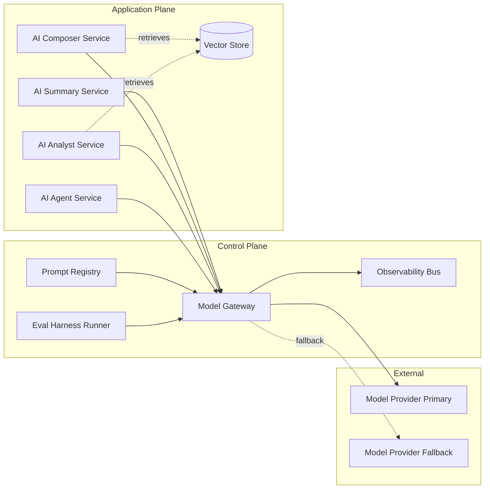

# AI Architecture Spec Template

## 1. AI Plane Diagram

## 2. Feature-to-Pattern Map

| Feature | Pattern | Drivers | Rejected alternatives |
|---------|---------|---------|------------------------|
| AI Summary | direct LLM | input self-contained | RAG (no benefit), fine-tune (premature) |
| AI Composer | RAG (tone + thread) | grounding required | direct (no tone control), fine-tune (cost/time) |
| AI Analyst | RAG over warehouse | numeric grounding required | direct (hallucinated numbers) |
| AI Agent | agent with approved-action tool catalogue | multi-step | direct (single shot insufficient) |

## 3. Model Gateway

- Providers: { Primary: Anthropic Claude 3.7 Sonnet; Fallback: OpenAI GPT-4o; Specialist: Cohere rerank }.
- Auth: per-feature service identity, rotated 90 d.
- Tenant-id propagation: guarded JWT claim; gateway rejects requests without it.
- Rate limit: per (tenant, feature, minute); override on tier upgrade.
- Cost ceiling: per (tenant, day) and per (tenant, month); throttle on breach.
- Request/response log retention: 90 d hot, 13 mo cold; per-tenant partition.
- Content-filter chain: PII detector (input + output), profanity filter, policy classifier, jailbreak detector.
- Fallback routing: provider down -> fallback model; cost-overrun -> cheaper model; latency P95 over 200% target -> fallback.
- Idempotency: client-supplied key; gateway de-duplicates 24 h.

## 4. Vector Store

| Index | Store | Partition | Embedding | Dim | ANN params | Freshness | Encryption |
|-------|-------|-----------|-----------|-----|-------------|-----------|-------------|
| customer-docs | pgvector | per-tenant table | embedding-v3 | 1536 | HNSW M=16 ef=64 | < 5 min | AES-256, per-tenant key Enterprise |
| public-corpus | pgvector | shared | embedding-v3 | 1536 | HNSW M=16 ef=64 | weekly | AES-256 |
| internal-wiki | pgvector | internal | embedding-v3 | 1536 | HNSW M=16 ef=64 | daily | AES-256 |

## 5. Prompt Registry

- Source of truth: Git repo `prompts/` with semantic-version tags.
- Change protocol: PR with: prompt diff, regression eval result on attached golden set, sign-off from prompt owner + AI lead.
- Deploy: pinned tag per environment; staged promotion dev -> staging -> prod.
- Rollback: revert tag pin; gateway picks new tag on next request.

## 6. Eval Harness

- Dataset store: object store, versioned by tag.
- Judge: judge-LLM (separate provider) with rubric per feature.
- CI gate: PR cannot merge if regression > 2 pp on golden set or red-team set.
- Scheduled regression: nightly on golden; weekly on full red-team.
- Alert: score drop > 3 pp triggers SEV3 to AI lead.

## 7. Observability

| Metric | Source | Cardinality | Sample | Retention |
|--------|--------|-------------|--------|-----------|
| tokens_in / tokens_out | gateway | per (tenant, feature, model) | every request | 13 mo |
| model_latency_ms | gateway | per (provider, model) | every request | 13 mo |
| fallback_rate | gateway | per feature | 1 min | 13 mo |
| abstention_rate | service | per feature | 1 min | 13 mo |
| citation_rate | service | per feature | 1 min | 13 mo |
| judge_llm_score | eval runner | per feature | per run | 13 mo |
| cost_usd | gateway | per (tenant, feature) | every request | 24 mo |
| content_filter_trips | gateway | per filter | every trip | 13 mo |

## 8. Security Boundaries

- Untrusted text surfaces: retrieved docs, user input, tool outputs. All passed to the model with hard system-message defences and indirect-prompt-injection probes in red-team.
- Tool execution: sandboxed; approved-actions catalogue is the closed list; agent cannot construct new actions.
- Egress allow-list: gateway egresses only to listed model providers and to the eval/judge endpoint. All other egress denied.
- Secrets: never in prompts. Tools fetch credentials by tenant-id claim against a vault.
- Cross-tenant retrieval: prohibited; gateway returns 403 if the retrieval payload tenant differs from caller tenant.

## 9. ADR Seed Index

- ADR-AI-001 Model Gateway as sole egress
- ADR-AI-002 Anthropic Claude as primary for summarisation
- ADR-AI-003 RAG (not fine-tune) for AI Composer
- ADR-AI-004 pgvector per-tenant for customer docs
- ADR-AI-005 Eval CI gate at 2 pp regression threshold
- ADR-AI-006 Abstain rule: retrieval confidence < 0.5 or judge < 0.7
- ADR-AI-007 Content filter chain order

## 10. Traceability

| Section | AI FR | PRD FR | NFR | Eval ID |
|---------|-------|--------|-----|---------|
| Gateway | all | all | NFR-SEC-AI-* | n/a |
| RAG (Composer) | AI-FR-002 | FR-022 | NFR-PERF-AI-002 | EVAL-COMP-150 |
| RAG (Analyst) | AI-FR-003 | FR-031 | NFR-PERF-AI-003 | EVAL-ANL-300 |
| Agent | AI-FR-004 | FR-041 | NFR-SEC-AI-004 | EVAL-AGT-100 |
