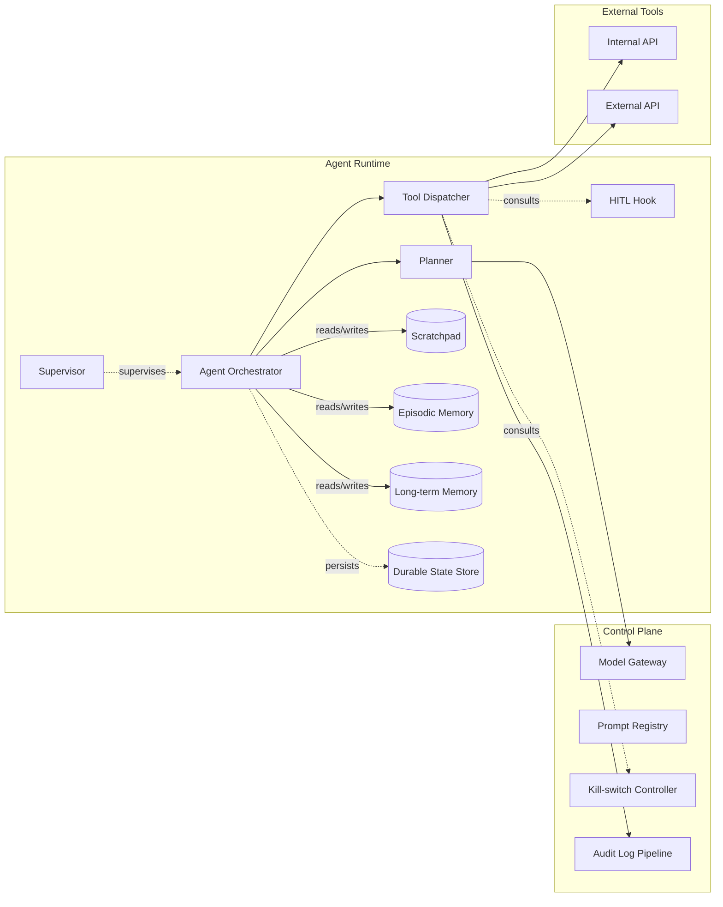
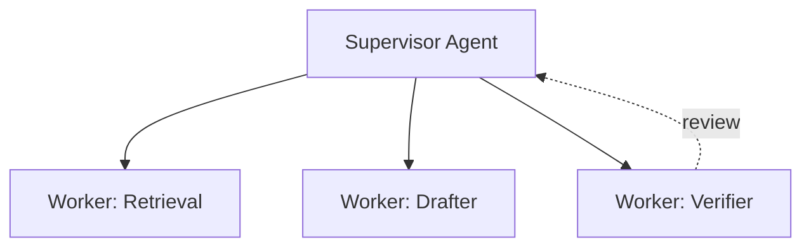

# AI Agent Architecture Spec Template

## 1. Agent Runtime Diagram



## 2. Loop & State Machine

```
pending
  -> planning
       -> awaiting-approval        (when reversibility = irreversible OR plan-approval required)
            -> executing-tool      (approved)
            -> aborted             (rejected or timeout)
       -> executing-tool           (no approval needed)
            -> awaiting-tool-result
                 -> planning       (more steps)
                 -> completed-success
                 -> completed-failed
                 -> intervened     (user-triggered)
       -> completed-abstain        (no satisfying plan)
       -> aborted                  (budget exhausted)
```

Durability points: every state transition writes the new state, the last observation, the last plan, the last tool-call result, and the cumulative cost to the durable state store.

## 3. Memory Tiers

| Tier | Lifespan | Isolation key | Storage | Encryption | Redaction at write |
|------|----------|---------------|---------|------------|---------------------|
| Scratchpad | run-duration | `(tenant_id, agent_run_id)` | in-process + durable state | TDE | none required |
| Episodic | 30 d default; tenant-configurable | `(tenant_id, user_id)` | Postgres per-tenant table | TDE | PII redactor v1 |
| Long-term | unbounded; opt-in | `(tenant_id)` | Postgres + pgvector per-tenant table | TDE + envelope encryption | PII redactor v1; sensitive-class redactor |

## 4. Planner

- Pattern: Plan-and-execute (initial plan + per-step revision); fallback to ReAct when plan adherence fails twice.
- Prompt source: prompt registry tags `planner-v1.x`.
- Budget hooks: halt when `cost_usd > max_cost` OR `step_index >= max_step` OR `wallclock_s > max_wallclock`.
- Abstain payload schema:

```yaml
type: object
required: [reason, recoverable, suggested_human_action]
properties:
  reason:                   { type: string, enum: [policy-envelope-fail, insufficient-context, ambiguous-goal, irreversibility-without-approver] }
  recoverable:              { type: boolean }
  suggested_human_action:   { type: string, maxLength: 500 }
```

## 5. Tool Dispatcher

Sequence per tool call:

1. Catalogue lookup; refuse if absent (`outcome=refused`, `reason=tool-not-in-catalogue`).
2. Schema validate input; refuse on failure.
3. Re-validate tenant claim and tier availability.
4. Consult kill-switch (global, per-tenant, per-feature).
5. Consult rate-limit class; throttle or refuse if exhausted.
6. If `reversibility_class=irreversible` OR over `approval_threshold`: invoke HITL hook; block with timeout.
7. Execute underlying API call with idempotency key `(agent_run_id, step_index)`.
8. Sanitise tool output: strip embedded `IGNORE PRIOR INSTRUCTIONS` patterns; truncate to N tokens; redact PII per redactor v1.
9. Emit `agent_tool_call_event` to the audit pipeline.
10. Return sanitised output to orchestrator.

The dispatcher is the only egress for tool calls. No agent code path bypasses it.

## 6. Supervisor (multi-agent only)

Cross-link `15-ai-agent-multi-agent-coordination-spec`. Topology placeholder:



Supervision policy: review-before-act for any worker plan that contains an irreversible tool.

## 7. Durability & Resumability

- Storage: Postgres `agent_run_state` per-tenant table; `pg_jsonb` payload.
- Serialisation: protobuf v3.
- Resume SLA: < 30 s after process restart; orchestrator rebuilds the in-memory state from the last persisted transition.
- Idempotency key: `sha256(agent_run_id + ':' + step_index)`; passed to every underlying API.
- Backoff: tool-result wait is fully resumable; orchestrator does not poll, it waits on an event subscription.

## 8. Kill-switch Wiring

- Operator API: `POST /ops/kill-switch` with scope = `global | tenant:<id> | feature:<id>`.
- Console UI: ops admin only; two-person rule for global.
- Propagation: Redis pubsub channel `agent:killswitch`; every dispatcher subscribes.
- SLA: every dispatcher refuses new tool calls in scope within 5 s of the switch flip.
- In-flight tool calls: complete or time-out per the per-tool timeout; results not used.
- Rehearsal: monthly in staging with chaos test `agent-killswitch-chaos`.

## 9. Per-Tenant Isolation

| Layer | Enforcement |
|-------|-------------|
| Planner | retrieval calls scoped by `tenant_id`; refuses prompts that reference other tenants |
| Dispatcher | tenant claim re-validated per call; refuses claim drift |
| Scratchpad | keyed `(tenant_id, agent_run_id)`; no cross-key reads |
| Episodic | per-tenant Postgres table; row-level security keyed by `(tenant_id, user_id)` |
| Long-term | per-tenant Postgres table; opt-in flag in tenant settings; refuses when flag = false |
| Audit log | partitioned by `tenant_id`; export endpoints scoped by tenant claim |

## 10. ADR Seed Index

| ADR | Topic |
|-----|-------|
| ADR-AGT-001 | Planner choice per feature |
| ADR-AGT-002 | Durable state store technology |
| ADR-AGT-003 | Scratchpad isolation key |
| ADR-AGT-004 | Kill-switch propagation SLA |
| ADR-AGT-005 | Irreversibility-gating policy (cross-link) |
| ADR-AGT-006 | Tool-output sanitiser policy |
| ADR-AGT-007 | Audit log retention by event class |

## 11. Traceability

| Component | FR refs | ADR refs |
|------------|----------|-----------|
| Agent Orchestrator | AFR-TRG-001, AFR-REC-001, AFR-SUP-001 | ADR-AGT-001..007 |
| Tool Dispatcher | every agent FR | ADR-AGT-006, action catalogue rows |
| Kill-switch | every agent FR | ADR-AGT-004 |
