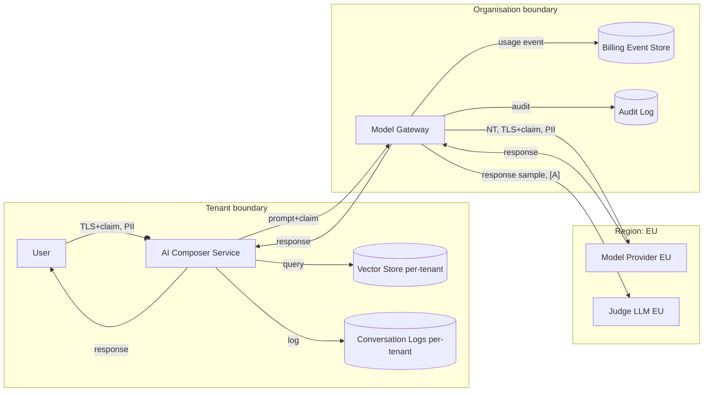

# AI Data-Flow Diagram Conventions

## Why a separate convention

Generic data-flow diagrams do not distinguish the model-provider boundary, the training-data exclusion flag, or the tenant-claim enforcement point. AI data-flow diagrams in this engine MUST follow these conventions so DPIA reviewers and auditors can read them without an oral briefing.

## Symbols

| Symbol | Meaning |
|--------|---------|
| rounded rectangle | service we operate |
| sharp rectangle | external processor (model provider, judge, reranker) |
| cylinder | persistent store (DB, vector store, log store) |
| double-ended arrow | bi-directional flow |
| arrow with circle on tail | PII flows on this edge |
| arrow with double-circle on tail | SPI / special category flows on this edge |
| arrow with `[A]` label | anonymised / aggregate only |
| arrow with `[NT]` label | no-training endpoint enforced |
| arrow with `[TLS+claim]` label | TLS plus signed tenant claim required |

## Boundaries (subgraphs / swimlanes)

| Boundary | Style |
|----------|-------|
| Tenant boundary | dashed border |
| Organisation boundary | solid border, grey fill |
| Jurisdiction boundary (region) | dotted border, labelled with region code |
| Processor boundary | dash-dot, labelled "Processor: <name>" |

## Required elements per AI feature

1. User actor.
2. Our service.
3. Retrieval store with tenant boundary.
4. Model Gateway (our control plane).
5. Model Provider (external; in jurisdiction boundary).
6. Conversation log store (tenant-partitioned).
7. Billing event store.
8. Judge-LLM provider (if eval runs).
9. Red-team data store (separate).
10. Audit log store.

## Forbidden patterns

- Direct edge from a feature service to a model provider bypassing the gateway.
- Edge from one tenant's retrieval store to another tenant's service.
- Edge from conversation logs to general training pipelines.

## Worked example (Mermaid)

## Generation tips

- Always show the gateway as the sole egress to providers.
- Always show the tenant boundary as dashed; PII edges with circle-tail.
- Always label cross-jurisdiction edges with the transfer mechanism (e.g. `[DPF]`, `[SCCs]`).
- Always show the conversation log and the billing event store; reviewers ask about them.
