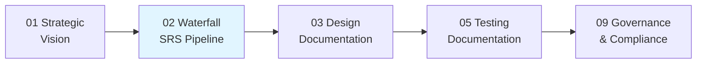
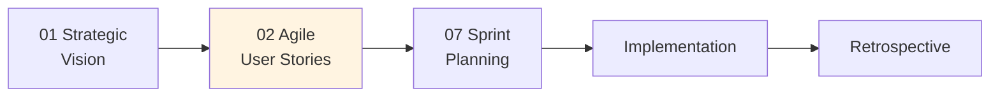

# SDLC-Docs-Engine: Standards-Driven Documentation Across the Software Lifecycle

**SDLC-Docs-Engine** (formerly SRS-Skills) is a modular, AI-driven toolkit for generating **comprehensive, standards-compliant documentation** across all phases of software development. It supports **Waterfall, Agile, and Hybrid methodologies**, providing IEEE/ISO-aligned documentation from strategic vision to deployment operations.

## 🌟 What's New in v3.0

- **Multi-Methodology Support**: Choose Waterfall (IEEE 830 SRS) or Agile (User Stories) pipelines
- **Expanded Scope**: Beyond SRS—now supports PRDs, HLD/LLD, API docs, test plans, deployment guides, and more
- **Phase-Based Organization**: 10 SDLC phases from strategic vision to governance/compliance
- **Methodology Detection**: New Phase 00 helps select the right documentation approach
- **Backward Compatible**: Existing Waterfall SRS pipeline preserved (moved to `02-requirements-engineering/waterfall/`)

---

## 📚 Supported Documentation Types

### **Strategic & Vision Documents (Phase 01)**
- **PRD (Product Requirements Document)** - IEEE 29148
- **Vision Statements**
- **Business Cases**

### **Requirements Engineering (Phase 02)**

#### **Waterfall Track:**
- **SRS (Software Requirements Specification)** - IEEE 830-1998, IEEE 1233-1998
- **Use Cases** - UML 2.5 standards
- **Formal Requirements** - Stimulus/response patterns

#### **Agile Track:**
- **User Stories** - INVEST criteria, IEEE 29148-2018
- **User Story Maps** - Jeff Patton methodology
- **Product Backlog** - Sprint-ready with story points

### **Design Documentation (Phase 03)**
- **HLD (High-Level Design)** - IEEE 1016-2009
- **LLD (Low-Level Design)** - IEEE 1016-2009
- **API Specifications** - OpenAPI 3.0, JSON Schema
- **Database Design** - ERDs, schema documentation
- **UI/UX Specifications** - Wireframes, style guides

### **Testing Documentation (Phase 05)**
- **Test Strategy** - IEEE 829
- **Test Plans & Test Cases**
- **Test Reports** - Defect tracking, coverage metrics

### **Deployment & Operations (Phase 06)**
- **Deployment Guides** - Step-by-step procedures
- **Runbooks** - SRE best practices
- **Monitoring Documentation**
- **Infrastructure as Code Docs**

### **Agile Artifacts (Phase 07)**
- **Sprint Planning Documents**
- **Definition of Done (DoD)**
- **Definition of Ready (DoR)**
- **Retrospective Reports**
- **Burndown/Burnup Charts**

### **End-User Documentation (Phase 08)**
- **User Manuals** - ISO 26514
- **Installation Guides**
- **Troubleshooting FAQs**
- **Release Notes**

### **Governance & Compliance (Phase 09)**
- **Requirements Traceability Matrix** - IEEE 1012-2016
- **Audit Reports** - IEEE 1012 V&V
- **Compliance Documentation** - GDPR, HIPAA, SOC2
- **Risk Assessments**

---

## 🛠 Supported Standards

- **IEEE Std 830-1998**: Software Requirements Specifications
- **IEEE Std 1233-1998**: System Requirements Development
- **IEEE Std 610.12-1990**: Software Engineering Terminology
- **IEEE Std 1012-2016**: Verification and Validation
- **IEEE Std 1016-2009**: Software Design Descriptions
- **IEEE Std 29148-2018**: Requirements Engineering
- **IEEE Std 829**: Software Test Documentation
- **ASTM E1340-96**: Rapid Prototyping of Computerized Systems
- **ISO/IEC 15504**: Process Assessment Framework
- **ISO/IEC 25010**: Software Product Quality Model
- **ISO 26514**: User Documentation
- **OpenAPI 3.0**: API Documentation

---

## 🚀 Integration & Workflow

This repository is architected as a **"Stateless Documentation Engine."** It provides the logic and templates, while your parent project provides the context.

### Installation

Add this project as a submodule in your existing repository:

```bash
git submodule add https://github.com/peterbamuhigire/srs-skills.git skills
cd skills
git checkout main
```

### Quick Start

#### **Step 1: Select Your Methodology**

Run the methodology detection skill:

```bash
Run skill: 00-meta-initialization
```

This will:
- Detect your project type (Waterfall, Agile, Hybrid)
- Create `../project_context/methodology.md`
- Generate a documentation roadmap
- Activate appropriate pipelines

#### **Step 2: Choose Your Documentation Path**

**For Waterfall Projects (Traditional SDLC):**



Start with: `02-requirements-engineering/waterfall/01-initialize-srs`

**For Agile Projects (Scrum/Kanban):**



Start with: `02-requirements-engineering/agile/01-user-story-generation`

#### **Step 3: Execute Your Documentation Pipeline**

Each phase builds on the previous:

1. **Initialize context** (seed `../project_context/` with vision, features, tech stack)
2. **Run sequential skills** in your chosen pipeline
3. **Generate outputs** to `../output/` directory
4. **Validate with auditing skills** (Phase 09)

---

## 🗂 Repository Structure

```
sdlc-docs-engine/
├── 00-meta-initialization/          # Methodology selection & project setup
├── 01-strategic-vision/             # PRD, vision statements, business cases
├── 02-requirements-engineering/
│   ├── waterfall/                   # IEEE 830 SRS pipeline (8 phases)
│   │   ├── 01-initialize-srs/
│   │   ├── 02-context-engineering/
│   │   ├── 03-descriptive-modeling/
│   │   ├── 04-interface-specification/
│   │   ├── 05-feature-decomposition/
│   │   ├── 06-logic-modeling/
│   │   ├── 07-attribute-mapping/
│   │   └── 08-semantic-auditing/
│   └── agile/                       # User stories, story mapping, backlog
│       ├── 01-user-story-generation/
│       ├── 02-acceptance-criteria/
│       ├── 03-story-mapping/
│       └── 04-backlog-prioritization/
├── 03-design-documentation/         # HLD, LLD, API specs, database design
├── 04-development-artifacts/        # Technical specs, code documentation
├── 05-testing-documentation/        # Test strategy, plans, cases, reports
├── 06-deployment-operations/        # Deployment guides, runbooks, IaC docs
├── 07-agile-artifacts/              # Sprint planning, DoD, DoR, retrospectives
├── 08-end-user-documentation/       # User manuals, installation guides, FAQs
├── 09-governance-compliance/        # Traceability, audits, compliance docs
└── skills/                          # Domain-specific patterns & utilities
    ├── multi-tenant-saas-architecture/
    ├── feature-planning/
    ├── doc-architect/
    ├── mysql-best-practices/
    ├── webapp-gui-design/
    └── [25+ additional skills]
```

---

## 📋 Documentation Pipelines

### Waterfall SRS Pipeline (Phase 02)

**Best for:** Regulated industries, fixed-scope projects, safety-critical systems

**Generates:** Complete IEEE 830-compliant SRS with 8 sections

**Phases:**
1. Initialize context templates
2. Generate Section 1.0 (Introduction)
3. Generate Section 2.0 (Overall Description)
4. Generate Section 3.1 (External Interfaces)
5. Generate Section 3.2 (Functional Requirements)
6. Generate Section 3.2.x (Logic & Algorithms)
7. Generate Sections 3.3-3.6 (Non-Functional Requirements)
8. Validate & generate Traceability Matrix

**Output:** `../output/SRS_Draft.md`, `Traceability_Matrix.md`, `Audit_Report.md`

👉 **[Start Waterfall SRS Pipeline](02-requirements-engineering/waterfall/README.md)**

---

### Agile User Story Pipeline (Phase 02)

**Best for:** Startups, MVPs, iterative projects, Scrum/Kanban teams

**Generates:** INVEST-compliant user stories with acceptance criteria

**Phases:**
1. Generate user stories from features
2. Refine acceptance criteria (Given-When-Then)
3. Create story map visualization
4. Prioritize backlog (MoSCoW/WSJF)

**Output:** `../output/user_stories.md`, `story_map.mmd`, `backlog_summary.md`

👉 **[Start Agile User Story Pipeline](02-requirements-engineering/agile/README.md)**

---

## 🤖 AI-Assisted Development Skills (New in v3.1)

**Purpose:** Skills that make Claude Code better at helping you develop software by enforcing patterns, preventing errors, and optimizing workflows.

### Core AI Development Skills

#### 1. **ai-assisted-development** - Multi-Agent Orchestration
**Use when:** Coordinating multiple AI agents (Planning, Coding, Testing, Review)

**Provides:**
- 5 orchestration strategies (Sequential, Parallel, Conditional, Looping, Retry)
- 3 AI-specific patterns (Agent Handoff, Fan-Out/Fan-In, Human-in-the-Loop)
- Real-world examples from MADUUKA and BRIGHTSOMA projects
- 30-75% faster development through parallelization

👉 **[Learn AI Agent Orchestration](skills/ai-assisted-development/SKILL.md)**

---

#### 2. **ai-error-prevention** - Trust But Verify Workflow
**Use when:** Working with Claude to generate code (always!)

**Provides:**
- 7 prevention strategies to catch Claude's mistakes early
- Common failure modes: Hallucination, Incomplete Solutions, Misunderstanding, Lazy Solutions
- App-specific checklists (MADUUKA, MEDIC8, BRIGHTSOMA, DDA, CROWNPOINT)
- **Saves 50-75% of wasted tokens** through early error detection

👉 **[Learn Error Prevention](skills/ai-error-prevention/SKILL.md)**

---

#### 3. **orchestration-best-practices** - The 10 Commandments
**Use when:** Generating multi-step workflows or complex processes

**Provides:**
- The 10 orchestration rules (steps, dependencies, validation, error handling)
- Complete code examples (good vs bad patterns)
- Verification checklist
- Anti-patterns guide

👉 **[Learn Orchestration Rules](skills/orchestration-best-practices/SKILL.md)**

---

#### 4. **ai-error-handling** - 5-Layer Validation Stack
**Use when:** Validating AI-generated code before production

**Provides:**
- 5 validation layers: Syntax, Requirements, Testing, Security, Documentation
- Quality scoring system (0-100, threshold >= 80)
- Validation loop with max 3 iterations
- Automated recovery strategies

👉 **[Learn Validation Stack](skills/ai-error-handling/SKILL.md)**

---

### Reference Guides

#### **prompting-patterns-reference.md**
10 essential patterns for better AI instructions
- Reduces clarification questions by 50%
- Improves first-time-right code by 60%
- Patterns: Clear Task+Context+Constraints, Chain-of-Thought, Few-Shot Learning, etc.

#### **orchestration-patterns-reference.md**
Comprehensive guide for coordinating multiple agents/tasks
- 5 orchestration types with examples
- 4 core patterns (Map-Reduce, Pipeline, Fan-Out/Fan-In, Circuit Breaker)
- Decision trees and performance analysis

#### **encoding-patterns-into-skills.md**
How to create skills that automatically enforce patterns
- Formula: Rules + Examples + Checklists + Decision Trees
- Pattern encoding templates
- Skill iteration strategies

---

### How AI Skills Work Together

```
REQUEST PREPARATION (ai-error-prevention)
├─ Use prompting patterns (prompting-patterns-reference)
├─ Break into small steps
└─ Clear task + context + constraints

CLAUDE GENERATES CODE

IMMEDIATE VERIFICATION (ai-error-prevention)
├─ Verification-First strategy
├─ Test-Driven Validation
└─ Specification Matching

STRUCTURE CHECK (orchestration-best-practices)
├─ Steps clearly defined?
├─ Dependencies identified?
└─ Error handling present?

VALIDATION (ai-error-handling)
├─ 5-layer validation stack
└─ Quality threshold check (>= 80/100)

ACCEPTANCE OR ITERATION
└─ All checks passed? → USE CODE ✓
```

**Result:** Production-ready code, 50-75% fewer wasted tokens, higher quality output

---

## ✅ Methodology Selection Guide

### When to Use Waterfall SRS Pipeline

✅ **YES for:**
- Regulated industries (FDA, FAA, DOD, medical devices)
- Fixed-scope, fixed-price contracts
- Safety-critical systems (aerospace, automotive)
- Projects requiring IEEE 830/1233 compliance
- Formal verification & validation (IEEE 1012)

❌ **NO for:**
- Agile/Scrum projects with evolving requirements
- MVPs with high uncertainty
- Startups needing rapid iteration

### When to Use Agile User Story Pipeline

✅ **YES for:**
- Scrum, Kanban, XP projects
- Startups with evolving requirements
- MVPs and rapid prototypes
- Continuous stakeholder collaboration
- Projects with flexible scope

❌ **NO for:**
- Regulated industries requiring comprehensive SRS
- Fixed-scope contracts with formal signoffs
- Safety-critical systems

### Hybrid Approach

You can **mix methodologies**:

**Example 1:** Use Waterfall SRS for backend (regulated) + Agile User Stories for frontend (rapid iteration)

**Example 2:** Use Waterfall for core platform + Agile for new feature experiments

---

## 🔁 Iterative Development & Re-running Phases

**Idempotency Rule:** Most skills are designed to be re-runnable.

### When Context Changes

| Changed File | Re-run Phases | Reason |
|--------------|---------------|--------|
| `vision.md` | 02 (Context/Stories), 09 (Audit) | Vision affects all downstream docs |
| `features.md` | 02 (Requirements), 03 (Design) | New features → new requirements |
| `tech_stack.md` | 03 (Design), 04 (Interfaces) | Tech stack changes affect architecture |
| `business_rules.md` | 06 (Logic Modeling) | Business rules map to algorithms |
| `quality_standards.md` | 07 (NFRs), 05 (Testing) | Quality targets define test criteria |

### Maintenance Mode

When re-running skills on existing documentation:

1. **Phase 01** has `--maintenance` flag to add missing templates without overwriting
2. **Phases 02-08** will prompt before overwriting: `[APPEND]`, `[PATCH]`, or `[OVERWRITE]`
3. **Always re-run Phase 09** (Audit) after any changes to validate consistency

---

## 🧠 Design Philosophy

- **Parent-Root Targeting:** Skills execute within the submodule but operate on `../project_context/` and `../output/`
- **Standards-Driven Prompts:** Every skill maps to specific IEEE/ISO clauses
- **Engineering over Authorship:** Requirements use stimulus-response patterns and logic modeling for verifiability
- **Methodology-Agnostic Core:** Choose Waterfall, Agile, or Hybrid based on project needs
- **Submodule Portability:** The engine is stateless; project-specific data never commits to this submodule
- **Token Efficiency:** 500-line hard limit on all `.md` files ensures AI comprehension and cost efficiency

---

## 📖 Supporting Documentation

- **[CLAUDE.md](CLAUDE.md)**: AI assistant SOP with V&V procedures, skill usage guidelines
- **[DEPENDENCIES.md](DEPENDENCIES.md)**: Runtime requirements (Python 3.10+, libraries, environment variables)
- **[docs/CHANGELOG.md](docs/CHANGELOG.md)**: Version history, standards updates, migration notes
- **[skill_overview.md](skill_overview.md)**: Input-to-output registry for each skill
- **[PROJECT_BRIEF.md](PROJECT_BRIEF.md)**: Quick overview for new users
- **[ARCHITECTURE.md](ARCHITECTURE.md)**: Technical architecture and design decisions

---

## 🎯 Example Workflows

### Workflow 1: Waterfall Medical Device SRS

```bash
# Step 1: Initialize
Run skill: 02-requirements-engineering/waterfall/01-initialize-srs

# Step 2: Populate context files (manually)
Edit ../project_context/vision.md
Edit ../project_context/features.md
Edit ../project_context/tech_stack.md
Edit ../project_context/business_rules.md
Edit ../project_context/quality_standards.md
Edit ../project_context/glossary.md

# Step 3: Generate SRS sections sequentially
Run skill: 02-requirements-engineering/waterfall/02-context-engineering
Run skill: 02-requirements-engineering/waterfall/03-descriptive-modeling
Run skill: 02-requirements-engineering/waterfall/04-interface-specification
Run skill: 02-requirements-engineering/waterfall/05-feature-decomposition
Run skill: 02-requirements-engineering/waterfall/06-logic-modeling
Run skill: 02-requirements-engineering/waterfall/07-attribute-mapping
Run skill: 02-requirements-engineering/waterfall/08-semantic-auditing

# Output: ../output/SRS_Draft.md (IEEE 830 compliant)
```

### Workflow 2: Agile E-commerce Startup

```bash
# Step 1: Create PRD and vision
Run skill: 01-strategic-vision/01-prd-generation

# Step 2: Generate user stories
Run skill: 02-requirements-engineering/agile/01-user-story-generation

# Step 3: Create story map
Run skill: 02-requirements-engineering/agile/03-story-mapping

# Step 4: Sprint planning
Run skill: 07-agile-artifacts/01-sprint-planning

# Output: ../output/user_stories.md, story_map.mmd, sprint_1_backlog.md
```

### Workflow 3: Hybrid SaaS Platform

```bash
# Backend (Regulated, needs formal SRS)
Run skill: 02-requirements-engineering/waterfall/ (full pipeline)

# Frontend (Agile, rapid iteration)
Run skill: 02-requirements-engineering/agile/01-user-story-generation

# Shared Design Documentation
Run skill: 03-design-documentation/01-high-level-design

# Output: SRS for backend, User Stories for frontend, Unified HLD
```

---

## 🔧 Domain-Specific Skills

The `skills/` directory contains **25+ reusable domain patterns** that integrate with documentation phases:

### Architecture Skills
- **multi-tenant-saas-architecture**: Backend isolation, tenant management
- **modular-saas-architecture**: Microservices patterns

### Database Skills
- **mysql-best-practices**: **MANDATORY for all database work** - Schema design, migrations, multi-tenant isolation

### Security Skills
- **dual-auth-rbac**: Session + JWT authentication, role-based access control
- **vibe-security-skill**: **MANDATORY for web apps** - OWASP Top 10, secure coding

### UI/UX Skills
- **webapp-gui-design**: Web app UI patterns, responsive design
- **pos-sales-ui-design**: Point-of-sale UI standards

### Process Skills
- **feature-planning**: Complete feature planning from spec to implementation
- **doc-architect**: Generate Triple-Layer AGENTS.md documentation

### Technology Skills
- **gis-mapping**: OpenStreetMap integration, geofencing
- **report-print-pdf**: PDF generation, auto-print workflows
- **api-error-handling**: Standardized error responses

**Usage:** Load domain skills alongside phase skills for specialized guidance.

Example:
```bash
# Use multi-tenant skill with HLD generation
Run skill: 03-design-documentation/01-high-level-design
+ Reference: skills/multi-tenant-saas-architecture/
```

---

## 🚨 Critical Rules

### Database Work (MANDATORY)

**All database-related work MUST use `skills/mysql-best-practices/`**

This includes:
- Database migrations (tables, columns, indexes)
- Schema design and modifications
- Stored procedures, triggers, views
- Query optimization
- Multi-tenant isolation patterns

**Failure to follow the migration checklist causes production failures.**

### Documentation Standards (MANDATORY)

**All `.md` files MUST follow strict formatting:**

- **500-line hard limit** - No exceptions
- **Two-tier structure** - High-level TOC + Deep dive docs
- **Smart subdirectory grouping** - Logical organization

See `skills/doc-standards.md` for complete requirements.

### Security Baseline (MANDATORY for Web Apps)

**All web application work MUST apply `skills/vibe-security-skill/`**

Security principles are non-negotiable:
- Input validation and sanitization
- Authentication and authorization
- OWASP Top 10 protection
- Secure data handling

---

## 📊 Verification & Validation (V&V)

### IEEE 1012 Evaluation Framework

Every generated document undergoes V&V:

- **Correctness:** Confirms alignment with stakeholder intent
- **Consistency:** Ensures uniform terminology and logic
- **Completeness:** Verifies all edge cases are covered
- **Verifiability:** Confirms deterministic test criteria exist

### Audit Execution (Phase 09)

Phase 09 skills perform:

1. **Traceability Verification:** Every requirement links to business goals
2. **Logic Scrutiny:** Validates all formulas and algorithms
3. **Conflict Resolution:** Identifies contradictions between sections
4. **Standards Compliance:** Checks IEEE/ISO conformance

**Output:** `Audit_Report.md`, `Traceability_Matrix.md`

---

## 🔄 Migration from v2.x

**Existing users:** The original 8-phase SRS pipeline has been moved to `02-requirements-engineering/waterfall/`.

### Update Your Workflows

```bash
# Old path (deprecated)
01-initialize-srs/

# New path
02-requirements-engineering/waterfall/01-initialize-srs/
```

### Backward Compatibility

Legacy entry points still work but will show deprecation notices:

```markdown
# 01-initialize-srs (DEPRECATED)
Use: 02-requirements-engineering/waterfall/01-initialize-srs
```

See `docs/MIGRATION_V2_TO_V3.md` for complete migration guide.

---

## 📈 Roadmap

### v3.0.0 (Current - 2026-02-07)
- ✅ Multi-methodology support (Waterfall + Agile)
- ✅ Reorganized phase structure (00-09)
- ✅ Agile user story generation skill
- ✅ Updated documentation and migration guides

### v3.1.0 (Planned - Q1 2026)
- ⏳ Design documentation skills (HLD, LLD, API specs)
- ⏳ Testing documentation skills (test plans, test cases)
- ⏳ Agile story mapping and backlog prioritization

### v3.2.0 (Planned - Q2 2026)
- ⏳ Deployment & operations skills (runbooks, IaC docs)
- ⏳ End-user documentation skills (manuals, FAQs)
- ⏳ Compliance documentation (GDPR, HIPAA, SOC2)

### v4.0.0 (Planned - Q3 2026)
- ⏳ Automated doc generation from code (API docs, schema docs)
- ⏳ Integration with CI/CD pipelines
- ⏳ Multi-language support (docs in Spanish, French, etc.)

---

## 🤝 Contributing

We welcome contributions! To add or improve skills:

1. Review existing skills for format and structure
2. Follow the `skills/skill-writing/` meta-skill guidelines
3. Ensure 500-line limit and two-tier documentation structure
4. Add examples and anti-patterns
5. Update `README.md` and `PROJECT_BRIEF.md`
6. Submit PR with clear description

See `skills/claude-guides/skill-creation-workflow.md` for detailed workflow.

---

## 📄 License

This project is licensed under the MIT License. See `LICENSE.txt` for details.

---

## 💬 Support

- **Issues:** https://github.com/peterbamuhigire/srs-skills/issues
- **Discussions:** https://github.com/peterbamuhigire/srs-skills/discussions
- **Documentation:** See `CLAUDE.md` for AI assistant guidance

---

## 🙏 Acknowledgments

This project builds on industry standards:

- **IEEE Computer Society** for SRS and V&V standards
- **Agile Alliance** for user story best practices
- **Bill Wake** for INVEST criteria
- **Jeff Patton** for story mapping methodology
- **ISO/IEC** for quality and process standards

---

**Built with precision. Powered by standards. Designed for portability.**

**Maintained by:** Peter Bamuhigire
**Version:** 3.0.0
**Last Updated:** 2026-02-07

---

## Quick Reference

| Task | Command | Output |
|------|---------|--------|
| **Waterfall SRS** | `02-requirements-engineering/waterfall/01-initialize-srs` | IEEE 830 SRS |
| **Agile User Stories** | `02-requirements-engineering/agile/01-user-story-generation` | User story backlog |
| **Methodology Selection** | `00-meta-initialization` | Documentation roadmap |
| **Design Docs** | `03-design-documentation/01-high-level-design` | HLD, architecture diagrams |
| **Traceability** | `09-governance-compliance/01-traceability-matrix` | RTM, audit report |
