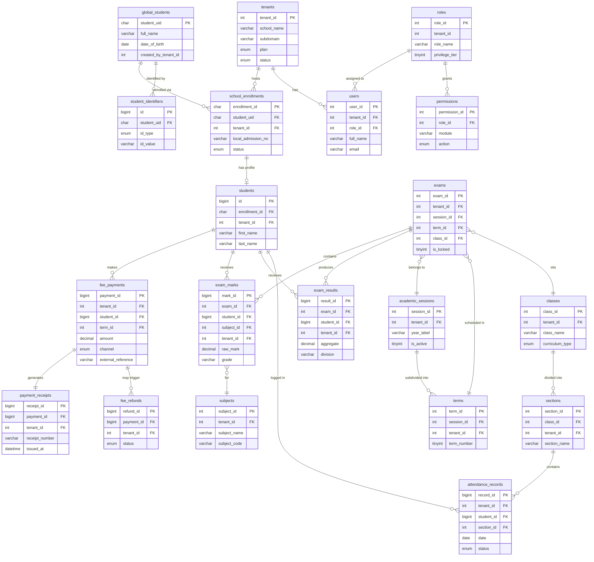
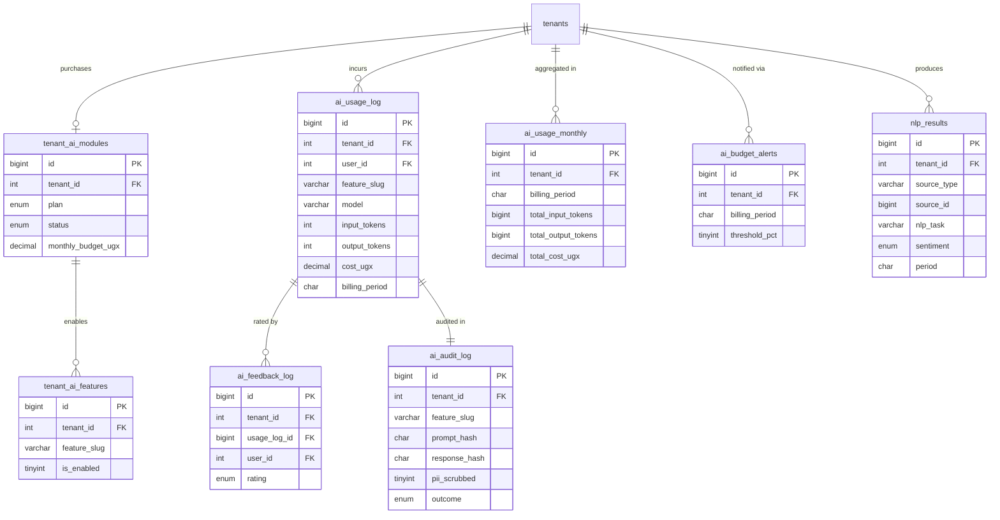

# Entity-Relationship Diagram — Academia Pro Database Design (Phase 1)

**Document ID:** DD-04-01
**Project:** Academia Pro
**Author:** Chwezi Core Systems
**Date:** 2026-03-28
**Version:** 1.0
**Status:** Draft — Pending Consultant Review

---

## 1. Introduction

This document defines the Phase 1 logical and physical data model for Academia Pro, a multi-tenant Software as a Service (SaaS) school management platform targeting Uganda schools with pan-Africa expansion. The database engine is MySQL 8.x InnoDB with `utf8mb4` charset and strict mode enabled.

### 1.1 Scope

Phase 1 covers 7 functional layers; Layer 8 (AI Module) is introduced at Phase 2 when the AI add-on becomes available:

1. **Platform Layer** — tenant registry and global student identity
2. **Auth and Role-Based Access Control (RBAC) Layer** — users, roles, permissions
3. **Student Profile Layer** — tenant-scoped student records and guardian links
4. **Academics Layer** — sessions, terms, classes, sections, subjects, timetable
5. **Fees Layer** — fee structures, assignments, payments, receipts, refunds
6. **Attendance Layer** — daily student attendance records
7. **Examinations Layer** — exams, marks, results, report cards
8. **AI Module Layer** — tenant AI subscriptions, feature gates, token ledger, usage metering, NLP results, audit log

Phase 2+ table stubs are listed in Section 8 without full definitions.

### 1.2 Architectural Constraints

- **Row-level multi-tenancy:** every tenant-scoped table carries a `tenant_id INT UNSIGNED NOT NULL` column. The Repository base class appends `WHERE tenant_id = ?` to every query using the `tenant_id` claim extracted from the authenticated JSON Web Token (JWT). No query executes without this filter (BR-MT-001).
- **Global identity isolation:** `global_students` and `student_identifiers` carry no `tenant_id`. Access is governed at the service layer (BR-MT-002).
- **Globally unique keys:** all cross-tenant identifiers use UUID v4 (`CHAR(36)`). Surrogate primary keys within a tenant scope use `INT UNSIGNED` or `BIGINT UNSIGNED` AUTO_INCREMENT.
- **Soft deletes:** `global_students` uses a `deleted_at` DATETIME column; hard deletes are prohibited for student records (BR-DP-002).
- **Immutable receipts:** `payment_receipts` has no `DELETE` permission at the application layer (BR-FEE-004).
- **Password storage:** all `password_hash` columns store bcrypt hashes; plaintext passwords are never persisted.

---

## 2. Legend

### 2.1 Naming Conventions

| Pattern | Meaning |
|---|---|
| `table_name` | Snake case, plural nouns |
| `column_name` | Snake case, singular descriptors |
| `_id` suffix | Surrogate integer primary key or foreign key |
| `_uid` suffix | UUID v4 (`CHAR(36)`) globally unique key |
| `_at` suffix | DATETIME timestamp column |
| `is_` prefix | Boolean flag (`TINYINT(1)`, 0 or 1) |
| `_json` suffix | JSON blob column |

### 2.2 Data Type Shorthand

| Shorthand | MySQL Type | Notes |
|---|---|---|
| `PK` | PRIMARY KEY | Auto-increment or UUID |
| `FK` | FOREIGN KEY | Enforced via InnoDB constraint |
| `UK` | UNIQUE KEY | Single-column or composite |
| `CHAR(36)` | UUID storage | UUID v4 format |
| `TINYINT(1)` | Boolean | 0 = false, 1 = true |
| `DECIMAL(12,2)` | Money | UGX fee amounts |
| `DECIMAL(6,2)` | Marks | Raw exam scores |
| `DATETIME` | Timestamp | UTC stored, displayed in tenant timezone |

### 2.3 Constraint Notation

- `NOT NULL` — column is mandatory; application layer validation duplicates this constraint.
- `DEFAULT` — database-level default; application may override before INSERT.
- `UNIQUE(a, b)` — composite unique index; documented inline per table.
- `ON DELETE RESTRICT` — the default for all foreign keys unless explicitly stated otherwise; orphan prevention is mandatory.

---

## 3. Architecture Diagram

The Mermaid diagram below covers the 5 most critical relationship clusters in Phase 1. All 20 entities shown represent the structural backbone; supporting columns are omitted for readability. Full column definitions are in Section 4.

---

## 4. Full Table Definitions

### 4.1 Platform Layer

#### 4.1.1 `tenants`

No `tenant_id` self-reference. This is the root of the multi-tenancy hierarchy.

| Column | Type | Constraints | Description |
|---|---|---|---|
| `tenant_id` | INT UNSIGNED | PK, AUTO_INCREMENT | Surrogate identifier for the school organisation |
| `school_name` | VARCHAR(200) | NOT NULL | Official school name as registered |
| `subdomain` | VARCHAR(100) | NOT NULL, UNIQUE | Subdomain slug (e.g., `stmary`) for `stmary.academiapro.ug` |
| `plan` | ENUM('starter','growth','pro') | NOT NULL, DEFAULT 'starter' | Subscription plan tier |
| `status` | ENUM('active','suspended','trial') | NOT NULL, DEFAULT 'trial' | Lifecycle state; 'suspended' blocks all logins |
| `country_code` | CHAR(2) | DEFAULT 'UG' | ISO 3166-1 alpha-2 country code |
| `currency` | CHAR(3) | DEFAULT 'UGX' | ISO 4217 currency code for fee display |
| `timezone` | VARCHAR(50) | DEFAULT 'Africa/Kampala' | IANA timezone identifier for date/time rendering |
| `settings_json` | JSON | NULL | School logo URL, branding colours, SMS sender ID, email config |
| `created_at` | DATETIME | NOT NULL | Record creation timestamp (UTC) |
| `updated_at` | DATETIME | NOT NULL | Last modification timestamp (UTC) |

#### 4.1.2 `global_students`

Platform-wide. No `tenant_id`. Identity owned by `created_by_tenant_id`; other schools may read but not alter (BR-STU-003).

| Column | Type | Constraints | Description |
|---|---|---|---|
| `student_uid` | CHAR(36) | PK | UUID v4; globally unique lifetime identifier (BR-STU-001) |
| `full_name` | VARCHAR(150) | NOT NULL | Legal full name at time of first admission |
| `date_of_birth` | DATE | NULL | Required for NIN/LIN verification; nullable until confirmed |
| `gender` | ENUM('M','F','Other') | NULL | Biological gender; 'Other' for non-binary and unspecified |
| `photo_url` | VARCHAR(500) | NULL | AWS S3 object URL to student passport photo |
| `created_by_tenant_id` | INT UNSIGNED | NULL, FK → tenants | School that first created this global record |
| `deleted_at` | DATETIME | NULL | Soft-delete timestamp; NULL = record is active (BR-DP-002) |
| `created_at` | DATETIME | NOT NULL | Record creation timestamp (UTC) |
| `updated_at` | DATETIME | NOT NULL | Last modification timestamp (UTC) |

#### 4.1.3 `student_identifiers`

Platform-wide. Stores all government-issued and contact identifiers per student. Enforces global uniqueness per `(id_type, id_value)` to prevent duplicate registration.

| Column | Type | Constraints | Description |
|---|---|---|---|
| `id` | BIGINT | PK, AUTO_INCREMENT | Surrogate row key |
| `student_uid` | CHAR(36) | NOT NULL, FK → global_students | Parent global student record |
| `id_type` | ENUM('nin','lin','phone','email','passport','birth_cert') | NOT NULL | Identifier category |
| `id_value` | VARCHAR(200) | NOT NULL | The identifier string (e.g., NIN value, phone number) |
| `verified` | TINYINT(1) | NOT NULL, DEFAULT 0 | 1 = verified against NIRA/NEMIS; 0 = self-declared |

**Composite unique constraint:** `UNIQUE(id_type, id_value)` — prevents two students sharing the same NIN or LIN.

#### 4.1.4 `school_enrollments`

Cross-tenant bridge. The `tenant_id` column acts as a foreign key to `tenants` but does not trigger row-level isolation (no Repository filter on this table — access is controlled at service layer). Enforces the rule that one student cannot have two active enrollments at two schools simultaneously (BR-STU-004).

| Column | Type | Constraints | Description |
|---|---|---|---|
| `enrollment_id` | CHAR(36) | PK | UUID v4; globally unique enrollment record |
| `student_uid` | CHAR(36) | NOT NULL, FK → global_students | Global student identity reference |
| `tenant_id` | INT UNSIGNED | NOT NULL, FK → tenants | School that owns this enrollment |
| `local_admission_no` | VARCHAR(50) | NULL | School's internal admission number |
| `local_name_override` | VARCHAR(150) | NULL | Optional name variant used by this school (e.g., preferred name) |
| `admission_date` | DATE | NOT NULL | Date student was formally admitted to this school |
| `leaving_date` | DATE | NULL | Date student left; NULL = still enrolled |
| `status` | ENUM('active','left','transferred','completed','suspended') | NOT NULL, DEFAULT 'active' | Current enrollment state |
| `class_id` | INT UNSIGNED | NULL, FK → classes | Current class at time of enrollment |
| `section_id` | INT UNSIGNED | NULL, FK → sections | Current section assignment |
| `academic_session_id` | INT UNSIGNED | NULL, FK → academic_sessions | Academic year of this enrollment record |
| `previous_school` | VARCHAR(200) | NULL | Name of school last attended before joining |
| `previous_class` | VARCHAR(100) | NULL | Class completed at previous school |

**Composite unique constraint:** `UNIQUE(student_uid, tenant_id, academic_session_id)` — one enrollment record per student per school per academic year.

---

### 4.2 Auth and RBAC Layer

#### 4.2.1 `roles`

`tenant_id = 0` designates platform-built-in roles (Super Admin, School Owner, Head Teacher, Class Teacher, Bursar, Parent, Student). Schools may define custom roles with `tenant_id` set to their own ID.

| Column | Type | Constraints | Description |
|---|---|---|---|
| `role_id` | INT UNSIGNED | PK, AUTO_INCREMENT | Surrogate role identifier |
| `tenant_id` | INT UNSIGNED | NOT NULL, DEFAULT 0 | 0 = platform-wide; >0 = tenant-specific custom role |
| `role_name` | VARCHAR(100) | NOT NULL | Display name (e.g., 'Class Teacher', 'Bursar') |
| `is_system` | TINYINT(1) | NOT NULL, DEFAULT 0 | 1 = built-in role; cannot be deleted by any user |
| `privilege_tier` | TINYINT UNSIGNED | NOT NULL | 1 = highest (Super Admin); 9 = lowest (Student); governs BR-RBAC-002 |

#### 4.2.2 `users`

All human and service account principals. A user belongs to exactly one tenant. A person operating at multiple schools holds separate `user_id` records per school (BR-RBAC-001).

| Column | Type | Constraints | Description |
|---|---|---|---|
| `user_id` | INT UNSIGNED | PK, AUTO_INCREMENT | Surrogate user identifier |
| `tenant_id` | INT UNSIGNED | NOT NULL, FK → tenants | School this account belongs to |
| `role_id` | INT UNSIGNED | NOT NULL, FK → roles | Role governing permissions for this account |
| `full_name` | VARCHAR(150) | NOT NULL | Display name |
| `email` | VARCHAR(200) | UNIQUE, NULL | Login email; NULL for accounts using phone-only login |
| `phone` | VARCHAR(20) | NULL | Mobile number for SMS OTP and Africa's Talking integration |
| `password_hash` | VARCHAR(255) | NOT NULL | bcrypt hash (cost factor ≥ 12); never store plaintext |
| `status` | ENUM('active','inactive','suspended') | NOT NULL, DEFAULT 'active' | 'suspended' blocks JWT issuance |
| `last_login` | DATETIME | NULL | Timestamp of most recent successful authentication |
| `created_at` | DATETIME | NOT NULL | Record creation timestamp (UTC) |
| `updated_at` | DATETIME | NOT NULL | Last modification timestamp (UTC) |

#### 4.2.3 `permissions`

Granular module-action grants per role. The permission matrix is built at seed time for system roles and is editable by School Owner for custom roles (BR-RBAC-003).

| Column | Type | Constraints | Description |
|---|---|---|---|
| `permission_id` | INT UNSIGNED | PK, AUTO_INCREMENT | Surrogate permission record key |
| `role_id` | INT UNSIGNED | NOT NULL, FK → roles | Role receiving this grant |
| `module` | VARCHAR(100) | NOT NULL | System module name (e.g., `fees`, `attendance`, `exam_marks`) |
| `action` | ENUM('view','create','edit','delete','approve','export') | NOT NULL | Permitted action within the module |

**Composite unique constraint:** `UNIQUE(role_id, module, action)` — prevents duplicate grants for the same role-module-action triplet.

---

### 4.3 Student Profile Layer

#### 4.3.1 `students`

Tenant-scoped profile record that supplements `global_students` with school-specific demographic, classification, and Uganda-specific fields. Linked to the enrollment record rather than directly to `global_students` to enforce the one-enrollment-per-academic-year constraint.

| Column | Type | Constraints | Description |
|---|---|---|---|
| `id` | BIGINT UNSIGNED | PK, AUTO_INCREMENT | Tenant-scoped surrogate key |
| `enrollment_id` | CHAR(36) | NOT NULL, FK → school_enrollments | Parent enrollment record |
| `tenant_id` | INT UNSIGNED | NOT NULL, FK → tenants | Row-level isolation key |
| `first_name` | VARCHAR(100) | NULL | Given name as used by the school |
| `last_name` | VARCHAR(100) | NULL | Family name as used by the school |
| `middle_name` | VARCHAR(100) | NULL | Middle name or additional given name |
| `date_of_birth` | DATE | NULL | May differ from `global_students.date_of_birth` if school data is more accurate |
| `gender` | ENUM('M','F') | NULL | Binary gender for EMIS/UNEB reporting |
| `nationality` | ENUM('Ugandan','Foreign','Refugee') | NULL | Required for EMIS export |
| `nin` | VARCHAR(20) | NULL | Synced from `student_identifiers`; cached here for query performance |
| `lin` | VARCHAR(20) | NULL | Synced from `student_identifiers`; cached here for query performance |
| `emis_number` | VARCHAR(30) | NULL | MoES EMIS unique number assigned by government |
| `district_of_birth` | VARCHAR(100) | NULL | Uganda district; required for EMIS reporting |
| `district_of_residence` | VARCHAR(100) | NULL | Current residential district |
| `sub_county` | VARCHAR(100) | NULL | Sub-county of residence |
| `category` | ENUM('day','boarder','special_needs') | NULL | Boarding status and needs classification |
| `house` | VARCHAR(100) | NULL | Boarding house or school house name |
| `orphan_status` | ENUM('both_parents','single_parent','orphan') | NULL | Welfare classification for government reporting |
| `previous_school` | VARCHAR(200) | NULL | Denormalised copy from `school_enrollments` for quick access |
| `previous_class` | VARCHAR(100) | NULL | Denormalised copy from `school_enrollments` for quick access |
| `status` | ENUM('active','inactive','left','graduated') | NOT NULL, DEFAULT 'active' | Current student status at this school |
| `admission_date` | DATE | NULL | Date of admission to this school |
| `leaving_date` | DATE | NULL | Date of departure; NULL = still enrolled |
| `photo_url` | VARCHAR(500) | NULL | School-specific photo override; falls back to `global_students.photo_url` |
| `created_at` | DATETIME | NOT NULL | Record creation timestamp (UTC) |
| `updated_at` | DATETIME | NOT NULL | Last modification timestamp (UTC) |

#### 4.3.2 `student_guardians`

Multiple guardians per student are supported. Exactly one should have `is_primary = 1`. The `is_payment_contact` flag controls who receives fee receipts and reminders (BR-FEE-006).

| Column | Type | Constraints | Description |
|---|---|---|---|
| `id` | BIGINT UNSIGNED | PK, AUTO_INCREMENT | Surrogate key |
| `student_id` | BIGINT UNSIGNED | NOT NULL, FK → students | Parent student profile |
| `tenant_id` | INT UNSIGNED | NOT NULL | Row-level isolation key |
| `guardian_name` | VARCHAR(150) | NOT NULL | Full name of guardian |
| `relation` | VARCHAR(50) | NULL | Relationship (e.g., 'Father', 'Mother', 'Aunt', 'Sponsor') |
| `phone` | VARCHAR(20) | NULL | Primary contact number; used for SMS alerts |
| `email` | VARCHAR(200) | NULL | Email for digital receipt and report card delivery |
| `nin` | VARCHAR(20) | NULL | Guardian NIN for identity verification |
| `is_primary` | TINYINT(1) | NOT NULL, DEFAULT 0 | 1 = primary contact for communications |
| `is_payment_contact` | TINYINT(1) | NOT NULL, DEFAULT 0 | 1 = receives fee receipts and payment reminders |

#### 4.3.3 `user_student_links`

Links authenticated parent users to their enrolled children within a school. Enables the parent portal to display the correct student records. `verified = 1` is required before the parent can view fee statements or report cards.

| Column | Type | Constraints | Description |
|---|---|---|---|
| `id` | BIGINT UNSIGNED | PK, AUTO_INCREMENT | Surrogate key |
| `user_id` | INT UNSIGNED | NOT NULL, FK → users | Parent user account |
| `student_id` | BIGINT UNSIGNED | NOT NULL, FK → students | Child's tenant-scoped student record |
| `tenant_id` | INT UNSIGNED | NOT NULL | Row-level isolation key |
| `verified` | TINYINT(1) | NOT NULL, DEFAULT 0 | 1 = link confirmed by school administrator |

---

### 4.4 Academics Layer

#### 4.4.1 `academic_sessions`

One session = one academic year. Only one session may have `is_active = 1` per tenant at any time. Enforced by application logic; the database does not enforce this at the constraint level.

| Column | Type | Constraints | Description |
|---|---|---|---|
| `session_id` | INT UNSIGNED | PK, AUTO_INCREMENT | Surrogate key |
| `tenant_id` | INT UNSIGNED | NOT NULL | Row-level isolation key |
| `year_label` | VARCHAR(20) | NOT NULL | Human-readable label (e.g., '2026') |
| `is_active` | TINYINT(1) | NOT NULL, DEFAULT 0 | 1 = current active year for this school |
| `created_at` | DATETIME | NOT NULL | Record creation timestamp (UTC) |

#### 4.4.2 `terms`

Uganda schools operate exactly 3 terms per academic year (BR-CAL-001). `is_active = 1` designates the current billing and attendance term.

| Column | Type | Constraints | Description |
|---|---|---|---|
| `term_id` | INT UNSIGNED | PK, AUTO_INCREMENT | Surrogate key |
| `session_id` | INT UNSIGNED | NOT NULL, FK → academic_sessions | Parent academic year |
| `tenant_id` | INT UNSIGNED | NOT NULL | Row-level isolation key |
| `term_number` | TINYINT | NOT NULL | Ordinal: 1, 2, or 3 |
| `term_label` | VARCHAR(50) | NULL | Display label (e.g., 'Term 1 2026') |
| `start_date` | DATE | NULL | Term opening date |
| `end_date` | DATE | NULL | Term closing date |
| `is_active` | TINYINT(1) | NOT NULL, DEFAULT 0 | 1 = current active term for fee and attendance recording |

#### 4.4.3 `classes`

Represents a curriculum level within a school (e.g., P1, P4, S1, S4, Baby Class). `class_level` provides sort order for report generation. `is_exam_class` and `exam_type` drive UNEB grading logic.

| Column | Type | Constraints | Description |
|---|---|---|---|
| `class_id` | INT UNSIGNED | PK, AUTO_INCREMENT | Surrogate key |
| `tenant_id` | INT UNSIGNED | NOT NULL | Row-level isolation key |
| `class_name` | VARCHAR(100) | NOT NULL | Display name (e.g., 'P1', 'S4', 'Baby Class') |
| `class_level` | TINYINT UNSIGNED | NOT NULL | Numeric sort order; 1 = lowest level |
| `curriculum_type` | ENUM('nursery','thematic','standard_primary','o_level','a_level') | NOT NULL | Determines grading logic and UNEB rules |
| `is_exam_class` | TINYINT(1) | NOT NULL, DEFAULT 0 | 1 = class sits a national UNEB examination |
| `exam_type` | ENUM('none','ple','uce','uace') | NOT NULL, DEFAULT 'none' | Specifies which UNEB grading algorithm applies |

#### 4.4.4 `sections`

Streaming divisions within a class (e.g., P1A, P1B, S4 East). Attendance is recorded at section level.

| Column | Type | Constraints | Description |
|---|---|---|---|
| `section_id` | INT UNSIGNED | PK, AUTO_INCREMENT | Surrogate key |
| `class_id` | INT UNSIGNED | NOT NULL, FK → classes | Parent class |
| `tenant_id` | INT UNSIGNED | NOT NULL | Row-level isolation key |
| `section_name` | VARCHAR(50) | NOT NULL | Display label (e.g., 'A', 'B', 'East', 'West') |

#### 4.4.5 `subjects`

Curriculum subjects offered by the school. `curriculum_type` aligns the subject to the correct grading algorithm. `is_compulsory` drives automatic inclusion in fee structure calculations for subject-based fees.

| Column | Type | Constraints | Description |
|---|---|---|---|
| `subject_id` | INT UNSIGNED | PK, AUTO_INCREMENT | Surrogate key |
| `tenant_id` | INT UNSIGNED | NOT NULL | Row-level isolation key |
| `subject_name` | VARCHAR(150) | NOT NULL | Full subject name (e.g., 'Mathematics', 'Social Studies & R.E') |
| `subject_code` | VARCHAR(20) | NULL | Short code for timetable and report displays |
| `curriculum_type` | ENUM('nursery','thematic','standard_primary','o_level','a_level') | NOT NULL | Determines grading scale applied |
| `is_compulsory` | TINYINT(1) | NOT NULL, DEFAULT 0 | 1 = required for all students at the associated class level |

#### 4.4.6 `class_subject_assignments`

Maps subjects to classes for a specific academic session, and assigns a responsible teacher. A subject may be taught by different teachers in different sessions.

| Column | Type | Constraints | Description |
|---|---|---|---|
| `id` | BIGINT UNSIGNED | PK, AUTO_INCREMENT | Surrogate key |
| `class_id` | INT UNSIGNED | NOT NULL, FK → classes | Class receiving the subject |
| `subject_id` | INT UNSIGNED | NOT NULL, FK → subjects | Subject being assigned |
| `teacher_user_id` | INT UNSIGNED | NOT NULL, FK → users | Teacher responsible for this assignment |
| `tenant_id` | INT UNSIGNED | NOT NULL | Row-level isolation key |
| `session_id` | INT UNSIGNED | NOT NULL, FK → academic_sessions | Academic year of the assignment |

#### 4.4.7 `timetable_slots`

Weekly repeating timetable grid. The composite unique constraint on `(section_id, day_of_week, period_number)` enforces that no section is double-booked for a given period.

| Column | Type | Constraints | Description |
|---|---|---|---|
| `slot_id` | INT UNSIGNED | PK, AUTO_INCREMENT | Surrogate key |
| `section_id` | INT UNSIGNED | NOT NULL, FK → sections | Section for which the slot is defined |
| `subject_id` | INT UNSIGNED | NOT NULL, FK → subjects | Subject taught in this slot |
| `teacher_user_id` | INT UNSIGNED | NOT NULL, FK → users | Teacher delivering this slot |
| `tenant_id` | INT UNSIGNED | NOT NULL | Row-level isolation key |
| `day_of_week` | TINYINT | NOT NULL | 1 = Monday, 6 = Saturday |
| `period_number` | TINYINT | NOT NULL | Sequential period within the school day (1, 2, 3, …) |
| `start_time` | TIME | NOT NULL | Period start time (24-hour format) |
| `end_time` | TIME | NOT NULL | Period end time (24-hour format) |

**Composite unique constraint:** `UNIQUE(section_id, day_of_week, period_number)` — prevents timetable conflicts.

---

### 4.5 Fees Layer

#### 4.5.1 `fee_types`

Catalogue of fee categories offered by the school. Optional fees (transport, lunch, boarding) are only assigned to students who opt in.

| Column | Type | Constraints | Description |
|---|---|---|---|
| `fee_type_id` | INT UNSIGNED | PK, AUTO_INCREMENT | Surrogate key |
| `tenant_id` | INT UNSIGNED | NOT NULL | Row-level isolation key |
| `name` | VARCHAR(150) | NOT NULL | Fee category name (e.g., 'Tuition', 'Boarding', 'Transport') |
| `is_optional` | TINYINT(1) | NOT NULL, DEFAULT 0 | 1 = fee is opt-in; 0 = mandatory for all students in the class |

#### 4.5.2 `fee_structures`

Container record linking a set of fee line items to a class and term. One structure per class per term (BR-FEE-001).

| Column | Type | Constraints | Description |
|---|---|---|---|
| `structure_id` | INT UNSIGNED | PK, AUTO_INCREMENT | Surrogate key |
| `tenant_id` | INT UNSIGNED | NOT NULL | Row-level isolation key |
| `class_id` | INT UNSIGNED | NOT NULL, FK → classes | Class level this structure applies to |
| `term_id` | INT UNSIGNED | NOT NULL, FK → terms | Term this structure applies to |
| `created_at` | DATETIME | NOT NULL | Record creation timestamp (UTC) |

#### 4.5.3 `fee_structure_items`

Individual line amounts within a fee structure. One row per `(structure_id, fee_type_id)` pair.

| Column | Type | Constraints | Description |
|---|---|---|---|
| `item_id` | INT UNSIGNED | PK, AUTO_INCREMENT | Surrogate key |
| `structure_id` | INT UNSIGNED | NOT NULL, FK → fee_structures | Parent structure |
| `fee_type_id` | INT UNSIGNED | NOT NULL, FK → fee_types | Fee category for this line |
| `tenant_id` | INT UNSIGNED | NOT NULL | Row-level isolation key |
| `amount` | DECIMAL(12,2) | NOT NULL | Fee amount in tenant currency (default UGX) |

#### 4.5.4 `fee_assignments`

Per-student fee obligation for a given term. Holds computed `total_due` after discounts. Partial payments reduce the outstanding balance via `fee_payments`; arrears are carried forward in the application layer (BR-FEE-003).

| Column | Type | Constraints | Description |
|---|---|---|---|
| `assignment_id` | BIGINT UNSIGNED | PK, AUTO_INCREMENT | Surrogate key |
| `student_id` | BIGINT UNSIGNED | NOT NULL, FK → students | Student carrying this obligation |
| `structure_id` | INT UNSIGNED | NOT NULL, FK → fee_structures | Fee structure applied |
| `tenant_id` | INT UNSIGNED | NOT NULL | Row-level isolation key |
| `term_id` | INT UNSIGNED | NOT NULL, FK → terms | Term of obligation |
| `total_due` | DECIMAL(12,2) | NOT NULL | Gross amount due before discount |
| `discount_amount` | DECIMAL(12,2) | NOT NULL, DEFAULT 0.00 | Discount applied (scholarship, sibling reduction, etc.) |
| `is_waived` | TINYINT(1) | NOT NULL, DEFAULT 0 | 1 = entire fee obligation waived by school owner |

Net payable: $NetPayable = TotalDue - DiscountAmount$ (when `is_waived = 0`)

#### 4.5.5 `fee_payments`

Every monetary receipt from a student, regardless of channel. `external_reference` with the `UNIQUE` constraint enforces idempotency — the same SchoolPay or MoMo transaction ID cannot be recorded twice (BR-FEE-005).

| Column | Type | Constraints | Description |
|---|---|---|---|
| `payment_id` | BIGINT UNSIGNED | PK, AUTO_INCREMENT | Surrogate key |
| `tenant_id` | INT UNSIGNED | NOT NULL | Row-level isolation key |
| `student_id` | BIGINT UNSIGNED | NOT NULL, FK → students | Student making payment |
| `term_id` | INT UNSIGNED | NOT NULL, FK → terms | Term this payment is allocated to |
| `amount` | DECIMAL(12,2) | NOT NULL | Amount received in tenant currency |
| `channel` | ENUM('cash','bank','schoolpay','momo_mtn','momo_airtel','cheque','other') | NOT NULL | Payment method |
| `external_reference` | VARCHAR(200) | UNIQUE, NULL | SchoolPay or MoMo transaction ID; enforces no-duplicate processing |
| `schoolpay_student_code` | VARCHAR(50) | NULL | SchoolPay-assigned student payment code |
| `recorded_by_user_id` | INT UNSIGNED | NOT NULL, FK → users | Staff member who recorded this payment |
| `source` | ENUM('manual','schoolpay_webhook','schoolpay_poll','momo_webhook') | NOT NULL, DEFAULT 'manual' | Origin of the payment record |
| `created_at` | DATETIME | NOT NULL | Record creation timestamp (UTC); immutable after insert |

#### 4.5.6 `payment_receipts`

One receipt per payment. Sequential numbering per tenant is managed by the application layer at insert time. The `UNIQUE` constraint on `payment_id` prevents duplicate receipt generation. No `DELETE` is permitted at the application layer (BR-FEE-004).

| Column | Type | Constraints | Description |
|---|---|---|---|
| `receipt_id` | BIGINT UNSIGNED | PK, AUTO_INCREMENT | Surrogate key |
| `payment_id` | BIGINT UNSIGNED | NOT NULL, FK → fee_payments, UNIQUE | Parent payment; one receipt per payment |
| `tenant_id` | INT UNSIGNED | NOT NULL | Row-level isolation key |
| `receipt_number` | VARCHAR(50) | NOT NULL | Sequential per-tenant receipt number (e.g., 'RCP-2026-00047'); immutable |
| `issued_at` | DATETIME | NOT NULL | Timestamp of receipt generation (UTC) |

#### 4.5.7 `fee_refunds`

Refund workflow table. The bursar initiates (`requested_by_user_id`); only the School Owner/Director may approve (`approved_by_user_id`) (BR-FEE-007).

| Column | Type | Constraints | Description |
|---|---|---|---|
| `refund_id` | BIGINT UNSIGNED | PK, AUTO_INCREMENT | Surrogate key |
| `payment_id` | BIGINT UNSIGNED | NOT NULL, FK → fee_payments | Payment being refunded |
| `tenant_id` | INT UNSIGNED | NOT NULL | Row-level isolation key |
| `requested_by_user_id` | INT UNSIGNED | NOT NULL, FK → users | Initiating staff member (Bursar role) |
| `approved_by_user_id` | INT UNSIGNED | NULL, FK → users | Approving user (Owner role); NULL = not yet approved |
| `amount` | DECIMAL(12,2) | NOT NULL | Refund amount (may be partial) |
| `status` | ENUM('pending','approved','rejected','processed') | NOT NULL, DEFAULT 'pending' | Refund lifecycle state |
| `reason` | VARCHAR(500) | NULL | Justification for refund |
| `created_at` | DATETIME | NOT NULL | Record creation timestamp (UTC) |
| `updated_at` | DATETIME | NOT NULL | Last modification timestamp (UTC) |

---

### 4.6 Attendance Layer

#### 4.6.1 `attendance_records`

One record per student per school day. Amendments after 48 hours require Head Teacher privileges and are logged via `amended_by_user_id` and `amendment_reason` (BR-ATT-003). The `UNIQUE(student_id, date)` constraint prevents duplicate entries for the same student on the same day.

| Column | Type | Constraints | Description |
|---|---|---|---|
| `record_id` | BIGINT UNSIGNED | PK, AUTO_INCREMENT | Surrogate key |
| `tenant_id` | INT UNSIGNED | NOT NULL | Row-level isolation key |
| `student_id` | BIGINT UNSIGNED | NOT NULL, FK → students | Student being marked |
| `section_id` | INT UNSIGNED | NOT NULL, FK → sections | Section in which attendance was taken |
| `date` | DATE | NOT NULL | Calendar date of attendance (school timezone) |
| `status` | ENUM('present','absent','late','excused') | NOT NULL | Attendance outcome (BR-ATT-001) |
| `recorded_by_user_id` | INT UNSIGNED | NOT NULL, FK → users | Teacher who entered the record |
| `amended_by_user_id` | INT UNSIGNED | NULL, FK → users | User who amended a past record; NULL = not amended |
| `amendment_reason` | VARCHAR(500) | NULL | Mandatory when `amended_by_user_id` is set |
| `created_at` | DATETIME | NOT NULL | Original entry timestamp (UTC) |
| `updated_at` | DATETIME | NOT NULL | Last modification timestamp (UTC) |

**Composite unique constraint:** `UNIQUE(student_id, date)` — one attendance record per student per calendar day.

---

### 4.7 Examinations Layer

#### 4.7.1 `exams`

Defines an examination event for a class in a given session and term. `is_locked = 1` prevents further mark entry after the submission deadline (BR-CAL-003 and BR-UNEB-005).

| Column | Type | Constraints | Description |
|---|---|---|---|
| `exam_id` | INT UNSIGNED | PK, AUTO_INCREMENT | Surrogate key |
| `tenant_id` | INT UNSIGNED | NOT NULL | Row-level isolation key |
| `session_id` | INT UNSIGNED | NOT NULL, FK → academic_sessions | Academic year of the exam |
| `term_id` | INT UNSIGNED | NOT NULL, FK → terms | Term in which the exam occurs |
| `class_id` | INT UNSIGNED | NOT NULL, FK → classes | Class sitting this exam |
| `exam_name` | VARCHAR(150) | NOT NULL | Display name (e.g., 'End of Term 3 Examinations 2026') |
| `exam_type` | ENUM('internal','ple','uce','uace','thematic','cat','mid_term','end_term') | NOT NULL | Determines grading algorithm and locking rules |
| `submission_deadline` | DATETIME | NULL | After this timestamp, `is_locked` is set to 1 |
| `is_locked` | TINYINT(1) | NOT NULL, DEFAULT 0 | 1 = mark entry is closed; no further INSERT or UPDATE permitted |

#### 4.7.2 `exam_marks`

Atomic mark record per student per subject per exam. `UNIQUE(exam_id, student_id, subject_id)` prevents duplicate entries. The `grade` column is computed at INSERT/UPDATE time by the grading service based on `curriculum_type` of the class (BR-UNEB-001 through BR-UNEB-004).

| Column | Type | Constraints | Description |
|---|---|---|---|
| `mark_id` | BIGINT UNSIGNED | PK, AUTO_INCREMENT | Surrogate key |
| `exam_id` | INT UNSIGNED | NOT NULL, FK → exams | Parent exam |
| `student_id` | BIGINT UNSIGNED | NOT NULL, FK → students | Student receiving the mark |
| `subject_id` | INT UNSIGNED | NOT NULL, FK → subjects | Subject assessed |
| `tenant_id` | INT UNSIGNED | NOT NULL | Row-level isolation key |
| `raw_mark` | DECIMAL(6,2) | NOT NULL | Raw score entered by teacher |
| `max_mark` | DECIMAL(6,2) | NOT NULL | Maximum attainable mark for this exam/subject |
| `grade` | VARCHAR(10) | NULL | Computed grade descriptor (e.g., 'D1', 'A', 'HC', '1') |
| `entered_by_user_id` | INT UNSIGNED | NOT NULL, FK → users | Teacher who entered or last modified the mark |
| `created_at` | DATETIME | NOT NULL | Record creation timestamp (UTC) |
| `updated_at` | DATETIME | NOT NULL | Last modification timestamp (UTC) |

**Composite unique constraint:** `UNIQUE(exam_id, student_id, subject_id)` — one mark per student per subject per exam.

UNEB aggregate computation formulas by level:

- **PLE aggregate:** $Aggregate_{PLE} = \sum_{i=1}^{4} Grade_i$ where $Grade_i \in \{1, 2, 3, 4\}$ across English, Mathematics, Science, and SST/RE (BR-UNEB-001).
- **UCE aggregate:** $Aggregate_{UCE} = \sum_{i=1}^{n} Numeric(Grade_i)$ where $Numeric(D1)=1, Numeric(D2)=2, \ldots, Numeric(F9)=9$ across best-of subjects per UNEB rules (BR-UNEB-002).
- **UACE points:** $Points_{UACE} = \sum_{i=1}^{3} Points(Principal_i)$ where $Points(A)=6, Points(B)=5, Points(C)=4, Points(D)=3, Points(E)=2$ (BR-UNEB-003).

#### 4.7.3 `exam_results`

Aggregated result record per student per exam. Populated by the grading engine after all marks are submitted and the exam is locked. `class_position` is computed by ranking students by `aggregate` within the class.

| Column | Type | Constraints | Description |
|---|---|---|---|
| `result_id` | BIGINT UNSIGNED | PK, AUTO_INCREMENT | Surrogate key |
| `exam_id` | INT UNSIGNED | NOT NULL, FK → exams | Parent exam |
| `student_id` | BIGINT UNSIGNED | NOT NULL, FK → students | Student whose aggregate this is |
| `tenant_id` | INT UNSIGNED | NOT NULL | Row-level isolation key |
| `aggregate` | DECIMAL(8,2) | NULL | Computed aggregate score (PLE sum, UCE sum, or UACE points) |
| `division` | VARCHAR(20) | NULL | UNEB division awarded (e.g., 'Division I', 'Division II') |
| `points` | DECIMAL(6,2) | NULL | UACE principal points (populated for A-Level only) |
| `class_position` | SMALLINT UNSIGNED | NULL | Student rank within the class for this exam |
| `computed_at` | DATETIME | NULL | Timestamp when the grading engine last ran for this record |

#### 4.7.4 `report_cards`

Generated PDF report card record per student per term. `published_at = NULL` means the card is generated but not yet visible to the parent/student portal. `published_at` is set by the Head Teacher when releasing results (BR-CAL-001).

| Column | Type | Constraints | Description |
|---|---|---|---|
| `card_id` | BIGINT UNSIGNED | PK, AUTO_INCREMENT | Surrogate key |
| `tenant_id` | INT UNSIGNED | NOT NULL | Row-level isolation key |
| `student_id` | BIGINT UNSIGNED | NOT NULL, FK → students | Student this report card belongs to |
| `term_id` | INT UNSIGNED | NOT NULL, FK → terms | Term covered by this report card |
| `exam_id` | INT UNSIGNED | NOT NULL, FK → exams | Primary exam used to populate the card |
| `pdf_url` | VARCHAR(500) | NULL | AWS S3 URL of the generated PDF |
| `generated_by_user_id` | INT UNSIGNED | NOT NULL, FK → users | Staff member who triggered PDF generation |
| `head_teacher_comment` | TEXT | NULL | Head teacher narrative comment printed on the card |
| `generated_at` | DATETIME | NOT NULL | Timestamp when PDF was generated (UTC) |
| `published_at` | DATETIME | NULL | Timestamp when card was released to parent/student portal; NULL = unreleased |

---

## 5. Key Relationships

This section lists all foreign key relationships using parent → child notation. All constraints use `ON DELETE RESTRICT` unless noted.

| Parent Table | Parent Column | Child Table | Child Column | Notes |
|---|---|---|---|---|
| `tenants` | `tenant_id` | `school_enrollments` | `tenant_id` | A school hosts many enrollments |
| `tenants` | `tenant_id` | `users` | `tenant_id` | A school has many user accounts |
| `global_students` | `student_uid` | `school_enrollments` | `student_uid` | One global identity, many school enrollments |
| `global_students` | `student_uid` | `student_identifiers` | `student_uid` | One student, many identifier records |
| `school_enrollments` | `enrollment_id` | `students` | `enrollment_id` | One enrollment record has one tenant profile |
| `school_enrollments` | `class_id` | `classes` | `class_id` | Enrollment is assigned to a class |
| `school_enrollments` | `section_id` | `sections` | `section_id` | Enrollment is assigned to a section |
| `school_enrollments` | `academic_session_id` | `academic_sessions` | `session_id` | Enrollment belongs to an academic year |
| `roles` | `role_id` | `users` | `role_id` | Role assigned to user |
| `roles` | `role_id` | `permissions` | `role_id` | Role grants permissions |
| `students` | `id` | `student_guardians` | `student_id` | Student has multiple guardians |
| `students` | `id` | `user_student_links` | `student_id` | Student linked to parent user accounts |
| `users` | `user_id` | `user_student_links` | `user_id` | Parent user linked to student records |
| `academic_sessions` | `session_id` | `terms` | `session_id` | Academic year subdivided into terms |
| `classes` | `class_id` | `sections` | `class_id` | Class divided into sections |
| `classes` | `class_id` | `class_subject_assignments` | `class_id` | Class has subject assignments |
| `subjects` | `subject_id` | `class_subject_assignments` | `subject_id` | Subject assigned to class |
| `users` | `user_id` | `class_subject_assignments` | `teacher_user_id` | Teacher delivers subject |
| `academic_sessions` | `session_id` | `class_subject_assignments` | `session_id` | Assignment scoped to session |
| `sections` | `section_id` | `timetable_slots` | `section_id` | Section has timetable slots |
| `subjects` | `subject_id` | `timetable_slots` | `subject_id` | Subject in timetable slot |
| `users` | `user_id` | `timetable_slots` | `teacher_user_id` | Teacher allocated to slot |
| `classes` | `class_id` | `fee_structures` | `class_id` | Fee structure defined per class |
| `terms` | `term_id` | `fee_structures` | `term_id` | Fee structure scoped to term |
| `fee_structures` | `structure_id` | `fee_structure_items` | `structure_id` | Structure contains line items |
| `fee_types` | `fee_type_id` | `fee_structure_items` | `fee_type_id` | Line item references fee category |
| `students` | `id` | `fee_assignments` | `student_id` | Student has fee obligation |
| `fee_structures` | `structure_id` | `fee_assignments` | `structure_id` | Obligation based on structure |
| `terms` | `term_id` | `fee_assignments` | `term_id` | Obligation scoped to term |
| `students` | `id` | `fee_payments` | `student_id` | Student makes payments |
| `terms` | `term_id` | `fee_payments` | `term_id` | Payment allocated to term |
| `users` | `user_id` | `fee_payments` | `recorded_by_user_id` | Bursar who recorded payment |
| `fee_payments` | `payment_id` | `payment_receipts` | `payment_id` | Payment generates one receipt |
| `fee_payments` | `payment_id` | `fee_refunds` | `payment_id` | Payment may be refunded |
| `users` | `user_id` | `fee_refunds` | `requested_by_user_id` | Bursar initiates refund |
| `users` | `user_id` | `fee_refunds` | `approved_by_user_id` | Owner approves refund |
| `students` | `id` | `attendance_records` | `student_id` | Student attendance entries |
| `sections` | `section_id` | `attendance_records` | `section_id` | Attendance taken in section |
| `users` | `user_id` | `attendance_records` | `recorded_by_user_id` | Teacher recording attendance |
| `users` | `user_id` | `attendance_records` | `amended_by_user_id` | User amending past record |
| `academic_sessions` | `session_id` | `exams` | `session_id` | Exam belongs to academic year |
| `terms` | `term_id` | `exams` | `term_id` | Exam scheduled in term |
| `classes` | `class_id` | `exams` | `class_id` | Exam sits for a class |
| `exams` | `exam_id` | `exam_marks` | `exam_id` | Exam contains individual marks |
| `students` | `id` | `exam_marks` | `student_id` | Student receives marks |
| `subjects` | `subject_id` | `exam_marks` | `subject_id` | Mark is for a subject |
| `users` | `user_id` | `exam_marks` | `entered_by_user_id` | Teacher who entered mark |
| `exams` | `exam_id` | `exam_results` | `exam_id` | Exam produces aggregate result |
| `students` | `id` | `exam_results` | `student_id` | Student has aggregate result |
| `students` | `id` | `report_cards` | `student_id` | Student has report cards |
| `terms` | `term_id` | `report_cards` | `term_id` | Report card covers a term |
| `exams` | `exam_id` | `report_cards` | `exam_id` | Report card sourced from exam |
| `users` | `user_id` | `report_cards` | `generated_by_user_id` | Staff member generated the card |

---

## 6. Indexing Strategy

Indexes below are in addition to primary key and unique constraint indexes created automatically by MySQL InnoDB. All are B-Tree indexes unless noted.

### 6.1 Platform and Identity Tables

| Table | Index Columns | Type | Rationale |
|---|---|---|---|
| `tenants` | `subdomain` | UK (already defined) | Subdomain lookup on every HTTP request for tenant resolution |
| `tenants` | `status` | INDEX | Filter active tenants in billing and monitoring queries |
| `global_students` | `full_name` | FULLTEXT | Scout/Meilisearch sync; fallback full-text search |
| `global_students` | `deleted_at` | INDEX | Filter soft-deleted records efficiently |
| `student_identifiers` | `(id_type, id_value)` | UK (already defined) | Cross-school student lookup by NIN/LIN |
| `school_enrollments` | `(student_uid, tenant_id)` | INDEX | Retrieve all enrollments for a student across schools |
| `school_enrollments` | `(tenant_id, status)` | INDEX | Active enrollment list per school |

### 6.2 Auth and RBAC Tables

| Table | Index Columns | Type | Rationale |
|---|---|---|---|
| `users` | `(tenant_id, status)` | INDEX | Active user list per school; used on every login attempt |
| `users` | `email` | UK (already defined) | Login lookup by email |
| `permissions` | `(role_id, module)` | INDEX | Permission check per module on every API call |

### 6.3 Student Profile Tables

| Table | Index Columns | Type | Rationale |
|---|---|---|---|
| `students` | `(tenant_id, status)` | INDEX | Active student list for class register and fee queries |
| `students` | `enrollment_id` | INDEX | Join from `school_enrollments` to `students` |
| `students` | `(tenant_id, last_name)` | INDEX | Alphabetical roster generation |
| `student_guardians` | `(student_id, is_primary)` | INDEX | Quick primary contact lookup for SMS alerts |
| `user_student_links` | `(user_id, tenant_id)` | INDEX | Parent portal: list of linked children |

### 6.4 Academics Tables

| Table | Index Columns | Type | Rationale |
|---|---|---|---|
| `academic_sessions` | `(tenant_id, is_active)` | INDEX | Active session lookup on every request |
| `terms` | `(tenant_id, is_active)` | INDEX | Active term lookup for fee and attendance operations |
| `classes` | `(tenant_id, class_level)` | INDEX | Ordered class list for timetable and report generation |
| `timetable_slots` | `(section_id, day_of_week)` | INDEX | Daily timetable rendering per section |

### 6.5 Fees Tables

| Table | Index Columns | Type | Rationale |
|---|---|---|---|
| `fee_assignments` | `(student_id, term_id)` | INDEX | Fee balance inquiry per student per term |
| `fee_payments` | `(student_id, term_id)` | INDEX | Payment history per student per term |
| `fee_payments` | `external_reference` | UK (already defined) | Idempotency check on webhook delivery |
| `fee_payments` | `(tenant_id, created_at)` | INDEX | Daily reconciliation reports sorted by date |
| `fee_refunds` | `(tenant_id, status)` | INDEX | Pending refund queue for bursar dashboard |

### 6.6 Attendance Tables

| Table | Index Columns | Type | Rationale |
|---|---|---|---|
| `attendance_records` | `(student_id, date)` | UK (already defined) | Duplicate prevention and point-in-time lookup |
| `attendance_records` | `(section_id, date)` | INDEX | Class attendance register for a given date |
| `attendance_records` | `(tenant_id, date, status)` | INDEX | Absentee report: all absent students on a given date |

### 6.7 Examinations Tables

| Table | Index Columns | Type | Rationale |
|---|---|---|---|
| `exam_marks` | `(exam_id, student_id, subject_id)` | UK (already defined) | Duplicate prevention; mark entry upsert |
| `exam_marks` | `(exam_id, subject_id)` | INDEX | Subject-level mark aggregation for grading engine |
| `exam_results` | `(exam_id, class_position)` | INDEX | Class position ranking queries |
| `report_cards` | `(tenant_id, published_at)` | INDEX | Filter published vs unreleased cards per school |
| `report_cards` | `(student_id, term_id)` | INDEX | Parent portal: fetch report card by term |

---

## 7. Seed Data Requirements

The following records must be present in the database before the first school can complete onboarding. Seed scripts reside in `database/seeders/` in the application codebase.

### 7.1 Platform Tenant (Tenant 0)

A virtual `tenants` record with `tenant_id = 0` is not inserted (AUTO_INCREMENT starts at 1). Instead, platform-level ownership of built-in roles is expressed through `roles.tenant_id = 0`. No data row for tenant 0 is required.

### 7.2 Built-In System Roles

The following roles are seeded with `tenant_id = 0` and `is_system = 1`:

| `role_name` | `privilege_tier` | Description |
|---|---|---|
| Super Admin | 1 | Chwezi staff; cross-tenant read-only access with full audit logging |
| School Owner / Director | 2 | Full access to a single tenant; approves refunds and role assignments |
| Head Teacher | 3 | Academic oversight; amends past attendance; publishes report cards |
| Class Teacher | 4 | Mark entry, attendance recording, timetable view |
| Bursar | 5 | Fee structure management, payment recording, receipt generation, refund initiation |
| Librarian | 6 | Phase 2 module; seeded now so RBAC matrix is complete |
| Transport Manager | 6 | Phase 2 module; seeded now |
| Hostel Warden | 6 | Phase 2 module; seeded now |
| Parent / Guardian | 8 | View-only access to linked student's fees, attendance, and report cards |
| Student | 9 | View-only access to own profile and published report cards |

### 7.3 Built-In Permissions (Minimum Viable Set)

Permissions for the 10 system roles across all Phase 1 modules must be seeded before onboarding. The full permission matrix is defined in `03-design-documentation/03-api-spec/` (RBAC matrix document). Seed script must iterate over the matrix and insert one `permissions` row per `(role_id, module, action)` triplet.

### 7.4 Uganda Class List

The following classes are seeded when `country_code = 'UG'` for a new tenant. Schools may rename or delete classes post-onboarding.

| `class_name` | `class_level` | `curriculum_type` | `is_exam_class` | `exam_type` |
|---|---|---|---|---|
| Baby Class | 1 | nursery | 0 | none |
| Middle Class | 2 | nursery | 0 | none |
| Top Class | 3 | nursery | 0 | none |
| P1 | 4 | thematic | 0 | none |
| P2 | 5 | thematic | 0 | none |
| P3 | 6 | thematic | 0 | none |
| P4 | 7 | standard_primary | 0 | none |
| P5 | 8 | standard_primary | 0 | none |
| P6 | 9 | standard_primary | 0 | none |
| P7 | 10 | standard_primary | 1 | ple |
| S1 | 11 | o_level | 0 | none |
| S2 | 12 | o_level | 0 | none |
| S3 | 13 | o_level | 0 | none |
| S4 | 14 | o_level | 1 | uce |
| S5 | 15 | a_level | 0 | none |
| S6 | 16 | a_level | 1 | uace |

### 7.5 Uganda Core Subjects

The following subjects are seeded for `country_code = 'UG'`. Schools may add additional subjects post-onboarding.

| `subject_name` | `subject_code` | `curriculum_type` | `is_compulsory` |
|---|---|---|---|
| English Language | ENG | standard_primary | 1 |
| Mathematics | MTH | standard_primary | 1 |
| Science | SCI | standard_primary | 1 |
| Social Studies & R.E | SST | standard_primary | 1 |
| English Language | ENG | o_level | 1 |
| Mathematics | MTH | o_level | 1 |
| Physics | PHY | o_level | 0 |
| Chemistry | CHM | o_level | 0 |
| Biology | BIO | o_level | 0 |
| History | HIS | o_level | 0 |
| Geography | GEO | o_level | 0 |
| Christian Religious Education | CRE | o_level | 0 |
| Islamic Religious Education | IRE | o_level | 0 |
| Commerce | COM | o_level | 0 |
| Agriculture | AGR | o_level | 0 |
| Computer Studies | CMP | o_level | 0 |
| General Paper | GP | a_level | 1 |
| Mathematics | MTH | a_level | 0 |
| Physics | PHY | a_level | 0 |
| Chemistry | CHM | a_level | 0 |
| Biology | BIO | a_level | 0 |
| Economics | ECO | a_level | 0 |
| History | HIS | a_level | 0 |
| Geography | GEO | a_level | 0 |
| Entrepreneurship | ENT | a_level | 0 |
| Literacy & Numeracy | LIT | thematic | 1 |
| Integrated Science | ISC | thematic | 1 |
| Creative Arts | CRA | thematic | 0 |
| Physical Education | PE | thematic | 0 |
| Local Language | LOC | thematic | 0 |

### 7.6 Default Fee Types

The following fee types are seeded as a starting point for all new Uganda tenants:

| `name` | `is_optional` |
|---|---|
| Tuition | 0 |
| Development Levy | 0 |
| Boarding | 1 |
| Lunch | 1 |
| Transport | 1 |
| Uniform | 1 |
| Examination Fee | 1 |
| Library Fee | 1 |

---

## 8. Phase 2+ Schema Stubs

Table names below are reserved for future phases. No column definitions are provided in this document. Definitions will be added to the ERD at the start of the corresponding phase.

### 8.1 Phase 2 — Staff and Human Resources

- `staff_profiles`
- `staff_contracts`
- `staff_leaves`
- `payroll_runs`
- `payroll_line_items`
- `staff_attendance_records`
- `staff_qualifications`

### 8.2 Phase 3 — Library Management

- `library_books`
- `library_borrowings`
- `library_fines`
- `library_categories`

### 8.3 Phase 4 — Transport Management

- `transport_routes`
- `transport_vehicles`
- `transport_stops`
- `student_transport_assignments`
- `vehicle_tracking_logs`

### 8.4 Phase 5 — Hostel and Boarding

- `dormitories`
- `dormitory_rooms`
- `student_room_assignments`
- `hostel_incidents`

### 8.5 Phase 6 — Communication and Events

- `announcements`
- `sms_logs`
- `push_notification_logs`
- `email_logs`
- `school_events`
- `event_invitees`

### 8.6 Phase 7 — Health Records

- `student_health_profiles`
- `medical_visits`
- `medication_logs`
- `vaccination_records`

### 8.7 Phase 8 — EMIS and Government Reporting

- `emis_submissions`
- `emis_submission_items`
- `uneb_registration_exports`

### 8.8 Phase 9 — Analytics and AI

- `ai_analysis_jobs`
- `predictive_defaulter_flags`
- `attendance_trend_snapshots`
- `performance_trend_snapshots`

### 8.9 Phase 10 — Accounting Integration

- `chart_of_accounts`
- `journal_entries`
- `journal_entry_lines`
- `bank_reconciliation_runs`

### 8.10 Phase 11 — Pan-Africa Expansion

- `country_configurations`
- `mpesa_transactions`
- `nemis_kenya_sync_logs`
- `curriculum_country_mappings`

---

*End of Document — DD-04-01 v1.0*

---

## 4.8 AI Module Layer

The AI Module Layer stores all data required to gate, meter, audit, and bill AI features per tenant. Every table in this layer carries `tenant_id` and participates in standard row-level multi-tenancy (BR-MT-001). No AI API call is made without a corresponding row in `tenant_ai_modules` confirming the tenant has purchased the AI add-on.

**Constraint AI-DB-001:** No row may be written to `ai_usage_log` without a corresponding `tenant_ai_modules` row in `active` status for the same `tenant_id`. Enforced at the application layer via `AIGate::check()` before every AI API call.

**Constraint AI-DB-002:** `ai_usage_log` is append-only. No `UPDATE` or `DELETE` permission is granted at the application layer for this table. It is the authoritative billing ledger.

**Constraint AI-DB-003:** All `prompt_hash` and `response_hash` values in `ai_audit_log` are SHA-256 hashes of the actual content. Plaintext prompt content is never persisted (DPPA 2019 compliance — audit trail without PII retention).

---

#### 4.8.1 `tenant_ai_modules`

Controls whether the AI add-on is active for a tenant. One row per tenant per billing period. The gate layer reads `status = 'active'` before permitting any AI feature call.

| Column | Type | Constraints | Description |
|---|---|---|---|
| `id` | BIGINT UNSIGNED | PK, AUTO_INCREMENT | Surrogate row key |
| `tenant_id` | INT UNSIGNED | NOT NULL, FK → tenants | School that purchased the AI add-on |
| `plan` | ENUM('starter','growth','enterprise') | NOT NULL | AI add-on plan tier: Starter = UGX 50,000/month, Growth = UGX 200,000/month, Enterprise = UGX 800,000/month |
| `status` | ENUM('active','suspended','cancelled') | NOT NULL, DEFAULT 'active' | 'suspended' blocks all AI calls immediately; 'cancelled' at billing period end |
| `monthly_budget_ugx` | DECIMAL(12,2) | NOT NULL | Tenant's AI spend ceiling per calendar month in UGX |
| `alert_threshold_pct` | TINYINT UNSIGNED | NOT NULL, DEFAULT 80 | Percentage of budget at which an email alert is sent to the School Owner |
| `activated_at` | DATETIME | NOT NULL | When the AI module was first activated |
| `expires_at` | DATETIME | NULL | If NULL, subscription is continuous; if set, auto-suspends at this timestamp |
| `created_at` | DATETIME | NOT NULL | Record creation timestamp (UTC) |
| `updated_at` | DATETIME | NOT NULL | Last modification timestamp (UTC) |

**Composite unique constraint:** `UNIQUE(tenant_id)` — one AI module record per tenant.

---

#### 4.8.2 `tenant_ai_features`

Granular on/off toggles for individual AI features within the tenant's purchased plan. The gate layer checks both `tenant_ai_modules.status = 'active'` AND `tenant_ai_features.is_enabled = 1` for the target `feature_slug`.

| Column | Type | Constraints | Description |
|---|---|---|---|
| `id` | BIGINT UNSIGNED | PK, AUTO_INCREMENT | Surrogate row key |
| `tenant_id` | INT UNSIGNED | NOT NULL, FK → tenants | Owning tenant |
| `feature_slug` | VARCHAR(100) | NOT NULL | Feature identifier (e.g., `at_risk_students`, `daily_sales_narrative`, `parent_sentiment`, `document_extraction`) |
| `is_enabled` | TINYINT(1) | NOT NULL, DEFAULT 0 | 1 = feature is active; 0 = feature is gated off |
| `enabled_by` | INT UNSIGNED | NULL, FK → users | User (super_admin or owner) who toggled the feature |
| `enabled_at` | DATETIME | NULL | Timestamp of last toggle |

**Composite unique constraint:** `UNIQUE(tenant_id, feature_slug)` — one row per feature per tenant.

**Seeded feature slugs for Academia Pro AI Module:**

| Feature Slug | Description | Minimum Plan |
|---|---|---|
| `at_risk_students` | Weekly student risk scoring (attendance + marks + login) | Starter |
| `parent_sentiment` | NLP sentiment analysis of parent feedback submissions | Starter |
| `report_card_narrative` | AI-generated teacher comment suggestions for report cards | Starter |
| `daily_attendance_summary` | Natural-language daily attendance narrative for Head Teacher | Growth |
| `exam_performance_insights` | Post-exam performance narrative and trend explanation | Growth |
| `fee_default_prediction` | Predictive alert for likely fee defaulters before term close | Growth |
| `document_extraction` | Extract structured data from uploaded receipts and invoices | Growth |
| `ai_executive_dashboard` | AI Insights panel on Owner/Director dashboard | Enterprise |
| `conversational_assistant` | In-app chat assistant for staff policy and FAQ lookup | Enterprise |

---

#### 4.8.3 `ai_usage_log`

Append-only token ledger. Every AI API call writes one row here before returning the response to the caller. This is the billing source of truth.

| Column | Type | Constraints | Description |
|---|---|---|---|
| `id` | BIGINT UNSIGNED | PK, AUTO_INCREMENT | Surrogate row key |
| `tenant_id` | INT UNSIGNED | NOT NULL, FK → tenants, INDEX | Tenant who incurred the cost |
| `user_id` | INT UNSIGNED | NULL, FK → users | User who triggered the AI call; NULL for system-initiated batch jobs |
| `feature_slug` | VARCHAR(100) | NOT NULL | Feature that made the call (FK to `tenant_ai_features.feature_slug`) |
| `model` | VARCHAR(100) | NOT NULL | AI model used (e.g., `claude-haiku-4-5`, `claude-sonnet-4-6`) |
| `input_tokens` | INT UNSIGNED | NOT NULL | Number of input tokens consumed |
| `output_tokens` | INT UNSIGNED | NOT NULL | Number of output tokens generated |
| `cost_usd` | DECIMAL(10,6) | NOT NULL | Raw provider cost in USD at time of call |
| `cost_ugx` | DECIMAL(12,2) | NOT NULL | Cost converted to UGX at exchange rate at time of call |
| `billing_period` | CHAR(7) | NOT NULL | Format `YYYY-MM`; used for monthly aggregation and invoicing |
| `latency_ms` | INT UNSIGNED | NULL | End-to-end API call latency in milliseconds |
| `created_at` | DATETIME | NOT NULL | Timestamp of the API call (UTC) |

**Indexes:** `INDEX(tenant_id, billing_period)` — primary aggregation pattern. `INDEX(user_id, billing_period)` — per-user reporting. `INDEX(feature_slug, billing_period)` — per-feature cost analysis.

---

#### 4.8.4 `ai_usage_monthly`

Pre-aggregated monthly totals per tenant, updated by a nightly scheduled job. Used by the billing and dashboard queries to avoid full table scans on `ai_usage_log`.

| Column | Type | Constraints | Description |
|---|---|---|---|
| `id` | BIGINT UNSIGNED | PK, AUTO_INCREMENT | Surrogate row key |
| `tenant_id` | INT UNSIGNED | NOT NULL, FK → tenants | Tenant |
| `billing_period` | CHAR(7) | NOT NULL | Format `YYYY-MM` |
| `total_input_tokens` | BIGINT UNSIGNED | NOT NULL, DEFAULT 0 | Cumulative input tokens for the period |
| `total_output_tokens` | BIGINT UNSIGNED | NOT NULL, DEFAULT 0 | Cumulative output tokens for the period |
| `total_cost_usd` | DECIMAL(10,4) | NOT NULL, DEFAULT 0 | Cumulative raw provider cost (USD) |
| `total_cost_ugx` | DECIMAL(12,2) | NOT NULL, DEFAULT 0 | Cumulative cost in UGX |
| `call_count` | INT UNSIGNED | NOT NULL, DEFAULT 0 | Total number of AI API calls in the period |
| `last_aggregated_at` | DATETIME | NOT NULL | When the nightly aggregation job last updated this row |

**Composite unique constraint:** `UNIQUE(tenant_id, billing_period)`.

---

#### 4.8.5 `ai_budget_alerts`

Tracks which budget threshold alerts have been sent, to prevent duplicate notifications within the same billing period.

| Column | Type | Constraints | Description |
|---|---|---|---|
| `id` | BIGINT UNSIGNED | PK, AUTO_INCREMENT | Surrogate row key |
| `tenant_id` | INT UNSIGNED | NOT NULL, FK → tenants | Tenant |
| `billing_period` | CHAR(7) | NOT NULL | Format `YYYY-MM` |
| `threshold_pct` | TINYINT UNSIGNED | NOT NULL | Threshold that was crossed (e.g., 80, 100) |
| `alerted_at` | DATETIME | NOT NULL | When the notification was sent |
| `notified_user_id` | INT UNSIGNED | NULL, FK → users | School Owner who received the alert |

**Composite unique constraint:** `UNIQUE(tenant_id, billing_period, threshold_pct)` — one alert per threshold per period.

---

#### 4.8.6 `nlp_results`

Stores the structured output of NLP analytics tasks (sentiment analysis, text classification, entity extraction, theme detection). Linked to the source record via `(source_type, source_id)`.

| Column | Type | Constraints | Description |
|---|---|---|---|
| `id` | BIGINT UNSIGNED | PK, AUTO_INCREMENT | Surrogate row key |
| `tenant_id` | INT UNSIGNED | NOT NULL, FK → tenants | Tenant |
| `source_type` | VARCHAR(64) | NOT NULL | Type of the source record (e.g., `parent_feedback`, `support_ticket`, `survey_response`) |
| `source_id` | BIGINT UNSIGNED | NOT NULL | ID of the source record in its own table |
| `nlp_task` | VARCHAR(32) | NOT NULL | Task performed: `sentiment`, `classification`, `extraction`, `themes` |
| `result_json` | JSON | NOT NULL | Full structured output from the LLM (validated JSON) |
| `sentiment` | ENUM('positive','neutral','negative') | NULL | Populated for `sentiment` tasks; NULL for others |
| `category` | VARCHAR(128) | NULL | Populated for `classification` tasks |
| `confidence` | ENUM('high','medium','low') | NULL | Model confidence in the result |
| `language` | CHAR(5) | NULL | ISO 639-1 language code detected (e.g., `en`, `lg` for Luganda, `sw` for Swahili) |
| `period` | CHAR(7) | NOT NULL | Format `YYYY-MM`; for dashboard aggregation |
| `created_at` | DATETIME | NOT NULL, DEFAULT CURRENT_TIMESTAMP | Record creation timestamp (UTC) |

**Indexes:** `INDEX(tenant_id, period)`, `INDEX(source_type, source_id)`, `INDEX(tenant_id, sentiment, period)`.

---

#### 4.8.7 `ai_feedback_log`

Records human feedback on AI-generated outputs (thumbs up/down + optional reason). Used to track accuracy over time and identify features requiring prompt tuning.

| Column | Type | Constraints | Description |
|---|---|---|---|
| `id` | BIGINT UNSIGNED | PK, AUTO_INCREMENT | Surrogate row key |
| `tenant_id` | INT UNSIGNED | NOT NULL, FK → tenants | Tenant |
| `usage_log_id` | BIGINT UNSIGNED | NOT NULL, FK → ai_usage_log | The specific AI call being rated |
| `user_id` | INT UNSIGNED | NOT NULL, FK → users | User providing the feedback |
| `rating` | ENUM('positive','negative') | NOT NULL | Thumbs up / thumbs down |
| `reason_slug` | VARCHAR(64) | NULL | One-tap reason (e.g., `wrong_student`, `inaccurate_score`, `too_vague`, `correct`) |
| `created_at` | DATETIME | NOT NULL | Feedback submission timestamp (UTC) |

**Composite unique constraint:** `UNIQUE(usage_log_id, user_id)` — one rating per user per AI call.

---

#### 4.8.8 `ai_audit_log`

DPPA-compliant audit trail for every AI API call. Stores hashed representations only — no plaintext prompt or response content is persisted. Immutable: no `UPDATE` or `DELETE` at application layer.

| Column | Type | Constraints | Description |
|---|---|---|---|
| `id` | BIGINT UNSIGNED | PK, AUTO_INCREMENT | Surrogate row key |
| `tenant_id` | INT UNSIGNED | NOT NULL, FK → tenants, INDEX | Tenant |
| `user_id` | INT UNSIGNED | NULL | Initiating user; NULL for batch jobs |
| `feature_slug` | VARCHAR(100) | NOT NULL | Feature that made the call |
| `model` | VARCHAR(100) | NOT NULL | AI model used |
| `prompt_hash` | CHAR(64) | NOT NULL | SHA-256 of the full prompt (not plaintext — Constraint AI-DB-003) |
| `response_hash` | CHAR(64) | NOT NULL | SHA-256 of the full response |
| `pii_scrubbed` | TINYINT(1) | NOT NULL, DEFAULT 1 | 1 = PII scrubber ran before prompt dispatch; 0 = scrubber bypassed (alert condition) |
| `outcome` | ENUM('success','fallback','error','budget_exceeded','gate_blocked') | NOT NULL | Result of the AI call |
| `created_at` | DATETIME | NOT NULL | UTC timestamp of the event |

**Index:** `INDEX(tenant_id, created_at)` — supports DPPA audit queries by tenant and date range.

---

### 4.8.9 AI Module Entity Relationships

