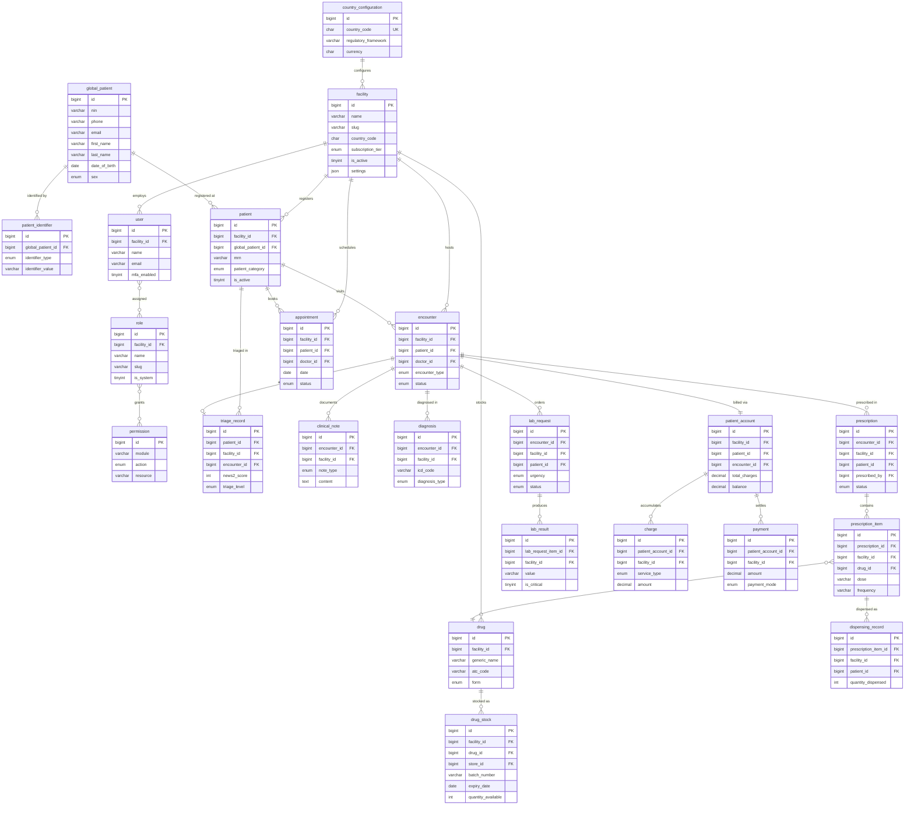

# Entity-Relationship Diagram — Medic8 Database Design

**Document ID:** DD-04-01
**Project:** Medic8
**Author:** Chwezi Core Systems
**Date:** 2026-04-03
**Version:** 1.0
**Status:** Draft — Pending Consultant Review

---

## 1. Introduction

This document defines the logical and physical data model for Medic8, a multi-tenant Software as a Service (SaaS) healthcare management system. The database engine is MySQL 8.x InnoDB with `utf8mb4` charset and strict mode enabled (`STRICT_TRANS_TABLES`, `NO_ZERO_DATE`, `NO_ZERO_IN_DATE`, `ERROR_FOR_DIVISION_BY_ZERO`).

### 1.1 Scope

Phase 1 tables are fully specified with column types, constraints, and descriptions. Phase 2-4 tables are listed with key columns only and will be expanded at the start of each phase.

Phase 1 covers 9 functional layers:

1. **Platform Layer** — facility registry, global patient identity, country configuration
2. **Authentication and RBAC Layer** — users, roles, permissions, sessions, audit logs
3. **Patient and Registration Layer** — tenant-scoped patient records, allergies, chronic conditions, triage
4. **OPD / Encounter Layer** — encounters, clinical notes, diagnoses, procedures, referrals
5. **Prescription and Pharmacy Layer** — prescriptions, drugs, stock, dispensing, Clinical Decision Support (CDS), narcotic register
6. **Laboratory Layer** — lab requests, samples, results, quality control
7. **Billing and Payment Layer** — patient accounts, charges, payments, receipts, cashier sessions, price lists
8. **Appointment Layer** — appointments, doctor availability
9. **API Authentication Layer** — refresh tokens for JWT-based mobile/API authentication

Phase 2-4 table stubs are listed in Sections 10 and 11 without full definitions.

### 1.2 Architectural Constraints

- **Row-level multi-tenancy:** every tenant-scoped table carries a `facility_id BIGINT UNSIGNED NOT NULL` column. The Repository base class appends `WHERE facility_id = ?` to every query using the `facility_id` resolved from the authenticated session or JWT claim. An Eloquent global scope provides secondary defence. No query executes without this filter (BR-DATA-004).
- **Centralised architecture:** all facilities share a single database cluster. Data isolation is logical (row-level), not physical (no per-tenant schemas or databases).
- **Global identity isolation:** `global_patients`, `patient_identifiers`, and `country_configurations` carry no `facility_id`. Access is governed at the service layer (BR-DATA-001).
- **Globally unique keys:** all primary keys use `BIGINT UNSIGNED AUTO_INCREMENT`. Cross-tenant identifiers (patient UIDs) use UUID v4 (`CHAR(36)`).
- **Soft deletes:** `global_patients` and `patients` use a `deleted_at` TIMESTAMP column; hard deletes are prohibited for patient records.
- **Append-only audit:** `audit_logs` and `emergency_access_logs` have no `UPDATE` or `DELETE` permission at the application layer.
- **Password storage:** all `password_hash` columns store Argon2ID hashes; plaintext passwords are never persisted (FR-AUTH-001).
- **InnoDB Cluster:** high availability via InnoDB Cluster with automatic failover.

### 1.3 Naming Conventions

| Pattern | Meaning |
|---|---|
| `table_name` | Snake case, singular nouns (e.g., `patient`, `drug_stock`) |
| `column_name` | Snake case, singular descriptors |
| `id` | Surrogate BIGINT UNSIGNED AUTO_INCREMENT primary key |
| `_id` suffix | Foreign key referencing another table's `id` |
| `facility_id` | Tenant isolation column on all tenant-scoped tables |
| `_at` suffix | TIMESTAMP column (UTC stored, displayed in facility timezone) |
| `is_` prefix | Boolean flag (`TINYINT(1)`, 0 or 1) |

### 1.4 Data Type Shorthand

| Shorthand | MySQL Type | Notes |
|---|---|---|
| `PK` | PRIMARY KEY | AUTO_INCREMENT BIGINT UNSIGNED |
| `FK` | FOREIGN KEY | Enforced via InnoDB constraint |
| `UK` | UNIQUE KEY | Single-column or composite |
| `TINYINT(1)` | Boolean | 0 = false, 1 = true |
| `DECIMAL(12,2)` | Currency | Monetary amounts (UGX, KES, etc.) |
| `DECIMAL(5,2)` | Clinical measures | Vitals, BMI, dosages |
| `TIMESTAMP` | Datetime | UTC stored; displayed in facility timezone |
| `JSON` | JSON column | InnoDB-validated JSON; used for settings and audit payloads |

### 1.5 Constraint Defaults

- `NOT NULL` — column is mandatory unless explicitly marked `NULL`.
- `ON DELETE RESTRICT` — default for all foreign keys; orphan prevention is mandatory.
- `ON DELETE CASCADE` — used only for pivot tables where the parent row's deletion should remove the association.
- All ENUM values are lowercase with underscores.

---

## 2. Architecture Diagram

The Mermaid diagram below covers the core relationship clusters in Phase 1. Supporting columns are omitted for readability. Full column definitions are in Sections 3-9.

---

## 3. Platform-Level Tables (No `facility_id`)

### 3.1 `facility`

Root of the multi-tenancy hierarchy. No `facility_id` self-reference.

| Column | Type | Constraints | Description |
|---|---|---|---|
| `id` | BIGINT UNSIGNED | PK, AUTO_INCREMENT | Surrogate facility identifier |
| `name` | VARCHAR(150) | NOT NULL | Official facility name |
| `slug` | VARCHAR(100) | NOT NULL, UNIQUE | URL-safe identifier (e.g., `hope-tororo`) for subdomain routing |
| `country_code` | CHAR(2) | NOT NULL, DEFAULT 'UG' | ISO 3166-1 alpha-2 country code; FK to `country_configuration` |
| `facility_type` | ENUM('clinic','health_centre_ii','health_centre_iii','health_centre_iv','general_hospital','regional_referral','national_referral') | NOT NULL | Uganda health system hierarchy classification (FR-TNT-001) |
| `subscription_tier` | ENUM('basic','pro','enterprise') | NOT NULL, DEFAULT 'basic' | Subscription plan governing module availability |
| `status` | ENUM('pending','active','suspended','decommissioned') | NOT NULL, DEFAULT 'pending' | Lifecycle state; `suspended` blocks all logins (FR-TNT-002) |
| `is_active` | TINYINT(1) | NOT NULL, DEFAULT 1 | Convenience flag; derived from `status = active` |
| `owner_name` | VARCHAR(100) | NOT NULL | Contact name of the facility owner |
| `owner_email` | VARCHAR(200) | NOT NULL | Contact email of the facility owner |
| `owner_phone` | VARCHAR(20) | NOT NULL | Contact phone (E.164 format) |
| `settings` | JSON | NULL | Facility-level configuration: logo URL, enabled modules, MRN format, operating hours, ward/department structure, branding, SMS sender ID |
| `created_at` | TIMESTAMP | NOT NULL, DEFAULT CURRENT_TIMESTAMP | Record creation timestamp (UTC) |
| `updated_at` | TIMESTAMP | NOT NULL, DEFAULT CURRENT_TIMESTAMP ON UPDATE CURRENT_TIMESTAMP | Last modification timestamp (UTC) |

### 3.2 `global_patient`

Platform-level patient identity. No `facility_id`. One record represents one human across all facilities (BR-DATA-001). Facility B can see that a patient exists but cannot read clinical data without consent or emergency access (BR-DATA-002).

| Column | Type | Constraints | Description |
|---|---|---|---|
| `id` | BIGINT UNSIGNED | PK, AUTO_INCREMENT | Surrogate global patient identifier |
| `patient_uid` | CHAR(36) | NOT NULL, UNIQUE | UUID v4; globally unique lifetime identifier |
| `nin` | VARCHAR(20) | NULL, UNIQUE | National Identification Number (Uganda format: 14 alphanumeric characters) |
| `phone` | VARCHAR(20) | NULL | Primary phone number (E.164 format) |
| `email` | VARCHAR(200) | NULL | Email address |
| `first_name` | VARCHAR(100) | NOT NULL | Legal first name |
| `last_name` | VARCHAR(100) | NOT NULL | Legal last name |
| `other_names` | VARCHAR(100) | NULL | Middle names, clan names, or compound surname components |
| `date_of_birth` | DATE | NULL | Date of birth; NULL if only estimated age is available |
| `sex` | ENUM('male','female') | NOT NULL | Biological sex for clinical purposes |
| `nationality` | CHAR(2) | DEFAULT 'UG' | ISO 3166-1 alpha-2 nationality |
| `deleted_at` | TIMESTAMP | NULL | Soft-delete timestamp; NULL = active record |
| `created_at` | TIMESTAMP | NOT NULL, DEFAULT CURRENT_TIMESTAMP | Record creation timestamp (UTC) |
| `updated_at` | TIMESTAMP | NOT NULL, DEFAULT CURRENT_TIMESTAMP ON UPDATE CURRENT_TIMESTAMP | Last modification timestamp (UTC) |

### 3.3 `patient_identifier`

Platform-level. Stores all government-issued and facility-issued identifiers per patient. Any stored identifier can be used for patient lookup (FR-REG-003, BR-PID-004).

| Column | Type | Constraints | Description |
|---|---|---|---|
| `id` | BIGINT UNSIGNED | PK, AUTO_INCREMENT | Surrogate row key |
| `global_patient_id` | BIGINT UNSIGNED | NOT NULL, FK -> `global_patient.id` | Parent global patient record |
| `identifier_type` | ENUM('nin','passport','unhcr_id','nhis','mrn','phone','email') | NOT NULL | Identifier category |
| `identifier_value` | VARCHAR(200) | NOT NULL | The identifier string (e.g., NIN value, passport number) |
| `facility_id_source` | BIGINT UNSIGNED | NULL, FK -> `facility.id` | Facility that recorded this identifier; NULL for platform-level identifiers |
| `verified` | TINYINT(1) | NOT NULL, DEFAULT 0 | 1 = verified against NIRA/external system; 0 = self-declared |
| `created_at` | TIMESTAMP | NOT NULL, DEFAULT CURRENT_TIMESTAMP | Record creation timestamp (UTC) |

**Composite unique constraint:** `UNIQUE(identifier_type, identifier_value)` — prevents two patients sharing the same NIN, passport, or UNHCR ID.

### 3.4 `country_configuration`

Platform-level. Defines regulatory, clinical, and financial rules per country (FR-TNT-004). All facilities in a country inherit these defaults.

| Column | Type | Constraints | Description |
|---|---|---|---|
| `id` | BIGINT UNSIGNED | PK, AUTO_INCREMENT | Surrogate row key |
| `country_code` | CHAR(2) | NOT NULL, UNIQUE | ISO 3166-1 alpha-2 country code |
| `country_name` | VARCHAR(100) | NOT NULL | Human-readable country name |
| `regulatory_framework` | VARCHAR(50) | NOT NULL | Primary data protection regulation (e.g., `PDPA_2019`, `HIPAA`, `DISHA`) |
| `currency` | CHAR(3) | NOT NULL, DEFAULT 'UGX' | ISO 4217 currency code |
| `tax_system` | JSON | NULL | PAYE brackets, social security rates, withholding tax rules |
| `hmis_system` | JSON | NULL | HMIS form identifiers and reporting calendar (e.g., HMIS 105, 108, 033b for Uganda) |
| `insurance_model` | JSON | NULL | Available insurance scheme types and claim formats |
| `immunisation_schedule` | JSON | NULL | National EPI schedule definition (vaccines, ages, doses) |
| `drug_formulary_source` | VARCHAR(100) | NULL | National drug authority reference (e.g., `NDA_Uganda`, `PPB_Kenya`) |
| `coding_system` | ENUM('icd10','icd11','both') | NOT NULL, DEFAULT 'icd10' | Preferred clinical coding system |
| `disease_surveillance` | JSON | NULL | IDSR disease list and reporting thresholds |
| `created_at` | TIMESTAMP | NOT NULL, DEFAULT CURRENT_TIMESTAMP | Record creation timestamp (UTC) |
| `updated_at` | TIMESTAMP | NOT NULL, DEFAULT CURRENT_TIMESTAMP ON UPDATE CURRENT_TIMESTAMP | Last modification timestamp (UTC) |

---

## 4. Authentication and RBAC Tables

### 4.1 `user`

All human principals. A user belongs to exactly one facility. Super Admins have `facility_id = NULL`. A person operating at multiple facilities holds separate `user` records per facility.

| Column | Type | Constraints | Description |
|---|---|---|---|
| `id` | BIGINT UNSIGNED | PK, AUTO_INCREMENT | Surrogate user identifier |
| `facility_id` | BIGINT UNSIGNED | NULL, FK -> `facility.id` | Facility this account belongs to; NULL for Super Admin accounts |
| `name` | VARCHAR(150) | NOT NULL | Full display name |
| `email` | VARCHAR(200) | NOT NULL, UNIQUE | Login email address |
| `phone` | VARCHAR(20) | NULL | Mobile number for SMS OTP and notifications |
| `password_hash` | VARCHAR(255) | NOT NULL | Argon2ID hash; plaintext never stored (FR-AUTH-001) |
| `mfa_enabled` | TINYINT(1) | NOT NULL, DEFAULT 0 | 1 = TOTP/SMS MFA required at login (FR-AUTH-006) |
| `mfa_secret` | VARCHAR(255) | NULL | Encrypted TOTP secret key (AES-256-GCM) |
| `is_active` | TINYINT(1) | NOT NULL, DEFAULT 1 | 0 = account disabled; login blocked |
| `locked` | TINYINT(1) | NOT NULL, DEFAULT 0 | 1 = account locked after 5 failed login attempts (FR-AUTH-001) |
| `failed_login_attempts` | TINYINT UNSIGNED | NOT NULL, DEFAULT 0 | Counter reset to 0 on successful login |
| `force_password_change` | TINYINT(1) | NOT NULL, DEFAULT 0 | 1 = user must change password on next login (FR-TNT-001) |
| `last_login_at` | TIMESTAMP | NULL | Timestamp of last successful authentication |
| `created_at` | TIMESTAMP | NOT NULL, DEFAULT CURRENT_TIMESTAMP | Record creation timestamp (UTC) |
| `updated_at` | TIMESTAMP | NOT NULL, DEFAULT CURRENT_TIMESTAMP ON UPDATE CURRENT_TIMESTAMP | Last modification timestamp (UTC) |

### 4.2 `role`

Roles govern permission sets. `facility_id = NULL` designates platform-built-in roles (Super Admin, Facility Admin, Doctor, Clinical Officer, Nurse, Pharmacist, Lab Technician, Receptionist, Records Officer, Cashier). Facilities may define custom roles with their `facility_id`.

| Column | Type | Constraints | Description |
|---|---|---|---|
| `id` | BIGINT UNSIGNED | PK, AUTO_INCREMENT | Surrogate role identifier |
| `facility_id` | BIGINT UNSIGNED | NULL, FK -> `facility.id` | NULL = platform-wide built-in; non-NULL = facility-specific custom role |
| `name` | VARCHAR(100) | NOT NULL | Display name (e.g., 'Doctor', 'Pharmacist') |
| `slug` | VARCHAR(100) | NOT NULL | URL-safe identifier (e.g., `doctor`, `pharmacist`, `facility_admin`) |
| `is_system` | TINYINT(1) | NOT NULL, DEFAULT 0 | 1 = built-in role; cannot be deleted or renamed |
| `description` | VARCHAR(255) | NULL | Human-readable description of the role's responsibilities |
| `created_at` | TIMESTAMP | NOT NULL, DEFAULT CURRENT_TIMESTAMP | Record creation timestamp (UTC) |

**Composite unique constraint:** `UNIQUE(facility_id, slug)` — prevents duplicate role slugs within a facility.

### 4.3 `permission`

Flat permission catalogue. Each row represents one action on one resource within one module.

| Column | Type | Constraints | Description |
|---|---|---|---|
| `id` | BIGINT UNSIGNED | PK, AUTO_INCREMENT | Surrogate permission identifier |
| `module` | VARCHAR(50) | NOT NULL | Module grouping (e.g., `patients`, `pharmacy`, `lab`, `billing`, `admin`) |
| `action` | ENUM('create','read','update','delete') | NOT NULL | CRUD action |
| `resource` | VARCHAR(100) | NOT NULL | Specific resource within the module (e.g., `patient_record`, `prescription`, `lab_result`) |
| `description` | VARCHAR(255) | NULL | Human-readable explanation of what this permission grants |

**Composite unique constraint:** `UNIQUE(module, action, resource)` — prevents duplicate permission definitions.

### 4.4 `role_permission`

Pivot table associating roles with permissions.

| Column | Type | Constraints | Description |
|---|---|---|---|
| `role_id` | BIGINT UNSIGNED | NOT NULL, FK -> `role.id`, ON DELETE CASCADE | Role receiving the permission |
| `permission_id` | BIGINT UNSIGNED | NOT NULL, FK -> `permission.id`, ON DELETE CASCADE | Permission being granted |

**Composite primary key:** `PRIMARY KEY(role_id, permission_id)`.

### 4.5 `user_role`

Pivot table assigning roles to users within a specific facility context.

| Column | Type | Constraints | Description |
|---|---|---|---|
| `user_id` | BIGINT UNSIGNED | NOT NULL, FK -> `user.id`, ON DELETE CASCADE | User receiving the role |
| `role_id` | BIGINT UNSIGNED | NOT NULL, FK -> `role.id`, ON DELETE CASCADE | Role being assigned |
| `facility_id` | BIGINT UNSIGNED | NOT NULL, FK -> `facility.id` | Facility scope for this assignment |

**Composite primary key:** `PRIMARY KEY(user_id, role_id, facility_id)`.

### 4.6 `session`

Web session tracking for authenticated users.

| Column | Type | Constraints | Description |
|---|---|---|---|
| `id` | BIGINT UNSIGNED | PK, AUTO_INCREMENT | Surrogate session identifier |
| `user_id` | BIGINT UNSIGNED | NOT NULL, FK -> `user.id` | Authenticated user |
| `facility_id` | BIGINT UNSIGNED | NULL, FK -> `facility.id` | Tenant context; NULL for Super Admin sessions |
| `session_id` | VARCHAR(128) | NOT NULL, UNIQUE | PHP session ID string |
| `ip_address` | VARCHAR(45) | NOT NULL | Client IP (supports IPv6) |
| `user_agent` | VARCHAR(500) | NULL | Browser/client user agent string |
| `device_fingerprint` | VARCHAR(255) | NULL | Device fingerprint hash for anomaly detection |
| `last_activity` | TIMESTAMP | NOT NULL | Timestamp of last request; used for idle timeout (FR-AUTH-005, 900-second window) |
| `created_at` | TIMESTAMP | NOT NULL, DEFAULT CURRENT_TIMESTAMP | Session creation timestamp |

### 4.7 `api_refresh_token`

Persisted JWT refresh tokens for mobile/API authentication (FR-AUTH-002, FR-AUTH-003).

| Column | Type | Constraints | Description |
|---|---|---|---|
| `id` | BIGINT UNSIGNED | PK, AUTO_INCREMENT | Surrogate row key |
| `user_id` | BIGINT UNSIGNED | NOT NULL, FK -> `user.id` | Token owner |
| `jti` | CHAR(36) | NOT NULL, UNIQUE | JWT ID (UUID v4); used for revocation checks |
| `device_id` | VARCHAR(255) | NOT NULL | Device identifier for per-device token revocation |
| `revoked` | TINYINT(1) | NOT NULL, DEFAULT 0 | 1 = token revoked via logout or rotation |
| `expires_at` | TIMESTAMP | NOT NULL | Token expiry (30 days from issue) |
| `created_at` | TIMESTAMP | NOT NULL, DEFAULT CURRENT_TIMESTAMP | Token issue timestamp |

### 4.8 `audit_log`

Append-only audit trail for all data-changing actions. No UPDATE or DELETE permission at the application layer.

| Column | Type | Constraints | Description |
|---|---|---|---|
| `id` | BIGINT UNSIGNED | PK, AUTO_INCREMENT | Surrogate audit entry identifier |
| `facility_id` | BIGINT UNSIGNED | NULL, FK -> `facility.id` | Tenant context; NULL for platform-level actions |
| `user_id` | BIGINT UNSIGNED | NULL, FK -> `user.id` | Acting user; NULL for system-initiated actions |
| `action` | VARCHAR(50) | NOT NULL | Action performed (e.g., `CREATE`, `UPDATE`, `DELETE`, `LOGIN`, `MERGE`, `FACILITY_CREATED`) |
| `resource_type` | VARCHAR(100) | NOT NULL | Entity type affected (e.g., `patient`, `prescription`, `user`) |
| `resource_id` | BIGINT UNSIGNED | NULL | Primary key of the affected record |
| `old_values` | JSON | NULL | Previous state of modified fields (NULL for CREATE actions) |
| `new_values` | JSON | NULL | New state of modified fields (NULL for DELETE actions) |
| `ip_address` | VARCHAR(45) | NULL | Client IP address |
| `user_agent` | VARCHAR(500) | NULL | Client user agent string |
| `created_at` | TIMESTAMP | NOT NULL, DEFAULT CURRENT_TIMESTAMP | Audit entry timestamp (UTC) |

**Index:** `INDEX(facility_id, resource_type, created_at)` for efficient audit trail queries.

### 4.9 `emergency_access_log`

Records emergency cross-facility clinical data access (BR-DATA-002). Append-only.

| Column | Type | Constraints | Description |
|---|---|---|---|
| `id` | BIGINT UNSIGNED | PK, AUTO_INCREMENT | Surrogate row key |
| `facility_id` | BIGINT UNSIGNED | NOT NULL, FK -> `facility.id` | Facility from which access was requested |
| `requesting_user_id` | BIGINT UNSIGNED | NOT NULL, FK -> `user.id` | Clinician who invoked emergency access |
| `patient_id` | BIGINT UNSIGNED | NOT NULL, FK -> `global_patient.id` | Global patient whose data was accessed |
| `reason` | TEXT | NOT NULL | Documented clinical reason for emergency access |
| `accessed_data` | JSON | NOT NULL | Summary of data categories revealed (allergies, medications, diagnoses) |
| `expires_at` | TIMESTAMP | NOT NULL | Access window expiry (24 hours from grant) |
| `patient_notified_at` | TIMESTAMP | NULL | Timestamp when SMS notification was sent to the patient |
| `created_at` | TIMESTAMP | NOT NULL, DEFAULT CURRENT_TIMESTAMP | Access grant timestamp |

---

## 5. Patient and Registration Tables (Phase 1)

### 5.1 `patient`

Tenant-scoped patient record. Links to `global_patient` for cross-facility identity. Each facility maintains its own patient record with local MRN and clinical categorisation (FR-REG-001).

| Column | Type | Constraints | Description |
|---|---|---|---|
| `id` | BIGINT UNSIGNED | PK, AUTO_INCREMENT | Surrogate patient identifier (facility-scoped) |
| `facility_id` | BIGINT UNSIGNED | NOT NULL, FK -> `facility.id` | Tenant isolation column |
| `global_patient_id` | BIGINT UNSIGNED | NOT NULL, FK -> `global_patient.id` | Link to platform-level patient identity |
| `mrn` | VARCHAR(30) | NOT NULL | Medical Record Number, auto-generated per facility format (FR-REG-002) |
| `first_name` | VARCHAR(100) | NOT NULL | First name (may differ from global record if facility uses a local variant) |
| `last_name` | VARCHAR(100) | NOT NULL | Last name |
| `other_names` | VARCHAR(100) | NULL | Middle names, clan names |
| `date_of_birth` | DATE | NULL | Date of birth; NULL if only estimated age is known |
| `estimated_age` | TINYINT UNSIGNED | NULL | Estimated age in years when exact DOB is unavailable |
| `sex` | ENUM('male','female') | NOT NULL | Biological sex |
| `blood_group` | ENUM('a_pos','a_neg','b_pos','b_neg','ab_pos','ab_neg','o_pos','o_neg') | NULL | ABO + Rh blood type |
| `photo_path` | VARCHAR(500) | NULL | S3 object key for patient passport photo |
| `patient_category` | ENUM('adult','paediatric','staff','vip','indigent','refugee') | NOT NULL, DEFAULT 'adult' | Determines pricing tier, clinical protocols, and reporting segmentation (FR-REG-004) |
| `guardian_patient_id` | BIGINT UNSIGNED | NULL, FK -> `patient.id` (self-referencing) | Parent/guardian for paediatric patients; NULL for adults |
| `phone` | VARCHAR(20) | NULL | Patient phone number (E.164 format) |
| `email` | VARCHAR(200) | NULL | Patient email address |
| `address` | TEXT | NULL | Physical address |
| `district` | VARCHAR(100) | NULL | Administrative district |
| `sub_county` | VARCHAR(100) | NULL | Sub-county |
| `village` | VARCHAR(100) | NULL | Village or LC1 |
| `tribe` | VARCHAR(50) | NULL | Tribe/ethnicity |
| `religion` | VARCHAR(50) | NULL | Religious affiliation |
| `occupation` | VARCHAR(100) | NULL | Occupation |
| `marital_status` | ENUM('single','married','divorced','widowed','separated') | NULL | Marital status |
| `nationality` | CHAR(2) | DEFAULT 'UG' | ISO 3166-1 alpha-2 |
| `next_of_kin_name` | VARCHAR(100) | NULL | Emergency contact name |
| `next_of_kin_phone` | VARCHAR(20) | NULL | Emergency contact phone (E.164) |
| `next_of_kin_relationship` | VARCHAR(50) | NULL | Relationship to patient (mother, father, spouse, sibling, etc.) |
| `status` | ENUM('active','inactive','merged','deceased') | NOT NULL, DEFAULT 'active' | Record lifecycle state |
| `merged_into_patient_id` | BIGINT UNSIGNED | NULL, FK -> `patient.id` | Redirect pointer after merge (FR-REG-008) |
| `is_active` | TINYINT(1) | NOT NULL, DEFAULT 1 | Convenience flag; derived from `status = active` |
| `deleted_at` | TIMESTAMP | NULL | Soft-delete timestamp |
| `created_at` | TIMESTAMP | NOT NULL, DEFAULT CURRENT_TIMESTAMP | Record creation timestamp (UTC) |
| `updated_at` | TIMESTAMP | NOT NULL, DEFAULT CURRENT_TIMESTAMP ON UPDATE CURRENT_TIMESTAMP | Last modification timestamp (UTC) |

**Composite unique constraint:** `UNIQUE(facility_id, mrn)` — MRN is unique within a facility.

**Index:** `FULLTEXT(first_name, last_name, other_names)` for fuzzy patient search (FR-REG-003).

### 5.2 `patient_allergy`

Records patient allergies with SNOMED coding and severity classification (FR-REG-007). Displayed as a safety alert banner on every clinical screen.

| Column | Type | Constraints | Description |
|---|---|---|---|
| `id` | BIGINT UNSIGNED | PK, AUTO_INCREMENT | Surrogate row key |
| `patient_id` | BIGINT UNSIGNED | NOT NULL, FK -> `patient.id` | Patient record |
| `facility_id` | BIGINT UNSIGNED | NOT NULL, FK -> `facility.id` | Tenant isolation |
| `allergen` | VARCHAR(200) | NOT NULL | Human-readable allergen name (e.g., 'Penicillin', 'Sulfonamides') |
| `allergen_code` | VARCHAR(20) | NULL | SNOMED CT concept ID for the allergen |
| `severity` | ENUM('mild','moderate','severe','life_threatening') | NOT NULL | Clinical severity classification |
| `reaction` | VARCHAR(255) | NULL | Description of the allergic reaction (e.g., 'Anaphylaxis', 'Urticaria') |
| `recorded_by` | BIGINT UNSIGNED | NOT NULL, FK -> `user.id` | Clinician who recorded the allergy |
| `is_active` | TINYINT(1) | NOT NULL, DEFAULT 1 | 0 = allergy resolved or retracted |
| `created_at` | TIMESTAMP | NOT NULL, DEFAULT CURRENT_TIMESTAMP | Record creation timestamp |

### 5.3 `patient_chronic_condition`

Records chronic conditions with ICD-10 coding. Used for clinical decision support, allergy cross-referencing, and HMIS reporting.

| Column | Type | Constraints | Description |
|---|---|---|---|
| `id` | BIGINT UNSIGNED | PK, AUTO_INCREMENT | Surrogate row key |
| `patient_id` | BIGINT UNSIGNED | NOT NULL, FK -> `patient.id` | Patient record |
| `facility_id` | BIGINT UNSIGNED | NOT NULL, FK -> `facility.id` | Tenant isolation |
| `condition` | VARCHAR(255) | NOT NULL | Human-readable condition name |
| `icd_code` | VARCHAR(10) | NOT NULL | ICD-10 code (e.g., `E11.9` for Type 2 Diabetes) |
| `onset_date` | DATE | NULL | Approximate date of onset |
| `status` | ENUM('active','resolved','managed') | NOT NULL, DEFAULT 'active' | Current condition status |
| `recorded_by` | BIGINT UNSIGNED | NOT NULL, FK -> `user.id` | Clinician who recorded the condition |
| `created_at` | TIMESTAMP | NOT NULL, DEFAULT CURRENT_TIMESTAMP | Record creation timestamp |

### 5.4 `triage_record`

Vital signs and triage assessment. NEWS2 score auto-calculated from vitals (BR-CLIN-007). One record per triage event per encounter (FR-OPD-001).

| Column | Type | Constraints | Description |
|---|---|---|---|
| `id` | BIGINT UNSIGNED | PK, AUTO_INCREMENT | Surrogate row key |
| `patient_id` | BIGINT UNSIGNED | NOT NULL, FK -> `patient.id` | Patient being triaged |
| `facility_id` | BIGINT UNSIGNED | NOT NULL, FK -> `facility.id` | Tenant isolation |
| `encounter_id` | BIGINT UNSIGNED | NULL, FK -> `encounter.id` | Associated encounter; NULL if triage precedes encounter creation |
| `bp_systolic` | SMALLINT UNSIGNED | NULL | Systolic blood pressure (mmHg), range 40-300 |
| `bp_diastolic` | SMALLINT UNSIGNED | NULL | Diastolic blood pressure (mmHg), range 20-200 |
| `temperature` | DECIMAL(4,1) | NULL | Body temperature (Celsius), range 30.0-45.0 |
| `pulse` | SMALLINT UNSIGNED | NULL | Heart rate (beats per minute), range 20-250 |
| `respiratory_rate` | SMALLINT UNSIGNED | NULL | Respiratory rate (breaths per minute), range 4-60 |
| `spo2` | TINYINT UNSIGNED | NULL | Oxygen saturation (%), range 50-100 |
| `weight` | DECIMAL(5,1) | NULL | Body weight (kg), range 0.3-300.0 |
| `height` | DECIMAL(4,1) | NULL | Height (cm), range 20.0-250.0 |
| `bmi` | DECIMAL(4,1) | NULL | Body Mass Index, auto-calculated from weight and height |
| `muac` | DECIMAL(3,1) | NULL | Mid-Upper Arm Circumference (cm); required for patients under 12 |
| `triage_level` | ENUM('emergency','urgent','semi_urgent','non_urgent') | NOT NULL | Triage classification (BR-CLIN-001) |
| `news2_score` | TINYINT UNSIGNED | NULL | National Early Warning Score 2, auto-calculated (BR-CLIN-007) |
| `consciousness` | ENUM('alert','voice','pain','unresponsive') | NULL | AVPU consciousness scale |
| `supplemental_oxygen` | TINYINT(1) | NOT NULL, DEFAULT 0 | 1 = patient receiving supplemental O2 (affects NEWS2 calculation) |
| `triaged_by` | BIGINT UNSIGNED | NOT NULL, FK -> `user.id` | Nurse who performed triage |
| `created_at` | TIMESTAMP | NOT NULL, DEFAULT CURRENT_TIMESTAMP | Triage timestamp |

---

## 6. OPD / Encounter Tables (Phase 1)

### 6.1 `encounter`

Clinical visit record. Covers OPD, IPD, and Emergency encounter types. All clinical activities (notes, diagnoses, prescriptions, lab requests) are children of an encounter.

| Column | Type | Constraints | Description |
|---|---|---|---|
| `id` | BIGINT UNSIGNED | PK, AUTO_INCREMENT | Surrogate encounter identifier |
| `facility_id` | BIGINT UNSIGNED | NOT NULL, FK -> `facility.id` | Tenant isolation |
| `patient_id` | BIGINT UNSIGNED | NOT NULL, FK -> `patient.id` | Patient being seen |
| `encounter_type` | ENUM('opd','ipd','emergency') | NOT NULL | Visit type |
| `department` | VARCHAR(100) | NULL | Department or clinic within the facility |
| `doctor_id` | BIGINT UNSIGNED | NULL, FK -> `user.id` | Assigned clinician; NULL until patient is allocated to a doctor |
| `status` | ENUM('registered','triaged','waiting','in_progress','completed','discharged','cancelled') | NOT NULL, DEFAULT 'registered' | Encounter lifecycle state |
| `chief_complaint` | TEXT | NULL | Patient's presenting complaint in free text |
| `started_at` | TIMESTAMP | NULL | Consultation start time |
| `ended_at` | TIMESTAMP | NULL | Consultation end time |
| `created_at` | TIMESTAMP | NOT NULL, DEFAULT CURRENT_TIMESTAMP | Record creation timestamp |
| `updated_at` | TIMESTAMP | NOT NULL, DEFAULT CURRENT_TIMESTAMP ON UPDATE CURRENT_TIMESTAMP | Last modification timestamp |

**Index:** `INDEX(facility_id, patient_id)`, `INDEX(facility_id, doctor_id, status)`, `INDEX(facility_id, created_at)`.

### 6.2 `clinical_note`

Structured clinical documentation per encounter. Supports SOAP notes, progress notes, and nursing notes (FR-OPD-003).

| Column | Type | Constraints | Description |
|---|---|---|---|
| `id` | BIGINT UNSIGNED | PK, AUTO_INCREMENT | Surrogate row key |
| `encounter_id` | BIGINT UNSIGNED | NOT NULL, FK -> `encounter.id` | Parent encounter |
| `facility_id` | BIGINT UNSIGNED | NOT NULL, FK -> `facility.id` | Tenant isolation |
| `note_type` | ENUM('soap_subjective','soap_objective','soap_assessment','soap_plan','progress','nursing','procedure','referral') | NOT NULL | Note category |
| `content` | TEXT | NOT NULL | Clinical note content |
| `authored_by` | BIGINT UNSIGNED | NOT NULL, FK -> `user.id` | Clinician who authored the note |
| `created_at` | TIMESTAMP | NOT NULL, DEFAULT CURRENT_TIMESTAMP | Note creation timestamp |

### 6.3 `diagnosis`

ICD-coded diagnoses per encounter. Supports ICD-10 and ICD-11 dual coding. Primary diagnosis is mandatory for HMIS reporting (BR-DATA-006).

| Column | Type | Constraints | Description |
|---|---|---|---|
| `id` | BIGINT UNSIGNED | PK, AUTO_INCREMENT | Surrogate row key |
| `encounter_id` | BIGINT UNSIGNED | NOT NULL, FK -> `encounter.id` | Parent encounter |
| `facility_id` | BIGINT UNSIGNED | NOT NULL, FK -> `facility.id` | Tenant isolation |
| `icd_code` | VARCHAR(10) | NOT NULL | ICD code (e.g., `B54` for malaria) |
| `icd_version` | ENUM('10','11') | NOT NULL, DEFAULT '10' | ICD version used |
| `description` | VARCHAR(255) | NOT NULL | Human-readable diagnosis description |
| `diagnosis_type` | ENUM('primary','secondary','differential') | NOT NULL | Classification; exactly one primary diagnosis per encounter |
| `snomed_code` | VARCHAR(20) | NULL | SNOMED CT concept ID for interoperability |
| `diagnosed_by` | BIGINT UNSIGNED | NOT NULL, FK -> `user.id` | Diagnosing clinician |
| `created_at` | TIMESTAMP | NOT NULL, DEFAULT CURRENT_TIMESTAMP | Diagnosis timestamp |

### 6.4 `procedure`

Clinical procedures performed during an encounter (FR-OPD-010).

| Column | Type | Constraints | Description |
|---|---|---|---|
| `id` | BIGINT UNSIGNED | PK, AUTO_INCREMENT | Surrogate row key |
| `encounter_id` | BIGINT UNSIGNED | NOT NULL, FK -> `encounter.id` | Parent encounter |
| `facility_id` | BIGINT UNSIGNED | NOT NULL, FK -> `facility.id` | Tenant isolation |
| `procedure_name` | VARCHAR(200) | NOT NULL | Name of the procedure performed |
| `procedure_code` | VARCHAR(20) | NULL | CPT or local procedure code |
| `notes` | TEXT | NULL | Procedure notes and findings |
| `performed_by` | BIGINT UNSIGNED | NOT NULL, FK -> `user.id` | Clinician who performed the procedure |
| `assistant_id` | BIGINT UNSIGNED | NULL, FK -> `user.id` | Assisting clinician |
| `performed_at` | TIMESTAMP | NOT NULL, DEFAULT CURRENT_TIMESTAMP | Procedure timestamp |
| `created_at` | TIMESTAMP | NOT NULL, DEFAULT CURRENT_TIMESTAMP | Record creation timestamp |

### 6.5 `referral`

Internal and external referrals from an encounter (FR-OPD-011).

| Column | Type | Constraints | Description |
|---|---|---|---|
| `id` | BIGINT UNSIGNED | PK, AUTO_INCREMENT | Surrogate row key |
| `encounter_id` | BIGINT UNSIGNED | NOT NULL, FK -> `encounter.id` | Source encounter |
| `facility_id` | BIGINT UNSIGNED | NOT NULL, FK -> `facility.id` | Tenant isolation |
| `referral_type` | ENUM('internal','external') | NOT NULL | Internal (within facility) or external (to another facility) |
| `to_department` | VARCHAR(100) | NULL | Target department for internal referrals |
| `to_facility_name` | VARCHAR(200) | NULL | Target facility name for external referrals |
| `to_facility_id` | BIGINT UNSIGNED | NULL, FK -> `facility.id` | Target facility ID for electronic referrals within the Medic8 platform |
| `reason` | TEXT | NOT NULL | Clinical reason for referral |
| `referral_letter` | TEXT | NULL | Full referral letter content |
| `urgency` | ENUM('routine','urgent','emergency') | NOT NULL, DEFAULT 'routine' | Referral urgency |
| `status` | ENUM('pending','accepted','declined','completed','cancelled') | NOT NULL, DEFAULT 'pending' | Referral lifecycle state |
| `referred_by` | BIGINT UNSIGNED | NOT NULL, FK -> `user.id` | Referring clinician |
| `created_at` | TIMESTAMP | NOT NULL, DEFAULT CURRENT_TIMESTAMP | Referral creation timestamp |
| `updated_at` | TIMESTAMP | NOT NULL, DEFAULT CURRENT_TIMESTAMP ON UPDATE CURRENT_TIMESTAMP | Last modification timestamp |

---

## 7. Prescription and Pharmacy Tables (Phase 1)

### 7.1 `prescription`

Prescription header per encounter. Groups one or more prescription items written by a single prescriber (FR-OPD-006).

| Column | Type | Constraints | Description |
|---|---|---|---|
| `id` | BIGINT UNSIGNED | PK, AUTO_INCREMENT | Surrogate prescription identifier |
| `encounter_id` | BIGINT UNSIGNED | NOT NULL, FK -> `encounter.id` | Parent encounter |
| `facility_id` | BIGINT UNSIGNED | NOT NULL, FK -> `facility.id` | Tenant isolation |
| `patient_id` | BIGINT UNSIGNED | NOT NULL, FK -> `patient.id` | Patient receiving medication |
| `prescribed_by` | BIGINT UNSIGNED | NOT NULL, FK -> `user.id` | Prescribing clinician (BR-CLIN-002: role-restricted) |
| `status` | ENUM('pending','dispensed','partial','cancelled') | NOT NULL, DEFAULT 'pending' | Prescription lifecycle state |
| `notes` | TEXT | NULL | General prescription notes |
| `created_at` | TIMESTAMP | NOT NULL, DEFAULT CURRENT_TIMESTAMP | Prescription timestamp |
| `updated_at` | TIMESTAMP | NOT NULL, DEFAULT CURRENT_TIMESTAMP ON UPDATE CURRENT_TIMESTAMP | Last modification timestamp |

### 7.2 `prescription_item`

Individual drug line within a prescription. Carries dosing details and paediatric safeguards (BR-CLIN-006, BR-CLIN-008).

| Column | Type | Constraints | Description |
|---|---|---|---|
| `id` | BIGINT UNSIGNED | PK, AUTO_INCREMENT | Surrogate row key |
| `prescription_id` | BIGINT UNSIGNED | NOT NULL, FK -> `prescription.id` | Parent prescription |
| `facility_id` | BIGINT UNSIGNED | NOT NULL, FK -> `facility.id` | Tenant isolation |
| `drug_id` | BIGINT UNSIGNED | NOT NULL, FK -> `drug.id` | Selected drug from facility formulary |
| `drug_name` | VARCHAR(200) | NOT NULL | Drug name at time of prescribing (denormalised for audit permanence) |
| `dose` | VARCHAR(50) | NOT NULL | Dose amount (e.g., '500', '10') |
| `dose_unit` | VARCHAR(20) | NOT NULL | Dose unit (e.g., 'mg', 'ml', 'units') |
| `frequency` | VARCHAR(50) | NOT NULL | Dosing frequency (e.g., 'TDS', 'BD', 'QID', 'STAT', 'PRN') |
| `duration` | SMALLINT UNSIGNED | NOT NULL | Duration value |
| `duration_unit` | ENUM('days','weeks','months') | NOT NULL, DEFAULT 'days' | Duration unit |
| `route` | ENUM('oral','iv','im','sc','topical','rectal','inhaled','sublingual','ophthalmic','otic','nasal','intrathecal') | NOT NULL | Administration route |
| `quantity` | SMALLINT UNSIGNED | NOT NULL | Total quantity to dispense |
| `instructions` | VARCHAR(500) | NULL | Special instructions (e.g., 'Take after meals', 'Shake well before use') |
| `is_paediatric_dose` | TINYINT(1) | NOT NULL, DEFAULT 0 | 1 = dose calculated using weight-based formula (BR-CLIN-006) |
| `calculated_dose_mg_kg` | DECIMAL(8,3) | NULL | Weight-based dose in mg/kg for paediatric verification |
| `patient_weight_kg` | DECIMAL(5,1) | NULL | Patient weight used for dose calculation |
| `status` | ENUM('pending','dispensed','partial','cancelled','substituted') | NOT NULL, DEFAULT 'pending' | Item-level status |
| `created_at` | TIMESTAMP | NOT NULL, DEFAULT CURRENT_TIMESTAMP | Record creation timestamp |

### 7.3 `drug`

Facility formulary. Each facility maintains its own drug catalogue with generic and brand names, ATC codes, and safety flags (BR-RX-002, BR-RX-003).

| Column | Type | Constraints | Description |
|---|---|---|---|
| `id` | BIGINT UNSIGNED | PK, AUTO_INCREMENT | Surrogate drug identifier |
| `facility_id` | BIGINT UNSIGNED | NOT NULL, FK -> `facility.id` | Tenant isolation |
| `generic_name` | VARCHAR(200) | NOT NULL | INN (International Nonproprietary Name) |
| `brand_name` | VARCHAR(200) | NULL | Commercial brand name |
| `atc_code` | VARCHAR(10) | NULL | WHO Anatomical Therapeutic Chemical code |
| `rxnorm_code` | VARCHAR(20) | NULL | RxNorm concept identifier for interoperability |
| `form` | ENUM('tablet','capsule','syrup','suspension','injection','cream','ointment','drops','inhaler','suppository','patch','powder','solution','gel','spray') | NOT NULL | Pharmaceutical form |
| `strength` | VARCHAR(50) | NOT NULL | Drug strength (e.g., '500mg', '250mg/5ml') |
| `unit` | VARCHAR(20) | NOT NULL | Dispensing unit (e.g., 'tablet', 'bottle', 'vial', 'tube') |
| `is_narcotic` | TINYINT(1) | NOT NULL, DEFAULT 0 | 1 = controlled substance requiring narcotic register (BR-RX-001) |
| `schedule_class` | ENUM('none','schedule_i','schedule_ii','schedule_iii','schedule_iv','schedule_v') | NOT NULL, DEFAULT 'none' | Drug scheduling classification |
| `is_active` | TINYINT(1) | NOT NULL, DEFAULT 1 | 0 = drug removed from active formulary |
| `tall_man_display` | VARCHAR(200) | NULL | Tall Man Lettering for LASA drugs (BR-RX-003), e.g., 'hydrOXYzine' |
| `therapeutic_class` | VARCHAR(100) | NULL | Therapeutic drug class for substitution suggestions |
| `max_adult_dose_mg` | DECIMAL(8,2) | NULL | Maximum adult ceiling dose in mg for paediatric dose cap (BR-CLIN-006) |
| `min_stock_level` | INT UNSIGNED | NULL | Minimum stock level below which an alert is triggered |
| `created_at` | TIMESTAMP | NOT NULL, DEFAULT CURRENT_TIMESTAMP | Record creation timestamp |
| `updated_at` | TIMESTAMP | NOT NULL, DEFAULT CURRENT_TIMESTAMP ON UPDATE CURRENT_TIMESTAMP | Last modification timestamp |

**Index:** `INDEX(facility_id, generic_name)`, `INDEX(facility_id, atc_code)`.

### 7.4 `store`

Physical storage locations within a facility. Each facility has at least one store (main pharmacy). Additional stores support multi-location dispensing.

| Column | Type | Constraints | Description |
|---|---|---|---|
| `id` | BIGINT UNSIGNED | PK, AUTO_INCREMENT | Surrogate store identifier |
| `facility_id` | BIGINT UNSIGNED | NOT NULL, FK -> `facility.id` | Tenant isolation |
| `name` | VARCHAR(100) | NOT NULL | Store name (e.g., 'Main Pharmacy', 'Theatre Store', 'Ward 3 Store', 'Dental Store') |
| `store_type` | ENUM('main','pharmacy','theatre','ward','dental','laboratory') | NOT NULL, DEFAULT 'pharmacy' | Store category |
| `is_active` | TINYINT(1) | NOT NULL, DEFAULT 1 | 0 = store decommissioned |
| `created_at` | TIMESTAMP | NOT NULL, DEFAULT CURRENT_TIMESTAMP | Record creation timestamp |

### 7.5 `goods_received_note`

Goods Received Note (GRN) recording incoming drug stock from suppliers.

| Column | Type | Constraints | Description |
|---|---|---|---|
| `id` | BIGINT UNSIGNED | PK, AUTO_INCREMENT | Surrogate GRN identifier |
| `facility_id` | BIGINT UNSIGNED | NOT NULL, FK -> `facility.id` | Tenant isolation |
| `store_id` | BIGINT UNSIGNED | NOT NULL, FK -> `store.id` | Receiving store |
| `supplier_name` | VARCHAR(200) | NOT NULL | Supplier name (denormalised; `supplier` table in Phase 2) |
| `supplier_id` | BIGINT UNSIGNED | NULL | FK placeholder for Phase 2 `supplier` table |
| `lpo_number` | VARCHAR(50) | NULL | Local Purchase Order reference |
| `invoice_number` | VARCHAR(50) | NULL | Supplier invoice number |
| `received_by` | BIGINT UNSIGNED | NOT NULL, FK -> `user.id` | User who received the goods |
| `total_cost` | DECIMAL(12,2) | NOT NULL, DEFAULT 0.00 | Total cost of received goods |
| `notes` | TEXT | NULL | GRN notes |
| `received_at` | TIMESTAMP | NOT NULL, DEFAULT CURRENT_TIMESTAMP | Date goods were received |
| `created_at` | TIMESTAMP | NOT NULL, DEFAULT CURRENT_TIMESTAMP | Record creation timestamp |

### 7.6 `drug_stock`

Batch-level stock tracking per drug per store. Supports FIFO and weighted average costing (BR-FIN-001).

| Column | Type | Constraints | Description |
|---|---|---|---|
| `id` | BIGINT UNSIGNED | PK, AUTO_INCREMENT | Surrogate row key |
| `facility_id` | BIGINT UNSIGNED | NOT NULL, FK -> `facility.id` | Tenant isolation |
| `drug_id` | BIGINT UNSIGNED | NOT NULL, FK -> `drug.id` | Drug being stocked |
| `store_id` | BIGINT UNSIGNED | NOT NULL, FK -> `store.id` | Storage location |
| `batch_number` | VARCHAR(50) | NOT NULL | Manufacturer batch number |
| `expiry_date` | DATE | NOT NULL | Batch expiry date; system flags batches within 90 days of expiry |
| `quantity_received` | INT UNSIGNED | NOT NULL | Original quantity received in this batch |
| `quantity_available` | INT UNSIGNED | NOT NULL | Current available quantity (decremented on dispensing) |
| `unit_cost` | DECIMAL(12,2) | NOT NULL | Cost per unit in this batch |
| `costing_method` | ENUM('fifo','weighted_avg') | NOT NULL, DEFAULT 'fifo' | Valuation method applied to this batch |
| `grn_id` | BIGINT UNSIGNED | NULL, FK -> `goods_received_note.id` | GRN that brought this stock in |
| `created_at` | TIMESTAMP | NOT NULL, DEFAULT CURRENT_TIMESTAMP | Record creation timestamp |
| `updated_at` | TIMESTAMP | NOT NULL, DEFAULT CURRENT_TIMESTAMP ON UPDATE CURRENT_TIMESTAMP | Last modification timestamp |

**Index:** `INDEX(facility_id, drug_id, expiry_date)` for FIFO dispensing queries.

### 7.7 `dispensing_record`

Records each dispensing event against a prescription item. Supports partial dispensing with pending balance tracking.

| Column | Type | Constraints | Description |
|---|---|---|---|
| `id` | BIGINT UNSIGNED | PK, AUTO_INCREMENT | Surrogate row key |
| `prescription_item_id` | BIGINT UNSIGNED | NOT NULL, FK -> `prescription_item.id` | Prescription line being dispensed |
| `facility_id` | BIGINT UNSIGNED | NOT NULL, FK -> `facility.id` | Tenant isolation |
| `patient_id` | BIGINT UNSIGNED | NOT NULL, FK -> `patient.id` | Patient receiving medication |
| `drug_id` | BIGINT UNSIGNED | NOT NULL, FK -> `drug.id` | Drug dispensed |
| `drug_stock_id` | BIGINT UNSIGNED | NULL, FK -> `drug_stock.id` | Specific batch from which stock was deducted |
| `quantity_dispensed` | INT UNSIGNED | NOT NULL | Quantity dispensed in this event |
| `quantity_pending` | INT UNSIGNED | NOT NULL, DEFAULT 0 | Remaining quantity not yet dispensed (partial dispensing) |
| `substitution_reason` | VARCHAR(255) | NULL | Reason for generic substitution, if applicable (BR-CLIN-002) |
| `dispensed_by` | BIGINT UNSIGNED | NOT NULL, FK -> `user.id` | Pharmacist or dispensing officer |
| `created_at` | TIMESTAMP | NOT NULL, DEFAULT CURRENT_TIMESTAMP | Dispensing timestamp |

### 7.8 `narcotic_register`

Controlled substance dispensing register. One entry per dispensing event for Schedule I-V drugs (BR-RX-001). Running balance maintained per controlled substance.

| Column | Type | Constraints | Description |
|---|---|---|---|
| `id` | BIGINT UNSIGNED | PK, AUTO_INCREMENT | Surrogate row key |
| `facility_id` | BIGINT UNSIGNED | NOT NULL, FK -> `facility.id` | Tenant isolation |
| `drug_id` | BIGINT UNSIGNED | NOT NULL, FK -> `drug.id` | Controlled substance |
| `patient_id` | BIGINT UNSIGNED | NOT NULL, FK -> `patient.id` | Patient receiving the drug |
| `prescription_id` | BIGINT UNSIGNED | NOT NULL, FK -> `prescription.id` | Originating prescription |
| `quantity` | INT UNSIGNED | NOT NULL | Quantity dispensed |
| `running_balance` | INT UNSIGNED | NOT NULL | Running balance after this dispensing event |
| `dispensed_by` | BIGINT UNSIGNED | NOT NULL, FK -> `user.id` | Dispensing pharmacist |
| `witness_id` | BIGINT UNSIGNED | NOT NULL, FK -> `user.id` | Witness to the dispensing (mandatory for narcotics) |
| `notes` | VARCHAR(255) | NULL | Additional notes |
| `created_at` | TIMESTAMP | NOT NULL, DEFAULT CURRENT_TIMESTAMP | Dispensing timestamp |

### 7.9 `cds_alert`

Clinical Decision Support (CDS) alerts generated during prescribing. Four-tier severity classification (BR-CLIN-004).

| Column | Type | Constraints | Description |
|---|---|---|---|
| `id` | BIGINT UNSIGNED | PK, AUTO_INCREMENT | Surrogate row key |
| `facility_id` | BIGINT UNSIGNED | NOT NULL, FK -> `facility.id` | Tenant isolation |
| `encounter_id` | BIGINT UNSIGNED | NOT NULL, FK -> `encounter.id` | Encounter during which the alert was generated |
| `prescription_item_id` | BIGINT UNSIGNED | NULL, FK -> `prescription_item.id` | Prescription item that triggered the alert |
| `rule_id` | VARCHAR(50) | NOT NULL | CDS rule identifier (e.g., `DDI-001`, `ALLERGY-001`, `DOSE-001`) |
| `severity` | TINYINT UNSIGNED | NOT NULL | Alert severity: 1 = Info, 2 = Warning, 3 = Serious, 4 = Fatal (BR-CLIN-004) |
| `alert_type` | ENUM('drug_drug','drug_allergy','dosing','pregnancy','duplicate_therapy','renal_adjustment') | NOT NULL | Alert classification |
| `drug_a_id` | BIGINT UNSIGNED | NULL, FK -> `drug.id` | First drug in the interaction pair |
| `drug_b_id` | BIGINT UNSIGNED | NULL, FK -> `drug.id` | Second drug in the interaction pair (NULL for non-interaction alerts) |
| `message` | TEXT | NOT NULL | Alert message displayed to the clinician |
| `resolved` | TINYINT(1) | NOT NULL, DEFAULT 0 | 1 = alert was acknowledged or resolved |
| `created_at` | TIMESTAMP | NOT NULL, DEFAULT CURRENT_TIMESTAMP | Alert generation timestamp |

### 7.10 `cds_override`

Records clinician overrides of CDS alerts. Mandatory for Tier 3 (Serious) alerts; Tier 4 (Fatal) alerts cannot be overridden by prescriber (BR-CLIN-004).

| Column | Type | Constraints | Description |
|---|---|---|---|
| `id` | BIGINT UNSIGNED | PK, AUTO_INCREMENT | Surrogate row key |
| `cds_alert_id` | BIGINT UNSIGNED | NOT NULL, FK -> `cds_alert.id` | Alert being overridden |
| `facility_id` | BIGINT UNSIGNED | NOT NULL, FK -> `facility.id` | Tenant isolation |
| `clinician_id` | BIGINT UNSIGNED | NOT NULL, FK -> `user.id` | Clinician who overrode the alert |
| `reason` | TEXT | NOT NULL | Documented clinical justification for the override |
| `created_at` | TIMESTAMP | NOT NULL, DEFAULT CURRENT_TIMESTAMP | Override timestamp |

---

## 8. Laboratory Tables (Phase 1)

### 8.1 `lab_test`

Laboratory test catalogue per facility. Each test is mapped to LOINC and categorised by department.

| Column | Type | Constraints | Description |
|---|---|---|---|
| `id` | BIGINT UNSIGNED | PK, AUTO_INCREMENT | Surrogate test identifier |
| `facility_id` | BIGINT UNSIGNED | NOT NULL, FK -> `facility.id` | Tenant isolation |
| `name` | VARCHAR(200) | NOT NULL | Test name (e.g., 'Full Blood Count', 'Malaria mRDT', 'Random Blood Sugar') |
| `loinc_code` | VARCHAR(20) | NULL | LOINC code for interoperability |
| `department` | ENUM('haematology','chemistry','microbiology','parasitology','serology','urinalysis','histopathology','immunology') | NOT NULL | Laboratory department |
| `specimen_type` | VARCHAR(100) | NOT NULL | Required specimen (e.g., 'Whole blood EDTA', 'Serum', 'Urine', 'CSF') |
| `reference_range_male` | VARCHAR(100) | NULL | Normal range for adult males |
| `reference_range_female` | VARCHAR(100) | NULL | Normal range for adult females |
| `reference_range_paediatric` | VARCHAR(100) | NULL | Normal range for paediatric patients |
| `unit` | VARCHAR(30) | NULL | Unit of measurement (e.g., 'g/dL', 'mmol/L', 'cells/uL') |
| `critical_low` | DECIMAL(10,3) | NULL | Panic value lower threshold (BR-CLIN-003) |
| `critical_high` | DECIMAL(10,3) | NULL | Panic value upper threshold (BR-CLIN-003) |
| `turnaround_hours` | SMALLINT UNSIGNED | NULL | Expected turnaround time in hours |
| `is_active` | TINYINT(1) | NOT NULL, DEFAULT 1 | 0 = test deactivated |
| `created_at` | TIMESTAMP | NOT NULL, DEFAULT CURRENT_TIMESTAMP | Record creation timestamp |

### 8.2 `lab_request`

Laboratory investigation request from a clinical encounter.

| Column | Type | Constraints | Description |
|---|---|---|---|
| `id` | BIGINT UNSIGNED | PK, AUTO_INCREMENT | Surrogate request identifier |
| `encounter_id` | BIGINT UNSIGNED | NOT NULL, FK -> `encounter.id` | Parent encounter |
| `facility_id` | BIGINT UNSIGNED | NOT NULL, FK -> `facility.id` | Tenant isolation |
| `patient_id` | BIGINT UNSIGNED | NOT NULL, FK -> `patient.id` | Patient |
| `requested_by` | BIGINT UNSIGNED | NOT NULL, FK -> `user.id` | Requesting clinician |
| `urgency` | ENUM('routine','urgent','stat') | NOT NULL, DEFAULT 'routine' | Request urgency level |
| `status` | ENUM('requested','sample_collected','received','processing','result_ready','validated','cancelled') | NOT NULL, DEFAULT 'requested' | Workflow state |
| `clinical_info` | TEXT | NULL | Clinical context provided by the requesting clinician |
| `created_at` | TIMESTAMP | NOT NULL, DEFAULT CURRENT_TIMESTAMP | Request timestamp |
| `updated_at` | TIMESTAMP | NOT NULL, DEFAULT CURRENT_TIMESTAMP ON UPDATE CURRENT_TIMESTAMP | Last modification timestamp |

**Index:** `INDEX(facility_id, patient_id)`, `INDEX(facility_id, status)`.

### 8.3 `lab_request_item`

Individual test line within a lab request. One request may contain multiple tests.

| Column | Type | Constraints | Description |
|---|---|---|---|
| `id` | BIGINT UNSIGNED | PK, AUTO_INCREMENT | Surrogate row key |
| `lab_request_id` | BIGINT UNSIGNED | NOT NULL, FK -> `lab_request.id` | Parent request |
| `facility_id` | BIGINT UNSIGNED | NOT NULL, FK -> `facility.id` | Tenant isolation |
| `test_id` | BIGINT UNSIGNED | NOT NULL, FK -> `lab_test.id` | Requested test |
| `status` | ENUM('requested','processing','result_ready','validated','cancelled') | NOT NULL, DEFAULT 'requested' | Item-level status |
| `created_at` | TIMESTAMP | NOT NULL, DEFAULT CURRENT_TIMESTAMP | Record creation timestamp |

### 8.4 `lab_sample`

Specimen tracking from collection to receipt in the laboratory.

| Column | Type | Constraints | Description |
|---|---|---|---|
| `id` | BIGINT UNSIGNED | PK, AUTO_INCREMENT | Surrogate row key |
| `lab_request_id` | BIGINT UNSIGNED | NOT NULL, FK -> `lab_request.id` | Parent lab request |
| `facility_id` | BIGINT UNSIGNED | NOT NULL, FK -> `facility.id` | Tenant isolation |
| `barcode` | VARCHAR(50) | NOT NULL | Unique barcode/QR label for the specimen |
| `specimen_type` | VARCHAR(100) | NOT NULL | Specimen type (e.g., 'Whole blood EDTA', 'Serum') |
| `collected_by` | BIGINT UNSIGNED | NULL, FK -> `user.id` | User who collected the specimen |
| `collected_at` | TIMESTAMP | NULL | Collection timestamp |
| `received_by` | BIGINT UNSIGNED | NULL, FK -> `user.id` | Lab technician who received the specimen |
| `received_at` | TIMESTAMP | NULL | Receipt timestamp in the laboratory |
| `is_rejected` | TINYINT(1) | NOT NULL, DEFAULT 0 | 1 = specimen rejected (haemolysed, insufficient, wrong container) |
| `rejection_reason` | VARCHAR(255) | NULL | Reason for specimen rejection |
| `created_at` | TIMESTAMP | NOT NULL, DEFAULT CURRENT_TIMESTAMP | Record creation timestamp |

**Composite unique constraint:** `UNIQUE(facility_id, barcode)`.

### 8.5 `lab_result`

Test results entered by lab technicians and validated by lab supervisors. Abnormal and critical values auto-flagged (BR-CLIN-003).

| Column | Type | Constraints | Description |
|---|---|---|---|
| `id` | BIGINT UNSIGNED | PK, AUTO_INCREMENT | Surrogate row key |
| `lab_request_item_id` | BIGINT UNSIGNED | NOT NULL, FK -> `lab_request_item.id` | Parent request item |
| `facility_id` | BIGINT UNSIGNED | NOT NULL, FK -> `facility.id` | Tenant isolation |
| `value` | VARCHAR(255) | NOT NULL | Result value (numeric or textual, e.g., '12.5', 'Positive', 'No growth') |
| `numeric_value` | DECIMAL(10,3) | NULL | Parsed numeric value for range comparison and trending |
| `unit` | VARCHAR(30) | NULL | Unit of measurement |
| `reference_range` | VARCHAR(100) | NULL | Applicable reference range at time of result |
| `is_abnormal` | TINYINT(1) | NOT NULL, DEFAULT 0 | 1 = value outside reference range (H or L flag) |
| `is_critical` | TINYINT(1) | NOT NULL, DEFAULT 0 | 1 = value exceeds panic threshold (BR-CLIN-003); triggers escalation |
| `entered_by` | BIGINT UNSIGNED | NOT NULL, FK -> `user.id` | Lab technician who entered the result |
| `validated_by` | BIGINT UNSIGNED | NULL, FK -> `user.id` | Lab supervisor who validated the result |
| `validated_at` | TIMESTAMP | NULL | Validation timestamp; result not visible to clinicians until validated |
| `instrument_id` | VARCHAR(50) | NULL | Analyser/instrument identifier for HL7 v2 interfaced results |
| `created_at` | TIMESTAMP | NOT NULL, DEFAULT CURRENT_TIMESTAMP | Result entry timestamp |

### 8.6 `lab_qc_record`

Laboratory quality control records for internal QC monitoring and Levey-Jennings charting.

| Column | Type | Constraints | Description |
|---|---|---|---|
| `id` | BIGINT UNSIGNED | PK, AUTO_INCREMENT | Surrogate row key |
| `facility_id` | BIGINT UNSIGNED | NOT NULL, FK -> `facility.id` | Tenant isolation |
| `test_id` | BIGINT UNSIGNED | NOT NULL, FK -> `lab_test.id` | Test being quality-controlled |
| `qc_level` | ENUM('low','normal','high') | NOT NULL | QC material level |
| `lot_number` | VARCHAR(50) | NULL | QC material lot number |
| `expected_value` | DECIMAL(10,3) | NOT NULL | Expected (target) value for QC material |
| `observed_value` | DECIMAL(10,3) | NOT NULL | Observed result value |
| `sd` | DECIMAL(10,3) | NULL | Standard deviation for the lot |
| `is_within_range` | TINYINT(1) | NOT NULL | 1 = within 2 SD; 0 = out of control |
| `recorded_by` | BIGINT UNSIGNED | NOT NULL, FK -> `user.id` | Lab technician who ran QC |
| `corrective_action` | TEXT | NULL | Action taken if out of range |
| `created_at` | TIMESTAMP | NOT NULL, DEFAULT CURRENT_TIMESTAMP | QC run timestamp |

---

## 9. Billing and Payment Tables (Phase 1)

### 9.1 `patient_account`

Per-encounter billing account. Accumulates charges and tracks payments (BR-FIN-001).

| Column | Type | Constraints | Description |
|---|---|---|---|
| `id` | BIGINT UNSIGNED | PK, AUTO_INCREMENT | Surrogate account identifier |
| `facility_id` | BIGINT UNSIGNED | NOT NULL, FK -> `facility.id` | Tenant isolation |
| `patient_id` | BIGINT UNSIGNED | NOT NULL, FK -> `patient.id` | Patient being billed |
| `encounter_id` | BIGINT UNSIGNED | NULL, FK -> `encounter.id` | Associated encounter; NULL for deposit or advance payment accounts |
| `total_charges` | DECIMAL(12,2) | NOT NULL, DEFAULT 0.00 | Sum of all charges posted to this account |
| `total_payments` | DECIMAL(12,2) | NOT NULL, DEFAULT 0.00 | Sum of all payments received |
| `total_adjustments` | DECIMAL(12,2) | NOT NULL, DEFAULT 0.00 | Sum of write-offs, discounts, and charity adjustments |
| `balance` | DECIMAL(12,2) | NOT NULL, DEFAULT 0.00 | Outstanding balance (total_charges - total_payments - total_adjustments) |
| `deposit_amount` | DECIMAL(12,2) | NOT NULL, DEFAULT 0.00 | Deposit held for inpatient admissions (BR-FIN-007) |
| `status` | ENUM('open','settled','credit','write_off') | NOT NULL, DEFAULT 'open' | Account status |
| `created_at` | TIMESTAMP | NOT NULL, DEFAULT CURRENT_TIMESTAMP | Account creation timestamp |
| `updated_at` | TIMESTAMP | NOT NULL, DEFAULT CURRENT_TIMESTAMP ON UPDATE CURRENT_TIMESTAMP | Last modification timestamp |

### 9.2 `charge`

Individual charge line posted to a patient account. Auto-generated from clinical activities (BR-FIN-001).

| Column | Type | Constraints | Description |
|---|---|---|---|
| `id` | BIGINT UNSIGNED | PK, AUTO_INCREMENT | Surrogate charge identifier |
| `patient_account_id` | BIGINT UNSIGNED | NOT NULL, FK -> `patient_account.id` | Parent billing account |
| `facility_id` | BIGINT UNSIGNED | NOT NULL, FK -> `facility.id` | Tenant isolation |
| `service_type` | ENUM('consultation','lab','drug','procedure','bed_day','radiology','registration','other') | NOT NULL | Service category |
| `service_id` | BIGINT UNSIGNED | NULL | FK to the source record (encounter, lab_request_item, dispensing_record, procedure) |
| `description` | VARCHAR(255) | NOT NULL | Human-readable charge description |
| `quantity` | SMALLINT UNSIGNED | NOT NULL, DEFAULT 1 | Number of units |
| `unit_price` | DECIMAL(12,2) | NOT NULL | Price per unit from the applicable price list |
| `amount` | DECIMAL(12,2) | NOT NULL | Total charge amount (quantity x unit_price) |
| `auto_generated` | TINYINT(1) | NOT NULL, DEFAULT 1 | 1 = system-generated; 0 = manually entered |
| `voided` | TINYINT(1) | NOT NULL, DEFAULT 0 | 1 = charge reversed |
| `voided_by` | BIGINT UNSIGNED | NULL, FK -> `user.id` | User who voided the charge |
| `voided_reason` | VARCHAR(255) | NULL | Reason for voiding |
| `created_at` | TIMESTAMP | NOT NULL, DEFAULT CURRENT_TIMESTAMP | Charge posting timestamp |

### 9.3 `payment`

Payment receipt against a patient account. Supports multiple payment modes including mobile money (BR-FIN-003).

| Column | Type | Constraints | Description |
|---|---|---|---|
| `id` | BIGINT UNSIGNED | PK, AUTO_INCREMENT | Surrogate payment identifier |
| `patient_account_id` | BIGINT UNSIGNED | NOT NULL, FK -> `patient_account.id` | Parent billing account |
| `facility_id` | BIGINT UNSIGNED | NOT NULL, FK -> `facility.id` | Tenant isolation |
| `amount` | DECIMAL(12,2) | NOT NULL | Payment amount |
| `payment_mode` | ENUM('cash','mtn_momo','airtel_money','card','bank_transfer','cheque','insurance') | NOT NULL | Payment method |
| `reference_number` | VARCHAR(100) | NULL | External reference (MoMo transaction ID, card reference, cheque number) |
| `cashier_id` | BIGINT UNSIGNED | NOT NULL, FK -> `user.id` | Cashier who recorded the payment |
| `cashier_session_id` | BIGINT UNSIGNED | NULL, FK -> `cashier_session.id` | Cashier session for reconciliation |
| `voided` | TINYINT(1) | NOT NULL, DEFAULT 0 | 1 = payment reversed |
| `voided_by` | BIGINT UNSIGNED | NULL, FK -> `user.id` | User who voided the payment |
| `voided_reason` | VARCHAR(255) | NULL | Reason for voiding |
| `created_at` | TIMESTAMP | NOT NULL, DEFAULT CURRENT_TIMESTAMP | Payment timestamp |

### 9.4 `receipt`

Printed receipt linked to a payment. Immutable once generated.

| Column | Type | Constraints | Description |
|---|---|---|---|
| `id` | BIGINT UNSIGNED | PK, AUTO_INCREMENT | Surrogate receipt identifier |
| `payment_id` | BIGINT UNSIGNED | NOT NULL, FK -> `payment.id` | Parent payment |
| `facility_id` | BIGINT UNSIGNED | NOT NULL, FK -> `facility.id` | Tenant isolation |
| `receipt_number` | VARCHAR(50) | NOT NULL | Sequential receipt number, unique per facility |
| `amount` | DECIMAL(12,2) | NOT NULL | Receipt amount (matches payment amount) |
| `printed_at` | TIMESTAMP | NULL | Timestamp of first print; NULL if not yet printed |
| `reprint_count` | TINYINT UNSIGNED | NOT NULL, DEFAULT 0 | Number of times the receipt has been reprinted |
| `created_at` | TIMESTAMP | NOT NULL, DEFAULT CURRENT_TIMESTAMP | Receipt generation timestamp |

**Composite unique constraint:** `UNIQUE(facility_id, receipt_number)`.

### 9.5 `cashier_session`

Daily cashier shift reconciliation (BR-FIN-004).

| Column | Type | Constraints | Description |
|---|---|---|---|
| `id` | BIGINT UNSIGNED | PK, AUTO_INCREMENT | Surrogate session identifier |
| `facility_id` | BIGINT UNSIGNED | NOT NULL, FK -> `facility.id` | Tenant isolation |
| `cashier_id` | BIGINT UNSIGNED | NOT NULL, FK -> `user.id` | Cashier who opened the session |
| `opening_float` | DECIMAL(12,2) | NOT NULL | Cash float at session start |
| `total_cash` | DECIMAL(12,2) | NOT NULL, DEFAULT 0.00 | Total cash collected during the session |
| `total_mtn_momo` | DECIMAL(12,2) | NOT NULL, DEFAULT 0.00 | Total MTN MoMo payments |
| `total_airtel_money` | DECIMAL(12,2) | NOT NULL, DEFAULT 0.00 | Total Airtel Money payments |
| `total_card` | DECIMAL(12,2) | NOT NULL, DEFAULT 0.00 | Total card payments |
| `total_bank_transfer` | DECIMAL(12,2) | NOT NULL, DEFAULT 0.00 | Total bank transfer payments |
| `closing_float` | DECIMAL(12,2) | NULL | Cash float at session close |
| `banking_amount` | DECIMAL(12,2) | NULL | Amount banked |
| `variance` | DECIMAL(12,2) | NULL | Discrepancy between expected and actual totals |
| `variance_note` | VARCHAR(255) | NULL | Explanation for variance exceeding UGX 5,000 |
| `status` | ENUM('open','closed') | NOT NULL, DEFAULT 'open' | Session lifecycle state |
| `supervisor_id` | BIGINT UNSIGNED | NULL, FK -> `user.id` | Supervisor who reviewed the session (for variances) |
| `opened_at` | TIMESTAMP | NOT NULL, DEFAULT CURRENT_TIMESTAMP | Session open timestamp |
| `closed_at` | TIMESTAMP | NULL | Session close timestamp |

### 9.6 `price_list`

Configurable pricing per service type, supporting patient category-based pricing tiers (cash, insurance, staff, indigent).

| Column | Type | Constraints | Description |
|---|---|---|---|
| `id` | BIGINT UNSIGNED | PK, AUTO_INCREMENT | Surrogate row key |
| `facility_id` | BIGINT UNSIGNED | NOT NULL, FK -> `facility.id` | Tenant isolation |
| `service_type` | ENUM('consultation','lab','drug','procedure','bed_day','radiology','registration','other') | NOT NULL | Service category |
| `service_id` | BIGINT UNSIGNED | NULL | FK to the source catalogue record (lab_test, drug, etc.) |
| `service_name` | VARCHAR(200) | NOT NULL | Human-readable service description |
| `category` | ENUM('cash','insurance','staff','indigent','vip') | NOT NULL, DEFAULT 'cash' | Patient pricing category |
| `amount` | DECIMAL(12,2) | NOT NULL | Price for this service under this category |
| `currency` | CHAR(3) | NOT NULL, DEFAULT 'UGX' | ISO 4217 currency code |
| `effective_from` | DATE | NOT NULL | Date from which this price is effective |
| `effective_to` | DATE | NULL | Date until which this price is effective; NULL = no end date |
| `is_active` | TINYINT(1) | NOT NULL, DEFAULT 1 | 0 = price superseded |
| `created_at` | TIMESTAMP | NOT NULL, DEFAULT CURRENT_TIMESTAMP | Record creation timestamp |

**Index:** `INDEX(facility_id, service_type, category, is_active)`.

---

## 10. Appointment Tables (Phase 1)

### 10.1 `appointment`

Patient appointment booking with SMS/WhatsApp reminders.

| Column | Type | Constraints | Description |
|---|---|---|---|
| `id` | BIGINT UNSIGNED | PK, AUTO_INCREMENT | Surrogate appointment identifier |
| `facility_id` | BIGINT UNSIGNED | NOT NULL, FK -> `facility.id` | Tenant isolation |
| `patient_id` | BIGINT UNSIGNED | NOT NULL, FK -> `patient.id` | Patient |
| `doctor_id` | BIGINT UNSIGNED | NULL, FK -> `user.id` | Assigned doctor; NULL for department-level bookings |
| `department` | VARCHAR(100) | NULL | Target department |
| `appointment_date` | DATE | NOT NULL | Scheduled date |
| `time_slot` | TIME | NOT NULL | Scheduled start time |
| `duration_minutes` | SMALLINT UNSIGNED | NOT NULL, DEFAULT 30 | Expected duration in minutes |
| `reason` | VARCHAR(255) | NULL | Reason for visit |
| `status` | ENUM('booked','confirmed','arrived','in_progress','completed','cancelled','no_show') | NOT NULL, DEFAULT 'booked' | Appointment lifecycle state |
| `reminder_sent_at` | TIMESTAMP | NULL | Timestamp when SMS/WhatsApp reminder was sent |
| `reminder_method` | ENUM('sms','whatsapp','email','none') | NULL | Reminder delivery method |
| `booked_by` | BIGINT UNSIGNED | NOT NULL, FK -> `user.id` | User who booked the appointment |
| `cancellation_reason` | VARCHAR(255) | NULL | Reason for cancellation or no-show |
| `created_at` | TIMESTAMP | NOT NULL, DEFAULT CURRENT_TIMESTAMP | Record creation timestamp |
| `updated_at` | TIMESTAMP | NOT NULL, DEFAULT CURRENT_TIMESTAMP ON UPDATE CURRENT_TIMESTAMP | Last modification timestamp |

**Index:** `INDEX(facility_id, doctor_id, appointment_date)`, `INDEX(facility_id, patient_id)`.

### 10.2 `doctor_availability`

Recurring weekly availability schedule per doctor.

| Column | Type | Constraints | Description |
|---|---|---|---|
| `id` | BIGINT UNSIGNED | PK, AUTO_INCREMENT | Surrogate row key |
| `facility_id` | BIGINT UNSIGNED | NOT NULL, FK -> `facility.id` | Tenant isolation |
| `doctor_id` | BIGINT UNSIGNED | NOT NULL, FK -> `user.id` | Doctor |
| `day_of_week` | TINYINT UNSIGNED | NOT NULL | Day of week: 0 = Monday, 6 = Sunday |
| `start_time` | TIME | NOT NULL | Availability start time |
| `end_time` | TIME | NOT NULL | Availability end time |
| `slot_duration_minutes` | SMALLINT UNSIGNED | NOT NULL, DEFAULT 30 | Duration per appointment slot |
| `max_patients` | SMALLINT UNSIGNED | NULL | Maximum patients per session; NULL = unlimited |
| `is_active` | TINYINT(1) | NOT NULL, DEFAULT 1 | 0 = availability suspended |
| `created_at` | TIMESTAMP | NOT NULL, DEFAULT CURRENT_TIMESTAMP | Record creation timestamp |

**Composite unique constraint:** `UNIQUE(facility_id, doctor_id, day_of_week)`.

---

## 10. AI Intelligence and Patient-Account Tables

### 10.1 `tenant_ai_config`

Per-tenant AI provider configuration. One row per tenant. API keys are encrypted at rest using AES-256-GCM (Security Architecture, Section 8.5).

| Column | Type | Constraints | Description |
|--------|------|-------------|-------------|
| `id` | BIGINT UNSIGNED | PK, AUTO_INCREMENT | Surrogate row key |
| `tenant_id` | BIGINT UNSIGNED | NOT NULL, FK → `facility.id`, UNIQUE | One config row per tenant |
| `primary_provider` | VARCHAR(20) | NOT NULL | Active adapter: `openai`, `anthropic`, `deepseek`, `gemini` |
| `primary_api_key` | TEXT | NOT NULL | AES-256-GCM encrypted API key for the primary provider |
| `failover_provider` | VARCHAR(20) | NULL | Fallback adapter if primary times out |
| `failover_api_key` | TEXT | NULL | AES-256-GCM encrypted API key for the failover provider |
| `billing_model` | VARCHAR(20) | NOT NULL, DEFAULT `credit_pack` | `credit_pack` or `flat_fee` |
| `credit_balance` | BIGINT UNSIGNED | NOT NULL, DEFAULT 0 | Token credit balance — decremented per request under `credit_pack` |
| `created_at` | TIMESTAMP | NOT NULL, DEFAULT CURRENT_TIMESTAMP | Record creation timestamp |
| `updated_at` | TIMESTAMP | NOT NULL, DEFAULT CURRENT_TIMESTAMP ON UPDATE CURRENT_TIMESTAMP | Last modification timestamp |

### 10.2 `ai_capability_toggles`

Per-capability on/off switches per tenant. Six rows per tenant (one per capability), seeded at AI module activation.

| Column | Type | Constraints | Description |
|--------|------|-------------|-------------|
| `id` | BIGINT UNSIGNED | PK, AUTO_INCREMENT | Surrogate row key |
| `tenant_id` | BIGINT UNSIGNED | NOT NULL, FK → `facility.id` | Tenant isolation |
| `capability_key` | VARCHAR(50) | NOT NULL | One of: `clinical_docs`, `icd_coding`, `differential`, `plain_language`, `claim_scrub`, `outbreak_alert` |
| `enabled` | TINYINT(1) | NOT NULL, DEFAULT 1 | 1 = capability active; 0 = capability disabled |
| `updated_at` | TIMESTAMP | NOT NULL, DEFAULT CURRENT_TIMESTAMP ON UPDATE CURRENT_TIMESTAMP | Last toggle timestamp |

**Composite unique constraint:** `UNIQUE(tenant_id, capability_key)`.

### 10.3 `ai_usage_log`

Append-only token metering log. One row per AI request. Used for billing reconciliation and the admin usage dashboard.

| Column | Type | Constraints | Description |
|--------|------|-------------|-------------|
| `id` | BIGINT UNSIGNED | PK, AUTO_INCREMENT | Surrogate log entry identifier |
| `tenant_id` | BIGINT UNSIGNED | NOT NULL, FK → `facility.id` | Tenant context |
| `capability` | VARCHAR(50) | NOT NULL | Capability key (e.g., `clinical_docs`, `icd_coding`) |
| `provider` | VARCHAR(20) | NOT NULL | Adapter used for the request (e.g., `openai`, `anthropic`) |
| `model` | VARCHAR(50) | NOT NULL | Model variant used (e.g., `gpt-4o-mini`, `claude-haiku`) |
| `input_tokens` | INT UNSIGNED | NOT NULL | Token count for the input prompt |
| `output_tokens` | INT UNSIGNED | NOT NULL | Token count for the completion |
| `total_tokens` | INT UNSIGNED | NOT NULL | Computed: `input_tokens + output_tokens` |
| `request_timestamp` | TIMESTAMP | NOT NULL | UTC timestamp of the request dispatch |
| `response_latency_ms` | INT UNSIGNED | NOT NULL | End-to-end response time in milliseconds |
| `was_failover` | TINYINT(1) | NOT NULL, DEFAULT 0 | 1 = failover provider was used for this request |

**Index:** `INDEX(tenant_id, capability, request_timestamp)` for usage dashboard queries.

### 10.4 `billing_accounts`

Billing account entity. Decoupled from `patients`. One account may cover multiple patients (family, corporate, insurance group). A default account of type `individual` is auto-created by an application event on every new `patients` insert (RULE-ACCT-001).

| Column | Type | Constraints | Description |
|--------|------|-------------|-------------|
| `id` | BIGINT UNSIGNED | PK, AUTO_INCREMENT | Surrogate billing account identifier |
| `tenant_id` | BIGINT UNSIGNED | NOT NULL, FK → `facility.id` | Tenant isolation |
| `account_name` | VARCHAR(255) | NOT NULL | Payer name — person, school, insurer, or company |
| `account_type` | VARCHAR(30) | NOT NULL, DEFAULT `individual` | `individual`, `family`, `corporate`, `insurance_group`, `institutional` |
| `payer_contact` | VARCHAR(255) | NULL | Primary billing contact (phone or email) |
| `insurance_policy_id` | BIGINT UNSIGNED | NULL, FK → `insurance_policies.id` | Linked insurance policy; all linked patients are covered (RULE-ACCT-007) |
| `is_archived` | TINYINT(1) | NOT NULL, DEFAULT 0 | 1 = account archived; read-only (RULE-ACCT-009) |
| `created_at` | TIMESTAMP | NOT NULL, DEFAULT CURRENT_TIMESTAMP | Account creation timestamp |
| `updated_at` | TIMESTAMP | NOT NULL, DEFAULT CURRENT_TIMESTAMP ON UPDATE CURRENT_TIMESTAMP | Last modification timestamp |

**Note:** The `patients` table no longer carries billing fields directly. All charge references are linked via `patient_account_links` to a `billing_accounts` row.

### 10.5 `patient_account_links`

Junction table linking patients to billing accounts. A patient may be linked to one active billing account. Many patients may share one account (RULE-ACCT-002).

| Column | Type | Constraints | Description |
|--------|------|-------------|-------------|
| `id` | BIGINT UNSIGNED | PK, AUTO_INCREMENT | Surrogate row key |
| `patient_id` | BIGINT UNSIGNED | NOT NULL, FK → `patients.id`, ON DELETE RESTRICT | Patient being linked |
| `billing_account_id` | BIGINT UNSIGNED | NOT NULL, FK → `billing_accounts.id`, ON DELETE RESTRICT | Target billing account |
| `linked_at` | TIMESTAMP | NOT NULL, DEFAULT CURRENT_TIMESTAMP | Timestamp when the link was created |
| `linked_by` | BIGINT UNSIGNED | NOT NULL, FK → `users.id` | Billing administrator who created the link |

**Composite unique constraint:** `UNIQUE(patient_id)` — each patient has exactly one active billing account link at a time.

### 10.6 `users` Table Update

The `users` table receives one additional column to support internationalisation:

| Column | Type | Constraints | Description |
|--------|------|-------------|-------------|
| `locale_preference` | CHAR(2) | NOT NULL, DEFAULT `en` | User's preferred UI language: `en`, `fr`, or `sw` |

This column is read by `LocaleResolver` at the start of every authenticated request to set the active application locale.

---

## 11. Phase 2 Tables (Key Columns Only)

The following tables are listed with their key columns to establish the data model direction. Full column definitions will be specified at the start of Phase 2 development.

### 11.1 Inpatient Department (IPD)

| Table | Key Columns | Description |
|---|---|---|
| `admission` | id, facility_id, patient_id, encounter_id, bed_id, ward_id, admitting_doctor_id, admission_date, discharge_date, discharge_type, status | Inpatient admission record |
| `ward` | id, facility_id, name, ward_type, total_beds, is_active | Ward definition |
| `bed` | id, facility_id, ward_id, bed_number, status (available/occupied/reserved/maintenance) | Individual bed record |
| `nursing_note` | id, facility_id, admission_id, shift, content, authored_by, created_at | Shift-by-shift nursing documentation |
| `drug_round` | id, facility_id, admission_id, prescription_item_id, scheduled_at, status (ordered/given/held/refused), administered_by | Medication administration tracking |
| `fluid_balance` | id, facility_id, admission_id, datetime, intake_type, intake_volume_ml, output_type, output_volume_ml, recorded_by | Intake and output charting |

### 11.2 Maternity

| Table | Key Columns | Description |
|---|---|---|
| `anc_registration` | id, facility_id, patient_id, lmp_date, edd, gravida, parity, risk_level | ANC enrolment record |
| `anc_visit` | id, facility_id, anc_registration_id, visit_number, gestational_age_weeks, fundal_height, fetal_heart_rate, presentation, blood_pressure | ANC visit record (ANC1-ANC8+) |
| `delivery` | id, facility_id, anc_registration_id, encounter_id, mode (svd/cs/vacuum/forceps), outcome (live_birth/stillbirth/neonatal_death), birth_weight, apgar_1min, apgar_5min, delivered_by | Delivery record |
| `newborn` | id, facility_id, delivery_id, mother_patient_id, sex, birth_weight, apgar_1min, apgar_5min, neonatal_assessment | Newborn record linked to mother |

### 11.3 Immunisation

| Table | Key Columns | Description |
|---|---|---|
| `vaccination_record` | id, facility_id, patient_id, vaccine_name, dose_number, batch_number, site, administered_by, administered_at | Vaccine administration record |
| `epi_schedule` | id, country_code, vaccine_name, dose_number, scheduled_age_weeks, is_active | Country-specific EPI schedule |

### 11.4 Insurance

| Table | Key Columns | Description |
|---|---|---|
| `insurance_scheme` | id, facility_id, scheme_name, scheme_type, insurer_contact, benefit_schedule (JSON) | Insurance scheme register |
| `member_verification` | id, facility_id, patient_id, scheme_id, member_number, verified_at, expiry_date, status | Member eligibility verification |
| `insurance_claim` | id, facility_id, patient_account_id, scheme_id, claim_number, total_amount, status (draft/submitted/approved/rejected/paid) | Insurance claim header |
| `claim_item` | id, claim_id, facility_id, service_type, description, amount, status | Individual claim line item |

### 11.5 Human Resources

| Table | Key Columns | Description |
|---|---|---|
| `staff` | id, facility_id, user_id, employee_number, department, designation, licence_number, licence_expiry, employment_date | Staff profile linked to user account |
| `qualification` | id, staff_id, facility_id, qualification_name, institution, year_obtained, certificate_path | Academic and professional qualifications |
| `leave_record` | id, staff_id, facility_id, leave_type, start_date, end_date, status, approved_by | Leave application and tracking |
| `payroll_run` | id, facility_id, month, year, status (draft/approved/paid), total_gross, total_paye, total_nssf, total_net | Monthly payroll batch |
| `payslip` | id, payroll_run_id, staff_id, facility_id, gross_salary, paye, nssf_employee, nssf_employer, net_salary | Individual payslip |
| `duty_roster` | id, facility_id, staff_id, date, shift (morning/afternoon/night), department | Duty roster assignment |

### 11.6 HMIS Reporting

| Table | Key Columns | Description |
|---|---|---|
| `hmis_report` | id, facility_id, report_type (105/108/033b), reporting_period, status (draft/validated/submitted), submitted_to_dhis2_at | HMIS report header |
| `hmis_data_element` | id, hmis_report_id, facility_id, indicator_code, value, auto_calculated | Individual HMIS data element |
| `dhis2_submission` | id, hmis_report_id, facility_id, dhis2_response_code, submitted_at, status | DHIS2 API submission log |

### 11.7 Inventory and Stores

| Table | Key Columns | Description |
|---|---|---|
| `supplier` | id, facility_id, name, contact_person, phone, email, address, tin_number | Supplier register |
| `purchase_order` | id, facility_id, supplier_id, po_number, status (draft/approved/sent/received), total_amount | Purchase order header |
| `stock_count` | id, facility_id, store_id, drug_id, physical_count, system_count, variance, counted_by, counted_at | Physical stock count reconciliation |

### 11.8 Financial Accounting

| Table | Key Columns | Description |
|---|---|---|
| `chart_of_account` | id, facility_id, account_code, account_name, account_type (asset/liability/equity/revenue/expense), parent_id | Chart of accounts |
| `journal_entry` | id, facility_id, entry_date, description, reference, total_debit, total_credit, posted_by, status | Double-entry journal header |
| `journal_line` | id, journal_entry_id, facility_id, account_id, debit, credit, description | Journal entry line item |
| `bank_reconciliation` | id, facility_id, account_id, statement_date, statement_balance, book_balance, reconciled_by, status | Bank reconciliation record |

---

## 12. Phase 3-4 Tables (Listed Only)

The following tables are identified for future phases. Column definitions will be specified at the start of each phase.

### 12.1 Phase 3 — Programmes and Patient Engagement

**HIV/AIDS Programme:**
- `art_enrolment` — ART programme enrolment with WHO staging, CD4, and initial regimen
- `art_dispensing` — ARV dispensing record with adherence tracking and next appointment
- `viral_load` — Viral load test tracking with suppression status classification

**TB Programme:**
- `tb_case` — TB case registration with classification (pulmonary/extrapulmonary, bacteriologically confirmed/clinically diagnosed)
- `tb_treatment` — Treatment regimen assignment and duration tracking
- `dot_record` — Directly Observed Therapy daily record with observer and adherence status

**Patient Portal:**
- `patient_app_user` — Patient mobile app registration linked to `global_patient`
- `app_session` — Patient app session tracking with device and platform metadata

### 12.2 Phase 4 — Advanced Specialty

**Theatre and Surgical Management:**
- `theatre_booking` — Theatre schedule with pre-op checklist status and anaesthesia type
- `operation_note` — Structured operation note with procedure, findings, and complications
- `anaesthesia_record` — Anaesthesia induction, maintenance, and recovery documentation

**Blood Bank and Transfusion:**
- `blood_unit` — Blood product inventory with ABO/Rh typing, collection, and expiry
- `cross_match` — Cross-match request and result linked to patient and blood unit
- `transfusion` — Transfusion administration record with reaction monitoring

---

## 13. Indexing Strategy

### 13.1 Tenant Isolation Indexes

Every `facility_id` column is indexed. For high-volume tables, `facility_id` leads all composite indexes to ensure the query planner uses tenant isolation as the first filter.

### 13.2 Composite Indexes

| Table | Index | Columns | Purpose |
|---|---|---|---|
| `patient` | `idx_patient_facility_mrn` | (facility_id, mrn) | Unique MRN lookup per facility |
| `patient` | `idx_patient_facility_global` | (facility_id, global_patient_id) | Cross-facility identity join |
| `patient_identifier` | `idx_pi_type_value` | (identifier_type, identifier_value) | Unique identifier enforcement |
| `encounter` | `idx_encounter_facility_patient` | (facility_id, patient_id) | Patient visit history |
| `encounter` | `idx_encounter_facility_doctor` | (facility_id, doctor_id, status) | Doctor's queue |
| `encounter` | `idx_encounter_facility_date` | (facility_id, created_at) | Date-range reporting |
| `prescription` | `idx_rx_facility_patient` | (facility_id, patient_id) | Patient prescription history |
| `lab_request` | `idx_lab_facility_patient` | (facility_id, patient_id) | Patient lab history |
| `lab_request` | `idx_lab_facility_status` | (facility_id, status) | Lab worklist queries |
| `drug_stock` | `idx_stock_facility_drug_expiry` | (facility_id, drug_id, expiry_date) | FIFO dispensing |
| `charge` | `idx_charge_facility_account` | (facility_id, patient_account_id) | Account charge listing |
| `payment` | `idx_payment_facility_account` | (facility_id, patient_account_id) | Account payment listing |
| `appointment` | `idx_appt_facility_doctor_date` | (facility_id, doctor_id, appointment_date) | Doctor schedule view |
| `audit_log` | `idx_audit_facility_resource_date` | (facility_id, resource_type, created_at) | Audit trail queries |

### 13.3 Full-Text Indexes

| Table | Columns | Purpose |
|---|---|---|
| `patient` | (first_name, last_name, other_names) | Fuzzy patient name search (FR-REG-003) |
| `drug` | (generic_name, brand_name) | Drug formulary search |

### 13.4 Unique Constraints Summary

| Table | Constraint | Columns |
|---|---|---|
| `facility` | UK | (slug) |
| `global_patient` | UK | (patient_uid) |
| `global_patient` | UK | (nin) |
| `patient_identifier` | UK | (identifier_type, identifier_value) |
| `patient` | UK | (facility_id, mrn) |
| `role` | UK | (facility_id, slug) |
| `permission` | UK | (module, action, resource) |
| `session` | UK | (session_id) |
| `api_refresh_token` | UK | (jti) |
| `lab_sample` | UK | (facility_id, barcode) |
| `receipt` | UK | (facility_id, receipt_number) |
| `doctor_availability` | UK | (facility_id, doctor_id, day_of_week) |
| `country_configuration` | UK | (country_code) |
